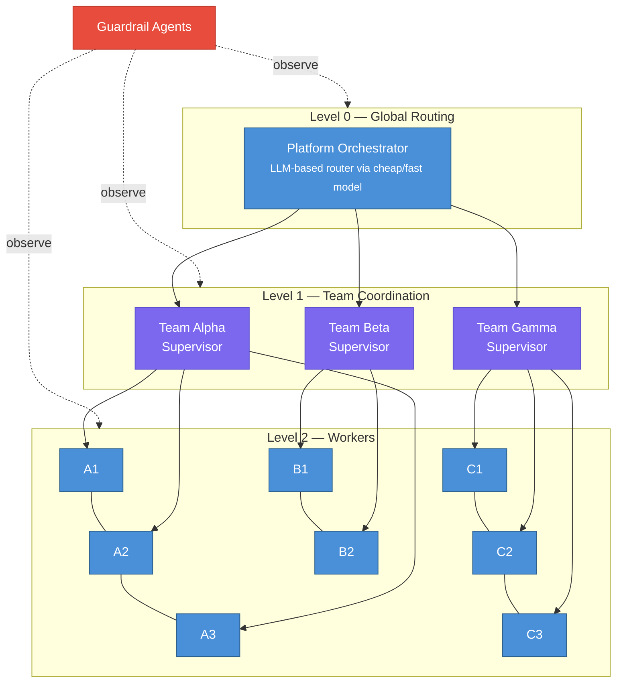

# AgentForge

**Agentic Orchestration & Monitoring Platform** — multi-tenant SaaS for building, deploying, and managing multi-agent systems.

> **Status**: Design phase — architecture decision records and subsystem specifications complete. No implementation yet.
> **Design review score**: 62/62 ✓ ([see assessment](docs/architecture/10-review-checklist-assessment.md))

---

## What is AgentForge?

AgentForge handles the operational side of running LLM-based agents at scale: defining agents with versioned system prompts, wiring them into teams, enforcing safety policies across six guardrail layers, and tracing every decision end-to-end with OpenTelemetry.

It targets multi-tenant environments where you need per-tenant isolation, RBAC, cost controls, and a repeatable deployment pipeline for agents.

---

## Architecture

AgentForge uses a **Hierarchical Supervisor** topology across three levels, with cross-cutting guardrail agents monitoring every layer.



**Agent communication**:
- **Intra-team**: Direct function calls via `AgentTool`; shared session state with prefix scoping
- **Inter-team**: A2A protocol over HTTP with mTLS + OAuth2; Agent Cards at `/.well-known/agent.json`
- **Agent-to-tool**: MCP protocol (STDIO for dev, HTTP+SSE for production)

---

## Repository Structure

The repo is documentation only — no implementation code yet. Everything lives under `docs/`.

### Start here

| Document | Description |
|----------|-------------|
| [System Overview](docs/architecture/00-system-overview.md) | Platform vision, topology diagram, data flows, tech recommendations, subsystem dependency map |
| [ADR-001 Master Decision Record](docs/ADR-001-agentic-orchestration-platform.md) | All pattern decisions with justifications, trade-offs, tool access matrix, memory design, safety boundaries |
| [Review Checklist Assessment](docs/architecture/10-review-checklist-assessment.md) | 62-item self-audit against the Agentic Design Patterns checklist — 62/62 |

### Core subsystems

| # | Document | Responsibility | Key Patterns |
|---|----------|---------------|--------------|
| 01 | [Agent Builder](docs/architecture/01-agent-builder.md) | Create, version, and AI-optimize agent system prompts | Reflection, Learning & Adaptation, Prompt Chaining |
| 02 | [Team Orchestrator](docs/architecture/02-team-orchestrator.md) | Compose agents into teams, define topologies and communication rules | Multi-Agent Collaboration, Routing, Planning, Parallelization |
| 03 | [Tool & MCP Manager](docs/architecture/03-tool-mcp-manager.md) | Register, discover, and assign tools/MCP servers with Least Privilege | MCP, Tool Use, A2A |
| 04 | [Guardrail System](docs/architecture/04-guardrail-system.md) | Real-time behavioral monitoring, policy enforcement, and alerting | Guardrails/Safety, HITL, Exception Handling |
| 05 | [Observability Platform](docs/architecture/05-observability-platform.md) | Trace, log, and visualize all agent interactions and decisions | Evaluation & Monitoring, Goal Setting |
| 06 | [Code Generation Tools](docs/architecture/06-code-generation-tools.md) | Sandboxed code generation, execution, and review for agents | Tool Use, Reflection, Guardrails/Safety |
| 07 | [Prompt Registry](docs/architecture/07-prompt-registry.md) | Version-controlled storage for all agent system prompts | Memory Management, Learning & Adaptation |
| 08 | [Evaluation Framework](docs/architecture/08-evaluation-framework.md) | Automated quality assessment, regression testing, and benchmarking | Evaluation & Monitoring, Reflection |
| 09 | [Cost & Resource Manager](docs/architecture/09-cost-resource-manager.md) | Token budgets, model routing, and resource optimization | Resource-Aware Optimization |

### Infrastructure subsystems

| # | Document | Responsibility | Key Patterns |
|---|----------|---------------|--------------|
| 11 | [Memory & Context Management](docs/architecture/11-memory-context-management.md) | Agent/team memory, context optimization, RAG knowledge retrieval | Memory Management, RAG, Resource-Aware |
| 12 | [External Integrations Hub](docs/architecture/12-external-integrations-hub.md) | Connectors to external services (Supabase, Slack, Google Drive, APIs) | MCP, Tool Use, A2A |
| 13 | [IAM & Access Control](docs/architecture/13-iam-access-control.md) | Multi-tenancy, RBAC, API keys, audit trail | Guardrails, HITL, A2A |
| 14 | [Agent Deployment Pipeline](docs/architecture/14-agent-deployment-pipeline.md) | CI/CD for agents: build, test, evaluate, deploy, rollback | Evaluation, Guardrails, HITL |
| 15 | [Event Bus](docs/architecture/15-event-bus.md) | Centralized event-driven pub/sub with event replay | A2A, Exception Handling, Memory |
| 16 | [Testing & Simulation](docs/architecture/16-testing-simulation.md) | Simulated users, tool mocking, chaos testing, red-team automation | Evaluation, Guardrails, Exception Handling |

### User-facing subsystems

| # | Document | Responsibility | Key Patterns |
|---|----------|---------------|--------------|
| 17 | [Conversation & Session Management](docs/architecture/17-conversation-session-management.md) | Multi-channel conversation layer, agent-to-human handoff | Memory, Routing, HITL, A2A |
| 18 | [Replay & Debugging](docs/architecture/18-replay-debugging.md) | Execution replay, time-travel, what-if analysis, root cause analysis | Evaluation, Exception Handling, Reflection |
| 19 | [Scheduling & Background Jobs](docs/architecture/19-scheduling-background-jobs.md) | Cron-based and event-triggered agent execution, job queues | Planning, Prioritization, Goal Setting |
| 20 | [Multi-Provider LLM Management](docs/architecture/20-multi-provider-llm-management.md) | Unified LLM interface, failover, cost routing, API key pools | Resource-Aware, Routing, Exception Handling |

---

## Key Architectural Decisions

| Concern | Decision |
|---------|----------|
| **Agent communication** | Intra-team: direct function calls; inter-team: A2A HTTP with mTLS + OAuth2 |
| **Tool protocol** | MCP — STDIO for dev, HTTP+SSE for production; every agent gets only its required tools (Least Privilege) |
| **Security model** | Six-layer defense-in-depth: input validation → behavioral constraints → tool restrictions → guardrail agents → external moderation → output filtering |
| **Prompt lifecycle** | Draft → Review (HITL) → Staged (eval) → Production, with AI-driven Reflection-based optimization loop |
| **LLM routing** | Three tiers — Flash/Haiku (simple tasks), Pro/Sonnet (complex), Ultra/Opus (critical) |
| **Event bus** | NATS JetStream — at-least-once delivery, consumer groups, event replay (CloudEvents spec) |
| **Observability** | OpenTelemetry traces; every span captures routing decisions, tool calls, token usage, guardrail results |
| **Deployment** | Six-stage CI/CD with canary ramp (1% → 5% → 25% → 50% → 100%); auto-rollback on >10% metric degradation |
| **Memory scoping** | `temp:` (session), `user:` (persistent user), `app:` (platform-wide) |

---

## Technology Stack

| Component | Technology | Rationale |
|-----------|-----------|-----------|
| Agent runtime | Python (asyncio) | Ecosystem maturity for LLM integrations |
| API layer | FastAPI | Async, auto-generated OpenAPI docs |
| MCP servers | FastMCP | Native Python MCP server framework |
| A2A transport | HTTP/2 + SSE | Standard A2A protocol |
| Message bus | NATS JetStream | At-least-once delivery, consumer groups, replay |
| State store | PostgreSQL + Redis | Persistent state + ephemeral session state |
| Vector store | pgvector / Qdrant | RAG memory for agent knowledge |
| Time-series DB | ClickHouse / TimescaleDB | High-throughput interaction logging |
| Tracing | OpenTelemetry + Grafana | Vendor-neutral distributed tracing |
| Prompt storage | Git-backed DB | Version control with full diff history |
| Code sandbox | Firecracker / gVisor | Secure code execution isolation |
| Auth | OAuth2 + mTLS | A2A security |
| IAM / RBAC | OPA (Open Policy Agent) | Declarative, auditable policy engine |
| LLM gateway | LiteLLM / custom adapter | Unified interface across providers |
| Secret vault | HashiCorp Vault / AWS Secrets Manager | Credential storage with rotation |

---

## Design Principles

1. **Single responsibility** — every agent has one well-defined purpose; supervisors route, workers execute
2. **Explicit contracts** — all inter-agent communication uses typed JSON Schema input/output schemas
3. **Untrusted boundaries** — sub-agent outputs and tool results are validated at every boundary
4. **Least Privilege** — every agent receives only the tools required for its specific task
5. **Defense in depth** — no single guardrail layer is sufficient; all six layers are always active
6. **HITL gates** — irreversible actions (prompt promotion, new tool grants, policy changes) always require human approval
7. **Observability everywhere** — every decision, routing choice, and tool call is captured in a structured trace
8. **Pattern citations** — all design decisions cite the *Agentic Design Patterns* PDF (482 pages) by page number

---

## Agent Identity Contract

Every agent in the platform carries a well-defined identity:

```json
{
  "agent_id": "uuid-v4",
  "name": "ResearchAgent",
  "version": "2.3.1",
  "system_prompt_ref": "prompt-registry://research-agent@2.3.1",
  "input_schema": { "type": "object", "properties": { "query": { "type": "string" } } },
  "output_schema": { "type": "object", "properties": { "summary": { "type": "string" }, "sources": { "type": "array" } } },
  "tools": ["mcp://search-server/web_search", "mcp://search-server/scholar_search"],
  "guardrail_policies": ["no-pii-output", "citation-required"],
  "model_tier": "auto",
  "max_iterations": 10,
  "team_id": "team-alpha"
}
```

---

## HITL Escalation Triggers

Human approval is required before any of the following actions:

- Deploying agent prompts to production
- Granting new tool access to an agent
- Executing generated code outside the sandbox
- Modifying guardrail policies
- Deleting agent versions or team configurations
- Tenant creation/deletion or RBAC role hierarchy changes
- Promoting a canary deployment past the 50% traffic stage

---

## Deploy on Vercel

This repository can be deployed to Vercel as a static MkDocs site.

1. Import the GitHub repository into Vercel.
2. Leave the framework preset as `Other`.
3. Vercel will use [`vercel.json`](/Users/francescofiore/Coding/agentic-infra-platform/vercel.json) to install dependencies, run `mkdocs build --strict`, and publish the generated `site/` directory.
4. In Project Settings -> Environment Variables, optionally add `SITE_URL=https://your-domain.vercel.app` or your custom production domain. If `SITE_URL` is not set, the build tries to fall back to `VERCEL_PROJECT_PRODUCTION_URL`.

After the first production deploy, add the final Vercel URL back to the top of this README if you want a public docs link here.

---

## Contributing

This project is in its early design phase and **contributions are very welcome**. Whether you want to challenge an architectural decision, suggest an alternative pattern, share real-world experience, or just ask a question — I'd love to hear from you.

- **Open an Issue** to share feedback, report gaps, or propose ideas
- **Start a Discussion** for broader architectural conversations
- **Submit a Pull Request** if you want to improve or extend the documentation

No contribution is too small — even a typo fix or a clarifying question helps move the project forward.

---

*All pattern references cite the "Agentic Design Patterns" PDF (482 pages). Start with [00-system-overview.md](docs/architecture/00-system-overview.md) for the full picture.*
