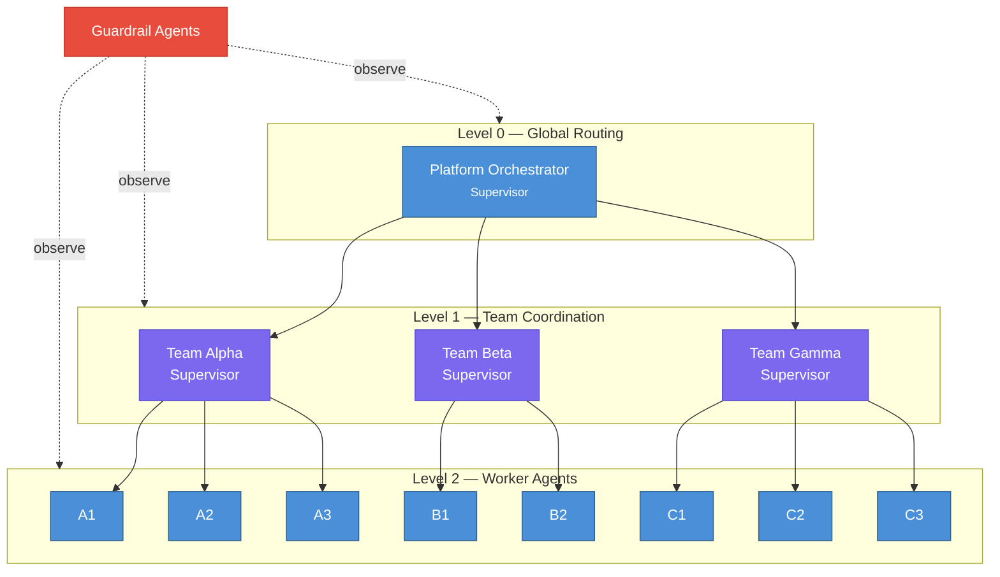
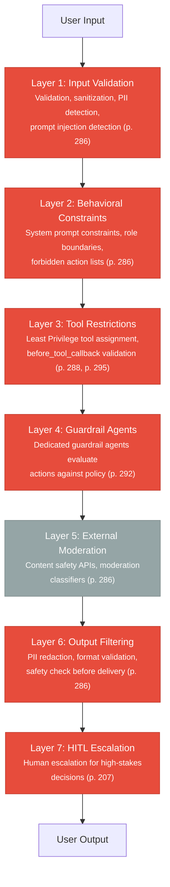
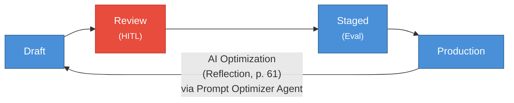
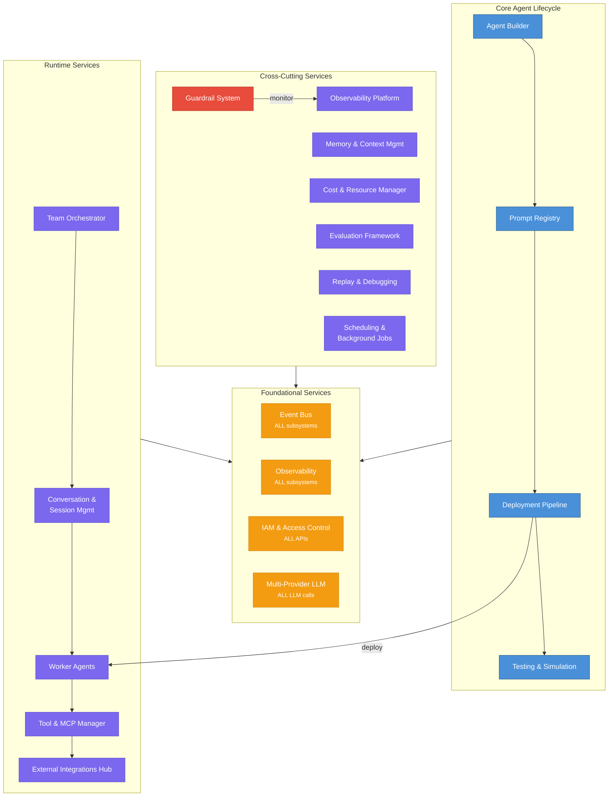

# AgentForge — System Overview

## 1. Vision

AgentForge is an **Agentic Orchestration & Monitoring Platform** that provides a unified control plane for creating, composing, governing, and observing agentic AI systems. It is the infrastructure layer that sits between raw LLM APIs and production-grade agentic applications.

```mermaid
graph TD
    classDef core fill:#4A90D9,stroke:#2C5F8A,color:#fff
    classDef infra fill:#7B68EE,stroke:#5A4FCF,color:#fff
    classDef userFacing fill:#2ECC71,stroke:#1FA855,color:#fff
    classDef platform fill:#1ABC9C,stroke:#148F77,color:#fff

    subgraph PLATFORM["AgentForge Platform"]
        direction TB

        subgraph CORE["Core"]
            direction LR
            AB["Agent<br/>Builder"]
            TO["Team<br/>Orchestrator"]
            TM["Tool & MCP<br/>Manager"]
            GS["Guardrail<br/>System"]
            PR["Prompt<br/>Registry"]
            EF["Evaluation<br/>Framework"]
            CG["Code<br/>Gen"]
            CR["Cost &<br/>Resource Mgr"]
        end

        subgraph INFRA["Infrastructure"]
            direction LR
            MC["Memory &<br/>Context Mgmt"]
            ML["Multi-Provider<br/>LLM Management"]
            EB["Event Bus<br/>(pub/sub)"]
            IA["IAM & Access<br/>Control"]
            SJ["Scheduling &<br/>Background Jobs"]
            RD["Replay &<br/>Debugging"]
        end

        subgraph UF["User-Facing"]
            direction LR
            CS["Conversation &<br/>Session Mgmt"]
            EI["External<br/>Integrations"]
            TS["Testing &<br/>Simulation"]
        end

        subgraph DO["Deployment & Observability"]
            direction LR
            DP["Agent Deployment<br/>Pipeline (CI/CD)"]
            OP["Observability Platform<br/>(Tracing/Metrics/Dashboards)"]
        end
    end

    CORE --> INFRA
    INFRA --> UF
    UF --> DO

    class AB,TO,TM,GS,PR,EF,CG,CR core
    class MC,ML,EB,IA,SJ,RD infra
    class CS,EI,TS userFacing
    class DP,OP platform
```



## 2. Subsystem Map

| # | Subsystem | Responsibility | Key Patterns |
|---|-----------|---------------|--------------|
| 1 | **Agent Builder** | Create, version, and optimize agent system prompts | Reflection (p. 61), Learning & Adaptation (p. 163), Prompt Chaining (p. 1) |
| 2 | **Team Orchestrator** | Compose agents into teams, define topologies and communication rules | Multi-Agent Collaboration (p. 121), Routing (p. 21), Planning (p. 101), Parallelization (p. 41) |
| 3 | **Tool & MCP Manager** | Register, discover, and assign tools/MCP servers to agents and teams | MCP (p. 155), Tool Use (p. 81), A2A (p. 240) |
| 4 | **Guardrail System** | Real-time behavioral monitoring, policy enforcement, and alerting | Guardrails/Safety (p. 285), HITL (p. 207), Exception Handling (p. 201) |
| 5 | **Observability Platform** | Trace, log, and visualize all agent interactions and decisions | Evaluation & Monitoring (p. 301), Goal Setting & Monitoring (p. 183) |
| 6 | **Code Generation Tools** | Sandboxed code generation, execution, and review for agents | Tool Use (p. 81), Reflection (p. 61), Guardrails/Safety (p. 285) |
| 7 | **Prompt Registry** | Version-controlled storage for all agent system prompts | Memory Management (p. 141), Learning & Adaptation (p. 163) |
| 8 | **Evaluation Framework** | Automated quality assessment, regression testing, and benchmarking | Evaluation & Monitoring (p. 301), Reflection (p. 61) |
| 9 | **Cost & Resource Manager** | Token budgets, model routing, and resource optimization | Resource-Aware Optimization (p. 255) |
| 10 | **Memory & Context Management** | Agent/team memory, context optimization, RAG knowledge retrieval | Memory Management (p. 141), RAG (p. 215), Resource-Aware Optimization (p. 262) |
| 11 | **External Integrations Hub** | Connectors to external services (Supabase, Slack, Google Drive, APIs) | MCP (p. 155), Tool Use (p. 81), A2A (p. 240) |
| 12 | **IAM & Access Control** | Multi-tenancy, RBAC, API keys, audit trail | Guardrails (p. 288), HITL (p. 211), A2A (p. 248) |
| 13 | **Agent Deployment Pipeline** | CI/CD for agents: build, test, evaluate, deploy, rollback | Evaluation (p. 312), Guardrails (p. 298), HITL (p. 211) |
| 14 | **Event Bus** | Centralized event-driven architecture, pub/sub, event replay | A2A (p. 245), Exception Handling (p. 205), Memory (p. 154) |
| 15 | **Testing & Simulation** | Simulated users, tool mocking, chaos testing, red-team automation | Evaluation (p. 308), Guardrails (p. 298), Exception Handling (p. 205) |
| 16 | **Conversation & Session Management** | User-facing conversation layer, multi-channel, agent-to-human handoff | Memory (p. 148), Routing (p. 25), HITL (p. 210), A2A (p. 246) |
| 17 | **Replay & Debugging** | Execution replay, time-travel, what-if analysis, root cause analysis | Evaluation (p. 308), Exception Handling (p. 209), Reflection (p. 65) |
| 18 | **Scheduling & Background Jobs** | Cron-based and event-triggered agent execution, job queues | Planning (p. 107), Prioritization (p. 326), Goal Setting (p. 185) |
| 19 | **Multi-Provider LLM Management** | Unified LLM interface, failover, cost routing, API key pools | Resource-Aware (p. 257), Routing (p. 25), Exception Handling (p. 208) |
| 21 | **Runtime & Deployment Environment** | Agent framework (ADK), Kubernetes orchestration, agent process model, MCP server topology | Multi-Agent Collaboration (p. 133), MCP (p. 160), A2A (p. 240), Resource-Aware (p. 258) |

## 3. Core Architecture Principles

### 3.1 Hierarchical Supervisor Topology (p. 130)

The platform uses a three-level hierarchy:



- **Level 0 — Platform Orchestrator**: Routes incoming requests to the appropriate team. Uses LLM-based routing (p. 25) with a cheap/fast model (p. 258).
- **Level 1 — Team Supervisors**: Coordinate agents within a team. Handle task decomposition (Planning, p. 101), delegation, and result aggregation.
- **Level 2 — Worker Agents**: Execute specialized tasks using their assigned MCP tools.
- **Cross-cutting — Guardrail Agents**: Monitor all three levels. Operate independently using `before_tool_callback` (p. 295) and policy evaluation (p. 292).

### 3.2 Agent Identity & Contracts

Every agent in the platform has a well-defined identity:

??? example "View JSON example"

    ```json
    {
      "agent_id": "uuid-v4",
      "name": "ResearchAgent",
      "version": "2.3.1",
      "system_prompt_ref": "prompt-registry://research-agent@2.3.1",
      "capabilities": ["web_search", "summarization", "citation"],
      "input_schema": { "type": "object", "properties": { "query": { "type": "string" } } },
      "output_schema": { "type": "object", "properties": { "summary": { "type": "string" }, "sources": { "type": "array" } } },
      "tools": ["mcp://search-server/web_search", "mcp://search-server/scholar_search"],
      "guardrail_policies": ["no-pii-output", "citation-required"],
      "model_tier": "auto",
      "max_iterations": 10,
      "team_id": "team-alpha"
    }
    ```

Key design rules:
- Each agent has **single responsibility** (p. 124)
- Input/output schemas define **explicit contracts** (p. 126)
- Sub-agent outputs are **treated as untrusted** and validated at boundaries (p. 126)

### 3.3 Communication Model

**Intra-team** (co-located agents):
- Direct function calls via AgentTool pattern (p. 133)
- Shared session state with prefix scoping (`temp:`, `user:`, `app:`) (p. 151)
- Supervisor routes via structured plan steps (p. 107)

**Inter-team** (distributed agents):
- A2A protocol over HTTP (p. 240)
- Agent Cards for discovery at `/.well-known/agent.json` (p. 243)
- Task states: `submitted` → `working` → `completed`/`failed` (p. 245)
- mTLS + OAuth2 authentication (p. 248)

**Agent-to-Tool**:
- MCP client-server protocol (p. 158)
- STDIO transport for local tools, HTTP+SSE for remote tools (p. 160)
- Tool descriptions self-contained (p. 162)

### 3.4 Defense-in-Depth Security Model

The platform implements all six guardrail layers (p. 286):



### 3.5 Observability Architecture

Every interaction produces a **trace** that captures the full execution graph:

```
Trace
├── Span: Platform Orchestrator
│   ├── routing_decision: "team-alpha"
│   ├── confidence: 0.92
│   └── model: "haiku"
│
├── Span: Team Alpha Supervisor
│   ├── plan: [step1, step2, step3]
│   ├── Span: Worker Agent A1
│   │   ├── tool_call: "web_search(query='...')"
│   │   ├── tool_result: {...}
│   │   ├── tokens: {input: 450, output: 280}
│   │   └── latency_ms: 1200
│   │
│   ├── Span: Worker Agent A2
│   │   └── ...
│   │
│   └── Span: Aggregation
│       └── ...
│
├── Span: Guardrail Check
│   ├── policy: "no-pii-output"
│   ├── result: "compliant"
│   └── latency_ms: 85
│
└── Metadata
    ├── total_tokens: 3200
    ├── total_cost_usd: 0.0048
    ├── total_latency_ms: 3500
    └── guardrail_interventions: 0
```

### 3.6 Prompt Lifecycle

System prompts follow a managed lifecycle:



1. **Draft**: New prompt version created (manually or by AI optimizer)
2. **Review**: Human reviews changes (HITL gate for prompt modifications)
3. **Staged**: Prompt runs against evalset; must pass quality thresholds
4. **Production**: Promoted to serve live traffic
5. **Optimization loop**: Reflection-based agent analyzes production performance, proposes improvements → new Draft

## 4. Data Flow

### 4.1 Request Processing Flow

??? example "View details"

    ```
    1. User Request arrives
    2. Input Validation (Layer 1) — reject malicious inputs
    3. Platform Orchestrator routes to Team
    4. Team Supervisor decomposes into plan steps (Planning, p. 101)
    5. Worker Agents execute steps:
       a. Load system prompt from Prompt Registry
       b. Receive tools from MCP Manager (Least Privilege, p. 288)
       c. Execute task with guardrail monitoring
       d. Log all interactions to Observability Platform
    6. Team Supervisor aggregates results
    7. Output Filtering (Layer 6) — sanitize before delivery
    8. Response returned to user
    9. Async: Evaluation Framework scores the interaction
    ```

### 4.2 Prompt Optimization Flow

??? example "View details"

    ```
    1. Evaluation Framework identifies underperforming agent (metric below threshold)
    2. Prompt Optimizer Agent loads current prompt from Registry
    3. Generator produces N prompt variants (Reflection, p. 61)
    4. Critic evaluates variants against quality rubric:
       - Task accuracy on evalset
       - Prompt clarity and specificity
       - Safety compliance
       - Token efficiency
    5. Best variant promoted to Draft → Review → Staged → Production
    6. A/B evaluation confirms improvement (p. 306)
    ```

### 4.3 Guardrail Alert Flow

??? example "View details"

    ```
    1. Guardrail Agent observes agent action (before_tool_callback, p. 295)
    2. Policy evaluation against registered policies (p. 292)
    3. Result: compliant | non_compliant | requires_review
    4. If non_compliant:
       a. Block the action (checkpoint & rollback, p. 290)
       b. Log the intervention with full context (p. 297)
       c. Emit alert to Observability Platform
       d. If critical: escalate to human (HITL, p. 213)
    5. If requires_review:
       a. Queue for async human review
       b. Agent proceeds with safe default (p. 214)
    ```

## 5. Technology Recommendations

| Component | Recommended Technology | Rationale |
|-----------|----------------------|-----------|
| **Agent Framework** | **Google ADK** (wrapped by AgentRuntime abstraction) | Native MCP (p. 161), A2A, LoopAgent/LlmAgent/AgentTool map 1:1 to Hierarchical Supervisor (p. 133) |
| **Container Orchestration** | **Kubernetes** (EKS / GKE / AKS) | HPA, Namespace isolation per tenant, NetworkPolicy for mTLS, rolling deploys for CI/CD |
| **Agent Process Model** | **In-process workers** (intra-team) + **A2A HTTP** (inter-team) | Direct function calls via AgentTool intra-team (p. 133); A2A mTLS inter-team (p. 240) |
| Agent Runtime | Python 3.12 (asyncio) | ADK, FastMCP, LLM clients are all Python-first; asyncio for concurrent tool calls |
| API Layer | FastAPI | Async, auto-generated OpenAPI docs |
| MCP Servers | FastMCP (p. 162) — HTTP+SSE in prod, STDIO in dev | Native Python MCP server framework; stateless K8s Deployment in production |
| A2A Protocol | HTTP/2 + SSE over Istio (mTLS) | Standard A2A transport (p. 246); Istio handles certificate lifecycle |
| Service Mesh | Istio | mTLS for A2A, traffic splitting for canary deployments |
| Message Bus | NATS JetStream | At-least-once delivery, replay, consumer groups |
| State Store | PostgreSQL + Redis | Persistent state + ephemeral session state |
| Vector Store | pgvector or Qdrant | RAG memory for agent knowledge |
| Time-series DB | ClickHouse or TimescaleDB | High-throughput interaction logging |
| Tracing | OpenTelemetry | Vendor-neutral distributed tracing |
| Dashboards | Grafana | Unified metrics/logs/traces visualization |
| Prompt Storage | Git-backed DB | Version control with full diff history |
| Code Sandbox | gVisor (prod) / Wasmtime (experimental) | Secure code execution isolation |
| Auth | OAuth2 + mTLS (Istio) | A2A security (p. 248) |
| IAM / RBAC | OPA (Open Policy Agent) | Declarative, auditable policy engine |
| Job Scheduler | APScheduler + Redis | Cron + interval + event-triggered scheduling |
| WebSocket | FastAPI WebSocket + Redis pub/sub | Real-time conversation streaming |
| LLM Gateway | LiteLLM or custom adapter | Unified interface across providers |
| Secret Vault | HashiCorp Vault or AWS Secrets Manager | Credential storage with rotation |
| Deployment tooling | Helm + Argo Rollouts | Chart-based K8s deploys + canary traffic splitting |
| Load Testing | Locust | Python-native distributed load testing |

*Full runtime and deployment decisions: see `21-runtime-deployment-environment.md`*

## 6. Subsystem Dependencies



**Dependency rules**:
- **Foundational services** (Event Bus, Observability, IAM, Multi-Provider LLM) have zero inter-dependencies and are started first
- **Event Bus** is the nervous system — all subsystems emit and consume events
- **IAM** gates every API call — no subsystem bypasses access control
- **Multi-Provider LLM** abstracts all LLM calls — no subsystem calls providers directly
- **Guardrail System** is cross-cutting and observes all other subsystems
- **Conversation & Session Mgmt** is the entry point for all user-facing interactions
- **Deployment Pipeline** orchestrates Agent Builder → Prompt Registry → Eval → Testing → Deploy

## 7. Cross-Cutting Concerns

### 7.1 Error Handling (p. 201)

Every subsystem implements the Error Triad:
1. **Detection**: Catch all exceptions from LLM calls, tool invocations, and validations
2. **Classification**: Transient → retry; Logic → re-prompt; Unrecoverable → escalate (p. 205)
3. **Recovery**: Exponential backoff, fallback handlers, checkpoint-rollback (p. 206-209)

### 7.2 HITL Integration (p. 207)

Human-in-the-loop gates at critical decision points:
- Prompt promotion to production
- New tool access grants
- Guardrail policy modifications
- Code execution outside sandbox
- Agent deletion or team reconfiguration

### 7.3 Goal Tracking (p. 183)

Every task processed by the platform has a SMART goal:
- **Specific**: Derived from user request + agent capability
- **Measurable**: Defined completion criteria in `goals_met()` check (p. 188)
- **Achievable**: Validated against available tools and model capabilities
- **Relevant**: Aligned with team mission
- **Time-bound**: `max_iterations` limit on every agent loop (p. 188)

---

*Next: See individual subsystem design documents (01 through 20) for detailed specifications, plus the review checklist assessment (10) for completeness validation.*
