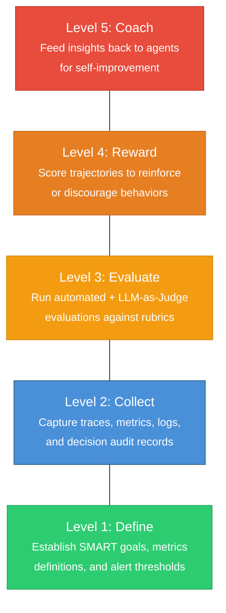
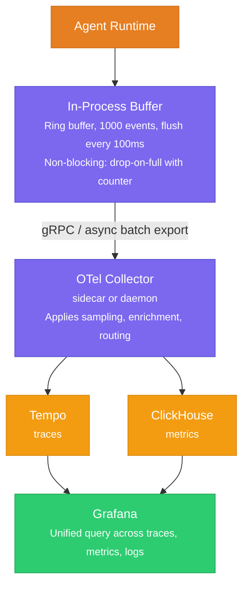
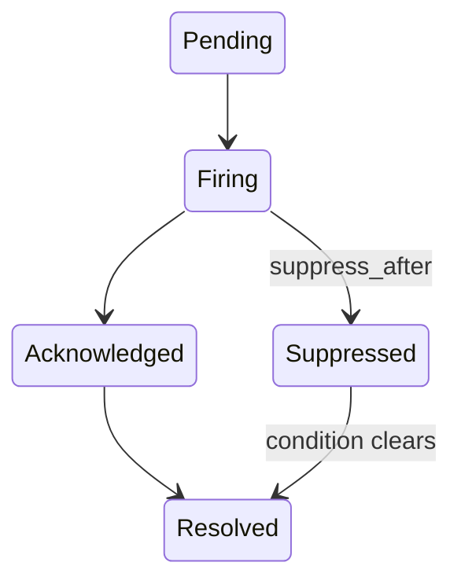
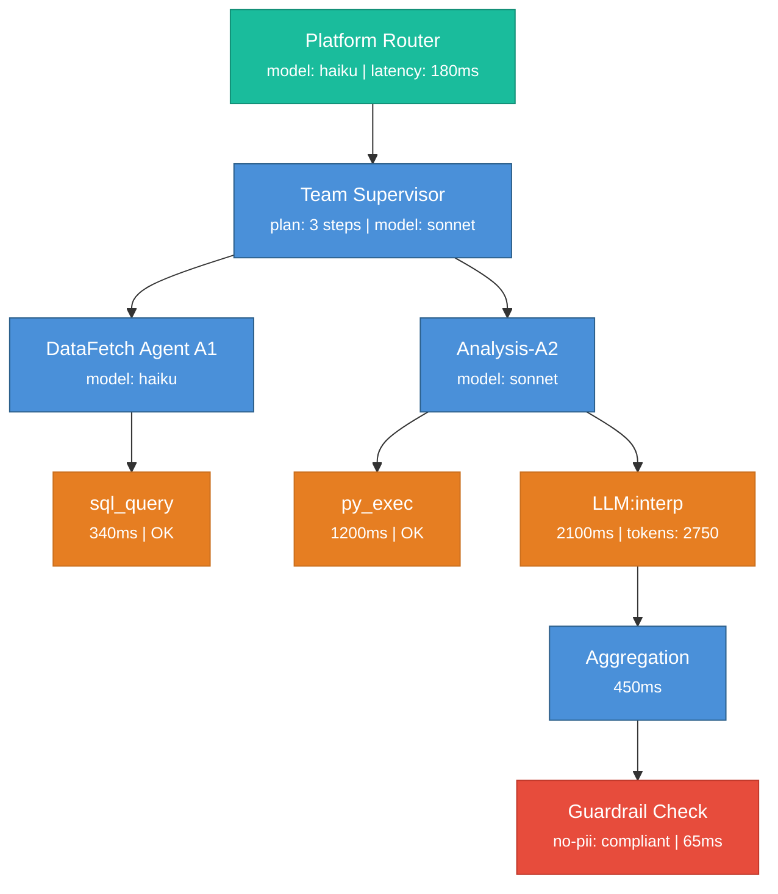
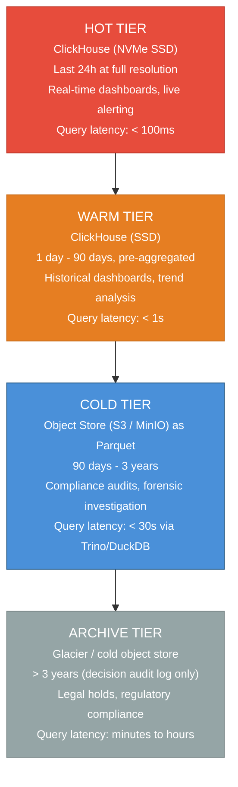
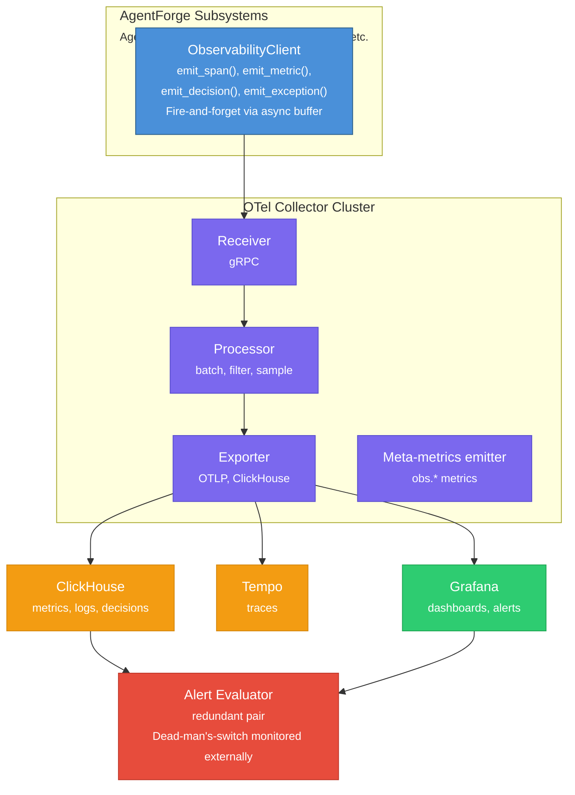

# 05 — Observability Platform

## Contents

| # | Section | Description |
|---|---------|-------------|
| 1 | [Overview & Responsibility](#1-overview--responsibility) | Telemetry backbone mandate and the Five-Level Evaluation Pyramid |
| 2 | [Trace Model](#2-trace-model) | Distributed trace structure, span types, and parent-child relationships |
| 3 | [Metrics Framework](#3-metrics-framework) | Counter, gauge, and histogram metrics with retention and aggregation |
| 4 | [Decision Audit Log](#4-decision-audit-log) | Immutable structured logs of every routing decision and guardrail intervention |
| 5 | [Dashboard Design](#5-dashboard-design) | Pre-built and custom dashboard layouts for operators and developers |
| 6 | [Alerting System](#6-alerting-system) | Threshold, anomaly-detection, and composite alert rules with escalation |
| 7 | [Trajectory Visualization](#7-trajectory-visualization) | Interactive multi-step trajectory viewer for debugging agent runs |
| 8 | [Data Model & Storage](#8-data-model--storage) | Storage schema, indexing strategy, and hot/warm/cold tiers |
| 9 | [Retention & Archival Policies](#9-retention--archival-policies) | TTL rules, compaction, and long-term archival to object storage |
| 10 | [API Surface](#10-api-surface) | Query, streaming, and export endpoints for trace and metric data |
| 11 | [Failure Modes & Mitigations](#11-failure-modes--mitigations) | Degraded-mode operation, buffering, and backpressure handling |
| 12 | [Instrumentation (Meta-Observability)](#12-instrumentation-meta-observability) | How the Observability Platform monitors itself |
| A | [Appendix A: Pattern Reference Index](#appendix-a-pattern-reference-index) | Cross-reference of PDF pattern citations used in this document |
| B | [Appendix B: Glossary](#appendix-b-glossary) | Key terms and abbreviations used throughout the document |

---

## 1. Overview & Responsibility

The Observability Platform is the foundational telemetry backbone of the AgentForge Agentic Orchestration Platform. Every other subsystem depends on it for logging, tracing, and metrics emission (see system overview dependency rules: "Observability Platform has zero dependencies — foundational service"). Its mandate is to answer three questions at any moment in time:

1. **What happened?** Full trace logging of every agent interaction: queries, responses, tool calls, latency, and token counts.
2. **How well did it happen?** Metrics collection and aggregation covering accuracy, latency, cost, error rates, and goal attainment.
3. **Why did it happen?** Decision audit logs that capture the reasoning chain behind every agent action, routing decision, and guardrail intervention.

The subsystem implements the **Five-Level Evaluation Pyramid** (p. 303):



Levels 1 and 2 are owned entirely by this subsystem. Levels 3-5 are shared with the Evaluation Framework (subsystem #8), which consumes the data this subsystem collects.

### Design Principles

- **Zero-dependency foundation**: The Observability Platform must boot and accept telemetry before any other subsystem starts. No circular imports, no runtime coupling.
- **Non-blocking emission**: All telemetry calls are fire-and-forget with async buffering. Agent latency must never increase by more than 2ms due to instrumentation.
- **Structured everything**: No free-form string logs. Every record follows a typed schema with mandatory fields.
- **Retention-aware**: Hot, warm, and cold storage tiers with automatic migration. Cost of observability must not exceed 5% of total platform compute.

---

## 2. Trace Model

### 2.1 OpenTelemetry Foundation

All tracing is built on the OpenTelemetry (OTel) specification. Every agent interaction produces a **trace** composed of nested **spans**. The trace captures the full execution graph from user request to final response, including all inter-agent invocations, tool calls, and guardrail checks.

```
Trace: tr-8f3a2b (user request "Analyze Q3 revenue trends")
│
├── Span: Platform Orchestrator           [root span]
│   ├── span_id: sp-001
│   ├── routing_decision: "team-analytics"
│   ├── routing_model: "haiku"
│   ├── routing_confidence: 0.94
│   ├── latency_ms: 180
│   │
│   ├── Span: Team Analytics Supervisor   [child span]
│   │   ├── span_id: sp-002
│   │   ├── parent_span_id: sp-001
│   │   ├── plan_steps: ["fetch_data", "run_analysis", "generate_report"]
│   │   ├── plan_model: "sonnet"
│   │   │
│   │   ├── Span: DataFetchAgent (A1)     [child span]
│   │   │   ├── span_id: sp-003
│   │   │   ├── parent_span_id: sp-002
│   │   │   ├── Span: tool_call "sql_query"
│   │   │   │   ├── tool_server: "mcp://db-server/sql_query"
│   │   │   │   ├── tool_input: {"query": "SELECT ..."}
│   │   │   │   ├── tool_output_bytes: 4096
│   │   │   │   ├── tool_status: "success"
│   │   │   │   └── latency_ms: 340
│   │   │   ├── tokens: {input: 620, output: 180}
│   │   │   ├── model: "haiku"
│   │   │   └── latency_ms: 890
│   │   │
│   │   ├── Span: AnalysisAgent (A2)      [child span]
│   │   │   ├── span_id: sp-004
│   │   │   ├── parent_span_id: sp-002
│   │   │   ├── Span: tool_call "python_exec"
│   │   │   │   ├── tool_input: {"code": "import pandas..."}
│   │   │   │   ├── tool_status: "success"
│   │   │   │   └── latency_ms: 1200
│   │   │   ├── Span: LLM call (interpretation)
│   │   │   │   ├── tokens: {input: 1800, output: 950}
│   │   │   │   ├── model: "sonnet"
│   │   │   │   └── latency_ms: 2100
│   │   │   └── latency_ms: 3800
│   │   │
│   │   └── Span: Aggregation             [child span]
│   │       ├── span_id: sp-005
│   │       └── latency_ms: 450
│   │
│   ├── Span: Guardrail Check             [child span]
│   │   ├── policy: "no-pii-output"
│   │   ├── result: "compliant"
│   │   └── latency_ms: 65
│   │
│   └── Span: Output Filtering            [child span]
│       ├── action: "pii_redaction"
│       ├── redactions_applied: 0
│       └── latency_ms: 12
│
└── Trace Metadata
    ├── trace_id: "tr-8f3a2b"
    ├── total_spans: 9
    ├── total_tokens: {input: 2420, output: 1130}
    ├── total_cost_usd: 0.0127
    ├── total_latency_ms: 5200
    ├── guardrail_interventions: 0
    └── goal_met: true
```

### 2.2 Span Types

The platform defines a closed set of span types to ensure consistent schema enforcement:

| Span Type | Created By | Key Attributes |
|-----------|-----------|----------------|
| `platform.route` | Platform Orchestrator | `routing_decision`, `confidence`, `model` |
| `team.supervise` | Team Supervisor | `plan_steps`, `delegation_strategy`, `model` |
| `agent.execute` | Worker Agent | `agent_id`, `agent_version`, `model`, `iteration_count` |
| `agent.llm_call` | Any agent making an LLM call | `model`, `tokens_in`, `tokens_out`, `latency_ms`, `temperature` |
| `agent.tool_call` | Any agent invoking a tool | `tool_server`, `tool_name`, `tool_input`, `tool_output_size`, `status` |
| `guardrail.check` | Guardrail System | `policy_id`, `result`, `intervention_type`, `severity` |
| `safety.filter` | Input/Output filters | `filter_type`, `action`, `items_flagged` |
| `goal.evaluate` | Goal tracking | `goal_id`, `goal_met`, `criteria_results` |
| `error.handle` | Exception handler | `error_type`, `error_class`, `recovery_strategy`, `outcome` |

### 2.3 Trace Context Propagation

Trace context propagates across all communication boundaries using the W3C Trace Context standard:

- **Intra-team (function calls)**: Context passed as `trace_context` argument to `AgentTool` invocations (p. 133).
- **Inter-team (A2A protocol)**: Context injected into A2A HTTP headers as `traceparent` / `tracestate` (p. 246).
- **Agent-to-Tool (MCP)**: Context injected into MCP request metadata. MCP servers that support tracing propagate the context through their internal operations.

### 2.4 Trace Creation Pseudocode

??? example "View Python pseudocode"

    ```python
    from opentelemetry import trace
    from opentelemetry.trace import StatusCode
    from dataclasses import dataclass, field
    from typing import Any, Optional
    import time
    import uuid


    tracer = trace.get_tracer("agentforge.observability", "1.0.0")


    @dataclass
    class AgentSpanAttributes:
        """Mandatory attributes for every agent execution span."""
        agent_id: str
        agent_version: str
        team_id: str
        model: str
        trace_id: str
        parent_span_id: Optional[str] = None


    class AgentTracer:
        """
        Creates and manages OpenTelemetry spans for agent interactions.
        Wraps OTel primitives with AgentForge-specific span types and
        mandatory attribute enforcement.
        """

        def __init__(self, service_name: str = "agentforge"):
            self.tracer = trace.get_tracer(f"{service_name}.observability")

        def start_agent_span(
            self,
            agent_id: str,
            agent_version: str,
            team_id: str,
            model: str,
            parent_context: Optional[trace.Context] = None,
        ) -> trace.Span:
            """
            Start a new span for an agent execution. Every agent.execute span
            carries mandatory attributes per the Trace Model schema.
            """
            ctx = parent_context or trace.get_current_span().get_span_context()
            span = self.tracer.start_span(
                name=f"agent.execute:{agent_id}",
                context=trace.set_span_in_context(ctx) if parent_context else None,
                attributes={
                    "agentforge.span_type": "agent.execute",
                    "agentforge.agent_id": agent_id,
                    "agentforge.agent_version": agent_version,
                    "agentforge.team_id": team_id,
                    "agentforge.model": model,
                    "agentforge.iteration_count": 0,
                },
            )
            return span

        def record_llm_call(
            self,
            parent_span: trace.Span,
            model: str,
            tokens_in: int,
            tokens_out: int,
            latency_ms: float,
            temperature: float = 0.0,
        ) -> trace.Span:
            """
            Record an LLM call as a child span. Captures token counts,
            latency, and model parameters required for cost attribution
            and performance analysis (p. 304).
            """
            with self.tracer.start_as_current_span(
                "agent.llm_call",
                attributes={
                    "agentforge.span_type": "agent.llm_call",
                    "agentforge.model": model,
                    "agentforge.tokens_in": tokens_in,
                    "agentforge.tokens_out": tokens_out,
                    "agentforge.latency_ms": latency_ms,
                    "agentforge.temperature": temperature,
                    "agentforge.cost_usd": self._compute_cost(
                        model, tokens_in, tokens_out
                    ),
                },
            ) as span:
                return span

        def record_tool_call(
            self,
            parent_span: trace.Span,
            tool_server: str,
            tool_name: str,
            tool_input: dict,
            tool_output_size: int,
            status: str,
            latency_ms: float,
        ) -> trace.Span:
            """
            Record a tool invocation as a child span. Tool call accuracy
            is a core metric (p. 304): did the agent pick the right tool
            with the right arguments?
            """
            with self.tracer.start_as_current_span(
                f"agent.tool_call:{tool_name}",
                attributes={
                    "agentforge.span_type": "agent.tool_call",
                    "agentforge.tool_server": tool_server,
                    "agentforge.tool_name": tool_name,
                    "agentforge.tool_input_keys": list(tool_input.keys()),
                    "agentforge.tool_output_bytes": tool_output_size,
                    "agentforge.tool_status": status,
                    "agentforge.latency_ms": latency_ms,
                },
            ) as span:
                if status == "error":
                    span.set_status(StatusCode.ERROR, "Tool call failed")
                return span

        def record_guardrail_check(
            self,
            policy_id: str,
            result: str,
            intervention_type: Optional[str] = None,
            severity: Optional[str] = None,
            latency_ms: float = 0.0,
        ) -> trace.Span:
            """
            Record a guardrail evaluation. Safety intervention logs are
            critical for audit (p. 297) and spike alerting (p. 106).
            """
            with self.tracer.start_as_current_span(
                f"guardrail.check:{policy_id}",
                attributes={
                    "agentforge.span_type": "guardrail.check",
                    "agentforge.policy_id": policy_id,
                    "agentforge.guardrail_result": result,
                    "agentforge.intervention_type": intervention_type or "none",
                    "agentforge.severity": severity or "info",
                    "agentforge.latency_ms": latency_ms,
                },
            ) as span:
                return span

        def _compute_cost(
            self, model: str, tokens_in: int, tokens_out: int
        ) -> float:
            """Look up model pricing and compute cost in USD."""
            pricing = {
                "opus": {"input": 15.0 / 1_000_000, "output": 75.0 / 1_000_000},
                "sonnet": {"input": 3.0 / 1_000_000, "output": 15.0 / 1_000_000},
                "haiku": {"input": 0.25 / 1_000_000, "output": 1.25 / 1_000_000},
            }
            rates = pricing.get(model, pricing["sonnet"])
            return (tokens_in * rates["input"]) + (tokens_out * rates["output"])
    ```

---

## 3. Metrics Framework

### 3.1 Core Metrics (p. 304)

The platform collects four categories of metrics aligned with the Evaluation & Monitoring pattern:

| Category | Metric | Description | Collection Point |
|----------|--------|-------------|-----------------|
| **Accuracy** | `task_success_rate` | Fraction of tasks where `goals_met()` returns True (p. 188) | Post-execution evaluation |
| **Accuracy** | `tool_call_accuracy` | Did the agent select the correct tool with correct arguments? (p. 304) | Trajectory evaluation |
| **Accuracy** | `response_quality_score` | LLM-as-Judge score on 1-5 rubric (p. 306) | Async evaluation pipeline |
| **Latency** | `e2e_latency_ms` | Wall-clock time from request receipt to response delivery | Root span duration |
| **Latency** | `llm_call_latency_ms` | Per-LLM-call response time | `agent.llm_call` span |
| **Latency** | `tool_call_latency_ms` | Per-tool-call execution time | `agent.tool_call` span |
| **Latency** | `time_to_first_token_ms` | Streaming responsiveness | LLM client instrumentation |
| **Cost** | `tokens_total` | Total input + output tokens per request | Aggregated from all `agent.llm_call` spans |
| **Cost** | `cost_usd` | Dollar cost per request | Computed from token counts + model pricing |
| **Cost** | `tokens_per_task` | Token efficiency — tokens consumed per completed task | `tokens_total / tasks_completed` |
| **Errors** | `error_rate` | Fraction of requests that result in unrecoverable errors | `error.handle` spans with `outcome=escalated` |
| **Errors** | `retry_rate` | Fraction of operations requiring retry | `error.handle` spans with `recovery_strategy=retry` |
| **Errors** | `guardrail_intervention_rate` | Fraction of actions blocked by guardrails (p. 297) | `guardrail.check` spans with `result=non_compliant` |
| **Goals** | `goal_completion_rate` | Fraction of SMART goals met within iteration budget (p. 188) | `goal.evaluate` spans |
| **Goals** | `goal_iterations_avg` | Average iterations to meet goal | `agent.execute` span `iteration_count` |

### 3.2 Aggregation Windows

Metrics are pre-aggregated at multiple temporal resolutions to balance query speed against storage cost:

| Window | Granularity | Retention | Use Case |
|--------|-------------|-----------|----------|
| **Real-time** | 10-second tumbling | 1 hour | Live dashboards, immediate alerts |
| **Short-term** | 1-minute tumbling | 24 hours | Operational dashboards, trend detection |
| **Medium-term** | 5-minute tumbling | 7 days | Performance analysis, SLO tracking |
| **Long-term** | 1-hour tumbling | 90 days | Capacity planning, monthly reporting |
| **Archival** | 1-day tumbling | Indefinite | Historical trends, compliance audits |

### 3.3 Aggregation Pipeline



### 3.4 Metric Dimensions

Every metric is tagged with a standard set of dimensions enabling fine-grained slicing:

??? example "View Python pseudocode"

    ```python
    STANDARD_DIMENSIONS = {
        "team_id":        str,   # Which team processed the request
        "agent_id":       str,   # Which agent emitted the metric
        "agent_version":  str,   # Semver of the agent prompt/config
        "model":          str,   # LLM model used (haiku, sonnet, opus)
        "tool_name":      str,   # For tool-related metrics
        "policy_id":      str,   # For guardrail metrics
        "error_class":    str,   # transient | logic | unrecoverable (p. 205)
        "environment":    str,   # staging | production | canary
    }
    ```

---

## 4. Decision Audit Log

### 4.1 Purpose

The Decision Audit Log answers the question: "Why did the agent do X?" Every non-trivial decision made by any component in the platform is captured as a structured audit record. This is critical for:

- **Compliance**: Demonstrating that agent behavior is explainable and auditable.
- **Debugging**: Tracing why an agent chose a particular tool, route, or response.
- **Improvement**: Identifying systematic decision patterns that lead to poor outcomes.
- **Safety**: Reviewing guardrail interventions and understanding the reasoning behind policy violations (p. 297).

### 4.2 Decision Record Schema

??? example "View JSON example"

    ```json
    {
      "decision_id": "dec-uuid-v4",
      "trace_id": "tr-8f3a2b",
      "span_id": "sp-002",
      "timestamp": "2026-02-27T14:32:18.442Z",
      "decision_type": "routing | planning | tool_selection | delegation | guardrail | escalation | goal_evaluation | error_recovery",
      "actor": {
        "component": "team_supervisor | worker_agent | platform_orchestrator | guardrail_agent",
        "agent_id": "analytics-supervisor-v2",
        "agent_version": "2.1.0"
      },
      "context": {
        "input_summary": "User asked to analyze Q3 revenue trends",
        "available_options": ["team-analytics", "team-research", "team-general"],
        "constraints": ["max_latency_ms: 10000", "budget_usd: 0.50"]
      },
      "decision": {
        "chosen_option": "team-analytics",
        "confidence": 0.94,
        "reasoning": "Query contains financial analysis keywords; team-analytics has sql_query and python_exec tools required for data analysis tasks"
      },
      "outcome": {
        "status": "success | failure | pending",
        "goal_met": true,
        "latency_ms": 5200,
        "tokens_consumed": 3550
      },
      "linked_decisions": ["dec-previous-uuid"],
      "tags": ["routing", "high-confidence"]
    }
    ```

### 4.3 Decision Types Captured

| Decision Type | Actor | What Is Logged | Reference |
|--------------|-------|---------------|-----------|
| **Routing** | Platform Orchestrator | Which team was selected and why | p. 25 (LLM-based routing) |
| **Planning** | Team Supervisor | Plan steps generated, ordering rationale | p. 107 (structured plans) |
| **Tool Selection** | Worker Agent | Which tool was chosen from available set | p. 304 (tool call accuracy) |
| **Delegation** | Team Supervisor | Which agent received which sub-task | p. 130 (supervisor delegation) |
| **Guardrail** | Guardrail Agent | Policy evaluated, result, intervention action | p. 292-297 (policy evaluation) |
| **Escalation** | Any agent or guardrail | Why a human was brought in | p. 213 (HITL escalation) |
| **Goal Evaluation** | Goal tracker | Whether goal was met and criteria breakdown | p. 188 (goals_met()) |
| **Error Recovery** | Exception handler | Error type, recovery strategy chosen, outcome | p. 204-209 (exception handling) |

### 4.4 Exception Logging (p. 204)

All exceptions are logged with full step context per the Exception Handling pattern:

??? example "View Python pseudocode"

    ```python
    @dataclass
    class ExceptionAuditRecord:
        """
        Structured exception log following the Exception Handling pattern (p. 204).
        Every exception captures the step context, classification, recovery
        strategy, and final outcome.
        """
        exception_id: str               # Unique ID for this exception event
        trace_id: str                   # Parent trace
        span_id: str                    # Span where the exception occurred
        timestamp: str                  # ISO 8601
        agent_id: str                   # Agent that encountered the error
        step_context: dict              # What the agent was doing when it failed
        # Example: {"step": "tool_call", "tool": "sql_query",
        #           "iteration": 3, "plan_step": "fetch_data"}

        error_type: str                 # Python exception class name
        error_message: str              # Exception message (sanitized of secrets)
        error_class: str                # "transient" | "logic" | "unrecoverable" (p. 205)
        recovery_strategy: str          # "retry" | "reprompt" | "fallback" |
                                        # "escalate" | "abort" (p. 206-209)
        recovery_outcome: str           # "recovered" | "degraded" | "failed"
        retry_count: int                # Number of retries attempted
        escalated_to_human: bool        # Whether HITL was triggered
        linked_decision_id: str         # Decision audit record for recovery choice
    ```

---

## 5. Dashboard Design

### 5.1 Dashboard Hierarchy

The platform provides four tiers of dashboards, each targeting a different audience and time horizon:

```
┌─────────────────────────────────────────────────────────────────────┐
│                    EXECUTIVE OVERVIEW                               │
│  Audience: Leadership    Refresh: 1 hour    Scope: Platform-wide    │
├─────────────────────────────────────────────────────────────────────┤
│                                                                     │
│  ┌─────────────┐  ┌──────────────┐  ┌───────────┐  ┌────────────┐   │
│  │ Task Success│  │  Avg Latency │  │ Total Cost│  │  Error Rate│   │
│  │   94.2%     │  │   2.3s       │  │  $127/day │  │   1.8%     │   │
│  │   ▲ +1.1%   │  │   ▼ -180ms   │  │   ▼ -$12  │  │   ▼ -0.3%  │   │
│  └─────────────┘  └──────────────┘  └───────────┘  └────────────┘   │
│                                                                     │
│  7-Day Trend:                                                       │
│  Success ████████████████████████████████████░░ 94.2%               │
│  Latency ██████████░░░░░░░░░░░░░░░░░░░░░░░░░░ 2.3s                  │
│  Cost    ████████████████░░░░░░░░░░░░░░░░░░░░ $127/d                │
│                                                                     │
└─────────────────────────────────────────────────────────────────────┘

┌─────────────────────────────────────────────────────────────────────┐
│                   TEAM OPERATIONS                                   │
│  Audience: Team Leads    Refresh: 1 min     Scope: Per-team         │
├─────────────────────────────────────────────────────────────────────┤
│                                                                     │
│  Team: analytics (3 agents)                                         │
│  ┌─────────────────────────────────────────────────────────────┐    │
│  │  Requests/min   Latency (p50/p95/p99)   Token Burn Rate     │    │
│  │     12.4            1.2s / 3.8s / 8.1s      ~2400 tok/req   │    │
│  └─────────────────────────────────────────────────────────────┘    │
│                                                                     │
│  Agent Breakdown:                                                   │
│  ┌──────────────┬─────────┬──────────┬──────────┬───────────────┐   │
│  │ Agent        │ Success │ Latency  │ Tokens   │ Errors (1h)   │   │
│  ├──────────────┼─────────┼──────────┼──────────┼───────────────┤   │
│  │ DataFetch-A1 │  97.1%  │  890ms   │   800    │     2         │   │
│  │ Analysis-A2  │  91.3%  │  3.8s    │  2750    │     8         │   │
│  │ Report-A3    │  95.8%  │  1.2s    │  1200    │     3         │   │
│  └──────────────┴─────────┴──────────┴──────────┴───────────────┘   │
│                                                                     │
│  Active Guardrail Interventions (last 1h): 3                        │
│  ├── no-pii-output: 2 (blocked)                                     │
│  └── sql-injection-guard: 1 (blocked)                               │
│                                                                     │
└─────────────────────────────────────────────────────────────────────┘

┌─────────────────────────────────────────────────────────────────────┐
│                    TRACE EXPLORER                                   │
│  Audience: Engineers     Refresh: Real-time  Scope: Per-request     │
├─────────────────────────────────────────────────────────────────────┤
│                                                                     │
│  Trace: tr-8f3a2b  Duration: 5.2s  Tokens: 3550  Cost: $0.013       │
│                                                                     │
│  Timeline (Gantt):                                                  │
│  0s        1s        2s        3s        4s        5s               │
│  |─────────|─────────|─────────|─────────|─────────|                │
│  [==Router==]                                                       │
│     [=======Supervisor=Planning==========================]          │
│        [==DataFetch-A1==]                                           │
│           [sql_query]                                               │
│                    [========Analysis-A2================]            │
│                       [python_exec]                                 │
│                                [===LLM:interpret===]                │
│                                                   [=Agg=]           │
│                                                      [GR]           │
│                                                                     │
│  Decision Log (this trace):                                         │
│  14:32:18.442  ROUTE   -> team-analytics (conf: 0.94)               │
│  14:32:18.630  PLAN    -> [fetch, analyze, report]                  │
│  14:32:19.100  TOOL    -> sql_query (DataFetch-A1)                  │
│  14:32:19.800  TOOL    -> python_exec (Analysis-A2)                 │
│  14:32:21.000  LLM     -> interpret results (sonnet)                │
│  14:32:23.100  GUARD   -> no-pii-output: compliant                  │
│  14:32:23.200  GOAL    -> goals_met(): true                         │
│                                                                     │
└─────────────────────────────────────────────────────────────────────┘

┌─────────────────────────────────────────────────────────────────────┐
│                    SAFETY & COMPLIANCE                              │
│  Audience: Safety Team   Refresh: 1 min     Scope: Platform-wide    │
├─────────────────────────────────────────────────────────────────────┤
│                                                                     │
│  Guardrail Interventions (24h): 47                                  │
│  ┌────────────────────────────────────────────────────────────┐     │
│  │  ▏        *                                                │     │
│  │  ▏       * *     Interventions/hour                        │     │
│  │  ▏  *  *   *  *                                            │     │
│  │  ▏ * **     ** * *    *                                    │     │
│  │  ▏*              * ** * *  *                               │     │
│  │  ▏─────────────────────────────────── threshold: 5/hr      │     │
│  │  └──────────────────────────────────────────── time ──►    │     │
│  └────────────────────────────────────────────────────────────┘     │
│                                                                     │
│  Policy Breakdown:               HITL Escalations (24h): 3          │
│  no-pii-output:        18        ├── high-stakes-decision: 2        │
│  sql-injection-guard:  12        └── unrecoverable-error: 1         │
│  content-safety:        9                                           │
│  rate-limit-guard:      5        Safety Score: 98.7% compliant      │
│  forbidden-action:      3                                           │
│                                                                     │
└─────────────────────────────────────────────────────────────────────┘
```

### 5.2 Dashboard Implementation

All dashboards are implemented as Grafana dashboards backed by:
- **Traces**: Tempo or Jaeger as the trace backend, queried via TraceQL.
- **Metrics**: ClickHouse or TimescaleDB, queried via Grafana's native ClickHouse plugin.
- **Logs**: Decision audit logs stored in ClickHouse, queryable with SQL.
- **Alerts**: Grafana Alerting with notification channels to Slack, PagerDuty, and email.

---

## 6. Alerting System

### 6.1 Alert Philosophy

Alerts follow the principle of **actionable-only alerting**: every alert must correspond to a condition that requires human attention and has a defined runbook. The degradation threshold baseline is 10% relative change from the trailing 24-hour average (p. 305).

### 6.2 Alert Rules

??? example "View Python pseudocode"

    ```python
    from dataclasses import dataclass
    from enum import Enum
    from typing import Callable, Optional


    class Severity(Enum):
        INFO = "info"
        WARNING = "warning"
        CRITICAL = "critical"
        PAGE = "page"  # Wakes someone up


    class ComparisonOp(Enum):
        GT = ">"
        LT = "<"
        GTE = ">="
        LTE = "<="
        DELTA_PCT_GT = "delta_pct_>"  # % change from baseline


    @dataclass
    class AlertRule:
        """
        Defines a single alert rule. Rules are evaluated against the
        real-time metrics stream at the cadence specified by eval_window.
        """
        rule_id: str
        name: str
        description: str
        metric: str                       # Metric name from Section 3.1
        comparison: ComparisonOp
        threshold: float
        eval_window: str                  # e.g., "5m", "15m", "1h"
        severity: Severity
        channels: list[str]               # e.g., ["slack:#ops", "pagerduty"]
        runbook_url: str
        suppress_after: Optional[str]     # Suppress re-fire for this duration
        dimensions_filter: dict = None    # Optional: only fire for specific dims


    # ─── Core Alert Rules ────────────────────────────────────────────────

    ALERT_RULES: list[AlertRule] = [

        # --- Accuracy Degradation (p. 305) ---
        AlertRule(
            rule_id="acc-001",
            name="Task Success Rate Degradation",
            description=(
                "Task success rate has dropped >10% relative to the trailing "
                "24-hour baseline. Indicates systemic quality regression."
            ),
            metric="task_success_rate",
            comparison=ComparisonOp.DELTA_PCT_GT,
            threshold=10.0,  # >10% degradation from baseline (p. 305)
            eval_window="15m",
            severity=Severity.CRITICAL,
            channels=["slack:#agent-ops", "pagerduty:agent-oncall"],
            runbook_url="https://runbooks.agentforge.dev/acc-001",
            suppress_after="30m",
        ),

        AlertRule(
            rule_id="acc-002",
            name="Tool Call Accuracy Drop",
            description=(
                "Agent tool call accuracy has degraded >10% from baseline. "
                "May indicate prompt regression or tool schema change (p. 304)."
            ),
            metric="tool_call_accuracy",
            comparison=ComparisonOp.DELTA_PCT_GT,
            threshold=10.0,
            eval_window="15m",
            severity=Severity.WARNING,
            channels=["slack:#agent-ops"],
            runbook_url="https://runbooks.agentforge.dev/acc-002",
            suppress_after="30m",
        ),

        # --- Latency ---
        AlertRule(
            rule_id="lat-001",
            name="P99 Latency Spike",
            description=(
                "End-to-end P99 latency has exceeded 15 seconds. User "
                "experience is materially degraded."
            ),
            metric="e2e_latency_ms",
            comparison=ComparisonOp.GTE,
            threshold=15000.0,  # 15 seconds
            eval_window="5m",
            severity=Severity.WARNING,
            channels=["slack:#agent-ops"],
            runbook_url="https://runbooks.agentforge.dev/lat-001",
            suppress_after="15m",
        ),

        AlertRule(
            rule_id="lat-002",
            name="P99 Latency Critical",
            description="P99 latency exceeding 30 seconds. Likely upstream failure.",
            metric="e2e_latency_ms",
            comparison=ComparisonOp.GTE,
            threshold=30000.0,
            eval_window="5m",
            severity=Severity.PAGE,
            channels=["slack:#agent-ops", "pagerduty:agent-oncall"],
            runbook_url="https://runbooks.agentforge.dev/lat-002",
            suppress_after="15m",
        ),

        # --- Error Rate ---
        AlertRule(
            rule_id="err-001",
            name="Error Rate Elevated",
            description="Unrecoverable error rate above 5%.",
            metric="error_rate",
            comparison=ComparisonOp.GTE,
            threshold=0.05,
            eval_window="10m",
            severity=Severity.CRITICAL,
            channels=["slack:#agent-ops", "pagerduty:agent-oncall"],
            runbook_url="https://runbooks.agentforge.dev/err-001",
            suppress_after="30m",
        ),

        # --- Cost ---
        AlertRule(
            rule_id="cost-001",
            name="Hourly Cost Spike",
            description=(
                "Hourly token spend has exceeded 150% of the trailing "
                "7-day hourly average. Possible runaway loop."
            ),
            metric="cost_usd",
            comparison=ComparisonOp.DELTA_PCT_GT,
            threshold=50.0,  # 50% above baseline = 150% of baseline
            eval_window="1h",
            severity=Severity.WARNING,
            channels=["slack:#agent-ops", "slack:#finance"],
            runbook_url="https://runbooks.agentforge.dev/cost-001",
            suppress_after="1h",
        ),

        # --- Guardrail / Safety (p. 106, p. 297) ---
        AlertRule(
            rule_id="safety-001",
            name="Guardrail Intervention Spike",
            description=(
                "Guardrail intervention rate has spiked >10% above baseline. "
                "May indicate adversarial input pattern or prompt regression "
                "causing agents to attempt unsafe actions (p. 106)."
            ),
            metric="guardrail_intervention_rate",
            comparison=ComparisonOp.DELTA_PCT_GT,
            threshold=10.0,
            eval_window="15m",
            severity=Severity.CRITICAL,
            channels=["slack:#safety-team", "pagerduty:safety-oncall"],
            runbook_url="https://runbooks.agentforge.dev/safety-001",
            suppress_after="30m",
        ),

        AlertRule(
            rule_id="safety-002",
            name="HITL Escalation Rate High",
            description="More than 10 HITL escalations in 1 hour.",
            metric="hitl_escalation_count",
            comparison=ComparisonOp.GTE,
            threshold=10.0,
            eval_window="1h",
            severity=Severity.WARNING,
            channels=["slack:#safety-team"],
            runbook_url="https://runbooks.agentforge.dev/safety-002",
            suppress_after="1h",
        ),

        # --- Goal Tracking (p. 192) ---
        AlertRule(
            rule_id="goal-001",
            name="Goal Completion Rate Drop",
            description=(
                "SMART goal completion rate below 80%. Agents are failing to "
                "achieve their defined objectives within iteration budgets (p. 188)."
            ),
            metric="goal_completion_rate",
            comparison=ComparisonOp.LTE,
            threshold=0.80,
            eval_window="1h",
            severity=Severity.WARNING,
            channels=["slack:#agent-ops"],
            runbook_url="https://runbooks.agentforge.dev/goal-001",
            suppress_after="2h",
        ),
    ]
    ```

### 6.3 Alert Channels

| Channel | Severity | Latency Target | Use Case |
|---------|----------|----------------|----------|
| Slack `#agent-ops` | INFO, WARNING, CRITICAL | < 30s | Engineering awareness |
| Slack `#safety-team` | WARNING, CRITICAL (safety) | < 30s | Safety team awareness |
| PagerDuty `agent-oncall` | CRITICAL, PAGE | < 60s | On-call engineer paging |
| PagerDuty `safety-oncall` | CRITICAL (safety) | < 60s | Safety on-call paging |
| Email digest | INFO, WARNING | < 5 min | Daily/weekly summaries |
| Webhook (generic) | All | < 30s | Integration with external systems |

### 6.4 Alert Lifecycle



Every alert state transition is itself logged to the Decision Audit Log with the alert rule ID, current metric value, threshold, and responder assignment.

---

## 7. Trajectory Visualization

### 7.1 Purpose

Trajectory visualization renders the full execution graph of an agent interaction as a visual directed acyclic graph (DAG). This directly supports the trajectory evaluation patterns (p. 308): exact-order, in-order, any-order, and single-tool evaluation all require a clear view of the sequence and structure of agent actions.

### 7.2 Trajectory Evaluation Modes (p. 308)

| Mode | Description | Visualization |
|------|-------------|--------------|
| **Exact-order** | Agent must call tools in precisely the expected sequence | Numbered sequential path highlighted in the DAG |
| **In-order** | Expected tools appear in order but other tools may appear between them | Ordered subset path highlighted, intermediate nodes dimmed |
| **Any-order** | All expected tools called, order does not matter | All expected nodes highlighted regardless of position |
| **Single-tool** | Only one specific tool must have been called | Single node highlighted, rest of graph context shown |

### 7.3 Execution Graph Structure

The execution graph is derived directly from the trace span tree. Each span becomes a node; parent-child relationships become directed edges.



### 7.4 Graph Rendering

The trajectory visualization UI provides:

1. **DAG Layout**: Hierarchical top-down layout using Dagre or ELK layout algorithms. Nodes are colored by span type (routing=blue, agent=green, tool=orange, guardrail=red, error=crimson).
2. **Timing Overlay**: Optional Gantt-chart overlay showing wall-clock time for each node along a shared timeline axis.
3. **Critical Path Highlighting**: The longest path through the DAG is highlighted, showing the latency bottleneck.
4. **Drill-down**: Clicking any node expands it to show full span attributes, decision audit records, and raw LLM input/output (with PII redaction applied).
5. **Trajectory Comparison**: Side-by-side diff of two traces for the same query type, highlighting where execution paths diverged.
6. **Trajectory Replay**: Step-through mode that replays the trace chronologically, animating node activation in real-time order.

### 7.5 Multi-Agent Interaction Tracing (p. 68-69, p. 121-140)

For multi-agent collaboration, the trajectory visualization must capture:

- **Agent invocations across team boundaries**: When one team delegates to another via A2A (p. 240), the graph shows a cross-team edge with protocol metadata.
- **Inputs/outputs at agent boundaries**: Each edge in the graph is annotated with the data contract (input schema, output schema) and actual payload size (p. 126).
- **Routing decisions**: The Platform Orchestrator's routing decision is shown as the root of the graph with confidence score and model used (p. 25).
- **Parallel fan-out**: When a supervisor delegates to multiple agents in parallel (Parallelization, p. 41), the graph renders parallel branches with a synchronization barrier node.

---

## 8. Data Model & Storage

### 8.1 Trace Storage Schema

Traces are stored in a columnar format optimized for range queries over time and trace ID lookups.

??? example "View SQL schema"

    ```sql
    -- Trace header table (one row per trace)
    CREATE TABLE traces (
        trace_id          String,
        start_time        DateTime64(3),    -- Millisecond precision
        end_time          DateTime64(3),
        duration_ms       UInt32,
        root_span_id      String,
        team_id           String,
        environment       LowCardinality(String),  -- staging | production | canary
        total_spans       UInt16,
        total_tokens_in   UInt32,
        total_tokens_out  UInt32,
        total_cost_usd    Float64,
        goal_met          Nullable(Bool),
        error_occurred    Bool,
        guardrail_interventions UInt16
    ) ENGINE = MergeTree()
      PARTITION BY toYYYYMMDD(start_time)
      ORDER BY (start_time, trace_id)
      TTL start_time + INTERVAL 90 DAY;

    -- Span table (multiple rows per trace)
    CREATE TABLE spans (
        trace_id          String,
        span_id           String,
        parent_span_id    Nullable(String),
        span_type         LowCardinality(String),  -- from Section 2.2 enum
        name              String,
        start_time        DateTime64(3),
        end_time          DateTime64(3),
        duration_ms       UInt32,
        agent_id          Nullable(String),
        agent_version     Nullable(String),
        team_id           Nullable(String),
        model             Nullable(LowCardinality(String)),
        tokens_in         Nullable(UInt32),
        tokens_out        Nullable(UInt32),
        cost_usd          Nullable(Float64),
        tool_name         Nullable(String),
        tool_server       Nullable(String),
        tool_status       Nullable(LowCardinality(String)),
        guardrail_policy  Nullable(String),
        guardrail_result  Nullable(LowCardinality(String)),
        error_type        Nullable(String),
        error_class       Nullable(LowCardinality(String)),
        attributes        Map(String, String)       -- Overflow for non-standard attrs
    ) ENGINE = MergeTree()
      PARTITION BY toYYYYMMDD(start_time)
      ORDER BY (trace_id, start_time, span_id)
      TTL start_time + INTERVAL 90 DAY;
    ```

### 8.2 Metrics Storage Schema

??? example "View SQL schema"

    ```sql
    -- Pre-aggregated metrics table
    CREATE TABLE metrics_agg (
        metric_name       LowCardinality(String),
        window_start      DateTime64(3),
        window_seconds    UInt32,           -- 10, 60, 300, 3600, 86400
        team_id           LowCardinality(String),
        agent_id          String,
        agent_version     String,
        model             LowCardinality(String),
        environment       LowCardinality(String),
        -- Aggregated values
        count             UInt64,
        sum               Float64,
        min               Float64,
        max               Float64,
        avg               Float64,
        p50               Float64,
        p95               Float64,
        p99               Float64
    ) ENGINE = SummingMergeTree()
      PARTITION BY (toYYYYMMDD(window_start), window_seconds)
      ORDER BY (metric_name, window_start, team_id, agent_id, model)
      TTL window_start + INTERVAL 90 DAY;
    ```

### 8.3 Decision Audit Log Storage Schema

??? example "View SQL schema"

    ```sql
    -- Decision audit log (append-only, immutable for compliance)
    CREATE TABLE decision_audit_log (
        decision_id       String,
        trace_id          String,
        span_id           String,
        timestamp         DateTime64(3),
        decision_type     LowCardinality(String),
        actor_component   LowCardinality(String),
        actor_agent_id    String,
        actor_agent_ver   String,
        -- Context (stored as JSON strings for flexibility)
        input_summary     String,
        available_options String,           -- JSON array
        constraints       String,           -- JSON array
        -- Decision
        chosen_option     String,
        confidence        Nullable(Float32),
        reasoning         String,
        -- Outcome (may be backfilled asynchronously)
        outcome_status    Nullable(LowCardinality(String)),
        outcome_goal_met  Nullable(Bool),
        outcome_latency   Nullable(UInt32),
        outcome_tokens    Nullable(UInt32),
        -- Linkage
        linked_decisions  Array(String),
        tags              Array(String)
    ) ENGINE = MergeTree()
      PARTITION BY toYYYYMMDD(timestamp)
      ORDER BY (timestamp, trace_id, decision_id)
      TTL timestamp + INTERVAL 365 DAY;   -- 1-year retention for audit
    ```

### 8.4 Exception Log Storage Schema

??? example "View SQL schema"

    ```sql
    -- Exception records per the Exception Handling pattern (p. 204)
    CREATE TABLE exception_log (
        exception_id      String,
        trace_id          String,
        span_id           String,
        timestamp         DateTime64(3),
        agent_id          String,
        step_context      String,           -- JSON
        error_type        String,
        error_message     String,
        error_class       LowCardinality(String),  -- transient | logic | unrecoverable
        recovery_strategy LowCardinality(String),  -- retry | reprompt | fallback |
                                                   -- escalate | abort
        recovery_outcome  LowCardinality(String),  -- recovered | degraded | failed
        retry_count       UInt8,
        escalated_to_human Bool,
        linked_decision_id String
    ) ENGINE = MergeTree()
      PARTITION BY toYYYYMMDD(timestamp)
      ORDER BY (timestamp, trace_id, exception_id)
      TTL timestamp + INTERVAL 365 DAY;
    ```

### 8.5 Storage Tier Architecture



---

## 9. Retention & Archival Policies

| Data Type | Hot (Full Res) | Warm (Aggregated) | Cold (Parquet) | Archive |
|-----------|---------------|-------------------|---------------|---------|
| **Traces (spans)** | 24 hours | 90 days | 1 year | Not archived |
| **Metrics (raw)** | 24 hours | -- | -- | -- |
| **Metrics (10s agg)** | 1 hour | -- | -- | -- |
| **Metrics (1m agg)** | 24 hours | 7 days | -- | -- |
| **Metrics (5m agg)** | 7 days | 90 days | 1 year | -- |
| **Metrics (1h agg)** | 90 days | 1 year | 3 years | -- |
| **Metrics (1d agg)** | 1 year | 3 years | Indefinite | -- |
| **Decision Audit Log** | 30 days | 1 year | 3 years | Indefinite |
| **Exception Log** | 30 days | 1 year | 3 years | 5 years |
| **Safety Intervention Log** | 90 days | 1 year | 3 years | Indefinite |

### Archival Process

1. **Daily**: ClickHouse materialized views pre-aggregate metrics at the next coarser window. Expired partitions are dropped after verification.
2. **Weekly**: A batch job exports partitions older than the warm threshold to Parquet format in the object store. A manifest file tracks exported partitions.
3. **Monthly**: Cold-tier data older than the retention boundary is migrated to archive. SHA-256 checksums verify integrity at each migration.
4. **On-demand**: Legal hold tags prevent any data from being archived or deleted. Holds are managed through the platform admin API.

### PII Handling in Retention

All data entering the Observability Platform passes through a PII scrubbing pipeline before storage. The scrubber:
- Detects and redacts PII tokens (emails, phone numbers, SSNs, names) in `tool_input`, `tool_output`, `reasoning`, and `input_summary` fields.
- Replaces PII with deterministic tokens (`[PII:email:a3f2]`) that allow correlation across records without exposing the raw value.
- Raw PII is never written to any observability storage tier.

---

## 10. API Surface

### 10.1 Trace API

| Method | Path | Description |
|--------|------|-------------|
| `POST` | `/api/v1/traces/ingest` | Bulk ingest spans (OTel protobuf or JSON). Primary write path from OTel Collectors. |
| `GET` | `/api/v1/traces/{trace_id}` | Retrieve complete trace with all spans, decision records, and metadata. |
| `GET` | `/api/v1/traces/search` | Search traces by time range, team, agent, model, error status, goal outcome. |
| `GET` | `/api/v1/traces/{trace_id}/graph` | Retrieve the execution DAG structure for trajectory visualization. |
| `GET` | `/api/v1/traces/{trace_id}/timeline` | Retrieve Gantt-chart timeline data for the trace. |

### 10.2 Metrics API

| Method | Path | Description |
|--------|------|-------------|
| `POST` | `/api/v1/metrics/ingest` | Bulk ingest raw metric points. |
| `GET` | `/api/v1/metrics/query` | Query aggregated metrics. Params: `metric`, `window`, `dimensions`, `start`, `end`. |
| `GET` | `/api/v1/metrics/agents/{agent_id}/summary` | Summary scorecard for a specific agent (success rate, latency, cost, errors). |
| `GET` | `/api/v1/metrics/teams/{team_id}/summary` | Summary scorecard for a specific team. |
| `GET` | `/api/v1/metrics/platform/summary` | Platform-wide executive summary. |

### 10.3 Decision Audit API

| Method | Path | Description |
|--------|------|-------------|
| `POST` | `/api/v1/decisions/ingest` | Record a decision audit entry. |
| `GET` | `/api/v1/decisions/{decision_id}` | Retrieve a specific decision record. |
| `GET` | `/api/v1/decisions/search` | Search decisions by type, actor, trace, time range, outcome. |
| `GET` | `/api/v1/decisions/trace/{trace_id}` | All decisions within a specific trace, ordered chronologically. |

### 10.4 Alert API

| Method | Path | Description |
|--------|------|-------------|
| `GET` | `/api/v1/alerts/rules` | List all configured alert rules. |
| `PUT` | `/api/v1/alerts/rules/{rule_id}` | Update an alert rule (threshold, channels, etc.). |
| `GET` | `/api/v1/alerts/active` | List all currently firing alerts. |
| `POST` | `/api/v1/alerts/{alert_id}/acknowledge` | Acknowledge a firing alert. |
| `POST` | `/api/v1/alerts/{alert_id}/resolve` | Manually resolve an alert. |
| `GET` | `/api/v1/alerts/history` | Historical alert log with state transitions. |

### 10.5 Instrumentation Emit API (for other subsystems)

This is the API that every other AgentForge subsystem calls to emit telemetry. It is intentionally minimal to reduce coupling.

??? example "View Python pseudocode"

    ```python
    class ObservabilityClient:
        """
        Lightweight client embedded in every AgentForge subsystem.
        All methods are non-blocking (fire-and-forget with async buffer).
        """

        async def emit_span(
            self,
            trace_id: str,
            span_id: str,
            parent_span_id: str | None,
            span_type: str,
            name: str,
            start_time: float,
            end_time: float,
            attributes: dict[str, Any],
        ) -> None:
            """Emit a single span to the Observability Platform."""
            ...

        async def emit_metric(
            self,
            metric_name: str,
            value: float,
            dimensions: dict[str, str],
            timestamp: float | None = None,
        ) -> None:
            """Emit a single metric data point."""
            ...

        async def emit_decision(
            self,
            decision: DecisionAuditRecord,
        ) -> None:
            """Emit a decision audit record."""
            ...

        async def emit_exception(
            self,
            exception: ExceptionAuditRecord,
        ) -> None:
            """Emit an exception audit record (p. 204)."""
            ...
    ```

---

## 11. Failure Modes & Mitigations

The Observability Platform must be the most reliable subsystem in AgentForge. Its failure modes and mitigations are designed to ensure that telemetry loss is minimized even under extreme conditions.

| Failure Mode | Impact | Mitigation |
|-------------|--------|-----------|
| **OTel Collector down** | Spans not forwarded to storage | In-process ring buffer holds up to 60s of data. Collector runs as a replica set (3 instances). Client-side retry with exponential backoff. |
| **ClickHouse unavailable** | No metrics queries, dashboards blank | Write-ahead log (WAL) on the OTel Collector buffers data for up to 1 hour. ClickHouse runs as a replicated cluster (3 shards, 2 replicas each). |
| **Tempo/Jaeger unavailable** | Trace queries fail | Same WAL buffering approach. Traces stored locally on collector disk until backend recovers. |
| **Alert evaluator crash** | Alerts stop firing | Alert evaluator runs as a redundant pair with leader election. Health-check heartbeat to a dead-man's-switch service that pages if no heartbeat for 5 minutes. |
| **Network partition (agent to collector)** | Telemetry from affected agents lost | Agents buffer locally with a bounded disk-backed queue (100MB). On reconnection, buffered data is flushed. |
| **Storage tier full** | Writes rejected | Pre-emptive capacity alerts at 70% and 85% utilization. Auto-scaling for ClickHouse cluster. Emergency retention reduction (drop 10s aggregations first). |
| **PII scrubber failure** | Risk of PII in observability store | Circuit breaker: if PII scrubber fails, data is quarantined in a holding queue rather than written to the main store. Alert fires immediately. |
| **Clock skew between agents** | Incorrect span ordering, broken trace assembly | NTP synchronization enforced. Span timestamps include monotonic clock deltas. Trace assembly tolerates up to 500ms skew. |
| **Cardinality explosion** | ClickHouse OOM on high-cardinality dimensions | Dimension values are validated against allow-lists. Overflow values mapped to `_other_`. Alert on dimension cardinality exceeding 10,000 unique values per metric. |
| **Runaway trace volume** | Storage cost spike, query degradation | Adaptive sampling: head-based sampling at 100% for error/slow traces, probabilistic sampling (10%) for healthy fast traces. Sampling rate adjusts dynamically based on ingest throughput. |

### Graceful Degradation Hierarchy

When the Observability Platform is under duress, data is shed in this priority order (least important first):

1. **Shed first**: 10-second metric aggregations (real-time dashboard refresh degrades to 1-minute).
2. **Shed second**: Span attributes beyond the mandatory set (extra attributes dropped, core schema preserved).
3. **Shed third**: Healthy-path trace sampling (reduce from 100% to 10%).
4. **Never shed**: Decision audit logs, exception logs, safety intervention logs, and error-path traces. These are critical for compliance and incident investigation.

---

## 12. Instrumentation (Meta-Observability)

The Observability Platform must observe itself. This section defines the meta-telemetry that ensures the observability infrastructure is healthy.

### 12.1 LLMInteractionMonitor (p. 310)

The `LLMInteractionMonitor` is the central instrumentation class that wraps every LLM call in the platform. It is responsible for capturing interaction data and feeding it into the Collect level of the evaluation pyramid (p. 303).

??? example "View Python pseudocode"

    ```python
    import time
    import uuid
    import asyncio
    from dataclasses import dataclass, field
    from typing import Any, Optional, Callable
    from enum import Enum


    class InteractionStatus(Enum):
        SUCCESS = "success"
        ERROR = "error"
        TIMEOUT = "timeout"
        GUARDRAIL_BLOCKED = "guardrail_blocked"


    @dataclass
    class LLMInteraction:
        """
        Complete record of a single LLM interaction.
        This is the atomic unit of data in the Collect level
        of the evaluation pyramid (p. 303).
        """
        interaction_id: str
        trace_id: str
        span_id: str
        agent_id: str
        agent_version: str
        team_id: str
        timestamp: float
        model: str

        # Input
        system_prompt_ref: str          # Reference to Prompt Registry version
        user_input: str                 # Sanitized (PII-scrubbed) user input
        context_tokens: int             # Tokens in context window

        # Output
        raw_output: str                 # Sanitized LLM output
        parsed_output: Optional[dict]   # Structured output if applicable

        # Tool calls within this interaction
        tool_calls: list[dict] = field(default_factory=list)
        # Each: {"tool": str, "input": dict, "output_size": int,
        #         "status": str, "latency_ms": float}

        # Metrics
        tokens_in: int = 0
        tokens_out: int = 0
        latency_ms: float = 0.0
        time_to_first_token_ms: float = 0.0
        cost_usd: float = 0.0

        # Status
        status: InteractionStatus = InteractionStatus.SUCCESS
        error_type: Optional[str] = None
        error_message: Optional[str] = None

        # Goal tracking (p. 188)
        goal_id: Optional[str] = None
        goal_met: Optional[bool] = None
        goal_criteria: Optional[dict] = None

        # Guardrail outcomes (p. 297)
        guardrail_checks: list[dict] = field(default_factory=list)
        # Each: {"policy": str, "result": str, "latency_ms": float}


    class LLMInteractionMonitor:
        """
        Wraps LLM calls to capture full interaction telemetry.
        Implements the LLMInteractionMonitor pattern (p. 310).

        Usage:

            monitor = LLMInteractionMonitor(
                observability_client=obs_client,
                agent_tracer=tracer,
            )

            # Wrap any LLM call:
            result = await monitor.monitored_call(
                agent_id="analysis-agent-v2",
                agent_version="2.1.0",
                team_id="team-analytics",
                model="sonnet",
                system_prompt_ref="prompt-registry://analysis@2.1.0",
                user_input=sanitized_input,
                llm_callable=my_llm_client.generate,
                llm_kwargs={"messages": messages, "temperature": 0.0},
            )
        """

        def __init__(
            self,
            observability_client: "ObservabilityClient",
            agent_tracer: "AgentTracer",
            pii_scrubber: Optional[Callable[[str], str]] = None,
        ):
            self._obs = observability_client
            self._tracer = agent_tracer
            self._scrub = pii_scrubber or (lambda x: x)
            self._interaction_buffer: asyncio.Queue = asyncio.Queue(maxsize=10_000)
            # Background flush task
            self._flush_task: Optional[asyncio.Task] = None

        async def start(self) -> None:
            """Start the background interaction flush loop."""
            self._flush_task = asyncio.create_task(self._flush_loop())

        async def stop(self) -> None:
            """Gracefully drain and stop the flush loop."""
            if self._flush_task:
                self._flush_task.cancel()
                # Drain remaining
                await self._flush_remaining()

        async def monitored_call(
            self,
            agent_id: str,
            agent_version: str,
            team_id: str,
            model: str,
            system_prompt_ref: str,
            user_input: str,
            llm_callable: Callable,
            llm_kwargs: dict[str, Any],
            goal_id: Optional[str] = None,
            goal_checker: Optional[Callable] = None,  # goals_met() (p. 188)
        ) -> Any:
            """
            Execute an LLM call with full monitoring instrumentation.

            This method:
            1. Creates a trace span for the LLM call
            2. Times the execution
            3. Captures token counts, cost, and status
            4. Evaluates goal completion if a goal_checker is provided
            5. Buffers the interaction record for async emission

            Returns the raw LLM output.
            """
            interaction_id = str(uuid.uuid4())
            trace_id = self._tracer.get_current_trace_id()
            sanitized_input = self._scrub(user_input)

            start_time = time.monotonic()
            timestamp = time.time()
            status = InteractionStatus.SUCCESS
            error_type = None
            error_message = None
            raw_output = ""
            tokens_in = 0
            tokens_out = 0
            ttft_ms = 0.0

            try:
                # Execute the LLM call
                response = await llm_callable(**llm_kwargs)

                # Extract response metadata (adapter pattern for different LLM clients)
                raw_output = self._scrub(self._extract_text(response))
                tokens_in = self._extract_tokens_in(response)
                tokens_out = self._extract_tokens_out(response)
                ttft_ms = self._extract_ttft(response)

                return response

            except TimeoutError:
                status = InteractionStatus.TIMEOUT
                error_type = "TimeoutError"
                error_message = "LLM call timed out"
                raise

            except Exception as e:
                status = InteractionStatus.ERROR
                error_type = type(e).__name__
                error_message = str(e)
                raise

            finally:
                end_time = time.monotonic()
                latency_ms = (end_time - start_time) * 1000
                cost_usd = self._tracer._compute_cost(model, tokens_in, tokens_out)

                # Evaluate goal if checker provided (p. 188)
                goal_met = None
                goal_criteria = None
                if goal_checker and status == InteractionStatus.SUCCESS:
                    goal_result = goal_checker(raw_output)
                    goal_met = goal_result.get("met", False)
                    goal_criteria = goal_result.get("criteria", {})

                # Build the interaction record
                interaction = LLMInteraction(
                    interaction_id=interaction_id,
                    trace_id=trace_id,
                    span_id=self._tracer.get_current_span_id(),
                    agent_id=agent_id,
                    agent_version=agent_version,
                    team_id=team_id,
                    timestamp=timestamp,
                    model=model,
                    system_prompt_ref=system_prompt_ref,
                    user_input=sanitized_input,
                    context_tokens=tokens_in,
                    raw_output=raw_output,
                    parsed_output=None,
                    tokens_in=tokens_in,
                    tokens_out=tokens_out,
                    latency_ms=latency_ms,
                    time_to_first_token_ms=ttft_ms,
                    cost_usd=cost_usd,
                    status=status,
                    error_type=error_type,
                    error_message=error_message,
                    goal_id=goal_id,
                    goal_met=goal_met,
                    goal_criteria=goal_criteria,
                )

                # Non-blocking buffer (drop if full, increment drop counter)
                try:
                    self._interaction_buffer.put_nowait(interaction)
                except asyncio.QueueFull:
                    # Emit a drop metric - never block the agent
                    await self._obs.emit_metric(
                        "observability.interaction_drops", 1.0,
                        {"agent_id": agent_id},
                    )

                # Log goal + evaluation outcome (p. 192)
                if goal_id:
                    await self._obs.emit_decision(
                        DecisionAuditRecord(
                            decision_type="goal_evaluation",
                            trace_id=trace_id,
                            actor_agent_id=agent_id,
                            chosen_option=f"goal_met={goal_met}",
                            reasoning=str(goal_criteria),
                        )
                    )

        async def _flush_loop(self) -> None:
            """Background loop: batch-flush interactions every 100ms."""
            while True:
                batch = []
                try:
                    # Drain up to 100 interactions per flush
                    for _ in range(100):
                        interaction = self._interaction_buffer.get_nowait()
                        batch.append(interaction)
                except asyncio.QueueEmpty:
                    pass

                if batch:
                    await self._flush_batch(batch)

                await asyncio.sleep(0.1)  # 100ms flush interval

        async def _flush_batch(self, batch: list[LLMInteraction]) -> None:
            """Emit a batch of interactions to the Observability Platform."""
            for interaction in batch:
                # Emit span
                await self._obs.emit_span(
                    trace_id=interaction.trace_id,
                    span_id=interaction.span_id,
                    parent_span_id=None,
                    span_type="agent.llm_call",
                    name=f"llm_call:{interaction.model}",
                    start_time=interaction.timestamp,
                    end_time=interaction.timestamp + (interaction.latency_ms / 1000),
                    attributes={
                        "model": interaction.model,
                        "tokens_in": str(interaction.tokens_in),
                        "tokens_out": str(interaction.tokens_out),
                        "cost_usd": str(interaction.cost_usd),
                        "status": interaction.status.value,
                    },
                )

                # Emit metrics
                dims = {
                    "agent_id": interaction.agent_id,
                    "agent_version": interaction.agent_version,
                    "team_id": interaction.team_id,
                    "model": interaction.model,
                }
                await self._obs.emit_metric(
                    "llm_call_latency_ms", interaction.latency_ms, dims,
                    interaction.timestamp,
                )
                await self._obs.emit_metric(
                    "tokens_total",
                    float(interaction.tokens_in + interaction.tokens_out),
                    dims, interaction.timestamp,
                )
                await self._obs.emit_metric(
                    "cost_usd", interaction.cost_usd, dims,
                    interaction.timestamp,
                )
                if interaction.status == InteractionStatus.ERROR:
                    await self._obs.emit_metric(
                        "error_count", 1.0, dims, interaction.timestamp,
                    )

        async def _flush_remaining(self) -> None:
            """Drain any remaining buffered interactions on shutdown."""
            batch = []
            while not self._interaction_buffer.empty():
                batch.append(self._interaction_buffer.get_nowait())
            if batch:
                await self._flush_batch(batch)

        # --- Adapter methods (implement per LLM client) ---

        def _extract_text(self, response: Any) -> str:
            return getattr(response, "text", str(response))

        def _extract_tokens_in(self, response: Any) -> int:
            usage = getattr(response, "usage", None)
            return getattr(usage, "input_tokens", 0) if usage else 0

        def _extract_tokens_out(self, response: Any) -> int:
            usage = getattr(response, "usage", None)
            return getattr(usage, "output_tokens", 0) if usage else 0

        def _extract_ttft(self, response: Any) -> float:
            return getattr(response, "time_to_first_token_ms", 0.0)
    ```

### 12.2 Meta-Observability Metrics

The Observability Platform emits its own health metrics:

| Metric | Description | Alert Threshold |
|--------|-------------|----------------|
| `obs.ingest_throughput_spans_per_sec` | Spans ingested per second | < 50% of expected baseline |
| `obs.ingest_throughput_metrics_per_sec` | Metric points ingested per second | < 50% of expected baseline |
| `obs.ingest_latency_ms` | Time from span creation to storage | > 5000ms |
| `obs.buffer_utilization_pct` | In-process ring buffer fill percentage | > 80% |
| `obs.interaction_drops` | Interactions dropped due to full buffer | > 0 (any drops are concerning) |
| `obs.query_latency_ms` | Dashboard query response time | p95 > 2000ms |
| `obs.storage_utilization_pct` | ClickHouse disk usage | > 85% |
| `obs.alert_evaluator_heartbeat` | Dead-man's-switch heartbeat | Missing for > 5 minutes |
| `obs.pii_scrubber_failures` | PII scrubber error count | > 0 |
| `obs.trace_assembly_errors` | Traces that could not be assembled from spans | > 1% of total traces |
| `obs.sampling_rate` | Current adaptive sampling rate | < 10% (too much data being dropped) |

### 12.3 Health Check Endpoint

??? example "View API example"

    ```
    GET /api/v1/health

    Response:
    {
      "status": "healthy | degraded | unhealthy",
      "components": {
        "otel_collector": "healthy",
        "clickhouse":     "healthy",
        "tempo":          "healthy",
        "alert_evaluator":"healthy",
        "pii_scrubber":   "healthy"
      },
      "metrics": {
        "ingest_throughput_spans_per_sec": 1240,
        "ingest_latency_ms_p95": 82,
        "buffer_utilization_pct": 12,
        "storage_utilization_pct": 43
      },
      "uptime_seconds": 864000,
      "version": "1.4.2"
    }
    ```

### 12.4 Self-Monitoring Architecture



---

## Appendix A: Pattern Reference Index

| Pattern | Pages | Where Applied in This Document |
|---------|-------|-------------------------------|
| Evaluation & Monitoring — Five-Level Pyramid | p. 303 | Section 1 (Overview), Section 12.1 |
| Evaluation & Monitoring — Core Metrics | p. 304 | Section 3.1 (Metrics Framework) |
| Evaluation & Monitoring — Degradation Alert Threshold | p. 305 | Section 6.2 (Alert Rules, >10% threshold) |
| Evaluation & Monitoring — LLM-as-Judge Rubric | p. 306 | Section 3.1 (`response_quality_score` metric) |
| Evaluation & Monitoring — Trajectory Evaluation | p. 308 | Section 7.2 (Trajectory Evaluation Modes) |
| Evaluation & Monitoring — LLMInteractionMonitor | p. 310 | Section 12.1 (Full implementation) |
| Goal Setting & Monitoring — SMART Goals | p. 185 | Section 3.1 (`goal_completion_rate` metric) |
| Goal Setting & Monitoring — goals_met() | p. 188 | Section 12.1 (`goal_checker` parameter) |
| Goal Setting & Monitoring — Log Goal + Evaluation | p. 192 | Section 12.1 (goal evaluation decision audit) |
| Exception Handling — Log with Context | p. 204 | Section 4.4 (ExceptionAuditRecord) |
| Exception Handling — Error Classification | p. 205 | Section 4.3 (`error_class` dimension) |
| Exception Handling — Recovery Strategies | p. 206-209 | Section 4.4 (`recovery_strategy` field) |
| Multi-Agent Collaboration — Log Boundaries | p. 121-140 | Section 7.5 (Multi-Agent Interaction Tracing) |
| Multi-Agent Collaboration — Execution Graph | p. 68-69 | Section 7.3 (Execution Graph Structure) |
| Guardrails/Safety — Safety Intervention Log | p. 297 | Section 4.3 (Guardrail decision type) |
| Guardrails/Safety — Alert on Spikes | p. 106 | Section 6.2 (safety-001 alert rule) |

---

## Appendix B: Glossary

| Term | Definition |
|------|-----------|
| **Trace** | A complete record of a single user request through the platform, from ingress to response. Composed of spans. |
| **Span** | A single unit of work within a trace (e.g., one LLM call, one tool invocation, one guardrail check). |
| **Decision Audit Record** | A structured log entry capturing why a component made a specific decision. |
| **Trajectory** | The ordered sequence of agent actions (tool calls, LLM calls, delegations) within a trace. |
| **Interaction** | A single LLM call with its full context (input, output, tokens, latency, cost). |
| **Goal** | A SMART objective assigned to an agent for a specific task, with measurable completion criteria. |
| **Intervention** | A guardrail action that blocks or modifies an agent's intended behavior. |

---

*This document is subsystem #5 of the AgentForge Agentic Orchestration Platform architecture series. It defines the Observability Platform that all other subsystems depend on for telemetry emission, storage, querying, alerting, and visualization.*
