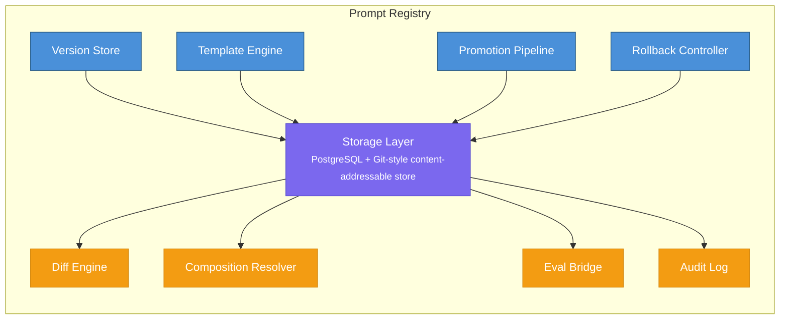
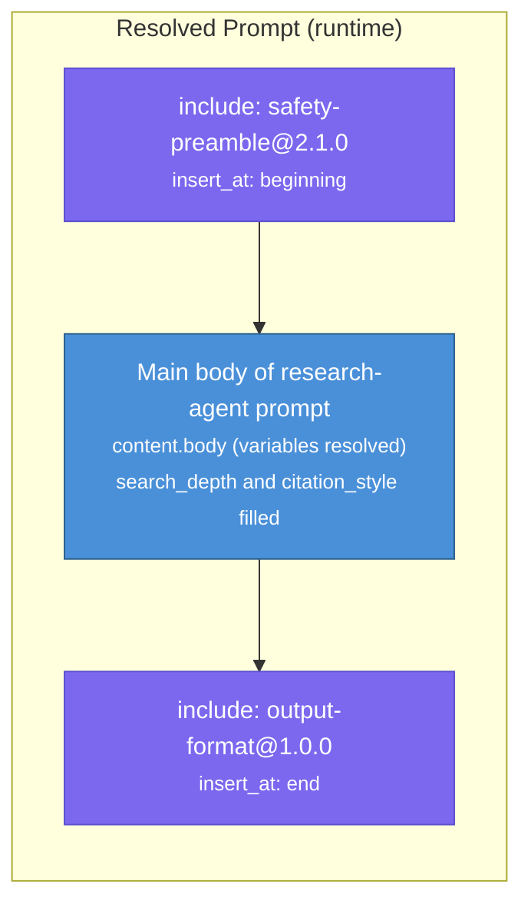

# 07 — Prompt Registry

## 1. Overview & Responsibility

The Prompt Registry is the **version-controlled, single-source-of-truth store** for every system prompt used by every agent in the AgentForge platform. It guarantees that prompt content is immutable per version, semantically versioned, diff-trackable, and promotable through a governed lifecycle pipeline before reaching production traffic.

Within the broader platform architecture (see `00-system-overview.md`, Section 2), the Prompt Registry occupies subsystem #7 and is referenced by virtually every other subsystem that instantiates or evaluates agents. Its core invariant is:

> **A running agent always resolves its `system_prompt_ref` to an immutable, fully-audited prompt snapshot.**

### Design-pattern grounding

| Concern | Pattern | Reference |
|---------|---------|-----------|
| Storage scope | Memory Management — `app:` prefix for application-scoped, persistent prompt storage | p. 151 |
| Persistence layer | Memory Management — durable database storage that survives session restarts | p. 141-155 |
| Version generation | Reflection — generator-critic loop produces new prompt candidates | p. 61-68 |
| Evolution tracking | Learning & Adaptation — prompt version lineage is the primary learning signal | p. 163-172 |
| Quality gates | Evaluation & Monitoring — every version carries eval metrics; evalset regression testing before promotion | p. 304, p. 312 |
| Approval gates | HITL — human approval required before version promotion to production | p. 211 |
| Composition | Prompt Chaining — prompts may be composed from reusable fragments and chains | p. 1-7 |

### Responsibilities

1. **Store** all agent system prompts with full version history.
2. **Version** prompts using strict semantic versioning (major.minor.patch).
3. **Diff** any two versions of the same prompt, character-level and semantic-level.
4. **Template** prompts with variable substitution, conditional sections, and composition from sub-prompts.
5. **Promote** prompts through a governed pipeline: draft --> review --> staged --> production.
6. **Roll back** to any previous production version within seconds.
7. **Integrate** with Agent Builder (subsystem #1) for the full prompt lifecycle, and with the Evaluation Framework (subsystem #8) for regression testing.



---

## 2. Prompt Schema

Every prompt stored in the registry conforms to a canonical JSON schema. The schema is designed to capture content, metadata, versioning, template variables, and composition rules in a single, self-describing document.

### 2.1 Canonical schema

??? example "View JSON example"

    ```json
    {
      "$schema": "https://agentforge.io/schemas/prompt/v1.json",
      "prompt_id": "prm_a1b2c3d4e5f6",
      "name": "research-agent",
      "display_name": "Research Agent System Prompt",
      "description": "Core system prompt for the Research Agent, including search strategy, citation requirements, and output formatting rules.",

      "version": {
        "semver": "2.3.1",
        "created_at": "2026-02-27T10:15:30Z",
        "created_by": {
          "type": "human",
          "identity": "user:alice@acme.com"
        },
        "parent_version": "2.3.0",
        "change_type": "patch",
        "change_summary": "Fix citation format to use APA-7 style consistently.",
        "content_hash": "sha256:e3b0c44298fc1c149afbf4c8996fb92427ae41e4649b934ca495991b7852b855"
      },

      "status": "production",

      "content": {
        "body": "You are a Research Agent. Your task is to ...\n\n## Output Format\n...",
        "format": "markdown"
      },

      "variables": [
        {
          "name": "search_depth",
          "type": "enum",
          "allowed_values": ["shallow", "standard", "deep"],
          "default": "standard",
          "description": "Controls how many search iterations the agent performs."
        },
        {
          "name": "citation_style",
          "type": "string",
          "default": "APA-7",
          "description": "Citation format to use in output."
        },
        {
          "name": "max_sources",
          "type": "integer",
          "default": 10,
          "min": 1,
          "max": 50,
          "description": "Maximum number of sources to include in the response."
        }
      ],

      "composition": {
        "extends": null,
        "includes": [
          {
            "ref": "prompt-registry://shared/output-format-rules@1.0.0",
            "insert_at": "end",
            "required": true
          },
          {
            "ref": "prompt-registry://shared/safety-preamble@2.1.0",
            "insert_at": "beginning",
            "required": true
          }
        ],
        "chain": null
      },

      "eval_metrics": {
        "evalset_id": "evalset_research_v3",
        "last_eval_score": 0.91,
        "last_eval_at": "2026-02-26T22:00:00Z",
        "regression_baseline": 0.88,
        "metric_breakdown": {
          "accuracy": 0.93,
          "citation_quality": 0.89,
          "format_compliance": 0.95,
          "safety": 1.0
        }
      },

      "metadata": {
        "agent_id": "agt_research_001",
        "team_id": "team-alpha",
        "tags": ["research", "web-search", "citations"],
        "model_compatibility": ["claude-sonnet-4-20250514", "claude-opus-4-20250514"],
        "token_estimate": {
          "input_tokens": 1250,
          "method": "tiktoken_cl100k"
        }
      }
    }
    ```

### 2.2 Field semantics

| Field | Purpose | Immutability |
|-------|---------|-------------|
| `prompt_id` | Globally unique identifier, stable across all versions of the same prompt | Immutable |
| `version.semver` | Semantic version string | Immutable per version |
| `version.content_hash` | SHA-256 of `content.body` after variable placeholder normalization | Immutable per version |
| `version.parent_version` | Points to the version this was derived from, forming a DAG | Immutable per version |
| `status` | Current lifecycle stage: `draft`, `review`, `staged`, `production`, `archived` | Mutable, transitions governed by Promotion Pipeline |
| `content.body` | The raw prompt text, including `{{variable}}` placeholders | Immutable per version |
| `variables` | Declared template variables with types, defaults, and constraints | Immutable per version |
| `composition` | References to other prompts that are composed into this one (Prompt Chaining, p. 1-7) | Immutable per version |
| `eval_metrics` | Latest evaluation scores, updated asynchronously by Evaluation Framework (p. 304) | Mutable (append-only metric history) |
| `metadata.token_estimate` | Estimated input token cost so Cost & Resource Manager can budget (p. 255) | Recomputed on creation |

### 2.3 Composition rules

Composition follows the Prompt Chaining pattern (p. 1-7) to allow reuse of common prompt fragments:

- **`extends`**: Single-inheritance. The current prompt inherits the full body of the parent and may override sections delimited by `<!-- section:name -->` markers.
- **`includes`**: Multi-include. Referenced prompts are inserted at `beginning`, `end`, or at a named `<!-- slot:name -->` anchor. Included prompts are resolved recursively, with cycle detection.
- **`chain`**: Ordered list of prompt references forming a sequential chain. Used when the agent's task is decomposed into pipeline stages, each with its own prompt (p. 3).



---

## 3. Versioning Model

### 3.1 Semantic versioning rules

The registry enforces strict semver (MAJOR.MINOR.PATCH) with the following bump conventions:

| Bump | When | Examples |
|------|------|----------|
| **MAJOR** | Breaking change to agent behavior, output schema, or variable contract. Any change that could cause downstream consumers to fail. | Removing a variable, changing output format from JSON to markdown, rewriting the core instructions |
| **MINOR** | Backward-compatible behavioral improvement. The agent produces better results but its interface contract is unchanged. | Adding a new capability section, improving reasoning instructions, adding a new variable with a default |
| **PATCH** | Non-behavioral fix. Typos, formatting, clarification of existing instructions with no expected output change. | Fixing a typo, rewording for clarity, updating citation style name |

### 3.2 Version creation sources

New versions can be created by three sources, each reflecting a different agentic pattern:

1. **Human author** — manual edit via Agent Builder UI or API.
2. **Reflection generator-critic loop** (p. 61-68) — the Prompt Optimizer Agent proposes a new version after analyzing production performance. The generator produces N candidate revisions; the critic scores them against the evalset; the best candidate becomes a new draft.
3. **Learning & Adaptation signal** (p. 163-172) — the platform detects a drift in agent quality metrics and triggers an automated prompt revision cycle, logged as a learning event.

All three sources produce an identical version record. The `created_by` field distinguishes the origin:

??? example "View Python pseudocode"

    ```python
    # Pseudocode: version creation
    class VersionOrigin:
        HUMAN = "human"
        REFLECTION = "reflection"       # p. 61-68
        ADAPTATION = "adaptation"       # p. 163-172

    def create_version(
        prompt_id: str,
        new_body: str,
        change_type: Literal["major", "minor", "patch"],
        origin: VersionOrigin,
        author_identity: str,
        change_summary: str,
        variables: list[VariableSpec] | None = None,
        composition: CompositionSpec | None = None,
    ) -> PromptVersion:
        current = get_current_version(prompt_id)
        new_semver = bump_semver(current.semver, change_type)
        content_hash = sha256(normalize_placeholders(new_body))

        # Reject if content is identical to current version
        if content_hash == current.content_hash:
            raise DuplicateVersionError(
                f"Content hash {content_hash} matches current version {current.semver}"
            )

        version = PromptVersion(
            prompt_id=prompt_id,
            semver=new_semver,
            parent_version=current.semver,
            content_hash=content_hash,
            body=new_body,
            change_type=change_type,
            change_summary=change_summary,
            created_by={"type": origin.value, "identity": author_identity},
            status="draft",  # Always starts as draft
            variables=variables or current.variables,
            composition=composition or current.composition,
        )

        store_version(version)
        compute_and_store_diff(current, version)  # Diff tracking
        emit_event("prompt.version.created", version)
        return version
    ```

### 3.3 Version lineage DAG

Because versions can branch (e.g., a hotfix patch from an older production version while a new minor is in review), the registry maintains a directed acyclic graph of version parentage:

```
1.0.0 ──► 1.1.0 ──► 1.2.0 ──► 2.0.0 ──► 2.0.1
                  │                         ▲
                  └──► 1.2.1 (hotfix) ──────┘
                         (parent: 1.2.0)
```

The DAG enables:
- **Cherry-pick diffs**: Show what changed between any two versions, not just adjacent ones.
- **Lineage queries**: "Show me every version produced by the Reflection loop" (p. 61).
- **Audit trails**: Full provenance from first draft to current production.

---

## 4. Storage Architecture

### 4.1 Design rationale

The registry uses a **hybrid storage model**: a relational database (PostgreSQL) as the primary store for metadata, status, and queryability, combined with a content-addressable blob store (inspired by Git) for prompt bodies and diffs. This approach satisfies the Memory Management pattern's requirement for persistent, application-scoped storage (p. 141-155, `app:` prefix, p. 151).

```
┌────────────────────────────────────────────────────────────────────┐
│                        Storage Architecture                        │
│                                                                    │
│  ┌──────────────────────────┐    ┌───────────────────────────────┐ │
│  │     PostgreSQL           │    │   Content-Addressable Store   │ │
│  │                          │    │   (Git-style blob storage)    │ │
│  │  prompt_versions table   │    │                               │ │
│  │  ┌────────────────────┐  │    │  key: sha256(content)         │ │
│  │  │ prompt_id          │  │    │  value: raw prompt text       │ │
│  │  │ semver             │  │    │                               │ │
│  │  │ status             │──┼────►  Deduplication: identical     │ │
│  │  │ content_hash  ─────┼──┘    │  bodies stored once           │ │
│  │  │ parent_version     │  │    │                               │ │
│  │  │ created_at         │  │    │  Diffs stored as separate     │ │
│  │  │ created_by         │  │    │  blobs (unified diff format)  │ │
│  │  │ variables (jsonb)  │  │    │                               │ │
│  │  │ composition (jsonb)│  │    └───────────────────────────────┘ │
│  │  │ eval_metrics(jsonb)│  │                                      │
│  │  │ metadata (jsonb)   │  │    ┌───────────────────────────────┐ │
│  │  └────────────────────┘  │    │   Redis (hot cache)           │ │
│  │                          │    │                               │ │
│  │  prompt_diffs table      │    │  Caches resolved prompts      │ │
│  │  ┌────────────────────┐  │    │  (templates + variables +     │ │
│  │  │ from_version       │  │    │   composition = final text)   │ │
│  │  │ to_version         │  │    │                               │ │
│  │  │ diff_hash ─────────┼──┼────►  TTL: until version status    │ │
│  │  │ diff_type          │  │    │  changes                      │ │
│  │  └────────────────────┘  │    │                               │ │
│  │                          │    │  Key: app:prompt:{id}@{ver}   │ │
│  │  promotion_log table     │    │  (Memory Management, p. 151)  │ │
│  │  audit_events table      │    └───────────────────────────────┘ │
│  └──────────────────────────┘                                      │
└────────────────────────────────────────────────────────────────────┘
```

### 4.2 Database schema (PostgreSQL)

??? example "View SQL schema"

    ```sql
    CREATE TABLE prompt_versions (
        id              UUID PRIMARY KEY DEFAULT gen_random_uuid(),
        prompt_id       TEXT NOT NULL,             -- stable across versions
        semver          TEXT NOT NULL,             -- e.g. "2.3.1"
        status          TEXT NOT NULL DEFAULT 'draft'
                        CHECK (status IN ('draft','review','staged','production','archived')),
        content_hash    TEXT NOT NULL,             -- sha256 of normalized body
        parent_version  TEXT,                      -- semver of parent (NULL for 1.0.0)
        change_type     TEXT NOT NULL CHECK (change_type IN ('major','minor','patch')),
        change_summary  TEXT NOT NULL,
        created_at      TIMESTAMPTZ NOT NULL DEFAULT now(),
        created_by      JSONB NOT NULL,           -- {type, identity}
        variables       JSONB NOT NULL DEFAULT '[]',
        composition     JSONB NOT NULL DEFAULT '{}',
        eval_metrics    JSONB NOT NULL DEFAULT '{}',
        metadata        JSONB NOT NULL DEFAULT '{}',

        UNIQUE (prompt_id, semver)
    );

    CREATE INDEX idx_prompt_versions_status ON prompt_versions (prompt_id, status);
    CREATE INDEX idx_prompt_versions_created ON prompt_versions (prompt_id, created_at DESC);

    CREATE TABLE prompt_diffs (
        id              UUID PRIMARY KEY DEFAULT gen_random_uuid(),
        prompt_id       TEXT NOT NULL,
        from_version    TEXT NOT NULL,
        to_version      TEXT NOT NULL,
        diff_hash       TEXT NOT NULL,             -- reference into blob store
        diff_type       TEXT NOT NULL DEFAULT 'unified',
        created_at      TIMESTAMPTZ NOT NULL DEFAULT now(),

        UNIQUE (prompt_id, from_version, to_version)
    );

    CREATE TABLE promotion_log (
        id              UUID PRIMARY KEY DEFAULT gen_random_uuid(),
        prompt_id       TEXT NOT NULL,
        semver          TEXT NOT NULL,
        from_status     TEXT NOT NULL,
        to_status       TEXT NOT NULL,
        promoted_by     JSONB NOT NULL,            -- {type, identity}
        reason          TEXT,
        eval_snapshot   JSONB,                     -- metrics at time of promotion
        created_at      TIMESTAMPTZ NOT NULL DEFAULT now()
    );
    ```

### 4.3 Content-addressable blob store

Prompt bodies and diffs are stored in a content-addressable manner, keyed by their SHA-256 hash. This provides automatic deduplication (common when patch versions only change metadata) and tamper evidence.

??? example "View Python pseudocode"

    ```python
    # Pseudocode: blob storage interface
    class BlobStore:
        """Git-style content-addressable store for prompt bodies and diffs."""

        def __init__(self, storage_backend: str = "s3"):
            self.backend = storage_backend

        def put(self, content: bytes) -> str:
            """Store content, return its SHA-256 hash."""
            content_hash = hashlib.sha256(content).hexdigest()
            key = f"app:prompt:blob:{content_hash}"  # app: prefix (p. 151)
            if not self._exists(key):
                self._write(key, content)
            return content_hash

        def get(self, content_hash: str) -> bytes:
            """Retrieve content by hash. Raises NotFound if missing."""
            key = f"app:prompt:blob:{content_hash}"
            return self._read(key)

        def compute_diff(self, old_hash: str, new_hash: str) -> str:
            """Compute unified diff between two blobs."""
            old_content = self.get(old_hash).decode("utf-8")
            new_content = self.get(new_hash).decode("utf-8")
            diff = difflib.unified_diff(
                old_content.splitlines(keepends=True),
                new_content.splitlines(keepends=True),
                fromfile=f"prompt@old",
                tofile=f"prompt@new",
            )
            return "".join(diff)
    ```

### 4.4 Caching layer

Resolved prompts (body + variables substituted + composition includes inlined) are cached in Redis under the `app:` prefix (Memory Management, p. 151). Cache keys follow the pattern:

```
app:prompt:resolved:{prompt_id}@{semver}:{variable_hash}
```

Cache entries are invalidated only when a version's status changes (e.g., archived). Because prompt versions are immutable, resolved results for a given (version, variable set) pair never go stale.

---

## 5. Template System

### 5.1 Variable substitution

The template engine supports Mustache-style `{{variable}}` placeholders. Variables are declared in the prompt schema (Section 2.1) with types, defaults, and constraints. At resolution time, the engine validates all provided values against declarations and substitutes them into the body.

??? example "View Python pseudocode"

    ```python
    # Pseudocode: template resolution
    import re
    from typing import Any

    class TemplateEngine:
        """Resolves prompt templates with variable substitution,
        conditional sections, and composition (Prompt Chaining, p. 1-7)."""

        VARIABLE_PATTERN = re.compile(r"\{\{(\w+)\}\}")
        CONDITIONAL_PATTERN = re.compile(
            r"\{\{#if\s+(\w+)\}\}(.*?)\{\{/if\}\}", re.DOTALL
        )
        SLOT_PATTERN = re.compile(r"<!--\s*slot:(\w+)\s*-->")

        def resolve(
            self,
            version: PromptVersion,
            variables: dict[str, Any] | None = None,
        ) -> str:
            """Fully resolve a prompt version to final text."""
            # Step 1: Resolve composition (includes and extends)
            body = self._resolve_composition(version)

            # Step 2: Resolve conditional sections
            body = self._resolve_conditionals(body, variables or {})

            # Step 3: Substitute variables
            body = self._substitute_variables(body, version.variables, variables or {})

            return body

        def _resolve_composition(self, version: PromptVersion) -> str:
            """Inline all included and extended prompts. Cycle detection
            prevents infinite recursion in composition graphs (p. 5)."""
            body = version.body
            visited = {version.prompt_id}

            # Handle extends (single inheritance)
            if version.composition.get("extends"):
                parent = fetch_version(version.composition["extends"])
                if parent.prompt_id in visited:
                    raise CycleDetectedError(f"Cycle in prompt composition: {visited}")
                visited.add(parent.prompt_id)
                body = self._apply_extends(parent.body, body)

            # Handle includes (multi-include, p. 1-7)
            for include in version.composition.get("includes", []):
                included_version = fetch_version(include["ref"])
                if included_version.prompt_id in visited:
                    raise CycleDetectedError(f"Cycle in prompt composition: {visited}")
                visited.add(included_version.prompt_id)

                included_body = self._resolve_composition(included_version)

                if include["insert_at"] == "beginning":
                    body = included_body + "\n\n" + body
                elif include["insert_at"] == "end":
                    body = body + "\n\n" + included_body
                else:
                    # Named slot insertion
                    slot_name = include["insert_at"]
                    body = self.SLOT_PATTERN.sub(
                        lambda m: included_body if m.group(1) == slot_name else m.group(0),
                        body,
                    )

            return body

        def _resolve_conditionals(self, body: str, variables: dict) -> str:
            """Resolve {{#if var}}...{{/if}} blocks."""
            def replace_conditional(match):
                var_name = match.group(1)
                content = match.group(2)
                if variables.get(var_name):
                    return content
                return ""
            return self.CONDITIONAL_PATTERN.sub(replace_conditional, body)

        def _substitute_variables(
            self,
            body: str,
            declarations: list[VariableSpec],
            provided: dict[str, Any],
        ) -> str:
            """Substitute {{variable}} placeholders. Apply defaults for
            missing values. Validate types and constraints."""
            decl_map = {v.name: v for v in declarations}
            resolved = {}

            for name, spec in decl_map.items():
                if name in provided:
                    self._validate_variable(spec, provided[name])
                    resolved[name] = provided[name]
                elif spec.default is not None:
                    resolved[name] = spec.default
                else:
                    raise MissingVariableError(f"Required variable '{name}' not provided")

            def replacer(match):
                var_name = match.group(1)
                if var_name not in resolved:
                    raise UnknownVariableError(f"Unknown variable '{var_name}'")
                return str(resolved[var_name])

            return self.VARIABLE_PATTERN.sub(replacer, body)

        def _validate_variable(self, spec: VariableSpec, value: Any) -> None:
            """Enforce type, range, and enum constraints."""
            if spec.type == "enum" and value not in spec.allowed_values:
                raise VariableValidationError(
                    f"Variable '{spec.name}' must be one of {spec.allowed_values}, got '{value}'"
                )
            if spec.type == "integer":
                if not isinstance(value, int):
                    raise VariableValidationError(
                        f"Variable '{spec.name}' must be an integer"
                    )
                if spec.min is not None and value < spec.min:
                    raise VariableValidationError(
                        f"Variable '{spec.name}' must be >= {spec.min}"
                    )
                if spec.max is not None and value > spec.max:
                    raise VariableValidationError(
                        f"Variable '{spec.name}' must be <= {spec.max}"
                    )
    ```

### 5.2 Conditional sections

Conditional sections allow parts of a prompt to be included or excluded based on variable values, supporting different agent configurations without maintaining separate prompt versions:

??? example "View details"

    ```
    You are a Research Agent.

    {{#if deep_analysis}}
    When performing deep analysis, you must:
    - Cross-reference at least 5 independent sources
    - Provide confidence scores for each claim
    - Include a methodology section in your output
    {{/if}}

    Your citation style is {{citation_style}}.
    ```

### 5.3 Composition resolution order

When a prompt uses both `extends` and `includes`, the resolution order is:

1. Resolve the `extends` parent (recursively).
2. Apply section overrides from the child onto the parent body.
3. Resolve each `includes` reference (recursively, with cycle detection).
4. Insert includes at their declared positions (`beginning`, `end`, or named slot).
5. Resolve conditional sections.
6. Substitute variables.

This ensures that composition is fully deterministic, and the same (version, variables) tuple always produces the same resolved text.

---

## 6. Promotion Pipeline

### 6.1 Lifecycle states

Every prompt version passes through a governed lifecycle pipeline. This mirrors the prompt lifecycle defined in the system overview (Section 3.6 of `00-system-overview.md`) and enforces quality and safety gates at each transition.

```
                    ┌───────────────────────────────────────────────────┐
                    │              Promotion Pipeline                   │
                    │                                                   │
  ┌──────────┐      │  ┌──────────┐    ┌──────────┐    ┌──────────┐     │
  │  CREATE  │─────►│  │  DRAFT   │───►│  REVIEW  │───►│  STAGED  │─────┼──► PRODUCTION
  │ (author  │      │  │          │    │  (HITL)  │    │  (Eval)  │     │
  │  or AI)  │      │  └──────────┘    └──────────┘    └──────────┘     │
  └──────────┘      │       ▲                                │          │
                    │       │          ┌──────────┐          │          │
                    │       └──────────│ REJECTED │◄─────────┘          │
                    │                  └──────────┘                     │
                    │                                                   │
                    │  At any point:  PRODUCTION ──► ARCHIVED           │
                    └───────────────────────────────────────────────────┘
```

### 6.2 Transition rules

| Transition | Gate | Automated? | Details |
|-----------|------|-----------|---------|
| draft --> review | Diff generated, schema validated | Yes | Automatic on version creation |
| review --> staged | Human approval (HITL, p. 211) | No | Reviewer must approve the diff and change summary. For AI-generated versions (Reflection, p. 61-68), the reviewer also verifies the generator-critic rationale. |
| review --> rejected | Human rejection | No | Reviewer provides rejection reason; author is notified |
| staged --> production | Evalset passes regression threshold (p. 312) | Conditional | Automated if eval score >= baseline. If below baseline, requires explicit human override. |
| staged --> rejected | Evalset fails regression threshold | Yes | Automatic rejection if score drops below `regression_baseline - tolerance` |
| production --> archived | New version reaches production, or manual archive | Yes/No | Previous production version is auto-archived when successor is promoted. Manual archival also supported. |
| any --> draft | Iteration after rejection | No | Author revises and creates a new version |

### 6.3 Promotion service

??? example "View Python pseudocode"

    ```python
    # Pseudocode: promotion pipeline
    class PromotionPipeline:
        """Manages prompt version lifecycle transitions.
        Enforces HITL gates (p. 211) and evalset regression testing (p. 312)."""

        VALID_TRANSITIONS = {
            "draft": ["review"],
            "review": ["staged", "rejected"],
            "staged": ["production", "rejected"],
            "production": ["archived"],
            "rejected": [],       # Terminal; author creates new draft instead
            "archived": [],       # Terminal
        }

        async def promote(
            self,
            prompt_id: str,
            semver: str,
            target_status: str,
            promoted_by: dict,
            reason: str | None = None,
        ) -> PromptVersion:
            version = get_version(prompt_id, semver)
            current_status = version.status

            # Validate transition
            if target_status not in self.VALID_TRANSITIONS.get(current_status, []):
                raise InvalidTransitionError(
                    f"Cannot transition from '{current_status}' to '{target_status}'"
                )

            # Gate: HITL approval for review -> staged (p. 211)
            if current_status == "review" and target_status == "staged":
                if promoted_by["type"] != "human":
                    raise HITLRequiredError(
                        "Human approval required for review -> staged transition (p. 211)"
                    )

            # Gate: evalset regression test for staged -> production (p. 312)
            if current_status == "staged" and target_status == "production":
                eval_result = await self._run_evalset_regression(version)
                if not eval_result.passed:
                    if not self._has_human_override(promoted_by, reason):
                        raise EvalRegressionError(
                            f"Evalset regression failed: score {eval_result.score:.3f} "
                            f"< baseline {version.eval_metrics['regression_baseline']:.3f}. "
                            f"Human override required."
                        )

                # Archive the current production version
                current_prod = get_production_version(prompt_id)
                if current_prod:
                    await self._transition(current_prod, "archived", promoted_by,
                                           reason=f"Superseded by {semver}")

            # Execute transition
            version = await self._transition(version, target_status, promoted_by, reason)

            # Emit event for Observability Platform (p. 301-314)
            emit_event("prompt.version.promoted", {
                "prompt_id": prompt_id,
                "semver": semver,
                "from_status": current_status,
                "to_status": target_status,
                "promoted_by": promoted_by,
                "eval_snapshot": version.eval_metrics,
            })

            return version

        async def _run_evalset_regression(self, version: PromptVersion) -> EvalResult:
            """Run the version's evalset and compare against regression baseline.
            Uses Evaluation Framework (subsystem #8, p. 304, p. 312)."""
            evalset_id = version.eval_metrics.get("evalset_id")
            if not evalset_id:
                raise ConfigurationError("No evalset_id configured for this prompt")

            resolved_prompt = template_engine.resolve(version)
            result = await evaluation_framework.run_evalset(
                evalset_id=evalset_id,
                prompt_text=resolved_prompt,
                agent_id=version.metadata["agent_id"],
            )

            baseline = version.eval_metrics.get("regression_baseline", 0.0)
            tolerance = 0.02  # 2% tolerance band
            result.passed = result.score >= (baseline - tolerance)

            # Store eval metrics on the version (p. 304)
            update_eval_metrics(version.prompt_id, version.semver, {
                "last_eval_score": result.score,
                "last_eval_at": datetime.utcnow().isoformat(),
                "metric_breakdown": result.metric_breakdown,
            })

            return result

        async def _transition(
            self,
            version: PromptVersion,
            target_status: str,
            promoted_by: dict,
            reason: str | None = None,
        ) -> PromptVersion:
            """Execute the status transition and log it."""
            old_status = version.status
            version.status = target_status
            save_version(version)

            # Audit log entry
            insert_promotion_log(
                prompt_id=version.prompt_id,
                semver=version.semver,
                from_status=old_status,
                to_status=target_status,
                promoted_by=promoted_by,
                reason=reason,
                eval_snapshot=version.eval_metrics,
            )

            # Invalidate cache if entering or leaving production
            if "production" in (old_status, target_status):
                invalidate_cache(version.prompt_id, version.semver)

            return version
    ```

---

## 7. Rollback Mechanism

### 7.1 Design principles

Rollback is a first-class operation, not a workaround. Because every version is immutable and the full lineage DAG is preserved, rollback is simply "promote a previously archived version back to production." No data is lost or overwritten.

### 7.2 Rollback strategies

| Strategy | Description | Use case |
|----------|-------------|----------|
| **Instant rollback** | Re-promote the previous production version. Skips review and staged gates (emergency path). | Production incident: new prompt causing failures |
| **Targeted rollback** | Promote any specific historical version. Goes through the full pipeline (review --> staged --> production). | Reverting to a known-good version from several releases ago |
| **Partial rollback** | Create a new version that cherry-picks content from a historical version but keeps current metadata/variables. | Reverting prompt body but preserving newly added variables |

### 7.3 Instant rollback service

??? example "View Python pseudocode"

    ```python
    # Pseudocode: rollback controller
    class RollbackController:
        """Provides instant and targeted rollback for prompt versions.
        Instant rollback is an emergency operation that bypasses normal
        promotion gates but still requires human authorization (HITL, p. 211)."""

        async def instant_rollback(
            self,
            prompt_id: str,
            target_semver: str | None = None,
            authorized_by: dict = None,
        ) -> PromptVersion:
            """Instantly roll back to a previous version.
            If target_semver is None, rolls back to the most recent
            archived version (i.e., the one that was production before current).

            HITL gate: authorized_by must be a human operator (p. 211).
            """
            if not authorized_by or authorized_by.get("type") != "human":
                raise HITLRequiredError(
                    "Instant rollback requires human authorization (p. 211)"
                )

            # Determine rollback target
            if target_semver:
                target = get_version(prompt_id, target_semver)
            else:
                target = get_most_recent_archived(prompt_id)

            if not target:
                raise RollbackError(f"No rollback target found for prompt '{prompt_id}'")

            # Archive current production version
            current_prod = get_production_version(prompt_id)
            if current_prod:
                current_prod.status = "archived"
                save_version(current_prod)
                insert_promotion_log(
                    prompt_id=prompt_id,
                    semver=current_prod.semver,
                    from_status="production",
                    to_status="archived",
                    promoted_by=authorized_by,
                    reason=f"Emergency rollback to {target.semver}",
                )

            # Promote target directly to production (bypass pipeline)
            target.status = "production"
            save_version(target)
            insert_promotion_log(
                prompt_id=prompt_id,
                semver=target.semver,
                from_status="archived",
                to_status="production",
                promoted_by=authorized_by,
                reason="Emergency instant rollback",
            )

            # Invalidate caches
            invalidate_cache(prompt_id)

            # Emit high-priority event
            emit_event("prompt.version.rollback", {
                "prompt_id": prompt_id,
                "rolled_back_from": current_prod.semver if current_prod else None,
                "rolled_back_to": target.semver,
                "authorized_by": authorized_by,
                "type": "instant",
            }, severity="critical")

            return target

        async def targeted_rollback(
            self,
            prompt_id: str,
            target_semver: str,
            change_summary: str,
            author: dict,
        ) -> PromptVersion:
            """Create a new draft version with the body from a historical version.
            Goes through the standard promotion pipeline.

            This is not truly a 'rollback' but a 'roll-forward to old content',
            preserving full audit trail and requiring normal gates."""
            historical = get_version(prompt_id, target_semver)
            current = get_current_version(prompt_id)
            new_semver = bump_semver(current.semver, "minor")

            new_version = PromptVersion(
                prompt_id=prompt_id,
                semver=new_semver,
                parent_version=current.semver,
                content_hash=historical.content_hash,
                body=historical.body,
                change_type="minor",
                change_summary=change_summary,
                created_by=author,
                status="draft",
                variables=current.variables,        # Keep current variables
                composition=current.composition,    # Keep current composition
            )

            store_version(new_version)
            compute_and_store_diff(current, new_version)
            emit_event("prompt.version.created", {
                **new_version.to_dict(),
                "rollback_source": target_semver,
            })

            return new_version
    ```

### 7.4 Rollback safety

- **Instant rollback** always requires HITL authorization (p. 211). It is logged as a critical audit event.
- **Cache invalidation** is synchronous during rollback: the function does not return until all resolved-prompt caches for the affected `prompt_id` are purged.
- **Downstream notification**: an event is emitted so that any running agent instances can reload their system prompt on the next turn boundary. Agents do not hot-swap prompts mid-conversation to prevent inconsistent behavior.

---

## 8. API Surface

### 8.1 REST endpoints

All endpoints are served by the Prompt Registry service behind the platform API gateway. Authentication follows the platform's OAuth2 model (p. 248).

| Method | Path | Description |
|--------|------|-------------|
| `POST` | `/api/v1/prompts` | Create a new prompt (first version 1.0.0) |
| `GET` | `/api/v1/prompts` | List prompts with filtering (by tag, agent, team, status) |
| `GET` | `/api/v1/prompts/{prompt_id}` | Get prompt metadata and current production version |
| `POST` | `/api/v1/prompts/{prompt_id}/versions` | Create a new version |
| `GET` | `/api/v1/prompts/{prompt_id}/versions` | List all versions (with optional status filter) |
| `GET` | `/api/v1/prompts/{prompt_id}/versions/{semver}` | Get a specific version |
| `GET` | `/api/v1/prompts/{prompt_id}/versions/{semver}/resolved` | Get fully resolved prompt text (template + composition) |
| `GET` | `/api/v1/prompts/{prompt_id}/diff/{from_ver}/{to_ver}` | Get diff between two versions |
| `POST` | `/api/v1/prompts/{prompt_id}/versions/{semver}/promote` | Promote a version to the next lifecycle stage |
| `POST` | `/api/v1/prompts/{prompt_id}/rollback` | Instant rollback (emergency) |
| `GET` | `/api/v1/prompts/{prompt_id}/lineage` | Get the version lineage DAG |
| `GET` | `/api/v1/prompts/{prompt_id}/audit-log` | Get the full promotion and change audit trail |

### 8.2 Internal resolution protocol

Agents resolve their system prompts via a lightweight internal protocol, not the full REST API. This is the hot path and must be low-latency:

??? example "View Python pseudocode"

    ```python
    # Pseudocode: prompt resolution protocol used by Agent Runtime
    class PromptResolver:
        """Resolves prompt references used in agent identity contracts.
        Reference format: prompt-registry://{name}@{semver}

        This is the hot path called on every agent instantiation.
        Uses Redis cache (app: prefix, p. 151) for sub-millisecond resolution."""

        def __init__(self, cache: RedisClient, db: DatabaseClient):
            self.cache = cache
            self.db = db
            self.template_engine = TemplateEngine()

        async def resolve(
            self,
            ref: str,
            variables: dict[str, Any] | None = None,
        ) -> str:
            """Resolve a prompt-registry:// reference to final prompt text.

            Args:
                ref: Prompt reference, e.g. 'prompt-registry://research-agent@2.3.1'
                     or 'prompt-registry://research-agent@latest' for current production.
                variables: Variable values to substitute into the template.

            Returns:
                Fully resolved prompt text, ready for use as system prompt.
            """
            name, version_spec = self._parse_ref(ref)

            # Resolve 'latest' to current production version
            if version_spec == "latest":
                version_spec = await self._get_production_semver(name)

            # Check cache
            var_hash = hashlib.md5(json.dumps(variables or {}, sort_keys=True).encode()).hexdigest()
            cache_key = f"app:prompt:resolved:{name}@{version_spec}:{var_hash}"
            cached = await self.cache.get(cache_key)
            if cached:
                return cached

            # Cache miss: resolve from database
            version = await self.db.get_version(name, version_spec)
            if not version:
                raise PromptNotFoundError(f"Prompt '{name}@{version_spec}' not found")
            if version.status not in ("production", "staged"):
                raise PromptNotActiveError(
                    f"Prompt '{name}@{version_spec}' is in status '{version.status}', "
                    f"expected 'production' or 'staged'"
                )

            resolved = self.template_engine.resolve(version, variables)

            # Cache with no TTL (invalidated explicitly on status change)
            await self.cache.set(cache_key, resolved)

            return resolved

        def _parse_ref(self, ref: str) -> tuple[str, str]:
            """Parse 'prompt-registry://name@version' into (name, version)."""
            stripped = ref.replace("prompt-registry://", "")
            if "@" in stripped:
                name, version = stripped.rsplit("@", 1)
            else:
                name, version = stripped, "latest"
            return name, version
    ```

### 8.3 Event bus integration

The Prompt Registry emits events on every state change. These events are consumed by the Observability Platform (p. 301-314), the Agent Builder (subsystem #1), and the Evaluation Framework (subsystem #8).

| Event | Payload | Consumers |
|-------|---------|-----------|
| `prompt.version.created` | Full version record | Agent Builder, Observability |
| `prompt.version.promoted` | Version ID, from/to status, eval snapshot | Observability, Evaluation Framework |
| `prompt.version.rollback` | Rollback details, severity=critical | Observability, Alerting, Agent Builder |
| `prompt.eval.completed` | Version ID, eval scores, pass/fail | Promotion Pipeline (auto-promotion decision) |

---

## 9. Failure Modes & Mitigations

The Prompt Registry is a critical-path dependency for every agent in the platform. Failures here can prevent agents from starting or cause them to use stale prompts. The following table catalogs known failure modes and their mitigations, following the Error Triad pattern (detection, classification, recovery) described in the system overview (Section 7.1).

| # | Failure Mode | Detection | Classification | Mitigation |
|---|-------------|-----------|---------------|------------|
| F1 | **Database unavailable** | Health check on PostgreSQL connection pool | Transient | Retry with exponential backoff. Agents fall back to Redis-cached resolved prompts. If cache also misses, agent startup is blocked with a clear error. |
| F2 | **Cache (Redis) unavailable** | Connection timeout on cache read | Transient | Bypass cache and resolve directly from database. Log degraded performance to Observability Platform (p. 301). |
| F3 | **Blob store unavailable** | HTTP error on blob fetch | Transient | Retry. If persistent, serve from PostgreSQL fallback column (prompt body is also stored inline for disaster recovery). |
| F4 | **Circular composition detected** | Cycle detection in `_resolve_composition` | Logic | Reject the version at creation time. Return a clear error identifying the cycle path. |
| F5 | **Missing include reference** | `fetch_version` returns None during composition resolution | Logic | If `required: true`, fail resolution with error. If `required: false`, omit the include and log a warning. |
| F6 | **Evalset regression during promotion** | Eval score below baseline - tolerance | Logic | Block promotion to production. Notify author with detailed metric breakdown. Require human override or revision. (p. 312) |
| F7 | **Concurrent promotion race** | Two promote calls for the same prompt_id arrive simultaneously | Logic | Use PostgreSQL advisory locks on `prompt_id` during promotion. Only one promotion can execute at a time. Loser receives a conflict error. |
| F8 | **Prompt too large for model context** | Token estimate exceeds model's max context window | Logic | Warn at creation time. Block promotion if resolved prompt exceeds the smallest compatible model's context window. Suggest splitting via composition. |
| F9 | **Rollback target not found** | No archived version exists for the prompt | Logic | Return clear error. Suggest targeted rollback to a specific version from the lineage DAG. |
| F10 | **Schema validation failure** | Variable type mismatch, missing required fields | Logic | Reject at API boundary with detailed validation errors. Never store an invalid version. |

### Recovery pseudocode for F1 (database unavailable)

??? example "View Python pseudocode"

    ```python
    # Pseudocode: resilient prompt resolution with fallback
    class ResilientPromptResolver:
        """Wraps PromptResolver with fallback chain for high availability.

        Fallback order:
        1. Redis cache (hot, sub-ms)
        2. PostgreSQL (primary store)
        3. Local file cache (cold, stale-but-safe)

        Follows Memory Management persistence hierarchy (p. 141-155)."""

        async def resolve_with_fallback(
            self,
            ref: str,
            variables: dict | None = None,
        ) -> str:
            # Attempt 1: Cache
            try:
                cached = await self.cache_resolve(ref, variables)
                if cached:
                    return cached
            except RedisUnavailableError:
                log.warning("Redis unavailable, falling back to database")
                metrics.increment("prompt_registry.cache_fallback")

            # Attempt 2: Database
            try:
                return await self.db_resolve(ref, variables)
            except DatabaseUnavailableError:
                log.error("Database unavailable, falling back to local cache")
                metrics.increment("prompt_registry.db_fallback")

            # Attempt 3: Local file cache (stale but safe)
            local = await self.local_file_resolve(ref, variables)
            if local:
                log.warning(f"Serving stale prompt from local cache for {ref}")
                metrics.increment("prompt_registry.local_fallback")
                return local

            # All sources exhausted
            raise PromptResolutionError(
                f"Cannot resolve prompt '{ref}': all storage backends unavailable"
            )
    ```

---

## 10. Instrumentation

### 10.1 Metrics

All metrics are exported via OpenTelemetry to the Observability Platform (p. 301-314). Metric names follow the `prompt_registry.*` namespace.

| Metric | Type | Description |
|--------|------|-------------|
| `prompt_registry.resolve.latency_ms` | Histogram | Time to resolve a prompt reference to final text. Labels: `cache_hit`, `prompt_id` |
| `prompt_registry.resolve.cache_hit_rate` | Gauge | Ratio of cache hits to total resolutions |
| `prompt_registry.resolve.errors` | Counter | Resolution failures. Labels: `error_type` (not_found, not_active, composition_error, storage_error) |
| `prompt_registry.version.created` | Counter | New versions created. Labels: `prompt_id`, `change_type`, `origin` (human, reflection, adaptation) |
| `prompt_registry.promotion.completed` | Counter | Successful promotions. Labels: `from_status`, `to_status` |
| `prompt_registry.promotion.rejected` | Counter | Rejected promotions. Labels: `from_status`, `rejection_reason` (hitl_denied, eval_regression, conflict) |
| `prompt_registry.rollback.executed` | Counter | Rollbacks performed. Labels: `type` (instant, targeted) |
| `prompt_registry.eval.score` | Gauge | Latest evalset score per prompt. Labels: `prompt_id`, `semver` |
| `prompt_registry.storage.blob_count` | Gauge | Total blobs in content-addressable store |
| `prompt_registry.storage.db_latency_ms` | Histogram | Database query latency |

### 10.2 Traces

Every prompt resolution and promotion operation produces a trace span, nested under the calling agent's trace:

```
Trace: Agent Execution
├── Span: PromptResolver.resolve
│   ├── attribute: prompt_ref = "prompt-registry://research-agent@latest"
│   ├── attribute: resolved_semver = "2.3.1"
│   ├── attribute: cache_hit = true
│   ├── attribute: resolved_token_count = 1250
│   └── latency_ms: 0.8
│
├── Span: Agent LLM Call
│   └── ...
```

Promotion operations produce their own top-level traces:

```
Trace: Prompt Promotion
├── Span: PromotionPipeline.promote
│   ├── attribute: prompt_id = "prm_a1b2c3d4e5f6"
│   ├── attribute: semver = "2.4.0"
│   ├── attribute: from_status = "staged"
│   ├── attribute: to_status = "production"
│   │
│   ├── Span: EvalsetRegression
│   │   ├── attribute: evalset_id = "evalset_research_v3"
│   │   ├── attribute: score = 0.93
│   │   ├── attribute: baseline = 0.88
│   │   ├── attribute: passed = true
│   │   └── latency_ms: 45000
│   │
│   ├── Span: ArchivePreviousProduction
│   │   ├── attribute: archived_semver = "2.3.1"
│   │   └── latency_ms: 12
│   │
│   └── Span: CacheInvalidation
│       └── latency_ms: 3
```

### 10.3 Structured audit log

Every mutation to the registry is captured in the `promotion_log` and `audit_events` tables (Section 4.2). These logs are immutable (append-only) and support the following queries critical for compliance and debugging:

- "Who approved prompt X version Y for production, and when?"
- "What was the evalset score at the time of promotion?" (p. 304)
- "How many versions were generated by the Reflection loop this month?" (p. 61-68)
- "Show the full lifecycle of this prompt from first draft to current production."
- "Which prompts have been rolled back in the last 7 days?"

### 10.4 Alerts

The following alert rules are configured in the Observability Platform:

| Alert | Condition | Severity | Action |
|-------|-----------|----------|--------|
| `PromptResolutionFailure` | `prompt_registry.resolve.errors` > 0 for 1 minute | Critical | Page on-call. Agents cannot start. |
| `HighResolutionLatency` | p99 of `prompt_registry.resolve.latency_ms` > 50ms for 5 minutes | Warning | Investigate cache health. |
| `EvalScoreDrift` | `prompt_registry.eval.score` drops > 5% from baseline for any production prompt | Warning | Notify prompt owner. Consider triggering Reflection loop (p. 61-68). |
| `FrequentRollbacks` | `prompt_registry.rollback.executed` > 3 in 24 hours | Warning | Investigate prompt quality process. Review HITL gate effectiveness (p. 211). |
| `StorageCapacity` | `prompt_registry.storage.blob_count` > 90% of provisioned capacity | Info | Plan capacity expansion. |

---

## Integration with Agent Builder

The Prompt Registry is tightly coupled with the Agent Builder (subsystem #1). The integration points are:

1. **Prompt creation**: Agent Builder calls `POST /api/v1/prompts` when a new agent is defined, establishing the prompt's identity and first version.
2. **Prompt editing**: Agent Builder provides a diff-aware editor that calls `POST /api/v1/prompts/{id}/versions` to create new versions and `GET /api/v1/prompts/{id}/diff/{from}/{to}` to display changes.
3. **Promotion UI**: Agent Builder surfaces the promotion pipeline status and provides the HITL review interface (p. 211) for the review --> staged transition.
4. **Reflection integration**: Agent Builder's Prompt Optimizer Agent (Reflection pattern, p. 61-68) creates new draft versions via the API. The `created_by.type` is set to `"reflection"`, enabling the reviewer to distinguish AI-generated versions.
5. **Learning signal**: When the Learning & Adaptation subsystem (p. 163-172) detects quality drift, it notifies Agent Builder, which triggers a prompt revision cycle and records the trigger as an adaptation event in the version metadata.
6. **Agent identity binding**: The agent identity contract (see system overview, Section 3.2) references prompts via `system_prompt_ref: "prompt-registry://name@version"`. Agent Builder maintains this binding and updates it when a new version reaches production.

---

*Previous: See subsystem #6 (Code Generation Tools). Next: See subsystem #8 (Evaluation Framework).*
