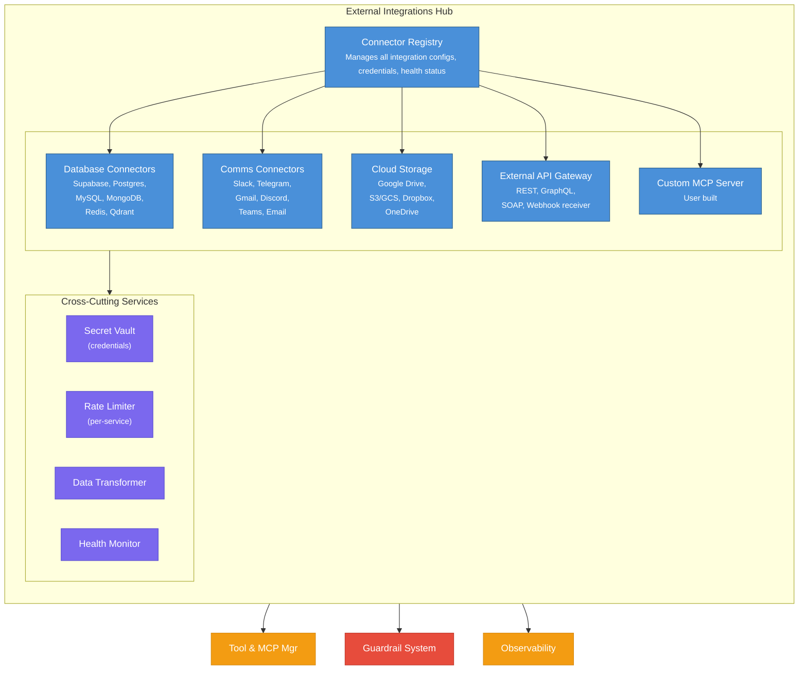

# Subsystem 12: External Integrations Hub

## 1. Overview & Responsibility

The External Integrations Hub is the **boundary layer** between AgentForge and the outside world. It provides a standardized, secure, and observable way for agents and teams to interact with external services — databases, communication platforms, cloud storage, third-party APIs, and any other system agents need to accomplish real-world tasks.

Every external integration is exposed as an **MCP server** (p. 158), making tools discoverable, self-describing, and assignable via the Tool & MCP Manager (subsystem 03). This creates a uniform interface regardless of whether the agent is querying a database, sending a Slack message, or calling a REST API.

### Core Responsibilities

| # | Responsibility | Pattern Reference |
|---|---------------|-------------------|
| 1 | **Connector Registry**: Catalog of all available external integrations | MCP (p. 155-165), Tool Use (p. 81) |
| 2 | **MCP Server Management**: Each integration runs as an MCP server | MCP (p. 158-163) |
| 3 | **Authentication & Secrets**: Secure credential management for external services | Guardrails/Safety (p. 288), A2A (p. 248) |
| 4 | **Rate Limiting & Quotas**: Prevent agents from overwhelming external APIs | Resource-Aware Optimization (p. 255) |
| 5 | **Data Transformation**: Normalize external data for agent consumption | Tool Use (p. 90) |
| 6 | **Health Monitoring**: Track availability of all external services | Evaluation & Monitoring (p. 301) |
| 7 | **Webhook Ingestion**: Receive events from external systems (Slack, Telegram, etc.) | A2A (p. 246 — webhook mode) |

### Architecture Diagram



---

## 2. Integration Connector Schema

Every external integration is described by a **Connector Definition**:

??? example "View JSON example"

    ```json
    {
      "connector_id": "supabase-production",
      "type": "database",
      "provider": "supabase",
      "display_name": "Supabase Production DB",
      "description": "PostgreSQL database via Supabase with real-time subscriptions and auth",
      "version": "1.2.0",

      "connection": {
        "transport": "http",
        "base_url": "https://xxxx.supabase.co",
        "auth": {
          "method": "api_key",
          "secret_ref": "vault://secrets/supabase/production/service_role_key"
        },
        "tls": true,
        "timeout_ms": 5000,
        "retry_policy": {
          "max_retries": 3,
          "backoff": "exponential",
          "base_delay_ms": 200
        }
      },

      "mcp_server": {
        "transport": "http_sse",
        "port": 8101,
        "health_check_path": "/health",
        "health_check_interval_seconds": 30
      },

      "tools": [
        {
          "name": "supabase_query",
          "description": "Execute a read-only SQL query against the Supabase PostgreSQL database. Use for data retrieval. Do NOT use for writes — use supabase_insert/update/delete instead.",
          "irreversible": false,
          "data_classification": "internal",
          "rate_limit": { "requests_per_minute": 60 }
        },
        {
          "name": "supabase_insert",
          "description": "Insert a new row into a Supabase table. This is a WRITE operation.",
          "irreversible": true,
          "requires_hitl": false,
          "data_classification": "internal",
          "rate_limit": { "requests_per_minute": 30 }
        }
      ],

      "permissions": {
        "default_scope": "read",
        "available_scopes": ["read", "write", "admin"],
        "tables_allowlist": ["products", "orders", "users_public"],
        "tables_denylist": ["auth.users", "auth.sessions", "secrets"]
      },

      "monitoring": {
        "log_queries": true,
        "log_results": false,
        "alert_on_error_rate": 0.05,
        "alert_on_latency_p95_ms": 2000
      }
    }
    ```

---

## 3. Database Connectors

### 3.1 Supabase / PostgreSQL

Supabase is the recommended primary database for AgentForge due to its PostgreSQL foundation, built-in auth, real-time subscriptions, and edge functions.

??? example "View Python pseudocode"

    ```python
    from fastmcp import FastMCP

    supabase_mcp = FastMCP("Supabase Connector")


    @supabase_mcp.tool()
    async def supabase_query(
        query: str,
        params: list | None = None,
        table: str | None = None
    ) -> list[dict]:
        """
        Execute a read-only SQL query against Supabase PostgreSQL.
        Use for retrieving data. Returns rows as list of dicts.
        Do NOT use for INSERT/UPDATE/DELETE — use dedicated write tools.

        Args:
            query: SQL SELECT query. Must be read-only.
            params: Parameterized query values (prevents SQL injection).
            table: Optional table name for access control validation.
        """
        # Security: validate read-only (p. 288 — Least Privilege)
        if not is_read_only_query(query):
            raise ToolSecurityError("Only SELECT queries allowed via supabase_query")

        # Security: validate table access
        if table and table in DENIED_TABLES:
            raise ToolSecurityError(f"Access to table '{table}' is denied")

        # Security: parameterized queries only (prevent SQL injection)
        if params is None and contains_user_input(query):
            raise ToolSecurityError("Use parameterized queries for user-provided values")

        result = await supabase_client.rpc("query", {
            "sql": query,
            "params": params or []
        })
        return result.data


    @supabase_mcp.tool()
    async def supabase_insert(
        table: str,
        data: dict,
        return_record: bool = True
    ) -> dict:
        """
        Insert a new row into a Supabase table. WRITE operation.
        Requires write scope. Irreversible — creates new data.

        Args:
            table: Target table name (must be in allowlist).
            data: Row data as key-value pairs matching table schema.
            return_record: Whether to return the inserted record.
        """
        if table in DENIED_TABLES:
            raise ToolSecurityError(f"Write access to '{table}' denied")

        # Guardrail: sanitize data before write (p. 289)
        sanitized = sanitize_for_storage(data)

        result = await supabase_client.table(table).insert(sanitized).execute()
        return result.data[0] if return_record and result.data else {"status": "inserted"}


    @supabase_mcp.tool()
    async def supabase_update(
        table: str,
        filters: dict,
        data: dict
    ) -> dict:
        """
        Update existing rows in a Supabase table. WRITE operation.
        Requires write scope. Modifies existing data.

        Args:
            table: Target table name.
            filters: WHERE conditions as key-value pairs (all must match).
            data: Fields to update as key-value pairs.
        """
        if table in DENIED_TABLES:
            raise ToolSecurityError(f"Write access to '{table}' denied")

        if not filters:
            raise ToolSecurityError("UPDATE without filters is not allowed (safety)")

        sanitized = sanitize_for_storage(data)
        query = supabase_client.table(table).update(sanitized)
        for key, value in filters.items():
            query = query.eq(key, value)

        result = await query.execute()
        return {"updated_count": len(result.data), "data": result.data}


    @supabase_mcp.tool()
    async def supabase_delete(
        table: str,
        filters: dict,
        confirm: bool = False
    ) -> dict:
        """
        Delete rows from a Supabase table. DESTRUCTIVE operation.
        Requires explicit confirmation. HITL recommended for bulk deletes.

        Args:
            table: Target table name.
            filters: WHERE conditions (required — cannot delete all rows).
            confirm: Must be True to proceed. Safety gate.
        """
        if not confirm:
            return {
                "status": "confirmation_required",
                "message": "Set confirm=True to proceed with deletion. "
                           "This action is irreversible."
            }

        if not filters:
            raise ToolSecurityError("DELETE without filters is not allowed")

        # Checkpoint before destructive action (p. 290)
        checkpoint = await create_checkpoint(table, filters)

        query = supabase_client.table(table).delete()
        for key, value in filters.items():
            query = query.eq(key, value)

        result = await query.execute()
        return {
            "deleted_count": len(result.data),
            "checkpoint_id": checkpoint.id,
            "rollback_available": True
        }


    @supabase_mcp.tool()
    async def supabase_realtime_subscribe(
        table: str,
        event: str = "INSERT",
        filters: dict | None = None
    ) -> dict:
        """
        Subscribe to real-time changes on a Supabase table.
        Returns a subscription ID that can be used to receive events.

        Args:
            table: Table to watch.
            event: Event type: INSERT, UPDATE, DELETE, or * for all.
            filters: Optional row-level filters.
        """
        subscription = await supabase_client.channel(f"agent-{table}").on(
            "postgres_changes",
            {"event": event, "schema": "public", "table": table, "filter": filters}
        ).subscribe()

        return {
            "subscription_id": subscription.id,
            "table": table,
            "event": event,
            "status": "active"
        }


    @supabase_mcp.tool()
    async def supabase_storage_upload(
        bucket: str,
        path: str,
        content: bytes,
        content_type: str = "application/octet-stream"
    ) -> dict:
        """
        Upload a file to Supabase Storage.
        Use for storing generated documents, images, or artifacts.

        Args:
            bucket: Storage bucket name.
            path: File path within the bucket.
            content: File content as bytes.
            content_type: MIME type.
        """
        if len(content) > MAX_UPLOAD_SIZE:
            raise ToolSecurityError(f"File exceeds max upload size ({MAX_UPLOAD_SIZE} bytes)")

        result = await supabase_client.storage.from_(bucket).upload(
            path, content, {"content-type": content_type}
        )
        public_url = supabase_client.storage.from_(bucket).get_public_url(path)

        return {"path": path, "bucket": bucket, "public_url": public_url}
    ```

### 3.2 Other Database Connectors

| Connector | Transport | Tools Exposed | Use Case |
|-----------|-----------|---------------|----------|
| **PostgreSQL (direct)** | STDIO | `pg_query`, `pg_execute`, `pg_schema` | Direct DB access without Supabase overhead |
| **MySQL** | STDIO | `mysql_query`, `mysql_execute` | Legacy system integration |
| **MongoDB** | HTTP+SSE | `mongo_find`, `mongo_insert`, `mongo_aggregate` | Document store for unstructured agent data |
| **Redis** | STDIO | `redis_get`, `redis_set`, `redis_publish` | Caching, pub/sub, session store |
| **Qdrant / pgvector** | HTTP+SSE | `vector_search`, `vector_upsert` | RAG knowledge store (§11, p. 220) |

---

## 4. Communication Platform Connectors

### 4.1 Slack

??? example "View Python pseudocode"

    ```python
    slack_mcp = FastMCP("Slack Connector")


    @slack_mcp.tool()
    async def slack_send_message(
        channel: str,
        text: str,
        thread_ts: str | None = None,
        blocks: list[dict] | None = None
    ) -> dict:
        """
        Send a message to a Slack channel or thread.
        EXTERNAL COMMUNICATION — visible to humans. Use carefully.

        Args:
            channel: Channel ID or name (e.g., #general, C01ABC123).
            text: Message text (Markdown supported).
            thread_ts: Thread timestamp to reply in a thread.
            blocks: Rich Slack Block Kit elements (optional).
        """
        # Guardrail: output filtering before external send (p. 286, Layer 6)
        sanitized_text = await output_filter.sanitize(text)

        result = await slack_client.chat_postMessage(
            channel=channel,
            text=sanitized_text,
            thread_ts=thread_ts,
            blocks=blocks
        )
        return {
            "ok": result["ok"],
            "ts": result["ts"],
            "channel": result["channel"]
        }


    @slack_mcp.tool()
    async def slack_read_channel(
        channel: str,
        limit: int = 20,
        oldest: str | None = None
    ) -> list[dict]:
        """
        Read recent messages from a Slack channel.
        Use for monitoring conversations or gathering context.

        Args:
            channel: Channel ID.
            limit: Max messages to retrieve (1-100).
            oldest: Only messages after this timestamp.
        """
        result = await slack_client.conversations_history(
            channel=channel, limit=min(limit, 100), oldest=oldest
        )
        return [
            {
                "user": msg.get("user"),
                "text": msg.get("text"),
                "ts": msg.get("ts"),
                "thread_ts": msg.get("thread_ts")
            }
            for msg in result["messages"]
        ]


    @slack_mcp.tool()
    async def slack_react(
        channel: str,
        timestamp: str,
        emoji: str
    ) -> dict:
        """Add a reaction emoji to a Slack message."""
        await slack_client.reactions_add(
            channel=channel, timestamp=timestamp, name=emoji
        )
        return {"ok": True, "emoji": emoji}


    @slack_mcp.tool()
    async def slack_search(
        query: str,
        count: int = 10,
        sort: str = "timestamp"
    ) -> list[dict]:
        """
        Search Slack messages across all accessible channels.

        Args:
            query: Search query string.
            count: Max results.
            sort: Sort by 'timestamp' or 'score'.
        """
        result = await slack_client.search_messages(
            query=query, count=min(count, 50), sort=sort
        )
        return [
            {
                "text": match["text"],
                "channel": match["channel"]["name"],
                "user": match["user"],
                "ts": match["ts"],
                "permalink": match["permalink"]
            }
            for match in result["messages"]["matches"]
        ]
    ```

**Webhook Ingestion** — Slack events (mentions, messages, reactions) can trigger agent workflows:

??? example "View Python pseudocode"

    ```python
    @app.post("/webhooks/slack/events")
    async def slack_event_handler(request: Request):
        """
        Receive Slack events and route them to the appropriate agent team.
        Uses the Routing pattern (p. 21) to dispatch events.
        """
        payload = await request.json()

        # Verify Slack signature (security)
        verify_slack_signature(request.headers, payload)

        event = payload.get("event", {})
        event_type = event.get("type")

        # Route to appropriate team based on event type (p. 25)
        if event_type == "app_mention":
            await team_orchestrator.dispatch({
                "source": "slack",
                "type": "mention",
                "channel": event["channel"],
                "user": event["user"],
                "text": event["text"],
                "thread_ts": event.get("thread_ts")
            })
        elif event_type == "message" and event.get("channel_type") == "im":
            await team_orchestrator.dispatch({
                "source": "slack",
                "type": "direct_message",
                "user": event["user"],
                "text": event["text"]
            })

        return {"ok": True}
    ```

### 4.2 Telegram

??? example "View Python pseudocode"

    ```python
    telegram_mcp = FastMCP("Telegram Connector")


    @telegram_mcp.tool()
    async def telegram_send_message(
        chat_id: int | str,
        text: str,
        parse_mode: str = "Markdown",
        reply_to_message_id: int | None = None
    ) -> dict:
        """
        Send a message via Telegram Bot API.
        EXTERNAL COMMUNICATION — visible to users.

        Args:
            chat_id: Telegram chat ID or @channel_username.
            text: Message text (Markdown or HTML).
            parse_mode: 'Markdown' or 'HTML'.
            reply_to_message_id: Message ID to reply to.
        """
        sanitized = await output_filter.sanitize(text)

        result = await telegram_bot.send_message(
            chat_id=chat_id,
            text=sanitized,
            parse_mode=parse_mode,
            reply_to_message_id=reply_to_message_id
        )
        return {
            "message_id": result.message_id,
            "chat_id": result.chat.id,
            "date": result.date.isoformat()
        }


    @telegram_mcp.tool()
    async def telegram_send_document(
        chat_id: int | str,
        file_path: str,
        caption: str | None = None
    ) -> dict:
        """
        Send a document/file via Telegram.
        Use for sharing reports, generated files, or exports.
        """
        with open(file_path, "rb") as f:
            result = await telegram_bot.send_document(
                chat_id=chat_id,
                document=f,
                caption=caption
            )
        return {"message_id": result.message_id, "file_id": result.document.file_id}


    @telegram_mcp.tool()
    async def telegram_get_updates(
        chat_id: int | str,
        limit: int = 20
    ) -> list[dict]:
        """
        Get recent messages from a Telegram chat.
        Use for reading user messages or monitoring group chats.
        """
        updates = await telegram_bot.get_updates(limit=limit)
        return [
            {
                "message_id": u.message.message_id,
                "from_user": u.message.from_user.username,
                "text": u.message.text,
                "date": u.message.date.isoformat(),
                "chat_id": u.message.chat.id
            }
            for u in updates
            if u.message and str(u.message.chat.id) == str(chat_id)
        ]
    ```

**Telegram Webhook Ingestion**:

??? example "View Python pseudocode"

    ```python
    @app.post("/webhooks/telegram/{bot_token}")
    async def telegram_webhook(bot_token: str, request: Request):
        """Receive Telegram updates and route to agent teams."""
        payload = await request.json()
        message = payload.get("message", {})

        if message.get("text", "").startswith("/"):
            # Command message — route to command handler
            await team_orchestrator.dispatch({
                "source": "telegram",
                "type": "command",
                "command": message["text"].split()[0],
                "args": message["text"].split()[1:],
                "chat_id": message["chat"]["id"],
                "user": message["from"].get("username")
            })
        else:
            # Regular message
            await team_orchestrator.dispatch({
                "source": "telegram",
                "type": "message",
                "text": message.get("text", ""),
                "chat_id": message["chat"]["id"],
                "user": message["from"].get("username")
            })

        return {"ok": True}
    ```

### 4.3 Gmail / Email

??? example "View Python pseudocode"

    ```python
    gmail_mcp = FastMCP("Gmail Connector")


    @gmail_mcp.tool()
    async def gmail_send(
        to: list[str],
        subject: str,
        body: str,
        cc: list[str] | None = None,
        attachments: list[str] | None = None,
        html: bool = False
    ) -> dict:
        """
        Send an email via Gmail. EXTERNAL COMMUNICATION — irreversible.
        Requires HITL approval for first-time recipients or sensitive content.

        Args:
            to: List of recipient email addresses.
            subject: Email subject line.
            body: Email body (plain text or HTML).
            cc: CC recipients.
            attachments: File paths to attach.
            html: Whether body is HTML.
        """
        # Output filter: sanitize before external send (p. 286)
        sanitized_body = await output_filter.sanitize(body)
        sanitized_subject = await output_filter.sanitize(subject)

        # HITL gate: new recipients require approval (p. 213)
        if await requires_recipient_approval(to):
            approval = await escalate_to_human(
                reason="Email to new recipient(s)",
                context={"to": to, "subject": sanitized_subject,
                         "body_preview": sanitized_body[:500]}
            )
            if approval != "approved":
                return {"status": "blocked", "reason": "HITL rejected"}

        message = create_message(
            to=to, subject=sanitized_subject, body=sanitized_body,
            cc=cc, html=html
        )

        if attachments:
            for path in attachments:
                message = add_attachment(message, path)

        result = await gmail_service.users().messages().send(
            userId="me", body={"raw": encode_message(message)}
        ).execute()

        return {"message_id": result["id"], "thread_id": result["threadId"]}


    @gmail_mcp.tool()
    async def gmail_search(
        query: str,
        max_results: int = 10
    ) -> list[dict]:
        """
        Search Gmail inbox using Gmail search syntax.

        Args:
            query: Gmail search query (e.g., 'from:boss@company.com subject:report').
            max_results: Maximum emails to return.
        """
        results = await gmail_service.users().messages().list(
            userId="me", q=query, maxResults=min(max_results, 50)
        ).execute()

        messages = []
        for msg_ref in results.get("messages", []):
            msg = await gmail_service.users().messages().get(
                userId="me", id=msg_ref["id"], format="metadata",
                metadataHeaders=["From", "To", "Subject", "Date"]
            ).execute()
            headers = {h["name"]: h["value"] for h in msg["payload"]["headers"]}
            messages.append({
                "id": msg["id"],
                "from": headers.get("From"),
                "to": headers.get("To"),
                "subject": headers.get("Subject"),
                "date": headers.get("Date"),
                "snippet": msg.get("snippet")
            })

        return messages


    @gmail_mcp.tool()
    async def gmail_read(message_id: str) -> dict:
        """
        Read the full content of a specific email.

        Args:
            message_id: Gmail message ID.
        """
        msg = await gmail_service.users().messages().get(
            userId="me", id=message_id, format="full"
        ).execute()

        body = extract_body(msg["payload"])
        headers = {h["name"]: h["value"] for h in msg["payload"]["headers"]}

        return {
            "id": msg["id"],
            "from": headers.get("From"),
            "to": headers.get("To"),
            "subject": headers.get("Subject"),
            "date": headers.get("Date"),
            "body": body,
            "labels": msg.get("labelIds", []),
            "attachments": extract_attachment_metadata(msg["payload"])
        }
    ```

### 4.4 Additional Communication Connectors

| Connector | Tools | Notes |
|-----------|-------|-------|
| **Discord** | `discord_send`, `discord_read`, `discord_react` | Bot token auth, channel-scoped |
| **Microsoft Teams** | `teams_send`, `teams_read`, `teams_create_meeting` | Azure AD OAuth2 |
| **WhatsApp Business** | `whatsapp_send`, `whatsapp_template` | Meta Business API, template-only for outbound |
| **Twilio SMS** | `sms_send`, `sms_read` | Phone number-based messaging |
| **SendGrid** | `sendgrid_send`, `sendgrid_template` | High-volume transactional email |

---

## 5. Cloud Storage Connectors

### 5.1 Google Drive

??? example "View Python pseudocode"

    ```python
    gdrive_mcp = FastMCP("Google Drive Connector")


    @gdrive_mcp.tool()
    async def gdrive_search(
        query: str,
        max_results: int = 10,
        mime_type: str | None = None
    ) -> list[dict]:
        """
        Search files in Google Drive.

        Args:
            query: Search query (supports Google Drive query syntax).
            max_results: Maximum files to return.
            mime_type: Filter by MIME type (e.g., 'application/pdf').
        """
        q = f"fullText contains '{query}'"
        if mime_type:
            q += f" and mimeType = '{mime_type}'"

        results = await drive_service.files().list(
            q=q, pageSize=min(max_results, 50),
            fields="files(id, name, mimeType, size, modifiedTime, webViewLink)"
        ).execute()

        return results.get("files", [])


    @gdrive_mcp.tool()
    async def gdrive_read(
        file_id: str,
        export_format: str | None = None
    ) -> dict:
        """
        Read file content from Google Drive.
        For Google Docs/Sheets/Slides, exports to specified format.

        Args:
            file_id: Google Drive file ID.
            export_format: Export format for Google Workspace files
                           (e.g., 'text/plain', 'application/pdf', 'text/csv').
        """
        metadata = await drive_service.files().get(
            fileId=file_id, fields="name, mimeType, size"
        ).execute()

        if metadata["mimeType"].startswith("application/vnd.google-apps"):
            # Google Workspace file — must export
            fmt = export_format or "text/plain"
            content = await drive_service.files().export(
                fileId=file_id, mimeType=fmt
            ).execute()
        else:
            content = await drive_service.files().get_media(
                fileId=file_id
            ).execute()

        return {
            "file_id": file_id,
            "name": metadata["name"],
            "mime_type": metadata["mimeType"],
            "content": content.decode("utf-8") if isinstance(content, bytes) else content
        }


    @gdrive_mcp.tool()
    async def gdrive_create(
        name: str,
        content: str,
        mime_type: str = "text/plain",
        folder_id: str | None = None
    ) -> dict:
        """
        Create a new file in Google Drive. WRITE operation.

        Args:
            name: File name.
            content: File content.
            mime_type: MIME type of the content.
            folder_id: Parent folder ID (optional).
        """
        file_metadata = {"name": name}
        if folder_id:
            file_metadata["parents"] = [folder_id]

        media = MediaIoBaseUpload(
            io.BytesIO(content.encode("utf-8")),
            mimetype=mime_type
        )

        result = await drive_service.files().create(
            body=file_metadata, media_body=media,
            fields="id, name, webViewLink"
        ).execute()

        return {
            "file_id": result["id"],
            "name": result["name"],
            "web_link": result["webViewLink"]
        }


    @gdrive_mcp.tool()
    async def gdrive_upload(
        file_path: str,
        folder_id: str | None = None,
        name: str | None = None
    ) -> dict:
        """
        Upload a local file to Google Drive. WRITE operation.

        Args:
            file_path: Local path to the file to upload.
            folder_id: Destination folder ID.
            name: Override file name (defaults to local filename).
        """
        import os
        file_name = name or os.path.basename(file_path)
        mime_type = guess_mime_type(file_path)

        file_metadata = {"name": file_name}
        if folder_id:
            file_metadata["parents"] = [folder_id]

        media = MediaFileUpload(file_path, mimetype=mime_type)

        result = await drive_service.files().create(
            body=file_metadata, media_body=media,
            fields="id, name, webViewLink, size"
        ).execute()

        return {
            "file_id": result["id"],
            "name": result["name"],
            "web_link": result["webViewLink"],
            "size": result.get("size")
        }
    ```

### 5.2 Other Storage Connectors

| Connector | Tools | Use Case |
|-----------|-------|----------|
| **AWS S3** | `s3_get`, `s3_put`, `s3_list`, `s3_presign` | Cloud object storage |
| **Google Cloud Storage** | `gcs_get`, `gcs_put`, `gcs_list` | GCP-native storage |
| **Dropbox** | `dropbox_search`, `dropbox_read`, `dropbox_upload` | File sharing/collaboration |
| **OneDrive** | `onedrive_search`, `onedrive_read`, `onedrive_upload` | Microsoft 365 integration |

---

## 6. Generic External API Gateway

For any external REST, GraphQL, or SOAP API not covered by a dedicated connector, the **API Gateway** provides a generic integration framework.

### 6.1 Generic API Connector

??? example "View Python pseudocode"

    ```python
    api_gateway_mcp = FastMCP("API Gateway")


    @api_gateway_mcp.tool()
    async def api_call(
        url: str,
        method: str = "GET",
        headers: dict | None = None,
        body: dict | None = None,
        query_params: dict | None = None,
        auth_ref: str | None = None,
        timeout_ms: int = 5000
    ) -> dict:
        """
        Make an HTTP request to an external API.
        Use for integrating with any REST API not covered by dedicated connectors.

        Security: URL must be in the allowlist. Requests to internal/private
        networks are blocked. Response content is treated as untrusted (p. 289).

        Args:
            url: Full URL to call. Must be in the allowed domains list.
            method: HTTP method (GET, POST, PUT, PATCH, DELETE).
            headers: Additional headers (auth headers from vault, not inline).
            body: Request body (JSON).
            query_params: URL query parameters.
            auth_ref: Vault reference for authentication credentials.
            timeout_ms: Request timeout in milliseconds.
        """
        # Security: URL allowlist check
        if not is_allowed_domain(url):
            raise ToolSecurityError(
                f"Domain not in allowlist. Add it via the Connector Registry."
            )

        # Security: block requests to private/internal networks
        if is_private_network(url):
            raise ToolSecurityError("Requests to private networks are blocked (SSRF prevention)")

        # Resolve auth from vault
        auth_headers = {}
        if auth_ref:
            credentials = await secret_vault.get(auth_ref)
            auth_headers = credentials.to_headers()

        # Make the request
        async with httpx.AsyncClient(timeout=timeout_ms / 1000) as client:
            response = await client.request(
                method=method.upper(),
                url=url,
                headers={**(headers or {}), **auth_headers},
                json=body,
                params=query_params
            )

        # Treat response as untrusted (p. 289)
        sanitized_body = sanitize_external_response(response.text)

        return {
            "status_code": response.status_code,
            "headers": dict(response.headers),
            "body": sanitized_body,
            "latency_ms": response.elapsed.total_seconds() * 1000
        }


    @api_gateway_mcp.tool()
    async def graphql_query(
        endpoint: str,
        query: str,
        variables: dict | None = None,
        auth_ref: str | None = None
    ) -> dict:
        """
        Execute a GraphQL query against an external endpoint.

        Args:
            endpoint: GraphQL API URL.
            query: GraphQL query string.
            variables: Query variables.
            auth_ref: Vault reference for authentication.
        """
        if not is_allowed_domain(endpoint):
            raise ToolSecurityError("GraphQL endpoint not in allowlist")

        auth_headers = {}
        if auth_ref:
            credentials = await secret_vault.get(auth_ref)
            auth_headers = credentials.to_headers()

        async with httpx.AsyncClient() as client:
            response = await client.post(
                endpoint,
                json={"query": query, "variables": variables or {}},
                headers={**auth_headers, "Content-Type": "application/json"}
            )

        result = response.json()
        if "errors" in result:
            return {"errors": result["errors"], "data": result.get("data")}

        return {"data": sanitize_external_response(result.get("data"))}


    @api_gateway_mcp.tool()
    async def webhook_register(
        name: str,
        callback_path: str,
        expected_source: str,
        verification_method: str = "signature",
        secret_ref: str | None = None
    ) -> dict:
        """
        Register a webhook endpoint that external services can call.
        AgentForge will receive and route incoming webhook events.

        Args:
            name: Human-readable name for this webhook.
            callback_path: URL path (e.g., '/webhooks/stripe').
            expected_source: Which service will call this webhook.
            verification_method: 'signature', 'token', or 'none'.
            secret_ref: Vault reference for webhook verification secret.
        """
        webhook_url = f"{PLATFORM_BASE_URL}{callback_path}"

        await webhook_registry.register({
            "name": name,
            "path": callback_path,
            "source": expected_source,
            "verification": verification_method,
            "secret_ref": secret_ref,
            "created_at": datetime.utcnow().isoformat()
        })

        return {
            "webhook_url": webhook_url,
            "status": "registered",
            "name": name
        }
    ```

### 6.2 API Domain Allowlist

??? example "View Python pseudocode"

    ```python
    # Domain allowlist — agents can only call approved external APIs
    ALLOWED_DOMAINS = {
        # Productivity
        "api.slack.com",
        "api.telegram.org",
        "www.googleapis.com",
        "graph.microsoft.com",

        # Databases
        "*.supabase.co",

        # AI/ML
        "api.anthropic.com",
        "api.openai.com",

        # Cloud
        "*.amazonaws.com",
        "*.googleapis.com",

        # User-configured domains (loaded from Connector Registry)
        *load_user_configured_domains()
    }
    ```

---

## 7. Authentication & Secret Management

### 7.1 Secret Vault

All credentials are stored in a **Secret Vault** — never inline in connector configs or agent prompts.

??? example "View Python pseudocode"

    ```python
    class SecretVault:
        """
        Secure credential storage for external service authentication.
        Supports multiple auth methods and automatic rotation.
        """

        SUPPORTED_AUTH_METHODS = {
            "api_key": APIKeyAuth,           # Simple API key header
            "bearer_token": BearerAuth,      # OAuth2 bearer token
            "oauth2": OAuth2Auth,            # Full OAuth2 flow with refresh
            "basic": BasicAuth,              # Username/password
            "mtls": MTLSAuth,               # Mutual TLS certificates (p. 248)
            "service_account": ServiceAccountAuth,  # GCP/AWS service account
        }

        async def get(self, ref: str) -> AuthCredentials:
            """
            Retrieve credentials by vault reference.
            Format: vault://secrets/{service}/{environment}/{key_name}
            """
            parts = parse_vault_ref(ref)

            # Check if credentials need refresh (OAuth2 token expiry)
            credentials = await self.store.get(parts)
            if credentials.is_expired():
                credentials = await self.refresh(credentials)

            return credentials

        async def rotate(self, ref: str) -> None:
            """Rotate credentials (scheduled or on-demand)."""
            old_creds = await self.store.get(parse_vault_ref(ref))
            new_creds = await old_creds.rotate()
            await self.store.put(parse_vault_ref(ref), new_creds)

            # Notify affected connectors
            await self.event_bus.publish("secret_rotated", {"ref": ref})
    ```

### 7.2 Auth Flow by Service

| Service | Auth Method | Rotation | Notes |
|---------|------------|----------|-------|
| Supabase | API Key (service_role) | Manual | Never expose anon key to agents |
| Slack | OAuth2 Bot Token | Auto-refresh | Scoped to required permissions |
| Telegram | Bot Token | Manual | One token per bot |
| Gmail | OAuth2 (Google) | Auto-refresh | Requires consent screen |
| Google Drive | OAuth2 (Google) | Auto-refresh | Share service account with folders |
| Generic REST | API Key / Bearer / OAuth2 | Configurable | Per-connector config |
| A2A agents | mTLS + OAuth2 | Cert rotation | Per p. 248 |

---

## 8. Rate Limiting & Quotas

??? example "View Python pseudocode"

    ```python
    class IntegrationRateLimiter:
        """
        Per-service, per-agent rate limiting to prevent
        overwhelming external APIs.
        """

        async def check_and_consume(self, connector_id: str,
                                      agent_id: str,
                                      tool_name: str) -> bool:
            """
            Check if the rate limit allows this call.
            Returns True if allowed, raises RateLimitExceeded if not.
            """
            # Three-level rate limiting:
            # 1. Per-tool limit (e.g., slack_send: 10/min)
            # 2. Per-connector limit (e.g., all Slack tools: 60/min)
            # 3. Per-agent limit (e.g., agent can make 100 external calls/min)

            limits = [
                (f"rate:{connector_id}:{tool_name}", self.get_tool_limit(connector_id, tool_name)),
                (f"rate:{connector_id}:*", self.get_connector_limit(connector_id)),
                (f"rate:agent:{agent_id}:external", self.get_agent_limit(agent_id)),
            ]

            for key, limit in limits:
                current = await self.redis.incr(key)
                if current == 1:
                    await self.redis.expire(key, 60)  # 1-minute window
                if current > limit:
                    raise RateLimitExceeded(
                        f"Rate limit exceeded: {key} ({current}/{limit} per minute)"
                    )

            return True
    ```

---

## 9. Data Transformation Layer

External service responses come in various formats. The transformation layer normalizes them for agent consumption (p. 90 — tool results as observations).

??? example "View Python pseudocode"

    ```python
    class DataTransformer:
        """
        Normalizes external service responses into a consistent format
        for agent consumption. Treats all external data as untrusted (p. 289).
        """

        async def transform(self, raw_response: Any,
                              connector_type: str,
                              tool_name: str) -> dict:
            """Transform raw external response into agent-consumable format."""

            # Step 1: Sanitize (treat as untrusted, p. 289)
            sanitized = self.sanitize(raw_response)

            # Step 2: Normalize to standard format
            normalized = {
                "source": connector_type,
                "tool": tool_name,
                "timestamp": datetime.utcnow().isoformat(),
                "data": sanitized,
                "metadata": {
                    "original_format": type(raw_response).__name__,
                    "transformation_applied": True
                }
            }

            # Step 3: Truncate if too large (prevent context overflow)
            if self.estimate_tokens(normalized) > MAX_TOOL_RESULT_TOKENS:
                normalized["data"] = self.summarize_large_result(sanitized)
                normalized["metadata"]["truncated"] = True

            return normalized

        def sanitize(self, data: Any) -> Any:
            """Remove potential prompt injection patterns from external data."""
            if isinstance(data, str):
                # Strip common injection patterns
                return strip_injection_patterns(data)
            elif isinstance(data, dict):
                return {k: self.sanitize(v) for k, v in data.items()}
            elif isinstance(data, list):
                return [self.sanitize(item) for item in data]
            return data
    ```

---

## 10. Health Monitoring

??? example "View Python pseudocode"

    ```python
    class IntegrationHealthMonitor:
        """
        Monitors the health of all external service connections.
        Publishes health status to the Observability Platform.
        """

        async def check_all(self) -> dict[str, HealthStatus]:
            """Run health checks on all registered connectors."""
            results = {}
            connectors = await self.connector_registry.list_active()

            for connector in connectors:
                try:
                    start = time.monotonic()
                    healthy = await self._check_connector(connector)
                    latency = (time.monotonic() - start) * 1000

                    results[connector.id] = HealthStatus(
                        connector_id=connector.id,
                        status="healthy" if healthy else "unhealthy",
                        latency_ms=latency,
                        last_check=datetime.utcnow(),
                        consecutive_failures=0 if healthy else
                            connector.consecutive_failures + 1
                    )
                except Exception as e:
                    results[connector.id] = HealthStatus(
                        connector_id=connector.id,
                        status="error",
                        error=str(e),
                        last_check=datetime.utcnow(),
                        consecutive_failures=connector.consecutive_failures + 1
                    )

            # Publish to Observability
            for status in results.values():
                await self.metrics.record_health(status)
                if status.status != "healthy":
                    await self.alerter.emit(
                        alert_type="integration_unhealthy",
                        connector_id=status.connector_id,
                        severity="warning" if status.consecutive_failures < 3 else "critical"
                    )

            return results

        async def _check_connector(self, connector) -> bool:
            """Perform connector-specific health check."""
            if connector.mcp_server.health_check_path:
                response = await httpx.get(
                    f"http://localhost:{connector.mcp_server.port}"
                    f"{connector.mcp_server.health_check_path}"
                )
                return response.status_code == 200
            return True  # No health check configured
    ```

---

## 11. API Surface

### Connector Management

| Method | Endpoint | Description |
|--------|----------|-------------|
| `GET` | `/api/v1/integrations/connectors` | List all registered connectors |
| `POST` | `/api/v1/integrations/connectors` | Register a new connector |
| `GET` | `/api/v1/integrations/connectors/{id}` | Get connector details |
| `PUT` | `/api/v1/integrations/connectors/{id}` | Update connector config |
| `DELETE` | `/api/v1/integrations/connectors/{id}` | Deregister connector |
| `GET` | `/api/v1/integrations/connectors/{id}/health` | Check connector health |
| `POST` | `/api/v1/integrations/connectors/{id}/test` | Test connector connectivity |

### Secret Management

| Method | Endpoint | Description |
|--------|----------|-------------|
| `POST` | `/api/v1/integrations/secrets` | Store a new secret |
| `PUT` | `/api/v1/integrations/secrets/{ref}` | Update/rotate a secret |
| `DELETE` | `/api/v1/integrations/secrets/{ref}` | Delete a secret |
| `POST` | `/api/v1/integrations/secrets/{ref}/rotate` | Trigger secret rotation |

### Webhook Management

| Method | Endpoint | Description |
|--------|----------|-------------|
| `GET` | `/api/v1/integrations/webhooks` | List registered webhooks |
| `POST` | `/api/v1/integrations/webhooks` | Register a new webhook |
| `DELETE` | `/api/v1/integrations/webhooks/{id}` | Deregister webhook |
| `GET` | `/api/v1/integrations/webhooks/{id}/events` | Get recent webhook events |

### API Gateway

| Method | Endpoint | Description |
|--------|----------|-------------|
| `GET` | `/api/v1/integrations/domains` | List allowed API domains |
| `POST` | `/api/v1/integrations/domains` | Add domain to allowlist |
| `DELETE` | `/api/v1/integrations/domains/{domain}` | Remove from allowlist |
| `GET` | `/api/v1/integrations/rate-limits` | View current rate limit status |

---

## 12. Failure Modes & Mitigations

| # | Failure Mode | Severity | Mitigation |
|---|-------------|----------|------------|
| F1 | **External service outage** — API returns 5xx | High | Retry with exponential backoff (p. 206); fallback to cached data; circuit breaker after N failures |
| F2 | **Credential expiry** — OAuth2 token expired | Medium | Auto-refresh before expiry; alert on refresh failure; graceful error to agent |
| F3 | **Rate limit exceeded** — 429 from external API | Medium | Three-level rate limiting (tool/connector/agent); backoff; queue overflow requests |
| F4 | **SSRF attempt** — agent tries to call internal network | Critical | URL allowlist + private network blocking; log and alert |
| F5 | **Prompt injection via API response** — malicious content in external data (p. 289) | Critical | Sanitize all external responses; treat as untrusted; structural separation |
| F6 | **Data exfiltration** — agent sends sensitive data to external API | Critical | Output filtering (p. 286); PII detection in outbound payloads; domain allowlist |
| F7 | **Webhook flood** — external service sends excessive events | Medium | Rate limit inbound webhooks; queue with backpressure; drop after threshold |
| F8 | **Credential leakage** — secrets appear in logs | Critical | Never log credentials; vault references only; scrub logs for secret patterns |
| F9 | **Stale connector config** — tool description drift from actual API | Medium | Version connector configs; periodic validation; health checks |
| F10 | **Large response overflow** — external API returns massive payload | Medium | Response size limits; truncation with summary; token budget enforcement |

---

## 13. Instrumentation

### Metrics

| Metric | Type | Description |
|--------|------|-------------|
| `integration.call.latency_ms` | Histogram | External call latency by connector/tool |
| `integration.call.count` | Counter | Total external calls by connector/tool/status |
| `integration.call.error_rate` | Gauge | Error rate by connector |
| `integration.rate_limit.rejections` | Counter | Rate limit rejections |
| `integration.health.status` | Gauge | 1=healthy, 0=unhealthy per connector |
| `integration.secret.rotation_age_days` | Gauge | Days since last credential rotation |
| `integration.webhook.events_received` | Counter | Inbound webhook events |
| `integration.data.sanitized_items` | Counter | Items sanitized in responses |
| `integration.data.bytes_received` | Counter | Total bytes received from external APIs |

### Alerts

| Alert | Condition | Severity |
|-------|-----------|----------|
| `IntegrationDown` | Health check failing > 3 consecutive | Critical |
| `RateLimitCritical` | >80% of rate limit consumed | Warning |
| `CredentialExpiringSoon` | OAuth2 token expires in < 1h | Warning |
| `SSRFAttemptDetected` | Private network request blocked | Critical |
| `DataExfiltrationAttempt` | PII detected in outbound payload | Critical |
| `WebhookFlood` | > 1000 events/min from single source | Warning |
| `SecretRotationOverdue` | Credential > 90 days without rotation | Warning |

---

## 14. Adding a New Integration

To add support for a new external service:

1. **Define Connector Schema** — Create a connector definition (§2) with connection details, auth method, and tool list
2. **Build MCP Server** — Implement tools using FastMCP `@mcp_server.tool()` decorator (p. 162)
3. **Store Credentials** — Add service credentials to the Secret Vault (§7)
4. **Configure Rate Limits** — Set per-tool and per-connector rate limits (§8)
5. **Add to Domain Allowlist** — Register API domains (§6.2)
6. **Register Connector** — Add to the Connector Registry via API (§11)
7. **Assign to Agents/Teams** — Use Tool & MCP Manager to assign tools (subsystem 03)
8. **Test Connectivity** — Run `POST /api/v1/integrations/connectors/{id}/test`
9. **Set Up Monitoring** — Configure health checks and alert thresholds (§10)

??? example "View Python pseudocode"

    ```python
    # Example: Adding a new Stripe integration

    # 1. Define the MCP server
    stripe_mcp = FastMCP("Stripe Connector")

    @stripe_mcp.tool()
    async def stripe_create_charge(
        amount: int,
        currency: str,
        customer_id: str,
        description: str
    ) -> dict:
        """
        Create a Stripe charge. FINANCIAL TRANSACTION — irreversible.
        Requires HITL approval for amounts > $100.
        """
        if amount > 10000:  # > $100
            approval = await escalate_to_human(
                reason=f"Stripe charge ${amount/100:.2f}",
                context={"customer": customer_id, "amount": amount}
            )
            if approval != "approved":
                return {"status": "blocked", "reason": "HITL rejected"}

        charge = await stripe.Charge.create(
            amount=amount, currency=currency,
            customer=customer_id, description=description
        )
        return {"id": charge.id, "status": charge.status, "amount": charge.amount}

    # 2. Register via API
    # POST /api/v1/integrations/connectors
    # { "connector_id": "stripe-prod", "provider": "stripe", ... }
    ```

---

*Pattern References: MCP (p. 155-165), Tool Use (p. 81-100), Guardrails/Safety (p. 285-301 — output filtering, untrusted data), A2A (p. 240-260 — webhook mode, mTLS+OAuth2), HITL (p. 207-215 — approval for irreversible external actions), Exception Handling (p. 201-210 — retry, fallback for external failures), Resource-Aware Optimization (p. 255-272 — rate limiting, caching).*
