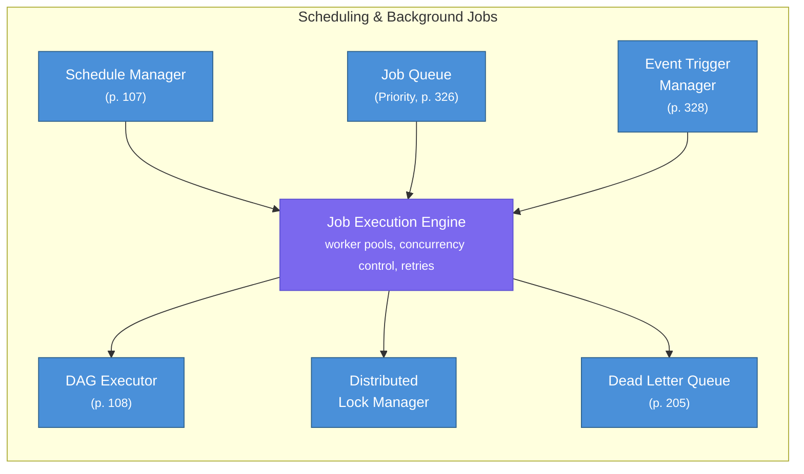
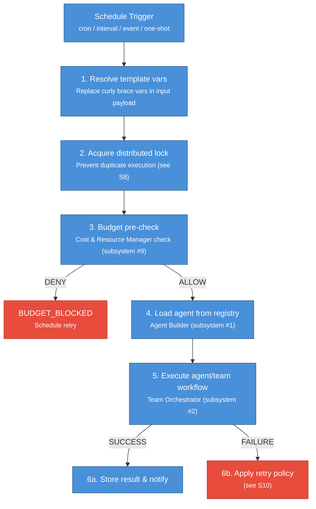
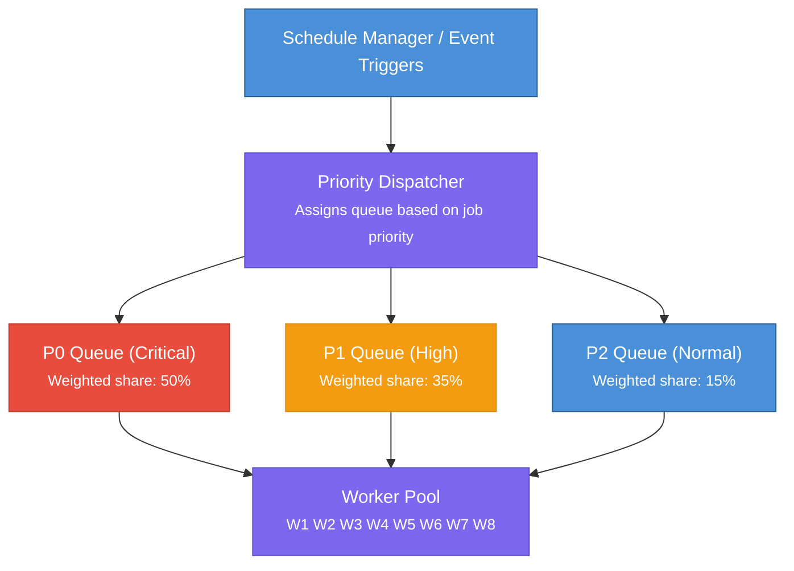
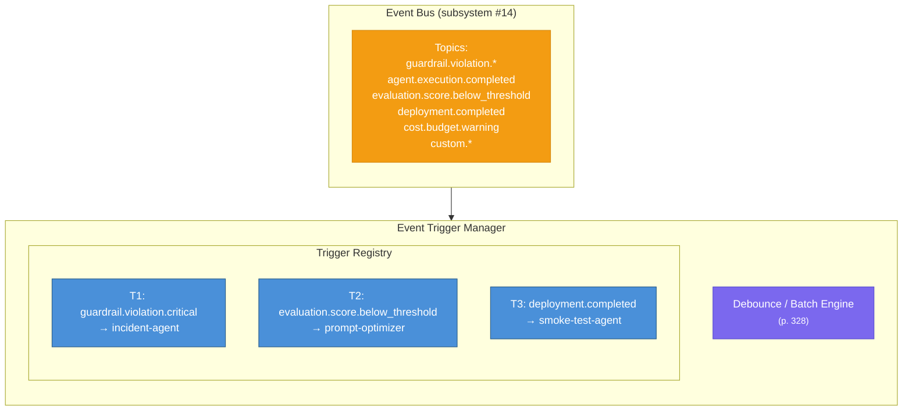
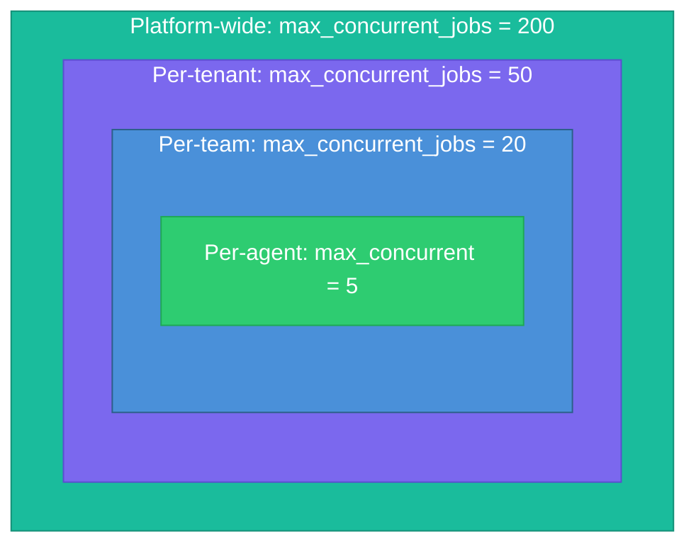
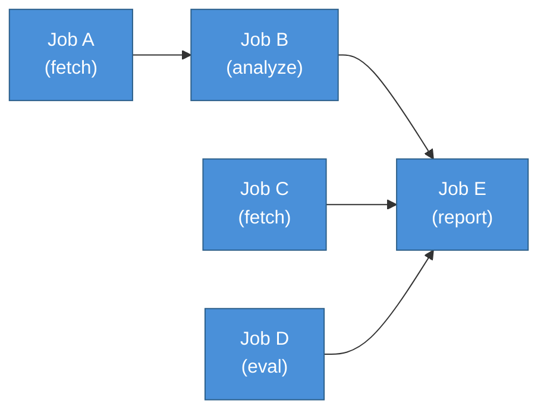
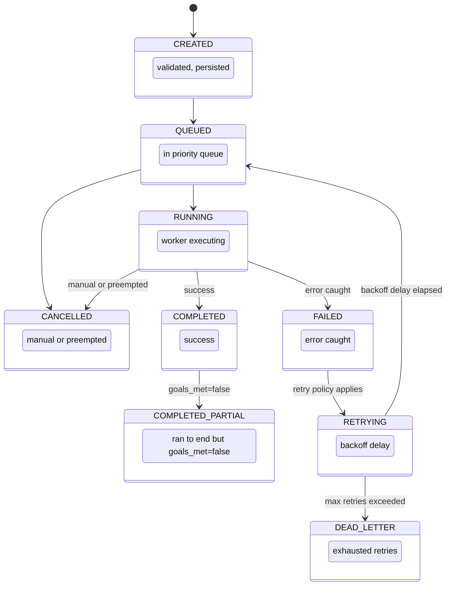
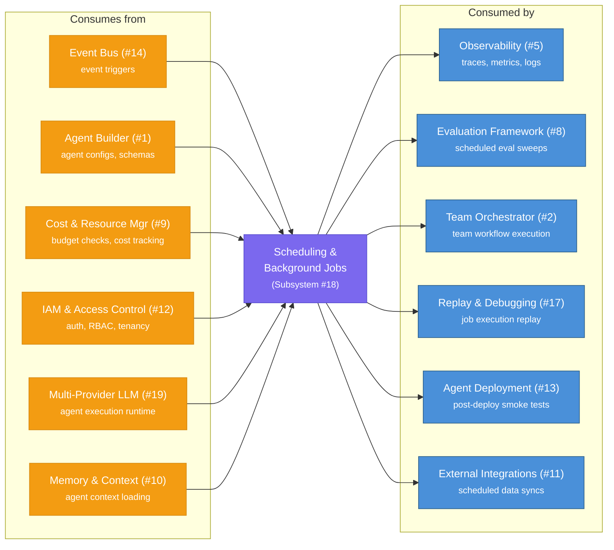

# 19 — Scheduling & Background Jobs

## Contents

| # | Section | Description |
|---|---------|-------------|
| 1 | [Overview & Responsibility](#1-overview--responsibility) | Background execution mandate: cron, event-triggered, and deferred agent jobs |
| 2 | [Job Types](#2-job-types) | Cron, one-shot, event-triggered, interval, and chained job classifications |
| 3 | [Agent-as-Job](#3-agent-as-job) | How any agent definition becomes a schedulable first-class job |
| 4 | [Job Queue Architecture](#4-job-queue-architecture) | Priority-aware queue with consumer groups and backpressure |
| 5 | [Event-Triggered Execution](#5-event-triggered-execution) | Event Bus subscriptions that launch jobs on matching events |
| 6 | [Concurrency Control](#6-concurrency-control) | Per-tenant and per-job concurrency limits with semaphore enforcement |
| 7 | [Job Dependencies (DAG Execution)](#7-job-dependencies-dag-execution) | Directed acyclic graph execution with fan-out and fan-in |
| 8 | [Distributed Locking](#8-distributed-locking) | Leader-election and mutex patterns for singleton job execution |
| 9 | [Job Lifecycle](#9-job-lifecycle) | State machine from enqueued through running, completed, failed, and archived |
| 10 | [Retry Policies](#10-retry-policies) | Exponential back-off, dead-letter promotion, and manual requeue flows |
| 11 | [Job Scheduler (Core Orchestrator)](#11-job-scheduler-core-orchestrator) | Scheduler loop, clock-skew handling, and priority arbitration |
| 12 | [Data Models](#12-data-models) | Core schemas: JobDefinition, JobRun, Schedule, Lock, and DLQ entry |
| 13 | [API Endpoints](#13-api-endpoints) | REST endpoints for job CRUD, manual triggers, and run history |
| 14 | [Metrics & Alerts](#14-metrics--alerts) | Queue depth, execution latency, failure rate, and DLQ-depth alerts |
| 15 | [Failure Modes & Mitigations](#15-failure-modes--mitigations) | Scheduler crash, lock expiry, missed cron fires, and poison-pill jobs |
| 16 | [Security & Multi-Tenancy](#16-security--multi-tenancy) | Per-tenant job isolation, RBAC enforcement, and secret injection |
| 17 | [Integration Points](#17-integration-points) | How Scheduling integrates with Event Bus, Observability, and Agent Builder |
| 18 | [Operational Runbook](#18-operational-runbook) | On-call procedures for common scheduler incidents and remediation steps |

---

## 1. Overview & Responsibility

The Scheduling & Background Jobs subsystem is the platform's execution backbone for all **time-based**, **event-driven**, and **deferred** agent work. It governs how agents and workflows run outside the synchronous request-response cycle -- enabling cron-based recurring tasks, one-shot delayed execution, event-triggered workflows, and interval-based polling agents.

In agentic systems, a significant portion of value is delivered not through interactive conversations but through autonomous background work: a daily report agent that synthesizes overnight data, a weekly compliance auditor, an event-triggered incident responder that launches when an anomaly is detected, or a scheduled evaluation sweep that benchmarks agent quality. Without a centralized scheduling subsystem, teams resort to ad-hoc cron jobs, external orchestrators, and manual triggers -- creating a fragmented, unobservable, and unreliable execution surface.

**Core design philosophy**: Treat agent executions as first-class jobs with full lifecycle management, priority-aware scheduling, dependency resolution, and comprehensive observability. Every scheduled agent run should be as traceable and governable as a synchronous user request (p. 107, p. 326).



**Eight core capabilities** implemented by this subsystem:

| # | Capability | Section |
|---|-----------|---------|
| 1 | Cron-based recurring schedules | S2, S3 |
| 2 | One-shot delayed execution | S2, S3 |
| 3 | Event-triggered workflows | S5 |
| 4 | Interval-based polling | S2, S3 |
| 5 | Priority queue with preemption | S4 |
| 6 | DAG-based job dependencies | S7 |
| 7 | Distributed locking | S8 |
| 8 | Retry with dead letter queue | S6 |

---

## 2. Job Types

The subsystem supports four fundamental job types. Each type maps to a different scheduling trigger but shares a common execution lifecycle (see S9).

### 2.1 Cron-Based (Recurring)

Cron jobs execute on a schedule defined by a cron expression. They are the primary mechanism for periodic agent work such as daily reports, weekly audits, and hourly data syncs.

```
┌───────────── minute (0-59)
│ ┌───────────── hour (0-23)
│ │ ┌───────────── day of month (1-31)
│ │ │ ┌───────────── month (1-12)
│ │ │ │ ┌───────────── day of week (0-6, Sun=0)
│ │ │ │ │
* * * * *
```

| Example | Cron Expression | Use Case |
|---------|----------------|----------|
| Every day at 6 AM UTC | `0 6 * * *` | Daily summary agent |
| Every Monday at 9 AM | `0 9 * * 1` | Weekly analysis agent |
| Every 15 minutes | `*/15 * * * *` | Data freshness monitor |
| First of month at midnight | `0 0 1 * *` | Monthly cost report |

**Key rule**: Cron jobs must specify a `max_execution_time` to prevent overlapping executions when the interval is shorter than the job duration (p. 188). If a job is still running when the next cron tick fires, the scheduler applies the configured overlap policy: `skip`, `queue`, or `terminate_and_restart`.

### 2.2 One-Shot (Delayed)

One-shot jobs execute exactly once at a specified future time or after a specified delay. They are used for deferred work such as "send this report in 2 hours" or "run evaluation after deployment completes."

```
One-shot: execute_at = now + delay
          ────────────────────────────►
          │                           │
        created                    executed
```

One-shot jobs are automatically cleaned up after completion. Failed one-shot jobs follow the configured retry policy before moving to the dead letter queue.

### 2.3 Event-Triggered

Event-triggered jobs launch in response to events from the Event Bus (subsystem #14). They define a subscription filter that matches specific event types and optionally event payload criteria. This enables reactive agent workflows -- for example, launching an incident analysis agent when a `guardrail.violation.critical` event is published.

```
Event Bus                          Scheduling Subsystem
──────────                         ────────────────────
  event published ──────────────► EventTriggerManager
                                    │
                                    ├── matches filter? ──► YES ──► create job
                                    │
                                    └── no match ──► discard
```

Event triggers support debouncing (ignore duplicate events within a time window) and batching (accumulate N events before launching a single job with the batch as input) (p. 328).

### 2.4 Interval-Based

Interval jobs execute repeatedly with a fixed delay between the end of one execution and the start of the next. Unlike cron jobs (which fire at absolute times), interval jobs are relative to completion, ensuring no overlap by design.

```
Cron (absolute):    |──run──|              |──run──|              |──run──|
                    t=0     t=3            t=10    t=13           t=20

Interval (relative):|──run──|──delay──|──run──|──delay──|──run──|
                    t=0     t=3  +5s  t=8     t=11 +5s  t=16
```

Interval jobs are preferred for polling-style agents where the execution duration is variable and overlap must be avoided (p. 109).

---

## 3. Agent-as-Job

The most powerful capability of this subsystem is running full agent workflows as scheduled jobs. An "Agent-as-Job" wraps an agent invocation (or a complete team workflow) inside the job execution framework, inheriting all scheduling, retry, priority, and observability features.

### 3.1 Agent Job Configuration

??? example "View JSON example"

    ```json
    {
      "job_id": "job-daily-report-001",
      "job_type": "cron",
      "cron_expression": "0 6 * * *",
      "timezone": "America/New_York",
      "agent_config": {
        "agent_id": "daily-report-agent-v3",
        "team_id": "team-analytics",
        "input_payload": {
          "report_date": "{{schedule.previous_fire_time | date('YYYY-MM-DD')}}",
          "sections": ["revenue", "engagement", "anomalies"]
        },
        "goal": "Generate a comprehensive daily business report for {{report_date}}",
        "max_iterations": 25,
        "model_tier": "tier_2"
      },
      "retry_policy": {
        "max_retries": 3,
        "backoff_strategy": "exponential",
        "base_delay_seconds": 30,
        "max_delay_seconds": 600
      },
      "priority": "P1",
      "max_execution_time_seconds": 300,
      "overlap_policy": "skip",
      "tenant_id": "org-acme",
      "team_id": "team-analytics",
      "tags": ["report", "daily", "analytics"],
      "notification_channels": ["slack://team-analytics", "email://ops@acme.com"]
    }
    ```

### 3.2 Template Variables

Agent job input payloads support template variables that are resolved at execution time:

| Variable | Description | Example Value |
|----------|-------------|---------------|
| `{{schedule.fire_time}}` | Current execution timestamp | `2026-02-27T06:00:00Z` |
| `{{schedule.previous_fire_time}}` | Previous execution timestamp | `2026-02-26T06:00:00Z` |
| `{{schedule.run_number}}` | Sequential run counter | `147` |
| `{{job.id}}` | Job identifier | `job-daily-report-001` |
| `{{execution.id}}` | Unique execution identifier | `exec-abc-789` |
| `{{env.VARIABLE}}` | Environment variable reference | Dynamic |

### 3.3 Agent Job Execution Flow

When a scheduled agent job fires, the execution follows this sequence:



### 3.4 Goal Tracking for Scheduled Agents

Every Agent-as-Job invocation carries a SMART goal (p. 185) that is evaluated upon completion:

- **Specific**: Defined in `agent_config.goal` with template variable resolution
- **Measurable**: Completion criteria checked via `goals_met()` (p. 188)
- **Achievable**: Validated against available tools and model tier at job creation time (p. 111)
- **Relevant**: Aligned with the team's mission as defined in the Team Orchestrator
- **Time-bound**: Enforced by `max_execution_time_seconds` and `max_iterations` (p. 188)

If `goals_met()` returns false after the agent completes its iterations, the job is marked as `COMPLETED_PARTIAL` rather than `COMPLETED`, and an alert is emitted so operators can investigate (p. 192).

---

## 4. Job Queue Architecture

The job queue is the central data structure that mediates between schedule triggers and worker execution. It implements a multi-level priority queue with tenant-aware concurrency control.

### 4.1 Queue Topology



### 4.2 Priority Levels (p. 326)

The subsystem uses the P0/P1/P2 priority framework from the Prioritization pattern (p. 326):

| Priority | Label | Use Cases | Queue Behavior |
|----------|-------|-----------|---------------|
| **P0** | Critical / Blocking | Incident response agents, security audit triggers, SLA-bound jobs | Preemptive: can interrupt P2 workers. 50% weighted share of worker pool. Max queue wait: 30s. |
| **P1** | High Importance | Daily reports, scheduled evaluations, team workflows | Standard priority. 35% weighted share. Max queue wait: 5min. |
| **P2** | Normal / Nice-to-have | Analytics sweeps, optimization runs, non-urgent maintenance | Best-effort. 15% weighted share. Max queue wait: 30min. Aging applied (p. 325). |

**Priority assignment rules** (p. 323):
1. **Urgency**: Jobs with deadlines approaching get boosted -- a P2 job within 10 minutes of its deadline is automatically promoted to P1 (p. 323).
2. **Importance**: Jobs tagged as business-critical or SLA-bound default to P0 (p. 323).
3. **Dependencies**: Jobs that unblock other waiting jobs receive a priority boost (p. 323).
4. **Resource availability**: Jobs whose required resources (model tier, tools) are currently available get a scheduling preference (p. 323).
5. **Cost/benefit ratio**: High-ROI jobs (as estimated by the Cost & Resource Manager) are preferred when resources are constrained (p. 323).

### 4.3 Aging Mechanism (p. 325)

To prevent starvation of low-priority jobs, the queue implements aging: a job's effective priority increases over time.

??? example "View details"

    ```
    effective_priority = base_priority - (time_in_queue / aging_interval)

    Where:
      base_priority:   P0=0, P1=1, P2=2  (lower is higher priority)
      aging_interval:  configurable per tenant (default: 15 min per level)

    Example:
      A P2 job after 30 minutes in queue:
      effective_priority = 2 - (30 / 15) = 0  →  effectively P0
    ```

**Key rule**: Always implement aging -- boost priority of long-waiting tasks to prevent starvation (p. 325). Log every priority change with the reason for post-hoc analysis (p. 329).

### 4.4 Job Queue Implementation

??? example "View Python pseudocode"

    ```python
    # --- Priority Job Queue (p. 326) ---

    from dataclasses import dataclass, field
    from typing import Optional
    import asyncio
    import time
    import json


    class JobQueue:
        """Multi-level priority queue backed by Redis sorted sets.

        Uses Redis ZSET with score = priority_weight + timestamp to provide
        both priority ordering and FIFO within each priority level. Implements
        weighted fair queuing so that P0/P1/P2 jobs each receive their
        configured share of worker attention (p. 326).

        Aging is applied by periodically adjusting scores of long-waiting
        jobs to prevent starvation (p. 325).
        """

        # Priority base scores (lower = higher priority)
        PRIORITY_SCORES = {
            "P0": 0,
            "P1": 1_000_000,
            "P2": 2_000_000,
        }

        def __init__(self, redis_client, config: dict):
            self.redis = redis_client
            self.queue_key = "jobqueue:pending"
            self.aging_interval_seconds = config.get("aging_interval_seconds", 900)
            self.aging_boost = config.get("aging_boost", 500_000)  # score reduction per interval

        async def enqueue(self, job) -> None:
            """Add a job to the priority queue.

            Score = priority_base + (timestamp fraction) for FIFO within priority.
            """
            base_score = self.PRIORITY_SCORES.get(job.priority.value, 2_000_000)
            # Use fractional timestamp for FIFO ordering within priority band
            time_fraction = time.time() % 1_000_000
            score = base_score + time_fraction

            job_data = json.dumps({
                "job_id": job.job_id,
                "priority": job.priority.value,
                "tenant_id": job.tenant_id,
                "team_id": job.team_id,
                "agent_id": job.agent_id,
                "enqueued_at": time.time(),
            })

            await self.redis.zadd(self.queue_key, {job_data: score})

        async def dequeue(self, timeout_seconds: int = 5) -> Optional[dict]:
            """Remove and return the highest-priority job from the queue.

            Uses ZPOPMIN for atomic dequeue of the lowest-scored (highest
            priority) element.
            """
            result = await self.redis.bzpopmin(self.queue_key, timeout=timeout_seconds)
            if result is None:
                return None

            _, job_data, score = result
            return json.loads(job_data)

        async def apply_aging(self) -> int:
            """Boost priority of long-waiting jobs to prevent starvation (p. 325).

            Scans the queue for jobs that have been waiting longer than the
            aging interval and reduces their score (= higher priority).
            Returns the number of jobs aged.
            """
            now = time.time()
            aged_count = 0

            # Get all pending jobs
            entries = await self.redis.zrange(self.queue_key, 0, -1, withscores=True)

            pipe = self.redis.pipeline()
            for job_data, score in entries:
                job = json.loads(job_data)
                wait_time = now - job.get("enqueued_at", now)
                intervals_waited = int(wait_time / self.aging_interval_seconds)

                if intervals_waited > 0:
                    new_score = max(0, score - (intervals_waited * self.aging_boost))
                    if new_score < score:
                        pipe.zadd(self.queue_key, {job_data: new_score})
                        aged_count += 1

            if aged_count > 0:
                await pipe.execute()

            return aged_count

        async def depth(self) -> dict:
            """Return current queue depth per priority level."""
            total = await self.redis.zcard(self.queue_key)
            p0 = await self.redis.zcount(self.queue_key, 0, 999_999)
            p1 = await self.redis.zcount(self.queue_key, 1_000_000, 1_999_999)
            p2 = await self.redis.zcount(self.queue_key, 2_000_000, "+inf")

            return {"P0": p0, "P1": p1, "P2": p2, "total": total}

        async def utilization(self) -> float:
            """Return queue utilization as a fraction of max capacity."""
            total = await self.redis.zcard(self.queue_key)
            max_capacity = 1000  # configurable
            return min(1.0, total / max_capacity)

        async def remove(self, job_id: str) -> bool:
            """Remove a specific job from the queue (for cancellation)."""
            entries = await self.redis.zrange(self.queue_key, 0, -1)
            for entry in entries:
                job = json.loads(entry)
                if job.get("job_id") == job_id:
                    await self.redis.zrem(self.queue_key, entry)
                    return True
            return False
    ```

### 4.5 Worker Pool

The worker pool is a set of async workers that consume jobs from the priority queues. Workers are dynamically scaled based on queue depth and configured concurrency limits.

??? example "View Python pseudocode"

    ```python
    # --- Worker Pool Configuration ---

    from dataclasses import dataclass, field
    from enum import Enum
    import asyncio


    class WorkerState(Enum):
        IDLE = "idle"
        BUSY = "busy"
        DRAINING = "draining"    # finishing current job, then shutting down
        STOPPED = "stopped"


    @dataclass
    class WorkerPoolConfig:
        min_workers: int = 4
        max_workers: int = 32
        scale_up_threshold: float = 0.8     # queue utilization to trigger scale-up
        scale_down_threshold: float = 0.2   # queue utilization to trigger scale-down
        scale_interval_seconds: int = 30    # check scaling every N seconds
        graceful_shutdown_timeout: int = 60  # seconds to wait for in-flight jobs

        # Per-priority weighted shares (p. 326)
        priority_weights: dict[str, float] = field(default_factory=lambda: {
            "P0": 0.50,
            "P1": 0.35,
            "P2": 0.15,
        })


    class WorkerPool:
        """Manages a pool of async workers that consume jobs from priority queues.

        Workers are allocated to priority queues based on weighted shares (p. 326).
        The pool auto-scales based on queue depth and applies concurrency limits
        per tenant (see S6 Concurrency Control).
        """

        def __init__(self, config: WorkerPoolConfig, job_queue, executor, metrics):
            self.config = config
            self.job_queue = job_queue
            self.executor = executor
            self.metrics = metrics
            self.workers: dict[str, WorkerState] = {}
            self._active_count = 0
            self._lock = asyncio.Lock()

        async def start(self):
            """Initialize the worker pool with min_workers."""
            for i in range(self.config.min_workers):
                worker_id = f"worker-{i:03d}"
                self.workers[worker_id] = WorkerState.IDLE
                asyncio.create_task(self._worker_loop(worker_id))

            # Start auto-scaler
            asyncio.create_task(self._auto_scale_loop())

        async def _worker_loop(self, worker_id: str):
            """Main loop for a single worker. Dequeues and executes jobs."""
            while self.workers.get(worker_id) != WorkerState.STOPPED:
                if self.workers.get(worker_id) == WorkerState.DRAINING:
                    break

                # Dequeue next job respecting priority weights
                job = await self.job_queue.dequeue(timeout_seconds=5)
                if job is None:
                    continue  # no job available, retry

                self.workers[worker_id] = WorkerState.BUSY
                self._active_count += 1
                self.metrics.gauge("agentforge.scheduler.workers_active", self._active_count)

                try:
                    await self.executor.execute(job)
                except Exception as e:
                    await self.executor.handle_failure(job, e)
                finally:
                    self.workers[worker_id] = WorkerState.IDLE
                    self._active_count -= 1
                    self.metrics.gauge("agentforge.scheduler.workers_active", self._active_count)

        async def _auto_scale_loop(self):
            """Periodically adjust worker count based on queue pressure."""
            while True:
                await asyncio.sleep(self.config.scale_interval_seconds)
                queue_utilization = await self.job_queue.utilization()
                current_count = len([w for w in self.workers.values()
                                    if w != WorkerState.STOPPED])

                if queue_utilization > self.config.scale_up_threshold:
                    if current_count < self.config.max_workers:
                        new_id = f"worker-{len(self.workers):03d}"
                        self.workers[new_id] = WorkerState.IDLE
                        asyncio.create_task(self._worker_loop(new_id))
                        self.metrics.counter("agentforge.scheduler.scale_up_total")

                elif queue_utilization < self.config.scale_down_threshold:
                    if current_count > self.config.min_workers:
                        # Drain one idle worker
                        for wid, state in self.workers.items():
                            if state == WorkerState.IDLE:
                                self.workers[wid] = WorkerState.DRAINING
                                self.metrics.counter("agentforge.scheduler.scale_down_total")
                                break

        async def shutdown(self):
            """Gracefully shut down all workers."""
            for wid in self.workers:
                self.workers[wid] = WorkerState.DRAINING
            # Wait for in-flight jobs to complete
            await asyncio.sleep(self.config.graceful_shutdown_timeout)
            for wid in self.workers:
                self.workers[wid] = WorkerState.STOPPED
    ```

---

## 5. Event-Triggered Execution

The Event Trigger Manager subscribes to the platform's Event Bus (subsystem #14) and launches jobs in response to matching events. This enables reactive agent workflows -- agents that respond to platform events without human intervention.

### 5.1 Event Trigger Architecture



### 5.2 Trigger Configuration

??? example "View JSON example"

    ```json
    {
      "trigger_id": "trig-guardrail-incident",
      "event_type": "guardrail.violation.critical",
      "filter": {
        "payload.severity": {"$gte": "critical"},
        "payload.policy_id": {"$in": ["no-pii-output", "no-harmful-content"]}
      },
      "debounce": {
        "enabled": true,
        "window_seconds": 60,
        "strategy": "first"
      },
      "job_template": {
        "agent_id": "incident-analysis-agent",
        "priority": "P0",
        "input_payload": {
          "violation_event": "{{event.payload}}",
          "agent_id": "{{event.payload.agent_id}}",
          "trace_id": "{{event.payload.trace_id}}"
        },
        "max_execution_time_seconds": 120,
        "goal": "Analyze the guardrail violation, determine root cause, and recommend remediation"
      },
      "enabled": true,
      "tenant_id": "org-acme"
    }
    ```

### 5.3 Debouncing and Batching (p. 328)

Event triggers support two mechanisms to prevent excessive job creation from high-frequency events:

**Debouncing**: Ignore duplicate events within a time window. Three strategies:
- `first`: Execute on the first event, ignore subsequent events within the window.
- `last`: Wait for the window to close, execute on the last event received.
- `accumulate`: Collect all events in the window, pass the full list to the job.

**Batching**: Accumulate N events before creating a single job. The batch is passed as the job's input payload. A maximum wait time prevents indefinite accumulation if events arrive slowly.

??? example "View Python pseudocode"

    ```python
    # --- Event Trigger Manager (p. 328) ---

    from dataclasses import dataclass, field
    from typing import Optional
    import asyncio
    import time
    import json


    @dataclass
    class TriggerConfig:
        trigger_id: str
        event_type: str                        # event type pattern (supports wildcards)
        filter: dict = field(default_factory=dict)  # payload filter criteria
        debounce_window_seconds: float = 0.0   # 0 = no debounce
        debounce_strategy: str = "first"       # first | last | accumulate
        batch_size: int = 1                    # 1 = no batching
        batch_max_wait_seconds: float = 60.0   # max wait for batch to fill
        job_template: dict = field(default_factory=dict)
        enabled: bool = True
        tenant_id: str = ""


    class EventTriggerManager:
        """Subscribes to Event Bus and creates jobs when matching events arrive.

        Implements debouncing (p. 328) to suppress duplicate events and batching
        to group related events into a single job execution. Re-prioritization
        is triggered when a new event arrives with high urgency (p. 328).
        """

        def __init__(self, event_bus, job_scheduler, config_store, metrics):
            self.event_bus = event_bus
            self.job_scheduler = job_scheduler
            self.config_store = config_store
            self.metrics = metrics
            self.triggers: dict[str, TriggerConfig] = {}
            self._debounce_timers: dict[str, float] = {}  # trigger_id -> last fire time
            self._batch_buffers: dict[str, list] = {}      # trigger_id -> event list
            self._lock = asyncio.Lock()

        async def start(self):
            """Load all triggers and subscribe to event bus."""
            triggers = await self.config_store.list_triggers()
            for t in triggers:
                self.triggers[t.trigger_id] = t

            # Subscribe to all event types with a single handler
            await self.event_bus.subscribe("*", self._on_event)

        async def _on_event(self, event: dict):
            """Handle an incoming event from the Event Bus."""
            event_type = event.get("type", "")

            for trigger in self.triggers.values():
                if not trigger.enabled:
                    continue
                if not self._matches_type(trigger.event_type, event_type):
                    continue
                if not self._matches_filter(trigger.filter, event.get("payload", {})):
                    continue

                self.metrics.counter(
                    "agentforge.scheduler.event_trigger_matches_total",
                    labels={"trigger_id": trigger.trigger_id}
                )

                await self._process_match(trigger, event)

        async def _process_match(self, trigger: TriggerConfig, event: dict):
            """Apply debounce/batch logic before creating a job."""
            async with self._lock:
                now = time.time()

                # Debouncing (p. 328)
                if trigger.debounce_window_seconds > 0:
                    last_fire = self._debounce_timers.get(trigger.trigger_id, 0)
                    if now - last_fire < trigger.debounce_window_seconds:
                        if trigger.debounce_strategy == "first":
                            self.metrics.counter(
                                "agentforge.scheduler.event_trigger_debounced_total",
                                labels={"trigger_id": trigger.trigger_id}
                            )
                            return  # suppress
                        elif trigger.debounce_strategy == "last":
                            self._debounce_timers[trigger.trigger_id] = now
                            return  # will be replaced by next event
                    self._debounce_timers[trigger.trigger_id] = now

                # Batching
                if trigger.batch_size > 1:
                    buf = self._batch_buffers.setdefault(trigger.trigger_id, [])
                    buf.append(event)
                    if len(buf) >= trigger.batch_size:
                        events = buf[:]
                        self._batch_buffers[trigger.trigger_id] = []
                        await self._create_job(trigger, events)
                    return

                # No batching -- create job immediately
                await self._create_job(trigger, [event])

        async def _create_job(self, trigger: TriggerConfig, events: list[dict]):
            """Create a job from the trigger template and matched events."""
            template = trigger.job_template
            input_payload = self._resolve_template(
                template.get("input_payload", {}),
                events[0] if len(events) == 1 else {"batch": events}
            )

            job = await self.job_scheduler.create_job(
                job_type="event_triggered",
                agent_id=template["agent_id"],
                input_payload=input_payload,
                priority=template.get("priority", "P1"),
                max_execution_time=template.get("max_execution_time_seconds", 300),
                goal=template.get("goal", ""),
                tenant_id=trigger.tenant_id,
                source_trigger_id=trigger.trigger_id,
                source_event_ids=[e.get("event_id") for e in events],
            )

            self.metrics.counter(
                "agentforge.scheduler.event_triggered_jobs_total",
                labels={"trigger_id": trigger.trigger_id}
            )

        def _matches_type(self, pattern: str, event_type: str) -> bool:
            """Match event type against trigger pattern (supports * wildcard)."""
            if pattern == "*":
                return True
            if "*" in pattern:
                prefix = pattern.replace("*", "")
                return event_type.startswith(prefix)
            return pattern == event_type

        def _matches_filter(self, filter_spec: dict, payload: dict) -> bool:
            """Evaluate payload filter criteria against event payload."""
            for key, condition in filter_spec.items():
                value = payload.get(key)
                if isinstance(condition, dict):
                    for op, expected in condition.items():
                        if op == "$gte" and value < expected:
                            return False
                        if op == "$in" and value not in expected:
                            return False
                        if op == "$eq" and value != expected:
                            return False
                elif value != condition:
                    return False
            return True

        def _resolve_template(self, template: dict, event: dict) -> dict:
            """Replace {{event.*}} template variables with actual event data."""
            resolved = {}
            for key, value in template.items():
                if isinstance(value, str) and "{{event." in value:
                    path = value.replace("{{", "").replace("}}", "").replace("event.", "")
                    resolved[key] = self._deep_get(event, path)
                elif isinstance(value, dict):
                    resolved[key] = self._resolve_template(value, event)
                else:
                    resolved[key] = value
            return resolved

        def _deep_get(self, obj: dict, path: str):
            """Get nested dict value by dot-separated path."""
            parts = path.split(".")
            current = obj
            for part in parts:
                if isinstance(current, dict):
                    current = current.get(part)
                else:
                    return None
            return current
    ```

### 5.4 Common Event Triggers

| Event Type | Agent Response | Priority |
|-----------|----------------|----------|
| `guardrail.violation.critical` | Incident analysis agent investigates root cause | P0 |
| `evaluation.score.below_threshold` | Prompt optimizer agent proposes improvements | P1 |
| `deployment.completed` | Smoke test agent validates the new deployment | P1 |
| `cost.budget.warning` | Cost analysis agent reviews spending patterns | P1 |
| `agent.execution.failed` | Diagnostic agent performs root-cause analysis | P1 |
| `data.ingestion.completed` | RAG index rebuild agent updates knowledge base | P2 |
| `schedule.job.failed_max_retries` | Dead letter processor agent reviews failures | P2 |

---

## 6. Concurrency Control

The subsystem enforces concurrency limits at multiple levels to prevent resource exhaustion and ensure fair scheduling across tenants.

### 6.1 Concurrency Hierarchy



### 6.2 Concurrency Enforcement

| Level | Default Limit | Enforcement | Override |
|-------|--------------|-------------|----------|
| **Platform** | 200 concurrent jobs | Hard limit; excess jobs queued | Platform admin config |
| **Tenant** | 50 concurrent jobs | Hard limit per tenant; prevents noisy-neighbor | Per-tenant config |
| **Team** | 20 concurrent jobs | Soft limit; P0 jobs can exceed by 20% | Team config |
| **Agent** | 5 concurrent instances | Hard limit; prevents agent resource contention | Agent config |
| **Job mutex** | 1 (mutual exclusion) | Only one instance of a named mutex job runs at a time | Per-job config |

### 6.3 Mutex and Semaphore Locks

For jobs that must not run concurrently (e.g., a database migration agent, a report generator that writes to a shared file), the subsystem provides named mutex locks:

??? example "View Python pseudocode"

    ```python
    # --- Concurrency Control ---

    from dataclasses import dataclass
    from typing import Optional
    import asyncio


    @dataclass
    class ConcurrencyLimits:
        platform_max: int = 200
        tenant_max: int = 50
        team_max: int = 20
        agent_max: int = 5


    class ConcurrencyController:
        """Enforces hierarchical concurrency limits and named mutex/semaphore locks.

        Prevents resource exhaustion by limiting how many jobs can run simultaneously
        at each level of the hierarchy. Named mutexes prevent duplicate execution of
        jobs that must not overlap (p. 109).
        """

        def __init__(self, redis_client, config: ConcurrencyLimits):
            self.redis = redis_client
            self.config = config

        async def acquire(
            self,
            job_id: str,
            tenant_id: str,
            team_id: str,
            agent_id: str,
            mutex_name: Optional[str] = None,
        ) -> bool:
            """Attempt to acquire concurrency slots at all levels.

            Returns True if all slots acquired, False if any limit reached.
            Uses Redis atomic operations for distributed safety.
            """
            # Check and increment all levels atomically
            pipe = self.redis.pipeline()

            checks = [
                (f"concurrency:platform", self.config.platform_max),
                (f"concurrency:tenant:{tenant_id}", self.config.tenant_max),
                (f"concurrency:team:{team_id}", self.config.team_max),
                (f"concurrency:agent:{agent_id}", self.config.agent_max),
            ]

            # Check current counts
            for key, _ in checks:
                pipe.get(key)
            counts = await pipe.execute()

            for (key, limit), count in zip(checks, counts):
                current = int(count or 0)
                if current >= limit:
                    return False

            # Named mutex check
            if mutex_name:
                mutex_key = f"mutex:{tenant_id}:{mutex_name}"
                acquired = await self.redis.set(
                    mutex_key, job_id, nx=True, ex=3600  # 1 hour TTL safety
                )
                if not acquired:
                    return False

            # Increment all counters atomically
            pipe = self.redis.pipeline()
            for key, _ in checks:
                pipe.incr(key)
            await pipe.execute()

            return True

        async def release(
            self,
            job_id: str,
            tenant_id: str,
            team_id: str,
            agent_id: str,
            mutex_name: Optional[str] = None,
        ):
            """Release concurrency slots at all levels."""
            pipe = self.redis.pipeline()
            pipe.decr(f"concurrency:platform")
            pipe.decr(f"concurrency:tenant:{tenant_id}")
            pipe.decr(f"concurrency:team:{team_id}")
            pipe.decr(f"concurrency:agent:{agent_id}")

            if mutex_name:
                pipe.delete(f"mutex:{tenant_id}:{mutex_name}")

            await pipe.execute()

        async def get_utilization(self, tenant_id: str) -> dict:
            """Return current concurrency utilization for a tenant."""
            pipe = self.redis.pipeline()
            pipe.get(f"concurrency:platform")
            pipe.get(f"concurrency:tenant:{tenant_id}")
            results = await pipe.execute()

            return {
                "platform": int(results[0] or 0) / self.config.platform_max,
                "tenant": int(results[1] or 0) / self.config.tenant_max,
            }
    ```

### 6.4 Preemption for P0 Jobs (p. 326)

When a P0 job cannot acquire a concurrency slot because the limit is reached, the subsystem can preempt a running P2 job:

1. Select the longest-running P2 job in the same tenant.
2. Send a graceful cancellation signal (the job has 30 seconds to checkpoint).
3. Move the preempted P2 job back to the queue with a `preempted` flag.
4. Allocate the freed slot to the P0 job.
5. Log the preemption event with full context for audit (p. 329).

Preemption is never applied to P1 jobs -- only P2 jobs can be preempted, and only by P0 jobs. This prevents cascading preemptions and preserves scheduling stability.

---

## 7. Job Dependencies (DAG Execution)

Jobs can declare dependencies on other jobs, forming a Directed Acyclic Graph (DAG). The DAG executor ensures that dependent jobs run only after their prerequisites have completed successfully. This directly implements the `depends_on` pattern from structured plan outputs (p. 107, p. 108).

### 7.1 DAG Structure



Execution order (topological sort):

- Level 0: A, C, D (no dependencies -- run in parallel)
- Level 1: B (depends on A)
- Level 2: E (depends on B, C, D)

### 7.2 DAG Job Configuration

??? example "View JSON example"

    ```json
    {
      "dag_id": "dag-weekly-analysis",
      "jobs": [
        {
          "job_id": "fetch-revenue",
          "agent_id": "data-fetch-agent",
          "depends_on": [],
          "priority": "P1"
        },
        {
          "job_id": "fetch-engagement",
          "agent_id": "data-fetch-agent",
          "depends_on": [],
          "priority": "P1"
        },
        {
          "job_id": "analyze-revenue",
          "agent_id": "analysis-agent",
          "depends_on": ["fetch-revenue"],
          "input_from": {"revenue_data": "fetch-revenue.output"},
          "priority": "P1"
        },
        {
          "job_id": "analyze-engagement",
          "agent_id": "analysis-agent",
          "depends_on": ["fetch-engagement"],
          "input_from": {"engagement_data": "fetch-engagement.output"},
          "priority": "P1"
        },
        {
          "job_id": "generate-report",
          "agent_id": "report-agent",
          "depends_on": ["analyze-revenue", "analyze-engagement"],
          "input_from": {
            "revenue_analysis": "analyze-revenue.output",
            "engagement_analysis": "analyze-engagement.output"
          },
          "priority": "P0"
        }
      ],
      "schedule": {
        "type": "cron",
        "cron_expression": "0 8 * * 1"
      },
      "failure_policy": "fail_downstream",
      "max_dag_execution_time_seconds": 1800,
      "tenant_id": "org-acme"
    }
    ```

### 7.3 DAG Executor

??? example "View Python pseudocode"

    ```python
    # --- DAG Executor (p. 107, p. 108) ---

    from dataclasses import dataclass, field
    from typing import Optional
    from enum import Enum
    import asyncio


    class DAGNodeState(Enum):
        PENDING = "pending"
        READY = "ready"        # all dependencies met
        RUNNING = "running"
        COMPLETED = "completed"
        FAILED = "failed"
        SKIPPED = "skipped"    # skipped due to upstream failure


    @dataclass
    class DAGNode:
        job_id: str
        agent_id: str
        depends_on: list[str] = field(default_factory=list)
        input_from: dict = field(default_factory=dict)  # {param: "other_job.output"}
        priority: str = "P1"
        state: DAGNodeState = DAGNodeState.PENDING
        output: Optional[dict] = None
        error: Optional[str] = None


    class JobDAGExecutor:
        """Executes a DAG of interdependent jobs, respecting dependency ordering.

        Uses topological sort to determine execution levels (p. 108). Independent
        jobs at the same level run in parallel. The executor validates the DAG
        for cycles at creation time — circular dependencies create infinite loops
        and must be rejected (p. 108).

        Failure policies:
        - fail_downstream: If a job fails, skip all downstream dependents.
        - fail_fast: If any job fails, cancel the entire DAG.
        - continue: If a job fails, continue with unaffected branches.
        """

        def __init__(self, job_scheduler, metrics):
            self.job_scheduler = job_scheduler
            self.metrics = metrics

        async def execute_dag(self, dag_id: str, nodes: list[DAGNode],
                              failure_policy: str = "fail_downstream") -> dict:
            """Execute a DAG of jobs with dependency resolution.

            Returns a summary dict with per-node results.
            """
            # Step 1: Validate DAG — reject cycles (p. 108)
            if self._has_cycle(nodes):
                raise ValueError(
                    f"DAG {dag_id} contains a cycle — circular dependencies "
                    f"are forbidden (p. 108)"
                )

            # Step 2: Build adjacency map
            node_map = {n.job_id: n for n in nodes}

            # Step 3: Execute in topological order
            while True:
                # Find all nodes that are READY (dependencies all completed)
                ready_nodes = []
                all_terminal = True

                for node in nodes:
                    if node.state in (DAGNodeState.PENDING, DAGNodeState.READY):
                        all_terminal = False

                    if node.state != DAGNodeState.PENDING:
                        continue

                    deps_met = all(
                        node_map[dep].state == DAGNodeState.COMPLETED
                        for dep in node.depends_on
                    )
                    deps_failed = any(
                        node_map[dep].state in (
                            DAGNodeState.FAILED, DAGNodeState.SKIPPED
                        )
                        for dep in node.depends_on
                    )

                    if deps_failed:
                        if failure_policy == "fail_downstream":
                            node.state = DAGNodeState.SKIPPED
                            node.error = "Skipped due to upstream failure"
                        elif failure_policy == "fail_fast":
                            # Cancel all remaining
                            for n in nodes:
                                if n.state == DAGNodeState.PENDING:
                                    n.state = DAGNodeState.SKIPPED
                            return self._build_summary(dag_id, nodes)
                        # "continue" policy: skip this node's failed deps
                        continue

                    if deps_met:
                        node.state = DAGNodeState.READY
                        ready_nodes.append(node)

                if not ready_nodes and all_terminal:
                    break

                if not ready_nodes:
                    # Possible deadlock — no ready nodes but not all terminal
                    break

                # Step 4: Execute ready nodes in parallel (p. 108)
                tasks = [
                    self._execute_node(node, node_map)
                    for node in ready_nodes
                ]
                await asyncio.gather(*tasks, return_exceptions=True)

            return self._build_summary(dag_id, nodes)

        async def _execute_node(self, node: DAGNode, node_map: dict):
            """Execute a single DAG node."""
            node.state = DAGNodeState.RUNNING

            # Resolve input_from references to upstream outputs
            resolved_input = {}
            for param, source in node.input_from.items():
                source_job_id, output_key = source.rsplit(".", 1)
                source_node = node_map[source_job_id]
                if source_node.output and output_key in source_node.output:
                    resolved_input[param] = source_node.output[output_key]

            try:
                result = await self.job_scheduler.execute_agent_job(
                    agent_id=node.agent_id,
                    input_payload=resolved_input,
                    priority=node.priority,
                )
                node.state = DAGNodeState.COMPLETED
                node.output = result
                self.metrics.counter(
                    "agentforge.scheduler.dag_node_completed_total",
                    labels={"dag_node_state": "completed"}
                )
            except Exception as e:
                node.state = DAGNodeState.FAILED
                node.error = str(e)
                self.metrics.counter(
                    "agentforge.scheduler.dag_node_completed_total",
                    labels={"dag_node_state": "failed"}
                )

        def _has_cycle(self, nodes: list[DAGNode]) -> bool:
            """Detect cycles using DFS-based topological sort (p. 108).

            Uses three-color marking: WHITE (unvisited), GRAY (in current DFS
            path), BLACK (fully processed). A back-edge to a GRAY node
            indicates a cycle.
            """
            WHITE, GRAY, BLACK = 0, 1, 2
            color = {n.job_id: WHITE for n in nodes}
            adj = {n.job_id: n.depends_on for n in nodes}

            def dfs(node_id: str) -> bool:
                color[node_id] = GRAY
                for dep in adj.get(node_id, []):
                    if color.get(dep) == GRAY:
                        return True  # back edge = cycle
                    if color.get(dep) == WHITE and dfs(dep):
                        return True
                color[node_id] = BLACK
                return False

            for node in nodes:
                if color[node.job_id] == WHITE:
                    if dfs(node.job_id):
                        return True
            return False

        def _build_summary(self, dag_id: str, nodes: list[DAGNode]) -> dict:
            """Build a summary of the DAG execution results."""
            return {
                "dag_id": dag_id,
                "nodes": {
                    n.job_id: {
                        "state": n.state.value,
                        "error": n.error,
                        "has_output": n.output is not None,
                    }
                    for n in nodes
                },
                "completed": sum(
                    1 for n in nodes if n.state == DAGNodeState.COMPLETED
                ),
                "failed": sum(
                    1 for n in nodes if n.state == DAGNodeState.FAILED
                ),
                "skipped": sum(
                    1 for n in nodes if n.state == DAGNodeState.SKIPPED
                ),
            }
    ```

### 7.4 DAG Validation Rules

At DAG creation time, the following validations are enforced:

1. **No cycles**: Topological sort must succeed; circular dependencies are rejected (p. 108).
2. **All references valid**: Every `depends_on` entry must reference an existing job in the same DAG.
3. **Input/output compatibility**: `input_from` references must match the output schema of the source job (validated against Agent Builder schemas).
4. **Reasonable depth**: DAGs deeper than 10 levels emit a warning (cost/latency risk) (p. 109).
5. **Feasibility**: All referenced agents must exist and have the required tools available (p. 111).

---

## 8. Distributed Locking

In a multi-worker, multi-node deployment, the subsystem must prevent duplicate job execution. If two workers observe the same cron tick, only one should execute the job. Distributed locking solves this problem.

### 8.1 Lock Strategy

The subsystem uses Redis-based distributed locks with the Redlock algorithm for correctness in multi-node deployments:

```
Worker 1                    Redis                      Worker 2
────────                    ─────                      ────────

Cron tick fires                                        Cron tick fires
     │                                                      │
     ▼                                                      ▼
SET lock:job-123            ◄──── NX (set if not exist)     SET lock:job-123
  ex=300 nx=true                                             ex=300 nx=true
     │                                                      │
     ▼                                                      ▼
  OK (acquired)             ◄────────────────────────       nil (denied)
     │                                                      │
     ▼                                                      ▼
  Execute job                                            Skip (log as
     │                                                   duplicate attempt)
     ▼
  DEL lock:job-123
```

### 8.2 Lock Implementation

??? example "View Python pseudocode"

    ```python
    # --- Distributed Lock Manager ---

    import asyncio
    import uuid
    from typing import Optional


    class DistributedLockManager:
        """Redis-based distributed locking for job execution deduplication.

        Uses SET NX EX (atomic set-if-not-exists with expiry) for simple
        distributed locking. The lock TTL acts as a safety mechanism: if a
        worker crashes while holding a lock, the lock auto-expires after
        the configured TTL so the job can be retried.

        For multi-Redis-node deployments, this should be upgraded to the
        Redlock algorithm for stronger consistency guarantees.
        """

        def __init__(self, redis_client, default_ttl_seconds: int = 600):
            self.redis = redis_client
            self.default_ttl = default_ttl_seconds

        async def acquire(
            self,
            lock_name: str,
            holder_id: Optional[str] = None,
            ttl_seconds: Optional[int] = None,
        ) -> Optional[str]:
            """Attempt to acquire a named lock.

            Returns the holder_id (lock token) on success, None on failure.
            The caller must pass the holder_id to release() to prove ownership.
            """
            holder = holder_id or str(uuid.uuid4())
            ttl = ttl_seconds or self.default_ttl

            acquired = await self.redis.set(
                f"lock:{lock_name}",
                holder,
                nx=True,
                ex=ttl,
            )

            if acquired:
                return holder
            return None

        async def release(self, lock_name: str, holder_id: str) -> bool:
            """Release a lock. Only succeeds if the caller holds the lock.

            Uses a Lua script for atomic check-and-delete to prevent
            releasing a lock that was already expired and re-acquired
            by another worker.
            """
            lua_script = """
            if redis.call("get", KEYS[1]) == ARGV[1] then
                return redis.call("del", KEYS[1])
            else
                return 0
            end
            """
            result = await self.redis.eval(
                lua_script, 1, f"lock:{lock_name}", holder_id
            )
            return result == 1

        async def extend(self, lock_name: str, holder_id: str,
                         additional_seconds: int) -> bool:
            """Extend a lock's TTL. Used for long-running jobs that need
            more time than the initial TTL.
            """
            lua_script = """
            if redis.call("get", KEYS[1]) == ARGV[1] then
                return redis.call("expire", KEYS[1], ARGV[2])
            else
                return 0
            end
            """
            result = await self.redis.eval(
                lua_script, 1, f"lock:{lock_name}", holder_id,
                additional_seconds
            )
            return result == 1

        async def is_locked(self, lock_name: str) -> bool:
            """Check if a lock is currently held (non-blocking)."""
            return await self.redis.exists(f"lock:{lock_name}") > 0
    ```

### 8.3 Lock Naming Conventions

| Lock Type | Key Pattern | Purpose |
|-----------|------------|---------|
| Cron execution | `lock:cron:{job_id}:{fire_time_epoch}` | Prevent duplicate cron execution |
| Job mutex | `lock:mutex:{tenant_id}:{mutex_name}` | Named mutual exclusion |
| DAG execution | `lock:dag:{dag_id}:{run_id}` | Prevent duplicate DAG execution |
| Schedule management | `lock:schedule:{schedule_id}:modify` | Prevent concurrent schedule modifications |

### 8.4 Lock TTL Safety

Lock TTL must be set to at least `max_execution_time_seconds + 60` for any job. If a job exceeds its TTL, the lock expires and another worker may pick up the same job. To prevent this:

1. Workers extend the lock periodically (every TTL/3 seconds) while the job is running.
2. If a lock extension fails (lock was stolen), the worker receives a `LockLostError` and must abort.
3. The aborted job is moved to the retry queue.

---

## 9. Job Lifecycle

Every job transitions through a well-defined state machine. All transitions are logged and emitted as events to the Event Bus.

### 9.1 State Machine



### 9.2 State Transition Rules

| From | To | Trigger | Side Effects |
|------|-----|---------|-------------|
| CREATED | QUEUED | Job passes validation | Enqueue to priority queue; emit `job.queued` event |
| QUEUED | RUNNING | Worker dequeues job | Acquire distributed lock; acquire concurrency slot; emit `job.started` event |
| RUNNING | COMPLETED | Agent returns success + `goals_met()=true` (p. 188) | Release lock and concurrency slot; store result; emit `job.completed` event; trigger downstream DAG nodes |
| RUNNING | COMPLETED_PARTIAL | Agent returns but `goals_met()=false` (p. 188) | Release resources; emit `job.completed_partial` event; alert operators (p. 192) |
| RUNNING | FAILED | Unhandled exception or timeout | Release resources; apply retry policy; emit `job.failed` event |
| RUNNING | CANCELLED | Manual cancellation or P0 preemption (p. 326) | Release resources; emit `job.cancelled` event; if preempted, re-queue as `job.preempted` |
| FAILED | RETRYING | Retry policy allows retry | Increment retry count; calculate backoff delay; re-queue after delay |
| RETRYING | QUEUED | Backoff delay elapsed | Re-enter priority queue |
| FAILED | DEAD_LETTER | Max retries exceeded | Move to dead letter queue; emit `job.dead_letter` event; alert operators |

---

## 10. Retry Policies

Retry policies define how failed jobs are retried. The subsystem supports configurable retry with exponential backoff, jitter, and dead letter queue routing.

### 10.1 Retry Policy Configuration

??? example "View Python pseudocode"

    ```python
    # --- Retry Policy (p. 205, p. 206) ---

    from dataclasses import dataclass
    from enum import Enum
    from typing import Optional
    import random


    class BackoffStrategy(Enum):
        FIXED = "fixed"
        LINEAR = "linear"
        EXPONENTIAL = "exponential"
        EXPONENTIAL_WITH_JITTER = "exponential_with_jitter"


    class ErrorClassification(Enum):
        """Error Triad classification (p. 205)."""
        TRANSIENT = "transient"          # Network timeout, rate limit — retry
        LOGIC = "logic"                  # Bad prompt, invalid input — re-prompt
        UNRECOVERABLE = "unrecoverable"  # Permission denied, resource gone — escalate


    @dataclass
    class RetryPolicy:
        """Configurable retry policy with exponential backoff (p. 206).

        Implements the Error Triad (p. 205): transient errors are retried,
        logic errors are retried with modifications, unrecoverable errors
        are sent directly to the dead letter queue.
        """
        max_retries: int = 3
        backoff_strategy: BackoffStrategy = BackoffStrategy.EXPONENTIAL_WITH_JITTER
        base_delay_seconds: float = 30.0
        max_delay_seconds: float = 600.0     # cap at 10 minutes
        jitter_factor: float = 0.25          # +/- 25% randomization
        retry_on: list[ErrorClassification] = None  # which error types to retry

        def __post_init__(self):
            if self.retry_on is None:
                self.retry_on = [
                    ErrorClassification.TRANSIENT,
                    ErrorClassification.LOGIC,
                ]

        def compute_delay(self, attempt: int) -> float:
            """Compute the delay before the next retry attempt.

            Uses exponential backoff with optional jitter to prevent
            thundering herd when multiple jobs fail simultaneously (p. 206).
            """
            if self.backoff_strategy == BackoffStrategy.FIXED:
                delay = self.base_delay_seconds

            elif self.backoff_strategy == BackoffStrategy.LINEAR:
                delay = self.base_delay_seconds * attempt

            elif self.backoff_strategy == BackoffStrategy.EXPONENTIAL:
                delay = self.base_delay_seconds * (2 ** (attempt - 1))

            elif self.backoff_strategy == BackoffStrategy.EXPONENTIAL_WITH_JITTER:
                base = self.base_delay_seconds * (2 ** (attempt - 1))
                jitter = base * self.jitter_factor * (2 * random.random() - 1)
                delay = base + jitter

            else:
                delay = self.base_delay_seconds

            return min(delay, self.max_delay_seconds)

        def should_retry(self, error_class: ErrorClassification,
                         attempt: int) -> bool:
            """Determine whether a failed job should be retried.

            Respects the Error Triad (p. 205): unrecoverable errors are
            never retried. Transient and logic errors are retried up to
            max_retries.
            """
            if error_class == ErrorClassification.UNRECOVERABLE:
                return False  # never retry unrecoverable (p. 205)
            if error_class not in self.retry_on:
                return False
            return attempt < self.max_retries
    ```

### 10.2 Error Classification (Error Triad, p. 205)

Every job failure is classified using the Error Triad before the retry decision is made:

| Classification | Examples | Retry? | Action |
|---------------|----------|--------|--------|
| **Transient** (p. 205) | Network timeout, rate limit (429), provider temporary outage, Redis connection lost | Yes | Exponential backoff retry |
| **Logic** (p. 205) | Agent produced invalid output, tool returned unexpected format, input validation failed | Yes (with modification) | Re-prompt with error context; reduce max_iterations; try different model tier |
| **Unrecoverable** (p. 205) | API key revoked, agent deleted, required tool removed, permission denied, budget exhausted | No | Send to dead letter queue; alert operator; escalate via HITL (p. 207) |

### 10.3 Dead Letter Queue

Jobs that exhaust all retry attempts are moved to the dead letter queue (DLQ). The DLQ is a persistent store that retains failed jobs with full context for operator investigation:

??? example "View JSON example"

    ```json
    {
      "dlq_entry_id": "dlq-001",
      "job_id": "job-daily-report-001",
      "execution_id": "exec-xyz-456",
      "failed_at": "2026-02-27T06:05:30Z",
      "retry_attempts": 3,
      "last_error": {
        "classification": "transient",
        "message": "LLM provider timeout after 30s",
        "trace_id": "trace-abc-789",
        "stack_trace": "..."
      },
      "all_errors": [
        {"attempt": 1, "error": "timeout", "timestamp": "2026-02-27T06:01:00Z"},
        {"attempt": 2, "error": "timeout", "timestamp": "2026-02-27T06:02:30Z"},
        {"attempt": 3, "error": "timeout", "timestamp": "2026-02-27T06:05:30Z"}
      ],
      "original_job": {
        "agent_id": "daily-report-agent-v3",
        "input_payload": {"report_date": "2026-02-26"},
        "priority": "P1"
      },
      "resolution": null,
      "resolved_by": null,
      "resolved_at": null
    }
    ```

DLQ entries can be manually retried (re-queued), discarded (marked as acknowledged), or escalated to HITL review (p. 207).

---

## 11. Job Scheduler (Core Orchestrator)

The Job Scheduler is the central orchestrator that ties together all components: schedule management, job creation, queue dispatch, and lifecycle tracking.

??? example "View Python pseudocode"

    ```python
    # --- Job Scheduler (p. 107, p. 185, p. 326) ---

    from dataclasses import dataclass, field
    from typing import Optional
    from enum import Enum
    from datetime import datetime, timezone
    import asyncio
    import uuid


    class JobType(Enum):
        CRON = "cron"
        ONE_SHOT = "one_shot"
        EVENT_TRIGGERED = "event_triggered"
        INTERVAL = "interval"


    class JobState(Enum):
        CREATED = "created"
        QUEUED = "queued"
        RUNNING = "running"
        COMPLETED = "completed"
        COMPLETED_PARTIAL = "completed_partial"
        FAILED = "failed"
        RETRYING = "retrying"
        CANCELLED = "cancelled"
        DEAD_LETTER = "dead_letter"


    class Priority(str, Enum):
        """P0/P1/P2 priority framework (p. 326)."""
        P0 = "P0"  # Critical / blocking
        P1 = "P1"  # High importance
        P2 = "P2"  # Normal / nice-to-have


    @dataclass
    class Job:
        """Core job entity. Every background task is represented as a Job."""
        job_id: str
        job_type: JobType
        agent_id: str
        input_payload: dict
        priority: Priority
        state: JobState = JobState.CREATED
        goal: str = ""
        tenant_id: str = ""
        team_id: str = ""
        max_execution_time_seconds: int = 300
        retry_policy: Optional[RetryPolicy] = None
        mutex_name: Optional[str] = None
        tags: list[str] = field(default_factory=list)
        created_at: datetime = field(
            default_factory=lambda: datetime.now(timezone.utc)
        )
        started_at: Optional[datetime] = None
        completed_at: Optional[datetime] = None
        retry_count: int = 0
        result: Optional[dict] = None
        error: Optional[str] = None
        dag_id: Optional[str] = None
        source_trigger_id: Optional[str] = None
        source_event_ids: list[str] = field(default_factory=list)


    @dataclass
    class Schedule:
        """Defines when and how often a job should be created."""
        schedule_id: str
        job_template: dict                    # template for creating jobs
        schedule_type: str                    # cron | interval
        cron_expression: Optional[str] = None
        interval_seconds: Optional[int] = None
        timezone: str = "UTC"
        enabled: bool = True
        overlap_policy: str = "skip"          # skip | queue | terminate_and_restart
        tenant_id: str = ""
        team_id: str = ""
        next_fire_time: Optional[datetime] = None
        last_fire_time: Optional[datetime] = None
        created_at: datetime = field(
            default_factory=lambda: datetime.now(timezone.utc)
        )
        run_count: int = 0


    class JobScheduler:
        """Central orchestrator for all scheduling operations.

        Manages the full job lifecycle from creation through completion.
        Coordinates with the priority queue, worker pool, concurrency
        controller, distributed lock manager, and DAG executor.

        Implements plan-then-execute (p. 107): schedules define the plan,
        the job queue manages execution ordering, and workers handle
        execution. Every job carries a SMART goal (p. 185) with bounded
        iterations and explicit success criteria.
        """

        def __init__(
            self,
            job_store,            # persistent job storage (PostgreSQL)
            schedule_store,       # schedule configuration storage
            job_queue,            # priority queue (Redis)
            concurrency_ctrl,     # ConcurrencyController
            lock_manager,         # DistributedLockManager
            dag_executor,         # JobDAGExecutor
            event_bus,            # Event Bus (subsystem #14)
            cost_manager,         # Cost & Resource Manager (subsystem #9)
            agent_runtime,        # Agent execution runtime
            metrics,              # metrics emitter
        ):
            self.job_store = job_store
            self.schedule_store = schedule_store
            self.job_queue = job_queue
            self.concurrency = concurrency_ctrl
            self.locks = lock_manager
            self.dag_executor = dag_executor
            self.event_bus = event_bus
            self.cost_manager = cost_manager
            self.agent_runtime = agent_runtime
            self.metrics = metrics
            self._cron_tasks: dict[str, asyncio.Task] = {}

        # --- Schedule Management ---

        async def create_schedule(self, schedule: Schedule) -> Schedule:
            """Create a new schedule. Validates cron expression and computes
            the first fire time.
            """
            if schedule.schedule_type == "cron":
                schedule.next_fire_time = self._compute_next_fire(
                    schedule.cron_expression, schedule.timezone
                )
            elif schedule.schedule_type == "interval":
                schedule.next_fire_time = datetime.now(timezone.utc)

            await self.schedule_store.save(schedule)
            await self._start_schedule_ticker(schedule)

            self.metrics.counter("agentforge.scheduler.schedules_created_total")
            await self.event_bus.publish("schedule.created", {
                "schedule_id": schedule.schedule_id,
                "type": schedule.schedule_type,
                "tenant_id": schedule.tenant_id,
            })

            return schedule

        async def pause_schedule(self, schedule_id: str):
            """Pause a schedule — no new jobs will be created until resumed."""
            schedule = await self.schedule_store.get(schedule_id)
            schedule.enabled = False
            await self.schedule_store.save(schedule)

            if schedule_id in self._cron_tasks:
                self._cron_tasks[schedule_id].cancel()

            await self.event_bus.publish("schedule.paused", {
                "schedule_id": schedule_id
            })

        async def resume_schedule(self, schedule_id: str):
            """Resume a paused schedule."""
            schedule = await self.schedule_store.get(schedule_id)
            schedule.enabled = True
            schedule.next_fire_time = self._compute_next_fire(
                schedule.cron_expression, schedule.timezone
            )
            await self.schedule_store.save(schedule)
            await self._start_schedule_ticker(schedule)

            await self.event_bus.publish("schedule.resumed", {
                "schedule_id": schedule_id
            })

        # --- Job Management ---

        async def create_job(self, **kwargs) -> Job:
            """Create and enqueue a new job."""
            job = Job(
                job_id=str(uuid.uuid4()),
                job_type=JobType(kwargs.get("job_type", "one_shot")),
                agent_id=kwargs["agent_id"],
                input_payload=kwargs.get("input_payload", {}),
                priority=Priority(kwargs.get("priority", "P1")),
                goal=kwargs.get("goal", ""),
                tenant_id=kwargs.get("tenant_id", ""),
                team_id=kwargs.get("team_id", ""),
                max_execution_time_seconds=kwargs.get(
                    "max_execution_time", 300
                ),
                retry_policy=kwargs.get("retry_policy"),
                mutex_name=kwargs.get("mutex_name"),
                tags=kwargs.get("tags", []),
                source_trigger_id=kwargs.get("source_trigger_id"),
                source_event_ids=kwargs.get("source_event_ids", []),
            )

            # Persist job
            await self.job_store.save(job)

            # Enqueue
            await self._enqueue(job)

            return job

        async def cancel_job(self, job_id: str, reason: str = "manual"):
            """Cancel a job. If running, send cancellation signal to worker."""
            job = await self.job_store.get(job_id)
            if job.state in (JobState.COMPLETED, JobState.DEAD_LETTER):
                raise ValueError(
                    f"Cannot cancel job in state {job.state.value}"
                )

            job.state = JobState.CANCELLED
            job.error = f"Cancelled: {reason}"
            job.completed_at = datetime.now(timezone.utc)
            await self.job_store.save(job)

            await self.event_bus.publish("job.cancelled", {
                "job_id": job_id, "reason": reason
            })

        async def retry_dlq_job(self, dlq_entry_id: str):
            """Manually retry a job from the dead letter queue."""
            entry = await self.job_store.get_dlq_entry(dlq_entry_id)
            original = entry["original_job"]

            new_job = Job(
                job_id=str(uuid.uuid4()),
                job_type=JobType(original["job_type"]),
                agent_id=original["agent_id"],
                input_payload=original["input_payload"],
                priority=Priority(original["priority"]),
                tenant_id=original["tenant_id"],
                team_id=original.get("team_id", ""),
            )
            await self.job_store.save(new_job)
            await self._enqueue(new_job)
            await self.job_store.resolve_dlq_entry(dlq_entry_id, "retried")

        # --- Execution ---

        async def execute_agent_job(
            self, agent_id: str, input_payload: dict,
            priority: str = "P1"
        ) -> dict:
            """Execute an agent job synchronously (used by DAG executor)."""
            result = await self.agent_runtime.run_agent(
                agent_id=agent_id,
                input_payload=input_payload,
            )
            return result

        # --- Internal ---

        async def _enqueue(self, job: Job):
            """Add job to the priority queue."""
            job.state = JobState.QUEUED
            await self.job_store.save(job)
            await self.job_queue.enqueue(job)

            self.metrics.counter(
                "agentforge.scheduler.jobs_enqueued_total",
                labels={
                    "priority": job.priority.value,
                    "job_type": job.job_type.value,
                }
            )

        async def _start_schedule_ticker(self, schedule: Schedule):
            """Start an async task that fires at the scheduled times."""

            async def _tick():
                while schedule.enabled:
                    now = datetime.now(timezone.utc)
                    if schedule.next_fire_time and now >= schedule.next_fire_time:
                        await self._fire_schedule(schedule)

                        if schedule.schedule_type == "cron":
                            schedule.next_fire_time = self._compute_next_fire(
                                schedule.cron_expression, schedule.timezone
                            )
                        # Interval: next fire time set after job completes

                    await asyncio.sleep(1)  # check every second

            task = asyncio.create_task(_tick())
            self._cron_tasks[schedule.schedule_id] = task

        async def _fire_schedule(self, schedule: Schedule):
            """Create a job from the schedule template and enqueue it."""
            # Check overlap policy
            if schedule.overlap_policy == "skip":
                running = await self.job_store.count_running_for_schedule(
                    schedule.schedule_id
                )
                if running > 0:
                    self.metrics.counter(
                        "agentforge.scheduler.schedule_skipped_overlap_total"
                    )
                    return

            template = schedule.job_template
            job = await self.create_job(
                job_type=schedule.schedule_type,
                agent_id=template["agent_id"],
                input_payload=template.get("input_payload", {}),
                priority=template.get("priority", "P1"),
                goal=template.get("goal", ""),
                tenant_id=schedule.tenant_id,
                team_id=schedule.team_id,
                max_execution_time=template.get(
                    "max_execution_time_seconds", 300
                ),
            )

            schedule.last_fire_time = datetime.now(timezone.utc)
            schedule.run_count += 1
            await self.schedule_store.save(schedule)

            self.metrics.counter(
                "agentforge.scheduler.schedule_fired_total",
                labels={"schedule_id": schedule.schedule_id}
            )

        def _compute_next_fire(self, cron_expr: str, tz: str) -> datetime:
            """Compute the next fire time for a cron expression.

            Uses the croniter library for cron expression parsing.
            """
            from croniter import croniter
            import pytz

            local_tz = pytz.timezone(tz)
            now = datetime.now(local_tz)
            cron = croniter(cron_expr, now)
            return cron.get_next(datetime).astimezone(timezone.utc)
    ```

---

## 12. Data Models

### 12.1 Entity-Relationship Diagram

```
┌──────────────┐       ┌──────────────────┐       ┌──────────────────┐
│   Schedule   │       │      Job         │       │  JobExecution    │
├──────────────┤       ├──────────────────┤       ├──────────────────┤
│ schedule_id  │──1:N──│ job_id           │──1:N──│ execution_id     │
│ type (cron/  │       │ job_type         │       │ job_id (FK)      │
│   interval)  │       │ agent_id         │       │ worker_id        │
│ cron_expr    │       │ schedule_id (FK) │       │ state            │
│ interval_sec │       │ priority         │       │ started_at       │
│ timezone     │       │ state            │       │ completed_at     │
│ overlap_pol  │       │ goal             │       │ duration_ms      │
│ enabled      │       │ tenant_id        │       │ result           │
│ tenant_id    │       │ team_id          │       │ error            │
│ next_fire    │       │ mutex_name       │       │ retry_attempt    │
│ last_fire    │       │ dag_id (FK)      │       │ trace_id         │
│ run_count    │       │ retry_count      │       │ tokens_consumed  │
│ created_at   │       │ created_at       │       │ cost_usd         │
│ updated_at   │       │ started_at       │       │ goals_met        │
└──────────────┘       │ completed_at     │       └──────────────────┘
                       └──────┬───────────┘
                              │
                              │
       ┌──────────────────────┼──────────────────────┐
       │                      │                      │
┌──────┴──────────┐   ┌──────┴──────────┐   ┌───────┴─────────┐
│  RetryPolicy    │   │ JobDependency   │   │  EventTrigger          │
├─────────────────┤   ├─────────────────┤   ├─────────────────┤
│ policy_id       │   │ dag_id          │   │ trigger_id             │
│ job_id (FK)     │   │ job_id (FK)     │   │ event_type             │
│ max_retries     │   │ depends_on (FK) │   │ filter                 │
│ backoff_strat   │   │ input_mapping   │   │ debounce_cfg           │
│ base_delay      │   │                 │   │ batch_cfg              │
│ max_delay       │   │                 │   │ job_template           │
│ jitter_factor   │   │                 │   │ enabled                │
│ retry_on_errors │   │                 │   │ tenant_id              │
└─────────────────┘   └─────────────────┘   └─────────────────┘

┌──────────────────┐
│  DeadLetterEntry                                                   │
├──────────────────┤
│ dlq_entry_id                                                       │
│ job_id (FK)                                                        │
│ execution_id(FK)                                                   │
│ failed_at                                                          │
│ retry_attempts                                                     │
│ last_error                                                         │
│ all_errors                                                         │
│ original_job                                                       │
│ resolution                                                         │
│ resolved_by                                                        │
│ resolved_at                                                        │
└──────────────────┘
```

### 12.2 PostgreSQL Schema

??? example "View SQL schema"

    ```sql
    -- Schedules
    CREATE TABLE schedules (
        schedule_id     UUID PRIMARY KEY DEFAULT gen_random_uuid(),
        schedule_type   VARCHAR(20) NOT NULL
                        CHECK (schedule_type IN ('cron', 'interval')),
        cron_expression VARCHAR(100),
        interval_seconds INTEGER,
        timezone        VARCHAR(50) DEFAULT 'UTC',
        overlap_policy  VARCHAR(30) DEFAULT 'skip',
        job_template    JSONB NOT NULL,
        enabled         BOOLEAN DEFAULT true,
        tenant_id       UUID NOT NULL,
        team_id         UUID,
        next_fire_time  TIMESTAMPTZ,
        last_fire_time  TIMESTAMPTZ,
        run_count       INTEGER DEFAULT 0,
        created_at      TIMESTAMPTZ DEFAULT now(),
        updated_at      TIMESTAMPTZ DEFAULT now()
    );

    CREATE INDEX idx_schedules_tenant ON schedules(tenant_id);
    CREATE INDEX idx_schedules_next_fire ON schedules(next_fire_time)
        WHERE enabled = true;

    -- Jobs
    CREATE TABLE jobs (
        job_id          UUID PRIMARY KEY DEFAULT gen_random_uuid(),
        job_type        VARCHAR(20) NOT NULL,
        agent_id        UUID NOT NULL,
        schedule_id     UUID REFERENCES schedules(schedule_id),
        priority        VARCHAR(5) NOT NULL DEFAULT 'P1',
        state           VARCHAR(30) NOT NULL DEFAULT 'created',
        goal            TEXT,
        input_payload   JSONB,
        tenant_id       UUID NOT NULL,
        team_id         UUID,
        mutex_name      VARCHAR(200),
        dag_id          UUID,
        retry_count     INTEGER DEFAULT 0,
        max_execution_time_seconds INTEGER DEFAULT 300,
        tags            TEXT[],
        source_trigger_id UUID,
        source_event_ids UUID[],
        created_at      TIMESTAMPTZ DEFAULT now(),
        started_at      TIMESTAMPTZ,
        completed_at    TIMESTAMPTZ,
        result          JSONB,
        error           TEXT
    );

    CREATE INDEX idx_jobs_state ON jobs(state);
    CREATE INDEX idx_jobs_tenant ON jobs(tenant_id);
    CREATE INDEX idx_jobs_priority_state ON jobs(priority, state);
    CREATE INDEX idx_jobs_schedule ON jobs(schedule_id);
    CREATE INDEX idx_jobs_dag ON jobs(dag_id);

    -- Job Executions (audit log of each attempt)
    CREATE TABLE job_executions (
        execution_id    UUID PRIMARY KEY DEFAULT gen_random_uuid(),
        job_id          UUID NOT NULL REFERENCES jobs(job_id),
        worker_id       VARCHAR(100),
        state           VARCHAR(30) NOT NULL,
        retry_attempt   INTEGER DEFAULT 0,
        started_at      TIMESTAMPTZ DEFAULT now(),
        completed_at    TIMESTAMPTZ,
        duration_ms     INTEGER,
        result          JSONB,
        error           TEXT,
        error_classification VARCHAR(30),
        trace_id        VARCHAR(100),
        tokens_consumed INTEGER DEFAULT 0,
        cost_usd        DECIMAL(10, 6) DEFAULT 0,
        goals_met       BOOLEAN
    );

    CREATE INDEX idx_executions_job ON job_executions(job_id);
    CREATE INDEX idx_executions_state ON job_executions(state);

    -- Retry Policies
    CREATE TABLE retry_policies (
        policy_id        UUID PRIMARY KEY DEFAULT gen_random_uuid(),
        name             VARCHAR(100) UNIQUE,
        max_retries      INTEGER DEFAULT 3,
        backoff_strategy VARCHAR(30) DEFAULT 'exponential_with_jitter',
        base_delay_seconds DECIMAL(10, 2) DEFAULT 30.0,
        max_delay_seconds  DECIMAL(10, 2) DEFAULT 600.0,
        jitter_factor    DECIMAL(4, 2) DEFAULT 0.25,
        retry_on_errors  TEXT[] DEFAULT ARRAY['transient', 'logic']
    );

    -- Job Dependencies (DAG edges)
    CREATE TABLE job_dependencies (
        dag_id            UUID NOT NULL,
        job_id            UUID NOT NULL REFERENCES jobs(job_id),
        depends_on_job_id UUID NOT NULL REFERENCES jobs(job_id),
        input_mapping     JSONB,
        PRIMARY KEY (dag_id, job_id, depends_on_job_id)
    );

    -- Event Triggers
    CREATE TABLE event_triggers (
        trigger_id      UUID PRIMARY KEY DEFAULT gen_random_uuid(),
        event_type      VARCHAR(200) NOT NULL,
        filter          JSONB DEFAULT '{}',
        debounce_config JSONB DEFAULT '{}',
        batch_config    JSONB DEFAULT '{}',
        job_template    JSONB NOT NULL,
        enabled         BOOLEAN DEFAULT true,
        tenant_id       UUID NOT NULL,
        created_at      TIMESTAMPTZ DEFAULT now(),
        updated_at      TIMESTAMPTZ DEFAULT now()
    );

    CREATE INDEX idx_triggers_tenant ON event_triggers(tenant_id);
    CREATE INDEX idx_triggers_event_type ON event_triggers(event_type)
        WHERE enabled = true;

    -- Dead Letter Queue
    CREATE TABLE dead_letter_queue (
        dlq_entry_id    UUID PRIMARY KEY DEFAULT gen_random_uuid(),
        job_id          UUID NOT NULL REFERENCES jobs(job_id),
        execution_id    UUID REFERENCES job_executions(execution_id),
        failed_at       TIMESTAMPTZ DEFAULT now(),
        retry_attempts  INTEGER,
        last_error      JSONB,
        all_errors      JSONB,
        original_job    JSONB NOT NULL,
        resolution      VARCHAR(50),
        resolved_by     VARCHAR(200),
        resolved_at     TIMESTAMPTZ
    );

    CREATE INDEX idx_dlq_resolution ON dead_letter_queue(resolution);
    CREATE INDEX idx_dlq_failed_at ON dead_letter_queue(failed_at);
    ```

---

## 13. API Endpoints

### 13.1 Schedule Management

??? example "View API example"

    ```
    POST /api/v1/schedules
      Body: { "schedule_type": "cron"|"interval", "cron_expression": str?,
              "interval_seconds": int?, "timezone": str, "job_template": {...},
              "overlap_policy": "skip"|"queue"|"terminate_and_restart",
              "tenant_id": str, "team_id": str? }
      Response: { "schedule_id": str, "next_fire_time": str, "created_at": str }
      Notes: Creates a new recurring schedule. Validates cron expression
             and rejects intervals shorter than 60 seconds.

    GET /api/v1/schedules
      Query: ?tenant_id=<str>&team_id=<str>&enabled=<bool>
             &page=<int>&limit=<int>
      Response: { "schedules": [...], "total": int, "page": int }
      Notes: List schedules with filtering and pagination.

    GET /api/v1/schedules/{schedule_id}
      Response: { "schedule_id": str, "schedule_type": str, ...,
                  "run_count": int, "next_fire_time": str }

    PUT /api/v1/schedules/{schedule_id}
      Body: { "cron_expression": str?, "enabled": bool?,
              "job_template": {...}?, "overlap_policy": str? }
      Response: { "updated": true, "next_fire_time": str }
      Notes: Update schedule configuration. Changes take effect at
             next fire time.

    DELETE /api/v1/schedules/{schedule_id}
      Response: { "deleted": true, "pending_jobs_cancelled": int }
      Notes: Deletes the schedule and cancels any pending jobs it created.

    POST /api/v1/schedules/{schedule_id}/pause
      Response: { "paused": true }

    POST /api/v1/schedules/{schedule_id}/resume
      Response: { "resumed": true, "next_fire_time": str }
    ```

### 13.2 Job Management

??? example "View API example"

    ```
    POST /api/v1/jobs
      Body: { "job_type": "one_shot"|"event_triggered", "agent_id": str,
              "input_payload": {...}, "priority": "P0"|"P1"|"P2",
              "execute_at": str?, "delay_seconds": int?,
              "max_execution_time_seconds": int, "goal": str,
              "retry_policy": {...}?, "mutex_name": str?,
              "tenant_id": str, "team_id": str?, "tags": [str] }
      Response: { "job_id": str, "state": "queued", "created_at": str }
      Notes: Create and enqueue a one-shot or ad-hoc job.

    GET /api/v1/jobs
      Query: ?tenant_id=<str>&state=<str>&priority=<str>&agent_id=<str>
             &tags=<str>&from=<iso8601>&to=<iso8601>
             &page=<int>&limit=<int>
      Response: { "jobs": [...], "total": int, "page": int }

    GET /api/v1/jobs/{job_id}
      Response: { "job_id": str, "state": str, "priority": str, ...,
                  "executions": [...] }
      Notes: Includes execution history for the job.

    POST /api/v1/jobs/{job_id}/cancel
      Body: { "reason": str? }
      Response: { "cancelled": true }
      Notes: Cancel a queued or running job.

    POST /api/v1/jobs/{job_id}/retry
      Response: { "new_job_id": str, "state": "queued" }
      Notes: Manually retry a failed job.

    GET /api/v1/jobs/{job_id}/executions
      Response: { "executions": [{ "execution_id": str, "state": str,
                  "retry_attempt": int, "duration_ms": int, ... }] }

    GET /api/v1/jobs/{job_id}/logs
      Query: ?from=<iso8601>&to=<iso8601>
      Response: { "log_lines": [...] }
      Notes: Retrieve execution logs linked to the job's trace_id.
    ```

### 13.3 DAG Management

??? example "View API example"

    ```
    POST /api/v1/dags
      Body: { "dag_id": str, "jobs": [{ "job_id": str, "agent_id": str,
              "depends_on": [str], "input_from": {...}, "priority": str }],
              "schedule": {...}?, "failure_policy": str,
              "max_dag_execution_time_seconds": int, "tenant_id": str }
      Response: { "dag_id": str, "validated": true, "node_count": int,
                  "max_depth": int }
      Notes: Create a DAG. Validates for cycles (p. 108) and
             reference integrity.

    GET /api/v1/dags/{dag_id}
      Response: { "dag_id": str, "jobs": [...], "schedule": {...},
                  "last_run": {...} }

    POST /api/v1/dags/{dag_id}/trigger
      Response: { "run_id": str, "state": "running" }
      Notes: Manually trigger a DAG execution.

    GET /api/v1/dags/{dag_id}/runs/{run_id}
      Response: { "run_id": str, "dag_id": str,
                  "nodes": { "job-a": {"state": "completed"},
                             "job-b": {"state": "running"}, ...},
                  "started_at": str, "progress_pct": float }
    ```

### 13.4 Event Trigger Management

??? example "View API example"

    ```
    POST /api/v1/triggers
      Body: { "event_type": str, "filter": {...}, "debounce": {...}?,
              "batch": {...}?, "job_template": {...}, "tenant_id": str }
      Response: { "trigger_id": str, "enabled": true }

    GET /api/v1/triggers
      Query: ?tenant_id=<str>&event_type=<str>&enabled=<bool>
      Response: { "triggers": [...], "total": int }

    PUT /api/v1/triggers/{trigger_id}
      Body: { "filter": {...}?, "enabled": bool?,
              "job_template": {...}? }
      Response: { "updated": true }

    DELETE /api/v1/triggers/{trigger_id}
      Response: { "deleted": true }
    ```

### 13.5 Dead Letter Queue

??? example "View API example"

    ```
    GET /api/v1/dlq
      Query: ?tenant_id=<str>&resolution=<str>&from=<iso8601>
             &to=<iso8601>&page=<int>&limit=<int>
      Response: { "entries": [...], "total": int,
                  "unresolved_count": int }

    POST /api/v1/dlq/{dlq_entry_id}/retry
      Response: { "new_job_id": str, "state": "queued" }
      Notes: Re-queue a dead letter entry for execution.

    POST /api/v1/dlq/{dlq_entry_id}/acknowledge
      Body: { "reason": str }
      Response: { "acknowledged": true }
      Notes: Mark a DLQ entry as reviewed and acknowledged
             (will not be retried).

    POST /api/v1/dlq/{dlq_entry_id}/escalate
      Body: { "assignee": str?, "notes": str? }
      Response: { "escalated": true, "hitl_ticket_id": str }
      Notes: Escalate to HITL review (p. 207).
    ```

### 13.6 Queue and Worker Status

??? example "View API example"

    ```
    GET /api/v1/scheduler/status
      Response: { "queue_depth": {"P0": int, "P1": int, "P2": int},
                  "workers": {"active": int, "idle": int, "total": int},
                  "concurrency": {"platform": float, "tenants": {...}},
                  "schedules_active": int, "triggers_active": int }

    GET /api/v1/scheduler/health
      Response: { "status": "healthy"|"degraded"|"unhealthy",
                  "checks": {"redis": "ok", "postgres": "ok",
                             "event_bus": "ok", "workers": "ok"} }
    ```

---

## 14. Metrics & Alerts

### 14.1 Metrics (Prometheus/OpenTelemetry Format)

All components emit structured telemetry to the Observability Platform (subsystem #5) via OpenTelemetry.

| # | Metric Name | Type | Labels | Description |
|---|-------------|------|--------|-------------|
| 1 | `agentforge.scheduler.jobs_enqueued_total` | Counter | `priority`, `job_type`, `tenant_id` | Total jobs enqueued |
| 2 | `agentforge.scheduler.jobs_completed_total` | Counter | `priority`, `job_type`, `state` | Total jobs reaching a terminal state |
| 3 | `agentforge.scheduler.job_duration_seconds` | Histogram | `priority`, `job_type`, `agent_id` | Job execution duration |
| 4 | `agentforge.scheduler.queue_depth` | Gauge | `priority` | Current jobs in each priority queue |
| 5 | `agentforge.scheduler.queue_wait_seconds` | Histogram | `priority` | Time job spends in queue before pickup |
| 6 | `agentforge.scheduler.workers_active` | Gauge | | Workers currently executing jobs |
| 7 | `agentforge.scheduler.workers_total` | Gauge | | Total workers (active + idle) |
| 8 | `agentforge.scheduler.retries_total` | Counter | `error_classification`, `retry_attempt` | Total retry attempts by error type |
| 9 | `agentforge.scheduler.dlq_entries_total` | Counter | `tenant_id` | Total jobs sent to dead letter queue |
| 10 | `agentforge.scheduler.dlq_depth` | Gauge | `tenant_id` | Current unresolved DLQ entries |
| 11 | `agentforge.scheduler.concurrency_utilization` | Gauge | `level`, `entity_id` | Current concurrency utilization (0.0-1.0) |
| 12 | `agentforge.scheduler.schedule_fired_total` | Counter | `schedule_id`, `schedule_type` | Times a schedule has fired |
| 13 | `agentforge.scheduler.schedule_skipped_overlap_total` | Counter | `schedule_id` | Skipped firings due to overlap policy |
| 14 | `agentforge.scheduler.event_trigger_matches_total` | Counter | `trigger_id` | Events matched by each trigger |
| 15 | `agentforge.scheduler.event_triggered_jobs_total` | Counter | `trigger_id` | Jobs created from event triggers |
| 16 | `agentforge.scheduler.dag_execution_duration_seconds` | Histogram | `dag_id` | Total DAG execution time |
| 17 | `agentforge.scheduler.dag_node_completed_total` | Counter | `dag_id`, `dag_node_state` | DAG node completions by state |
| 18 | `agentforge.scheduler.lock_acquired_total` | Counter | `lock_type` | Distributed lock acquisitions |
| 19 | `agentforge.scheduler.lock_contention_total` | Counter | `lock_type` | Failed lock acquisition attempts |
| 20 | `agentforge.scheduler.preemptions_total` | Counter | `preempted_priority`, `preemptor_priority` | P0 preemptions of P2 jobs |
| 21 | `agentforge.scheduler.goals_met_ratio` | Gauge | `agent_id` | Ratio of COMPLETED vs COMPLETED_PARTIAL |
| 22 | `agentforge.scheduler.scale_up_total` | Counter | | Worker pool scale-up events |
| 23 | `agentforge.scheduler.scale_down_total` | Counter | | Worker pool scale-down events |

### 14.2 Trace Attributes

Every job execution span is decorated with the following attributes:

??? example "View details"

    ```
    scheduler.job_id              = "job-daily-report-001"
    scheduler.job_type            = "cron"
    scheduler.schedule_id         = "sched-abc-123"
    scheduler.priority            = "P1"
    scheduler.retry_attempt       = 0
    scheduler.queue_wait_ms       = 1250
    scheduler.worker_id           = "worker-003"
    scheduler.mutex_name          = null
    scheduler.dag_id              = null
    scheduler.trigger_id          = null
    scheduler.goals_met           = true
    scheduler.concurrency_util    = 0.42
    scheduler.tenant_id           = "org-acme"
    scheduler.team_id             = "team-analytics"
    ```

### 14.3 Alert Rules

| # | Alert | Condition | Severity | Action |
|---|-------|-----------|----------|--------|
| 1 | `SchedulerQueueDepthHigh` | Any priority queue depth > 100 for > 5 min | Warning | Investigate worker capacity; consider scaling up |
| 2 | `SchedulerP0QueueWaitHigh` | P0 job queue wait > 30 seconds | Critical | Immediate: check for concurrency exhaustion or worker failures |
| 3 | `SchedulerJobFailureRateHigh` | Job failure rate > 20% in past 15 min | Warning | Review error classification; check for provider outages |
| 4 | `SchedulerDLQGrowing` | DLQ depth increases by > 10 entries in 1 hour | Warning | Review DLQ entries; check for systemic failures |
| 5 | `SchedulerWorkerPoolExhausted` | All workers busy for > 5 min | Critical | Scale up worker pool; investigate stuck jobs |
| 6 | `SchedulerConcurrencyTenantMaxed` | Tenant concurrency at 100% for > 10 min | Warning | Review tenant job volume; consider limit increase |
| 7 | `SchedulerDAGStalled` | DAG execution running > 2x max_dag_execution_time | Critical | Investigate stuck nodes; check for deadlocks |
| 8 | `SchedulerLockContentionHigh` | Lock contention rate > 30% in past 15 min | Warning | Review cron scheduling for hot spots; stagger schedules |
| 9 | `SchedulerGoalsMissedHigh` | COMPLETED_PARTIAL rate > 25% for any agent in 24h | Warning | Review agent configuration; check goals_met() criteria (p. 192) |
| 10 | `SchedulerScheduleNotFiring` | Schedule missed > 3 consecutive fire times | Critical | Check scheduler health; verify Redis connectivity |

### 14.4 Dashboard Panels

Key Grafana dashboard visualizations:

- **Job throughput**: Jobs enqueued/completed/failed per minute, by priority.
- **Queue depth over time**: Per-priority queue depth trend line.
- **Worker utilization**: Active vs idle workers, auto-scaling events.
- **Job duration distribution**: Histogram of execution times by agent and priority.
- **Retry heatmap**: Retry attempts by error classification and time.
- **DLQ trend**: Unresolved DLQ entries over time, resolution rate.
- **DAG execution timeline**: Gantt-chart view of DAG node execution with dependencies.
- **Schedule calendar**: Visual calendar of upcoming schedule fire times.
- **Concurrency utilization**: Per-tenant concurrency gauge.
- **Event trigger activity**: Events matched vs jobs created per trigger.

---

## 15. Failure Modes & Mitigations

| # | Failure Mode | Impact | Detection | Mitigation |
|---|-------------|--------|-----------|------------|
| 1 | **Duplicate job execution** (two workers pick up the same job) | Agent runs twice; duplicate results or side effects | Two executions for same job_id in job_executions table; lock contention metric spike | Distributed lock with Redlock algorithm (S8). Lock TTL with auto-extension. Idempotency keys on agent side effects. |
| 2 | **Worker crash mid-execution** (job in RUNNING state indefinitely) | Job appears stuck; downstream DAG nodes never start | Job in RUNNING state exceeding max_execution_time. Worker heartbeat missing. | Lock TTL auto-expires, allowing another worker to pick up. Periodic reaper process marks timed-out jobs as FAILED and applies retry policy. |
| 3 | **Redis unavailable** (queue inaccessible) | No new jobs can be enqueued or dequeued; scheduling stops | Redis health check fails; queue operations return errors | Graceful degradation: in-memory queue as temporary buffer. Alert on Redis connectivity. Persistent job state in PostgreSQL survives Redis loss; jobs re-enqueued on recovery. |
| 4 | **Cron expression misconfiguration** (fires every second instead of every hour) | Massive job creation; resource exhaustion | Abnormally high schedule_fired_total metric. Job creation rate spike. | Validate cron expressions at creation time; reject intervals shorter than 1 minute. Rate limiter on schedule firing (max 1 fire per 30s per schedule). |
| 5 | **DAG cycle introduced** (circular dependency) | DAG executor loops indefinitely or deadlocks | Cycle detection at DAG creation rejects the configuration | Topological sort validation at creation time (p. 108). Runtime cycle detection as safety net. DAGs validated on every update. |
| 6 | **Concurrency limit exhaustion** (all slots consumed) | New jobs queue indefinitely; P0 jobs delayed | Concurrency utilization at 100%. Queue wait time increasing. | P0 preemption of P2 jobs (p. 326). Auto-scaling worker pool. Alert on sustained high concurrency. Configurable per-tenant limits. |
| 7 | **Event storm** (Event Bus floods triggers with events) | Hundreds of jobs created in seconds; resource exhaustion | event_trigger_matches_total spike. Queue depth spike. | Debouncing and batching on event triggers (p. 328). Per-trigger rate limiter. Circuit breaker on job creation rate per trigger. |
| 8 | **Budget exhaustion during scheduled job** (Cost Manager denies execution) | Scheduled jobs fail with BUDGET_BLOCKED | job.failed events with budget_blocked error. | Re-queue with backoff; retry when budget window resets. Alert operators. P0 jobs exempt from budget blocking (require explicit opt-in to block P0). |
| 9 | **Clock skew across nodes** (cron fires at different times on different workers) | Duplicate or missed schedule firings | Multiple lock acquisition attempts for the same fire_time. | Distributed lock keyed on fire_time_epoch. NTP synchronization required across all nodes. |
| 10 | **Dead letter queue overflow** (too many unresolved failures) | Operator alert fatigue; real issues buried in noise | DLQ depth exceeding threshold. Old unresolved entries aging. | Auto-resolve DLQ entries older than configurable retention (default: 7 days). Priority-sort DLQ by original job priority. DLQ digest email for operators. |

### 15.1 Error Triad Classification for Scheduling Failures (p. 205)

| Error Type | Scheduling Examples | Recovery Strategy |
|-----------|-------------------|------------------|
| **Transient** (p. 205) | Redis timeout, worker OOM, LLM provider rate limit, network partition | Exponential backoff retry (p. 206). Auto-recovery expected. |
| **Logic** (p. 205) | Invalid agent input, agent produced malformed output, tool returned unexpected schema, goals_met() evaluation error | Re-queue with modified input. Escalate to Prompt Optimizer if repeated. Adjust max_iterations. |
| **Unrecoverable** (p. 205) | Agent deleted, API key revoked, required tool removed, tenant suspended, schedule references nonexistent agent | Move to DLQ immediately. Disable schedule. Alert operator. Require HITL resolution (p. 207). |

---

## 16. Security & Multi-Tenancy

### 16.1 Tenant Isolation

All scheduling operations are tenant-scoped. The IAM & Access Control subsystem (subsystem #12) enforces that:

- Schedules, jobs, triggers, and DAGs are visible only to their owning tenant.
- Concurrency limits are enforced per-tenant to prevent noisy-neighbor effects.
- Workers process jobs from multiple tenants but never expose cross-tenant data.
- DLQ entries are filtered by tenant in all API responses.

### 16.2 RBAC Permissions

| Permission | Description | Required Role |
|-----------|-------------|---------------|
| `scheduler:schedule:create` | Create schedules | Team Admin, Platform Admin |
| `scheduler:schedule:update` | Modify schedules | Team Admin, Platform Admin |
| `scheduler:schedule:delete` | Delete schedules | Team Admin, Platform Admin |
| `scheduler:job:create` | Create one-shot jobs | Team Member, Team Admin |
| `scheduler:job:cancel` | Cancel running jobs | Team Admin, Platform Admin |
| `scheduler:trigger:manage` | Create/update/delete event triggers | Team Admin, Platform Admin |
| `scheduler:dag:manage` | Create/update/trigger DAGs | Team Admin, Platform Admin |
| `scheduler:dlq:manage` | Retry/acknowledge/escalate DLQ entries | Team Admin, Platform Admin |
| `scheduler:config:update` | Modify concurrency limits, worker config | Platform Admin |

### 16.3 Audit Trail

All scheduling operations are recorded in the platform audit log:

??? example "View JSON example"

    ```json
    {
      "timestamp": "2026-02-27T14:30:00Z",
      "action": "schedule.created",
      "actor": "user@org.com",
      "tenant_id": "org-acme",
      "resource": "schedule:sched-abc-123",
      "details": {
        "schedule_type": "cron",
        "cron_expression": "0 6 * * *",
        "agent_id": "daily-report-agent-v3"
      }
    }
    ```

---

## 17. Integration Points

This subsystem integrates with multiple other AgentForge subsystems:



**Dependency rules**:
- **Event Bus** is required for event-triggered jobs and all job lifecycle events.
- **Cost & Resource Manager** is consulted before every job execution for budget approval.
- **IAM & Access Control** gates every API call and enforces tenant boundaries.
- **Observability Platform** receives all traces, metrics, and alerts from job executions.
- **Agent Builder** provides agent configurations used by Agent-as-Job.
- **Team Orchestrator** executes team workflows when the job references a team rather than a single agent.

---

## 18. Operational Runbook

### 18.1 Common Operations

**Investigating a stuck job**:
1. Query `GET /api/v1/jobs/{job_id}` -- check state and started_at.
2. Check distributed lock: is the lock still held? By which worker?
3. Check worker health: `GET /api/v1/scheduler/status`.
4. If worker is dead: lock will auto-expire; job will be retried.
5. If worker is alive but stuck: cancel the job, investigate the agent.

**Handling DLQ buildup**:
1. Query `GET /api/v1/dlq?resolution=null` -- review unresolved entries.
2. Group by error classification (p. 205).
3. Transient errors: bulk retry with `POST /api/v1/dlq/{id}/retry`.
4. Logic errors: fix agent input/configuration, then retry.
5. Unrecoverable errors: acknowledge with reason.

**Scaling the worker pool**:
1. Monitor `agentforge.scheduler.queue_depth` and `agentforge.scheduler.workers_active`.
2. If queue depth is consistently high: increase `max_workers` in config.
3. If workers are consistently idle: decrease `min_workers` to reduce resource usage.
4. Auto-scaler handles transient spikes within configured bounds.

### 18.2 Disaster Recovery

- **Job state** is persisted in PostgreSQL; survives Redis outage.
- **Queue state** in Redis is ephemeral but reconstructable from PostgreSQL.
- **Recovery procedure**: On Redis restart, reaper process scans for jobs in QUEUED or RUNNING state in PostgreSQL and re-enqueues them.
- **Schedule fire times** are computed deterministically from cron expressions; no state is lost if the scheduler restarts.

---

*This subsystem depends on: Event Bus (subsystem #14) for event-triggered execution and lifecycle events, Agent Builder (subsystem #1) for agent configurations, Cost & Resource Manager (subsystem #9) for budget enforcement, IAM & Access Control (subsystem #12) for authentication and authorization, Multi-Provider LLM (subsystem #19) for agent execution, Observability Platform (subsystem #5) for telemetry export. It is consumed by: Evaluation Framework (subsystem #8) for scheduled evaluation sweeps, Agent Deployment Pipeline (subsystem #13) for post-deployment smoke tests, External Integrations Hub (subsystem #11) for scheduled data synchronization, Team Orchestrator (subsystem #2) for scheduled team workflow execution.*
