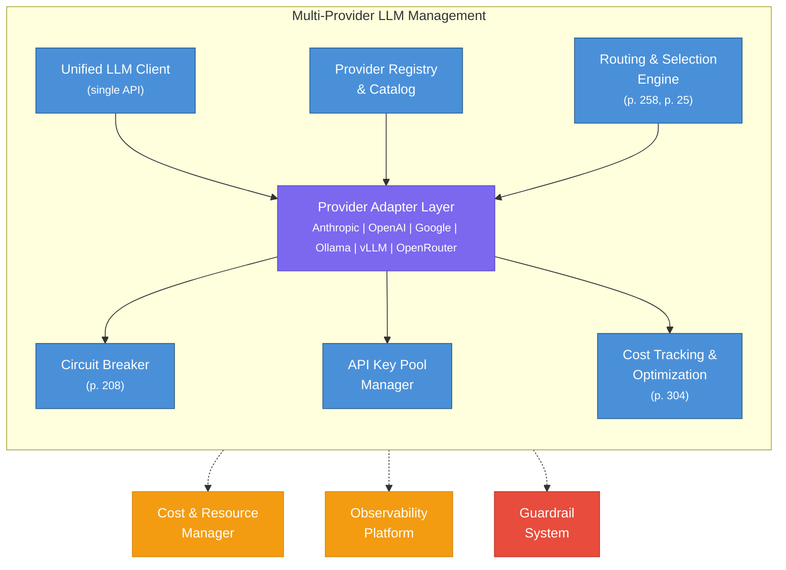
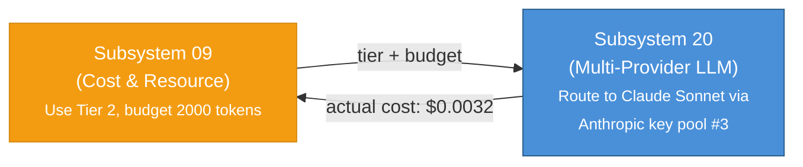
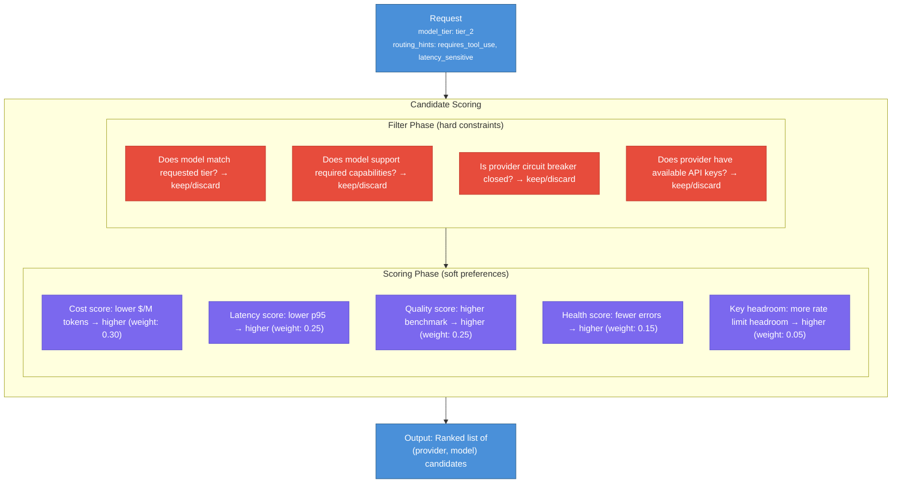
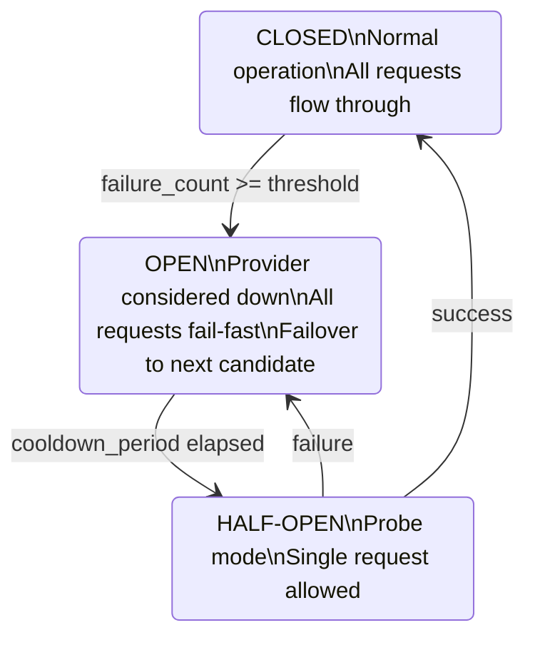
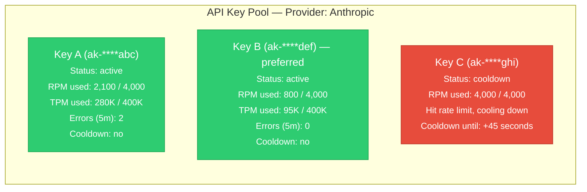
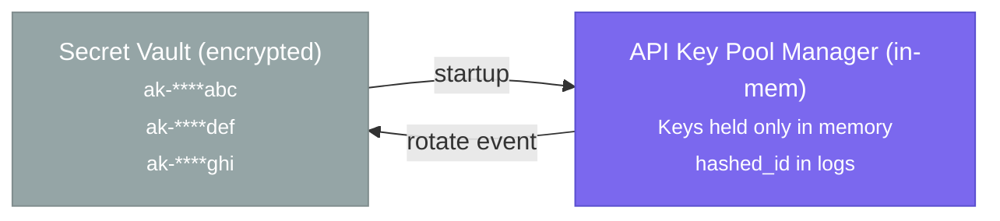
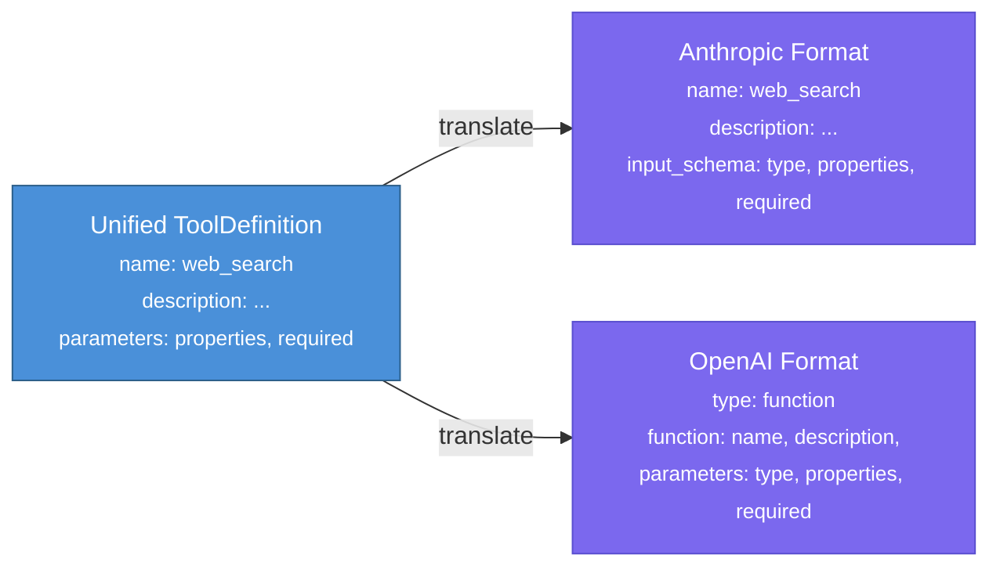

# Subsystem 20: Multi-Provider LLM Management

## Contents

| # | Section | Description |
|---|---------|-------------|
| 1 | [Overview & Responsibility](#1-overview--responsibility) | Abstraction-layer mandate: unified LLM interface across all providers |
| 2 | [Unified LLM Interface](#2-unified-llm-interface) | Single API surface hiding provider differences from all consumers |
| 3 | [Provider Registry & Model Catalog](#3-provider-registry--model-catalog) | Registry of supported providers, models, and their capabilities |
| 4 | [Provider Adapter Pattern](#4-provider-adapter-pattern) | Adapter abstraction translating unified requests to provider-specific formats |
| 5 | [Routing & Selection Engine](#5-routing--selection-engine) | Task-based, cost-based, and latency-based model selection logic |
| 6 | [Failover & Circuit Breaker](#6-failover--circuit-breaker) | Provider outage detection, automatic failover, and circuit-breaker state |
| 7 | [API Key Pool Management](#7-api-key-pool-management) | Multi-key rotation, rate-limit tracking, and key-health monitoring |
| 8 | [Cost Tracking & Optimization](#8-cost-tracking--optimization) | Per-request token accounting and budget enforcement |
| 9 | [Feature Compatibility Matrix](#9-feature-compatibility-matrix) | Matrix of which providers support tools, vision, JSON mode, etc. |
| 10 | [API Surface](#10-api-surface) | REST endpoints for LLM calls, provider health, and cost reporting |
| 11 | [Failure Modes & Mitigations](#11-failure-modes--mitigations) | Provider outages, rate-limit exhaustion, and model deprecation handling |
| 12 | [Instrumentation](#12-instrumentation) | Request latency, token usage, provider error rates, and cost-per-tenant metrics |

---

## 1. Overview & Responsibility

The Multi-Provider LLM Management subsystem is the **abstraction layer** between the AgentForge platform and the heterogeneous landscape of LLM providers. No agent, team, or platform service calls a provider API directly; all LLM traffic is mediated by this subsystem. It presents a single, unified interface to consumers while handling the full complexity of provider differences, failover, key management, cost optimization, and feature translation behind the scenes.

In a production agentic system, hard-coding a single provider creates brittleness: a provider outage halts all agent activity, rate limits throttle throughput, and pricing changes silently inflate costs. The Multi-Provider LLM Management subsystem eliminates these risks by treating LLM providers as interchangeable resources that can be selected, combined, and swapped at runtime based on task requirements, availability, and cost.

**Core design philosophy**: Every LLM call flows through a unified client that selects the optimal provider for the request, falls back automatically on failure, and tracks every token for cost and quality analysis. Agents never know or care which provider served their request (p. 258).



### Core Responsibilities

| # | Responsibility | Pattern Reference |
|---|---------------|-------------------|
| 1 | **Unified LLM Interface**: Single API that abstracts all provider differences | Tool Use (p. 81), Resource-Aware Optimization (p. 257) |
| 2 | **Provider Registry & Catalog**: Maintain an inventory of providers, models, capabilities, and pricing | Evaluation & Monitoring (p. 304) |
| 3 | **Provider Adapters**: Translate between the unified API and each provider's native format | Tool Use (p. 90 -- format translation) |
| 4 | **Routing & Selection**: Pick the best provider/model for each request based on task, cost, and availability | Routing (p. 25), Resource-Aware Optimization (p. 258) |
| 5 | **Failover & Circuit Breaker**: Detect provider degradation and automatically reroute to healthy alternatives | Exception Handling (p. 205-208), Routing (p. 27 -- fallback chain) |
| 6 | **API Key Pool Management**: Rotate keys, track per-key rate limits, distribute load across keys | Resource-Aware Optimization (p. 261) |
| 7 | **Cost Tracking & Optimization**: Real-time cost-per-token accounting, cheapest-viable-provider routing | Resource-Aware Optimization (p. 260-272), Evaluation & Monitoring (p. 304) |
| 8 | **Feature Compatibility**: Map provider-specific features (tool use, vision, streaming, extended thinking) to uniform capabilities | Tool Use (p. 81-100) |

### Relationship to Cost & Resource Manager (Subsystem 09)

Subsystem 09 owns **budget enforcement, model tier selection, and token accounting**. This subsystem (20) owns the **provider-level mechanics**: which provider serves the request, how keys are managed, how failover works, and how provider-specific API formats are translated. The two subsystems collaborate closely:

- Subsystem 09 decides the **model tier** (Tier 1/2/3) and **token budget** for a request.
- Subsystem 20 decides which **specific provider and model** fulfills the tier, manages the API call, and reports actual cost back.



---

## 2. Unified LLM Interface

The Unified LLM Interface is the single entry point through which every component of the AgentForge platform interacts with language models. It abstracts away all provider-specific concerns: authentication, request formatting, response parsing, streaming protocols, and error handling. Consumers of this interface -- agents, supervisors, guardrail evaluators, the complexity router -- issue calls against a provider-agnostic API and receive normalized responses.

### 2.1 Interface Contract

??? example "View Python pseudocode"

    ```python
    # --- Unified LLM Interface ---

    from dataclasses import dataclass, field
    from enum import Enum
    from typing import Optional, AsyncIterator
    from abc import ABC, abstractmethod


    class Role(Enum):
        SYSTEM = "system"
        USER = "user"
        ASSISTANT = "assistant"
        TOOL_RESULT = "tool_result"


    @dataclass
    class Message:
        role: Role
        content: str | list[dict]           # str for text, list for multimodal (vision)
        tool_call_id: Optional[str] = None  # for tool results
        name: Optional[str] = None          # optional sender name


    @dataclass
    class ToolDefinition:
        """Provider-agnostic tool definition. Translated to provider-specific
        format (OpenAI function_calling vs Anthropic tool_use) by the adapter layer.
        See Tool Use format translation (p. 90)."""
        name: str
        description: str
        parameters: dict                     # JSON Schema
        required: list[str] = field(default_factory=list)


    @dataclass
    class ToolCall:
        """A tool invocation requested by the model."""
        id: str
        name: str
        arguments: dict


    @dataclass
    class LLMRequest:
        """Provider-agnostic request. The unified client translates this into
        whatever format the selected provider requires."""
        messages: list[Message]
        model_tier: Optional[str] = None     # "tier_1", "tier_2", "tier_3" (p. 257)
        model: Optional[str] = None          # explicit model override (e.g. "claude-sonnet-4-20250514")
        provider: Optional[str] = None       # explicit provider override (e.g. "anthropic")
        max_tokens: int = 4096
        temperature: float = 0.7
        top_p: Optional[float] = None
        stop_sequences: Optional[list[str]] = None
        tools: Optional[list[ToolDefinition]] = None
        tool_choice: Optional[str] = None    # "auto", "required", "none", or specific tool name
        stream: bool = False
        response_format: Optional[dict] = None  # {"type": "json_object"} etc.

        # Extended features (mapped to provider-specific params by adapter)
        extended_thinking: bool = False       # Anthropic extended thinking
        thinking_budget: Optional[int] = None
        seed: Optional[int] = None           # deterministic generation where supported

        # Routing hints (consumed by the routing engine, not sent to provider)
        routing_hints: dict = field(default_factory=dict)
        # e.g. {"requires_vision": True, "requires_tool_use": True,
        #        "quality_critical": True, "latency_sensitive": True}


    @dataclass
    class TokenUsage:
        input_tokens: int
        output_tokens: int
        cache_read_tokens: int = 0
        cache_write_tokens: int = 0
        thinking_tokens: int = 0             # Anthropic extended thinking tokens
        total_tokens: int = 0

        def __post_init__(self):
            if self.total_tokens == 0:
                self.total_tokens = self.input_tokens + self.output_tokens


    @dataclass
    class LLMResponse:
        """Provider-agnostic response. All provider-specific response formats
        are normalized to this structure by the adapter layer."""
        content: str
        tool_calls: list[ToolCall] = field(default_factory=list)
        thinking: Optional[str] = None       # extended thinking content
        usage: Optional[TokenUsage] = None
        model: str = ""                       # actual model used (e.g. "claude-sonnet-4-20250514")
        provider: str = ""                    # actual provider used (e.g. "anthropic")
        finish_reason: str = ""              # "stop", "tool_use", "max_tokens", "content_filter"
        latency_ms: float = 0.0
        cost_usd: float = 0.0               # computed from usage + pricing table
        request_id: str = ""                 # provider's request ID for debugging

        # Metadata for observability
        key_id: str = ""                     # which API key was used (hashed)
        circuit_state: str = ""              # "closed", "half_open" at time of call
        routing_decision: Optional[dict] = None  # why this provider was chosen


    @dataclass
    class StreamChunk:
        """A single chunk from a streaming response."""
        content_delta: str = ""
        tool_call_delta: Optional[dict] = None
        thinking_delta: Optional[str] = None
        is_final: bool = False
        usage: Optional[TokenUsage] = None   # only present on final chunk
    ```

### 2.2 Unified LLM Client

The `UnifiedLLMClient` is the facade through which all platform components issue LLM calls. It orchestrates provider selection, adapter dispatch, failover, and response normalization. It is the only class in the platform that interacts with provider adapters.

??? example "View Python pseudocode"

    ```python
    # --- Unified LLM Client ---

    import time
    import asyncio
    from typing import Optional, AsyncIterator


    class UnifiedLLMClient:
        """Single entry point for all LLM interactions across the platform.

        Implements the Resource-Aware Optimization pattern (p. 257): callers
        specify intent (model tier, required features) rather than a specific
        provider. The client resolves the best provider/model combination at
        call time based on availability, cost, and capability.
        """

        def __init__(
            self,
            provider_registry: "ProviderRegistry",
            routing_engine: "RoutingEngine",
            circuit_breaker_manager: "CircuitBreakerManager",
            key_pool_manager: "APIKeyPoolManager",
            cost_tracker: "CostTracker",
            config: dict,
        ):
            self.registry = provider_registry
            self.router = routing_engine
            self.breakers = circuit_breaker_manager
            self.keys = key_pool_manager
            self.costs = cost_tracker
            self.max_failover_attempts = config.get("max_failover_attempts", 3)

        async def generate(self, request: LLMRequest) -> LLMResponse:
            """Execute an LLM generation with automatic routing and failover.

            Flow:
            1. Routing engine selects ordered list of provider/model candidates (p. 25).
            2. For each candidate, check circuit breaker state (p. 208).
            3. Acquire an API key from the pool for the selected provider.
            4. Translate request to provider format via adapter (p. 90).
            5. Execute the call; on success, return normalized response.
            6. On failure, classify error (p. 205) and either retry or failover.
            """
            # Step 1: Get ranked list of provider/model candidates
            candidates = await self.router.select_candidates(request)

            last_error = None
            for attempt, candidate in enumerate(candidates[:self.max_failover_attempts]):
                provider_name = candidate.provider
                model_name = candidate.model

                # Step 2: Check circuit breaker -- skip if open (p. 208)
                breaker = self.breakers.get_breaker(provider_name)
                if not breaker.allow_request():
                    continue

                # Step 3: Acquire API key from pool
                key = await self.keys.acquire_key(provider_name)
                if key is None:
                    continue  # all keys exhausted for this provider

                try:
                    # Step 4: Get the adapter and translate the request
                    adapter = self.registry.get_adapter(provider_name)
                    start_time = time.monotonic()

                    # Step 5: Execute the call
                    response = await adapter.generate(request, model_name, key)
                    elapsed_ms = (time.monotonic() - start_time) * 1000

                    # Enrich response metadata
                    response.provider = provider_name
                    response.model = model_name
                    response.latency_ms = elapsed_ms
                    response.key_id = key.hashed_id
                    response.circuit_state = breaker.state.value
                    response.routing_decision = candidate.to_dict()

                    # Compute cost from usage + pricing table
                    response.cost_usd = self.costs.compute_cost(
                        provider_name, model_name, response.usage
                    )

                    # Report success to circuit breaker and key pool
                    breaker.record_success()
                    self.keys.release_key(key, success=True)

                    # Emit cost event for subsystem 09 integration
                    await self.costs.record(response)

                    return response

                except ProviderError as e:
                    elapsed_ms = (time.monotonic() - start_time) * 1000

                    # Step 6: Classify error (p. 205)
                    classification = classify_error(e)
                    self.keys.release_key(key, success=False)

                    if classification == ErrorClass.TRANSIENT:
                        # Rate limit or temporary failure -- mark key and try next
                        breaker.record_failure()
                        last_error = e
                        continue  # failover to next candidate (p. 27)

                    elif classification == ErrorClass.RATE_LIMITED:
                        # Retry with backoff on same provider (p. 206)
                        await asyncio.sleep(e.retry_after or 1.0)
                        breaker.record_failure()
                        last_error = e
                        continue

                    elif classification == ErrorClass.PERMANENT:
                        # Model deprecated, invalid request -- do not retry (p. 205)
                        raise PermanentProviderError(provider_name, model_name, e)

                    else:
                        breaker.record_failure()
                        last_error = e
                        continue

            # All candidates exhausted
            raise AllProvidersExhaustedError(
                f"Failed after {self.max_failover_attempts} attempts. "
                f"Last error: {last_error}"
            )

        async def generate_stream(
            self, request: LLMRequest
        ) -> AsyncIterator[StreamChunk]:
            """Streaming variant of generate(). Same routing and failover logic,
            but yields StreamChunks as they arrive from the provider."""
            request.stream = True
            candidates = await self.router.select_candidates(request)

            for candidate in candidates[:self.max_failover_attempts]:
                breaker = self.breakers.get_breaker(candidate.provider)
                if not breaker.allow_request():
                    continue

                key = await self.keys.acquire_key(candidate.provider)
                if key is None:
                    continue

                try:
                    adapter = self.registry.get_adapter(candidate.provider)
                    start_time = time.monotonic()

                    async for chunk in adapter.generate_stream(
                        request, candidate.model, key
                    ):
                        yield chunk
                        if chunk.is_final and chunk.usage:
                            elapsed_ms = (time.monotonic() - start_time) * 1000
                            response_meta = LLMResponse(
                                content="",
                                usage=chunk.usage,
                                model=candidate.model,
                                provider=candidate.provider,
                                latency_ms=elapsed_ms,
                                key_id=key.hashed_id,
                            )
                            response_meta.cost_usd = self.costs.compute_cost(
                                candidate.provider, candidate.model, chunk.usage
                            )
                            await self.costs.record(response_meta)

                    breaker.record_success()
                    self.keys.release_key(key, success=True)
                    return  # stream completed successfully

                except ProviderError:
                    breaker.record_failure()
                    self.keys.release_key(key, success=False)
                    continue  # failover to next candidate

            raise AllProvidersExhaustedError("Streaming failed across all candidates")
    ```

### 2.3 Design Rationale

The unified interface enforces several critical properties:

1. **Provider agnosticism**: Agents and subsystems never import provider-specific SDKs. They depend only on `LLMRequest`/`LLMResponse`. This means swapping a provider, adding a new one, or removing a deprecated one requires zero changes to any agent code.

2. **Failover transparency**: The caller receives a single `LLMResponse` regardless of whether the first, second, or third provider candidate served it. The `routing_decision` metadata records which providers were tried, enabling post-hoc analysis.

3. **Cost attribution**: Every response carries `cost_usd` computed from the actual provider/model pricing. This feeds directly into subsystem 09's budget tracking without consumers needing to know pricing tables.

4. **Observability by default**: Every response includes the actual model, provider, key (hashed), latency, and circuit breaker state. The Observability Platform (subsystem 05) receives this metadata automatically.

---

## 3. Provider Registry & Model Catalog

The Provider Registry is the source of truth for all available LLM providers, models, their capabilities, pricing, and operational status. It is a configuration-driven data store that can be updated at runtime without redeploying the platform.

### 3.1 Provider Definition Schema

??? example "View JSON example"

    ```json
    {
      "provider_id": "anthropic",
      "display_name": "Anthropic",
      "adapter_class": "AnthropicAdapter",
      "base_url": "https://api.anthropic.com",
      "api_version": "2024-01-01",
      "auth_type": "api_key",
      "status": "active",

      "rate_limits": {
        "requests_per_minute": 4000,
        "tokens_per_minute": 400000,
        "tokens_per_day": 10000000
      },

      "models": [
        {
          "model_id": "claude-sonnet-4-20250514",
          "display_name": "Claude Sonnet 4",
          "tier": "tier_2",
          "context_window": 200000,
          "max_output_tokens": 64000,
          "pricing": {
            "input_per_million": 3.00,
            "output_per_million": 15.00,
            "cache_read_per_million": 0.30,
            "cache_write_per_million": 3.75
          },
          "capabilities": {
            "tool_use": true,
            "vision": true,
            "streaming": true,
            "extended_thinking": true,
            "json_mode": true,
            "system_prompt": true,
            "multi_turn": true,
            "pdf_input": true,
            "batch_api": true
          },
          "quality_scores": {
            "coding": 0.92,
            "reasoning": 0.90,
            "creative_writing": 0.88,
            "instruction_following": 0.93,
            "multilingual": 0.85
          },
          "status": "active"
        },
        {
          "model_id": "claude-opus-4-20250514",
          "display_name": "Claude Opus 4",
          "tier": "tier_3",
          "context_window": 200000,
          "max_output_tokens": 32000,
          "pricing": {
            "input_per_million": 15.00,
            "output_per_million": 75.00,
            "cache_read_per_million": 1.50,
            "cache_write_per_million": 18.75
          },
          "capabilities": {
            "tool_use": true,
            "vision": true,
            "streaming": true,
            "extended_thinking": true,
            "json_mode": true,
            "system_prompt": true,
            "multi_turn": true,
            "pdf_input": true,
            "batch_api": true
          },
          "quality_scores": {
            "coding": 0.97,
            "reasoning": 0.96,
            "creative_writing": 0.95,
            "instruction_following": 0.97,
            "multilingual": 0.92
          },
          "status": "active"
        },
        {
          "model_id": "claude-haiku-3.5",
          "display_name": "Claude 3.5 Haiku",
          "tier": "tier_1",
          "context_window": 200000,
          "max_output_tokens": 8192,
          "pricing": {
            "input_per_million": 0.80,
            "output_per_million": 4.00
          },
          "capabilities": {
            "tool_use": true,
            "vision": true,
            "streaming": true,
            "extended_thinking": false,
            "json_mode": true,
            "system_prompt": true,
            "multi_turn": true,
            "pdf_input": false,
            "batch_api": true
          },
          "quality_scores": {
            "coding": 0.78,
            "reasoning": 0.74,
            "creative_writing": 0.72,
            "instruction_following": 0.80,
            "multilingual": 0.70
          },
          "status": "active"
        }
      ]
    }
    ```

### 3.2 Full Provider Catalog

The platform ships with adapters for the following providers. Additional providers can be registered at runtime by deploying a new adapter and adding a provider definition to the registry.

```
Provider Catalog
═══════════════════════════════════════════════════════════════════════════

Anthropic (anthropic)
├── claude-opus-4          Tier 3   200K ctx   Tool/Vision/Thinking
├── claude-sonnet-4        Tier 2   200K ctx   Tool/Vision/Thinking
└── claude-haiku-3.5       Tier 1   200K ctx   Tool/Vision

OpenAI (openai)
├── gpt-4o                 Tier 2   128K ctx   Tool/Vision/JSON
├── gpt-4o-mini            Tier 1   128K ctx   Tool/Vision/JSON
├── o3                     Tier 3   200K ctx   Tool/Reasoning
└── o3-mini                Tier 2   200K ctx   Tool/Reasoning

Google (google)
├── gemini-2.5-pro         Tier 2   1M ctx     Tool/Vision/Thinking
├── gemini-2.5-flash       Tier 1   1M ctx     Tool/Vision
└── gemini-ultra           Tier 3   1M ctx     Tool/Vision/Thinking

Local — Ollama (ollama)
├── llama-3.3-70b          Tier 2   128K ctx   Tool (limited)
├── qwen-2.5-coder-32b    Tier 1   32K ctx    Code-specialized
└── (any Ollama model)     varies   varies     Model-dependent

Local — vLLM (vllm)
├── (any HuggingFace model) varies  varies     High-throughput serving
└── Configuration-driven    varies  varies     GPU-optimized batching

OpenRouter (openrouter)
└── (meta-provider)        varies   varies     Routes to 200+ models
    Provides cost arbitrage, automatic failover, and access to models
    not directly supported by other adapters (p. 261).
```

### 3.3 Provider Registry Implementation

??? example "View Python pseudocode"

    ```python
    # --- Provider Registry ---

    from dataclasses import dataclass, field
    from typing import Optional
    import json


    @dataclass
    class ModelInfo:
        model_id: str
        display_name: str
        tier: str                              # "tier_1", "tier_2", "tier_3"
        context_window: int
        max_output_tokens: int
        pricing: dict                          # per-million token costs
        capabilities: dict[str, bool]
        quality_scores: dict[str, float]
        status: str = "active"                 # "active", "deprecated", "beta"


    @dataclass
    class ProviderInfo:
        provider_id: str
        display_name: str
        adapter_class: str
        base_url: str
        auth_type: str
        rate_limits: dict
        models: dict[str, ModelInfo] = field(default_factory=dict)
        status: str = "active"


    class ProviderRegistry:
        """Central registry of all LLM providers and their models.

        Loaded from configuration at startup and can be hot-reloaded at runtime
        when pricing changes or new models are added.
        """

        def __init__(self):
            self._providers: dict[str, ProviderInfo] = {}
            self._adapters: dict[str, "ProviderAdapter"] = {}

        def register_provider(self, config: dict, adapter: "ProviderAdapter"):
            """Register a provider from its configuration and adapter instance."""
            models = {}
            for m in config.get("models", []):
                models[m["model_id"]] = ModelInfo(**m)

            provider = ProviderInfo(
                provider_id=config["provider_id"],
                display_name=config["display_name"],
                adapter_class=config["adapter_class"],
                base_url=config["base_url"],
                auth_type=config["auth_type"],
                rate_limits=config["rate_limits"],
                models=models,
                status=config.get("status", "active"),
            )
            self._providers[provider.provider_id] = provider
            self._adapters[provider.provider_id] = adapter

        def get_adapter(self, provider_id: str) -> "ProviderAdapter":
            """Return the adapter instance for a provider."""
            return self._adapters[provider_id]

        def get_models_for_tier(self, tier: str) -> list[tuple[str, ModelInfo]]:
            """Return all (provider_id, model) pairs matching a tier.
            Used by the routing engine to find candidates (p. 258)."""
            results = []
            for pid, provider in self._providers.items():
                if provider.status != "active":
                    continue
                for model in provider.models.values():
                    if model.tier == tier and model.status == "active":
                        results.append((pid, model))
            return results

        def get_models_with_capability(
            self, capability: str, tier: Optional[str] = None
        ) -> list[tuple[str, ModelInfo]]:
            """Return all models that support a given capability (e.g. 'vision').
            Optionally filter by tier."""
            results = []
            for pid, provider in self._providers.items():
                if provider.status != "active":
                    continue
                for model in provider.models.values():
                    if model.status != "active":
                        continue
                    if tier and model.tier != tier:
                        continue
                    if model.capabilities.get(capability, False):
                        results.append((pid, model))
            return results

        def get_pricing(self, provider_id: str, model_id: str) -> dict:
            """Return the pricing table for a specific provider/model pair."""
            provider = self._providers.get(provider_id)
            if provider and model_id in provider.models:
                return provider.models[model_id].pricing
            raise ModelNotFoundError(f"{provider_id}/{model_id}")

        def hot_reload(self, config_path: str):
            """Reload provider configuration without restarting.
            Used when pricing updates or new models are added."""
            with open(config_path) as f:
                configs = json.load(f)
            for config in configs:
                pid = config["provider_id"]
                if pid in self._providers:
                    # Update models and pricing in place
                    for m in config.get("models", []):
                        self._providers[pid].models[m["model_id"]] = ModelInfo(**m)
    ```

---

## 4. Provider Adapter Pattern

Each LLM provider has a dedicated **adapter** that translates between the platform's unified `LLMRequest`/`LLMResponse` format and the provider's native API. The adapter encapsulates all provider-specific logic: authentication headers, request body construction, response parsing, error code mapping, and streaming protocol handling.

This is a strict application of the **Adapter pattern**: the unified client depends only on the abstract `ProviderAdapter` interface. New providers are added by implementing this interface without touching any existing code.

### 4.1 Abstract Adapter Interface

??? example "View Python pseudocode"

    ```python
    # --- Provider Adapter (abstract) ---

    from abc import ABC, abstractmethod
    from typing import AsyncIterator


    class ProviderAdapter(ABC):
        """Abstract base class for all provider adapters.

        Each adapter translates between the unified LLMRequest/LLMResponse
        contract and the provider's native API format. This includes:

        - Request body construction (message format, tool definitions)
        - Authentication header injection
        - Response parsing and normalization
        - Error code mapping to platform error classes
        - Streaming protocol handling (SSE, WebSocket, etc.)

        Tool calling format translation (p. 90): OpenAI uses 'functions'/'tools'
        with 'function_call', Anthropic uses 'tools' with 'tool_use' content
        blocks. The adapter handles this translation transparently.
        """

        @abstractmethod
        async def generate(
            self,
            request: LLMRequest,
            model: str,
            api_key: "APIKey",
        ) -> LLMResponse:
            """Execute a non-streaming LLM call and return normalized response."""
            ...

        @abstractmethod
        async def generate_stream(
            self,
            request: LLMRequest,
            model: str,
            api_key: "APIKey",
        ) -> AsyncIterator[StreamChunk]:
            """Execute a streaming LLM call and yield normalized chunks."""
            ...

        @abstractmethod
        def translate_request(self, request: LLMRequest, model: str) -> dict:
            """Convert a unified LLMRequest into the provider's native format."""
            ...

        @abstractmethod
        def translate_response(self, raw_response: dict) -> LLMResponse:
            """Convert a provider's native response into a unified LLMResponse."""
            ...

        @abstractmethod
        def translate_error(self, error: Exception) -> "ProviderError":
            """Map provider-specific errors to platform error classes (p. 205)."""
            ...

        @abstractmethod
        def supports_feature(self, feature: str) -> bool:
            """Check if this adapter supports a feature at the API level."""
            ...
    ```

### 4.2 Anthropic Adapter Implementation

??? example "View Python pseudocode"

    ```python
    # --- Anthropic Adapter ---

    import httpx
    from typing import AsyncIterator


    class AnthropicAdapter(ProviderAdapter):
        """Adapter for the Anthropic Messages API.

        Handles Anthropic-specific concerns:
        - System prompt as a top-level parameter (not a message)
        - Tool use via 'tools' parameter with 'tool_use' content blocks
        - Extended thinking via 'thinking' parameter
        - Streaming via Server-Sent Events (SSE)
        - Cache control headers for prompt caching
        """

        BASE_URL = "https://api.anthropic.com/v1"

        def __init__(self, config: dict):
            self.api_version = config.get("api_version", "2024-01-01")
            self.http_client = httpx.AsyncClient(timeout=120.0)

        def translate_request(self, request: LLMRequest, model: str) -> dict:
            """Translate unified request to Anthropic Messages API format.

            Key differences from OpenAI format (p. 90):
            - System prompt is a top-level 'system' field, not a message
            - Tool definitions use 'input_schema' instead of 'parameters'
            - Vision content uses base64 'source' blocks
            - Extended thinking is a first-class parameter
            """
            # Separate system message from conversation messages
            system_content = None
            messages = []
            for msg in request.messages:
                if msg.role == Role.SYSTEM:
                    system_content = msg.content
                elif msg.role == Role.TOOL_RESULT:
                    messages.append({
                        "role": "user",
                        "content": [{
                            "type": "tool_result",
                            "tool_use_id": msg.tool_call_id,
                            "content": msg.content,
                        }]
                    })
                else:
                    messages.append({
                        "role": msg.role.value,
                        "content": msg.content,
                    })

            body = {
                "model": model,
                "messages": messages,
                "max_tokens": request.max_tokens,
                "temperature": request.temperature,
            }

            if system_content:
                body["system"] = system_content

            if request.stop_sequences:
                body["stop_sequences"] = request.stop_sequences

            # Tool use translation (p. 90): Anthropic format
            if request.tools:
                body["tools"] = [
                    {
                        "name": tool.name,
                        "description": tool.description,
                        "input_schema": {
                            "type": "object",
                            "properties": tool.parameters.get("properties", {}),
                            "required": tool.required,
                        },
                    }
                    for tool in request.tools
                ]

            # Extended thinking (Anthropic-specific feature)
            if request.extended_thinking:
                body["thinking"] = {
                    "type": "enabled",
                    "budget_tokens": request.thinking_budget or 10000,
                }
                # Extended thinking requires temperature = 1.0
                body["temperature"] = 1.0

            if request.stream:
                body["stream"] = True

            return body

        def translate_response(self, raw: dict) -> LLMResponse:
            """Parse Anthropic response into unified LLMResponse."""
            content_parts = []
            tool_calls = []
            thinking = None

            for block in raw.get("content", []):
                if block["type"] == "text":
                    content_parts.append(block["text"])
                elif block["type"] == "tool_use":
                    tool_calls.append(ToolCall(
                        id=block["id"],
                        name=block["name"],
                        arguments=block["input"],
                    ))
                elif block["type"] == "thinking":
                    thinking = block["thinking"]

            usage_data = raw.get("usage", {})
            usage = TokenUsage(
                input_tokens=usage_data.get("input_tokens", 0),
                output_tokens=usage_data.get("output_tokens", 0),
                cache_read_tokens=usage_data.get("cache_read_input_tokens", 0),
                cache_write_tokens=usage_data.get("cache_creation_input_tokens", 0),
            )

            return LLMResponse(
                content="\n".join(content_parts),
                tool_calls=tool_calls,
                thinking=thinking,
                usage=usage,
                model=raw.get("model", ""),
                finish_reason=raw.get("stop_reason", ""),
                request_id=raw.get("id", ""),
            )

        def translate_error(self, error: Exception) -> "ProviderError":
            """Map Anthropic HTTP errors to platform error classes (p. 205)."""
            if isinstance(error, httpx.HTTPStatusError):
                status = error.response.status_code
                if status == 429:
                    retry_after = float(
                        error.response.headers.get("retry-after", "1")
                    )
                    return RateLimitError("anthropic", retry_after=retry_after)
                elif status == 529:
                    return OverloadedError("anthropic")
                elif status in (401, 403):
                    return AuthenticationError("anthropic")
                elif status == 400:
                    return InvalidRequestError("anthropic", str(error))
                else:
                    return TransientError("anthropic", status)
            return UnknownProviderError("anthropic", str(error))

        def supports_feature(self, feature: str) -> bool:
            return feature in {
                "tool_use", "vision", "streaming", "extended_thinking",
                "json_mode", "system_prompt", "multi_turn", "pdf_input",
                "prompt_caching", "batch_api",
            }

        async def generate(
            self, request: LLMRequest, model: str, api_key: "APIKey"
        ) -> LLMResponse:
            body = self.translate_request(request, model)
            headers = {
                "x-api-key": api_key.value,
                "anthropic-version": self.api_version,
                "content-type": "application/json",
            }
            try:
                resp = await self.http_client.post(
                    f"{self.BASE_URL}/messages",
                    json=body,
                    headers=headers,
                )
                resp.raise_for_status()
                return self.translate_response(resp.json())
            except Exception as e:
                raise self.translate_error(e)

        async def generate_stream(
            self, request: LLMRequest, model: str, api_key: "APIKey"
        ) -> AsyncIterator[StreamChunk]:
            body = self.translate_request(request, model)
            body["stream"] = True
            headers = {
                "x-api-key": api_key.value,
                "anthropic-version": self.api_version,
                "content-type": "application/json",
            }
            async with self.http_client.stream(
                "POST", f"{self.BASE_URL}/messages", json=body, headers=headers
            ) as resp:
                async for line in resp.aiter_lines():
                    if line.startswith("data: "):
                        chunk_data = json.loads(line[6:])
                        yield self._parse_stream_event(chunk_data)

        def _parse_stream_event(self, event: dict) -> StreamChunk:
            event_type = event.get("type", "")
            if event_type == "content_block_delta":
                delta = event.get("delta", {})
                if delta.get("type") == "text_delta":
                    return StreamChunk(content_delta=delta.get("text", ""))
                elif delta.get("type") == "thinking_delta":
                    return StreamChunk(thinking_delta=delta.get("thinking", ""))
            elif event_type == "message_delta":
                usage = event.get("usage", {})
                return StreamChunk(
                    is_final=True,
                    usage=TokenUsage(
                        input_tokens=usage.get("input_tokens", 0),
                        output_tokens=usage.get("output_tokens", 0),
                    ),
                )
            return StreamChunk()
    ```

### 4.3 OpenAI Adapter (Key Differences)

??? example "View Python pseudocode"

    ```python
    # --- OpenAI Adapter (abbreviated -- highlighting format differences) ---

    class OpenAIAdapter(ProviderAdapter):
        """Adapter for the OpenAI Chat Completions API.

        Key format differences from Anthropic (p. 90):
        - System prompt is a message with role='system', not a top-level field
        - Tool definitions use 'parameters' (not 'input_schema')
        - Tool calls appear in 'tool_calls' array on the assistant message
        - Streaming uses 'choices[0].delta' structure
        - No native extended thinking (mapped to chain-of-thought prompting)
        """

        def translate_request(self, request: LLMRequest, model: str) -> dict:
            messages = []
            for msg in request.messages:
                if msg.role == Role.TOOL_RESULT:
                    messages.append({
                        "role": "tool",
                        "tool_call_id": msg.tool_call_id,
                        "content": msg.content,
                    })
                else:
                    messages.append({
                        "role": msg.role.value,
                        "content": msg.content,
                    })

            body = {
                "model": model,
                "messages": messages,
                "max_completion_tokens": request.max_tokens,
                "temperature": request.temperature,
                "stream": request.stream,
            }

            # Tool use translation (p. 90): OpenAI 'tools' format
            if request.tools:
                body["tools"] = [
                    {
                        "type": "function",
                        "function": {
                            "name": tool.name,
                            "description": tool.description,
                            "parameters": {
                                "type": "object",
                                "properties": tool.parameters.get("properties", {}),
                                "required": tool.required,
                            },
                        },
                    }
                    for tool in request.tools
                ]

            if request.response_format:
                body["response_format"] = request.response_format

            # Extended thinking not natively supported -- fallback to
            # system prompt instruction for chain-of-thought
            if request.extended_thinking:
                cot_instruction = {
                    "role": "system",
                    "content": (
                        "Think step by step before answering. "
                        "Show your reasoning process."
                    ),
                }
                messages.insert(0, cot_instruction)

            return body

        def translate_response(self, raw: dict) -> LLMResponse:
            choice = raw["choices"][0]
            message = choice["message"]
            tool_calls = []
            if message.get("tool_calls"):
                for tc in message["tool_calls"]:
                    tool_calls.append(ToolCall(
                        id=tc["id"],
                        name=tc["function"]["name"],
                        arguments=json.loads(tc["function"]["arguments"]),
                    ))

            usage_data = raw.get("usage", {})
            return LLMResponse(
                content=message.get("content", "") or "",
                tool_calls=tool_calls,
                usage=TokenUsage(
                    input_tokens=usage_data.get("prompt_tokens", 0),
                    output_tokens=usage_data.get("completion_tokens", 0),
                ),
                model=raw.get("model", ""),
                finish_reason=choice.get("finish_reason", ""),
                request_id=raw.get("id", ""),
            )
    ```

### 4.4 Local Model Adapter (Ollama)

??? example "View Python pseudocode"

    ```python
    # --- Ollama Adapter (local models) ---

    class OllamaAdapter(ProviderAdapter):
        """Adapter for locally-hosted models via Ollama.

        Key considerations for local models:
        - No API key required (auth_type: "none")
        - Latency depends on local GPU/CPU resources
        - Context window and capabilities vary per model
        - Tool use support is model-dependent
        - No per-token cost (only infrastructure cost)
        - The circuit breaker monitors local process health
        """

        def __init__(self, config: dict):
            self.base_url = config.get("base_url", "http://localhost:11434")
            self.http_client = httpx.AsyncClient(timeout=300.0)  # longer timeout for local

        def translate_request(self, request: LLMRequest, model: str) -> dict:
            messages = []
            for msg in request.messages:
                messages.append({
                    "role": msg.role.value if msg.role != Role.TOOL_RESULT else "user",
                    "content": msg.content,
                })

            return {
                "model": model,
                "messages": messages,
                "options": {
                    "temperature": request.temperature,
                    "num_predict": request.max_tokens,
                },
                "stream": request.stream,
            }

        async def generate(
            self, request: LLMRequest, model: str, api_key: "APIKey"
        ) -> LLMResponse:
            body = self.translate_request(request, model)
            resp = await self.http_client.post(
                f"{self.base_url}/api/chat", json=body
            )
            resp.raise_for_status()
            data = resp.json()
            return LLMResponse(
                content=data["message"]["content"],
                usage=TokenUsage(
                    input_tokens=data.get("prompt_eval_count", 0),
                    output_tokens=data.get("eval_count", 0),
                ),
                model=model,
                cost_usd=0.0,  # local models: no API cost
            )
    ```

### 4.5 Adapter Registration

Adapters are registered with the `ProviderRegistry` at startup. The factory pattern allows new adapters to be added without modifying existing code:

??? example "View Python pseudocode"

    ```python
    # --- Adapter Factory ---

    ADAPTER_CLASSES = {
        "AnthropicAdapter": AnthropicAdapter,
        "OpenAIAdapter": OpenAIAdapter,
        "GoogleAdapter": GoogleAdapter,
        "OllamaAdapter": OllamaAdapter,
        "VLLMAdapter": VLLMAdapter,
        "OpenRouterAdapter": OpenRouterAdapter,
    }


    def build_registry(provider_configs: list[dict]) -> ProviderRegistry:
        """Build the provider registry from a list of provider configurations.
        Called once at platform startup."""
        registry = ProviderRegistry()
        for config in provider_configs:
            adapter_cls = ADAPTER_CLASSES[config["adapter_class"]]
            adapter = adapter_cls(config)
            registry.register_provider(config, adapter)
        return registry
    ```

---

## 5. Routing & Selection Engine

The Routing & Selection Engine determines which provider and model should serve each LLM request. It applies the Routing pattern (p. 25) and Resource-Aware Optimization (p. 258) to make this decision based on multiple factors: requested tier, required capabilities, provider health, cost, latency, and quality scores.

### 5.1 Routing Decision Factors



### 5.2 Routing Engine Implementation

??? example "View Python pseudocode"

    ```python
    # --- Routing & Selection Engine (p. 25, p. 258) ---

    from dataclasses import dataclass
    from typing import Optional


    @dataclass
    class RoutingCandidate:
        provider: str
        model: str
        score: float
        cost_per_million_input: float
        cost_per_million_output: float
        estimated_latency_ms: float
        quality_score: float
        health_score: float

        def to_dict(self) -> dict:
            return {
                "provider": self.provider,
                "model": self.model,
                "score": round(self.score, 4),
                "cost_input": self.cost_per_million_input,
                "latency_est_ms": self.estimated_latency_ms,
            }


    class RoutingEngine:
        """Selects the best provider/model for each request.

        Applies the Routing pattern (p. 25) with a multi-factor scoring
        algorithm. The engine does NOT use an LLM for routing -- it uses
        deterministic scoring. The LLM-based complexity classification
        (which tier to use) is handled by subsystem 09's ComplexityRouter.

        This engine answers: "Given that we need a Tier 2 model with tool use,
        which specific provider and model should we use right now?"

        Fallback chain (p. 27): Candidates are returned in ranked order.
        The UnifiedLLMClient iterates through them on failure.
        """

        # Scoring weights -- configurable per deployment
        DEFAULT_WEIGHTS = {
            "cost": 0.30,
            "latency": 0.25,
            "quality": 0.25,
            "health": 0.15,
            "key_headroom": 0.05,
        }

        def __init__(
            self,
            registry: ProviderRegistry,
            circuit_breakers: "CircuitBreakerManager",
            key_pool: "APIKeyPoolManager",
            metrics_store: "ProviderMetricsStore",
            config: dict,
        ):
            self.registry = registry
            self.breakers = circuit_breakers
            self.keys = key_pool
            self.metrics = metrics_store
            self.weights = config.get("routing_weights", self.DEFAULT_WEIGHTS)
            self.preference_overrides = config.get("provider_preferences", {})

        async def select_candidates(
            self, request: LLMRequest
        ) -> list[RoutingCandidate]:
            """Return a ranked list of (provider, model) candidates for the request.

            The list is ordered by composite score (highest first). The caller
            iterates through candidates for failover (p. 27).
            """
            # Handle explicit provider/model override
            if request.provider and request.model:
                return [RoutingCandidate(
                    provider=request.provider,
                    model=request.model,
                    score=1.0,
                    cost_per_million_input=0,
                    cost_per_million_output=0,
                    estimated_latency_ms=0,
                    quality_score=0,
                    health_score=1.0,
                )]

            # Step 1: Gather all models for the requested tier
            tier = request.model_tier or "tier_2"
            all_models = self.registry.get_models_for_tier(tier)

            # Step 2: Filter by required capabilities (hard constraints)
            required_caps = self._extract_required_capabilities(request)
            candidates_raw = [
                (pid, model)
                for pid, model in all_models
                if self._meets_capabilities(model, required_caps)
            ]

            # Step 3: Filter by circuit breaker and key availability
            candidates_filtered = []
            for pid, model in candidates_raw:
                breaker = self.breakers.get_breaker(pid)
                if not breaker.allow_request():
                    continue
                if not self.keys.has_available_keys(pid):
                    continue
                candidates_filtered.append((pid, model))

            if not candidates_filtered:
                # No candidates at requested tier -- try adjacent tiers (p. 259)
                return await self._escalate_tier(request, tier)

            # Step 4: Score each candidate
            scored = []
            for pid, model in candidates_filtered:
                score = self._compute_score(pid, model, request)
                scored.append(score)

            # Step 5: Sort by composite score (highest first)
            scored.sort(key=lambda c: c.score, reverse=True)
            return scored

        def _extract_required_capabilities(self, request: LLMRequest) -> set[str]:
            """Determine which capabilities the request requires."""
            caps = set()
            hints = request.routing_hints

            if request.tools:
                caps.add("tool_use")
            if request.extended_thinking:
                caps.add("extended_thinking")
            if request.stream:
                caps.add("streaming")
            if hints.get("requires_vision"):
                caps.add("vision")
            if request.response_format and request.response_format.get("type") == "json_object":
                caps.add("json_mode")

            return caps

        def _meets_capabilities(
            self, model: ModelInfo, required: set[str]
        ) -> bool:
            """Check if a model supports all required capabilities."""
            for cap in required:
                if not model.capabilities.get(cap, False):
                    return False
            return True

        def _compute_score(
            self,
            provider_id: str,
            model: ModelInfo,
            request: LLMRequest,
        ) -> RoutingCandidate:
            """Compute a weighted composite score for a candidate."""
            w = self.weights

            # Cost score: normalized inverse of input cost (cheaper = higher score)
            max_cost = 20.0  # normalization ceiling ($/M tokens)
            input_cost = model.pricing.get("input_per_million", max_cost)
            output_cost = model.pricing.get("output_per_million", max_cost)
            cost_score = 1.0 - min(input_cost / max_cost, 1.0)

            # Latency score: from recent metrics
            recent = self.metrics.get_recent(provider_id, model.model_id)
            avg_latency = recent.get("avg_latency_ms", 2000)
            max_latency = 10000.0
            latency_score = 1.0 - min(avg_latency / max_latency, 1.0)

            # Boost latency score if request is latency-sensitive
            if request.routing_hints.get("latency_sensitive"):
                w = {**w, "latency": w["latency"] * 1.5, "cost": w["cost"] * 0.7}

            # Quality score: task-specific if available, else average
            task_type = request.routing_hints.get("task_type", "general")
            quality_score = model.quality_scores.get(
                task_type,
                sum(model.quality_scores.values()) / max(len(model.quality_scores), 1),
            )

            # Health score: from circuit breaker and recent error rate
            breaker = self.breakers.get_breaker(provider_id)
            error_rate = recent.get("error_rate_5m", 0.0)
            health_score = (1.0 - error_rate) * (
                1.0 if breaker.state == CircuitState.CLOSED else 0.5
            )

            # Key headroom: fraction of rate limit remaining
            key_headroom = self.keys.get_headroom_fraction(provider_id)

            # Weighted composite
            composite = (
                w["cost"] * cost_score
                + w["latency"] * latency_score
                + w["quality"] * quality_score
                + w["health"] * health_score
                + w["key_headroom"] * key_headroom
            )

            # Apply provider preference override (e.g., org prefers Anthropic)
            pref = self.preference_overrides.get(provider_id, 1.0)
            composite *= pref

            return RoutingCandidate(
                provider=provider_id,
                model=model.model_id,
                score=composite,
                cost_per_million_input=input_cost,
                cost_per_million_output=output_cost,
                estimated_latency_ms=avg_latency,
                quality_score=quality_score,
                health_score=health_score,
            )

        async def _escalate_tier(
            self, request: LLMRequest, current_tier: str
        ) -> list[RoutingCandidate]:
            """When no candidates exist at the requested tier, try adjacent tiers.
            Implements the upclass-on-unavailability principle (p. 259)."""
            tier_order = ["tier_1", "tier_2", "tier_3"]
            current_idx = tier_order.index(current_tier)

            # Try higher tiers first (prefer quality over cost when forced)
            for idx in range(current_idx + 1, len(tier_order)):
                request_copy = LLMRequest(**vars(request))
                request_copy.model_tier = tier_order[idx]
                candidates = await self.select_candidates(request_copy)
                if candidates:
                    return candidates

            # Then try lower tiers as last resort
            for idx in range(current_idx - 1, -1, -1):
                request_copy = LLMRequest(**vars(request))
                request_copy.model_tier = tier_order[idx]
                candidates = await self.select_candidates(request_copy)
                if candidates:
                    return candidates

            return []  # truly no candidates anywhere
    ```

### 5.3 Routing Strategy Profiles

The routing engine supports pre-configured profiles that adjust weights for common scenarios:

| Profile | Cost | Latency | Quality | Health | Use Case |
|---------|------|---------|---------|--------|----------|
| **balanced** | 0.30 | 0.25 | 0.25 | 0.15 | Default for most agent tasks |
| **cost_optimized** | 0.55 | 0.10 | 0.20 | 0.10 | High-volume batch processing, drafts |
| **quality_first** | 0.10 | 0.10 | 0.60 | 0.15 | Quality-critical outputs, evaluations |
| **latency_first** | 0.10 | 0.55 | 0.15 | 0.15 | Real-time chat, interactive agents |
| **resilience_first** | 0.15 | 0.15 | 0.15 | 0.50 | During provider incidents, degraded mode |

Agents can request a profile via `routing_hints`:

??? example "View Python pseudocode"

    ```python
    request = LLMRequest(
        messages=[...],
        model_tier="tier_2",
        routing_hints={
            "routing_profile": "quality_first",
            "task_type": "coding",
        },
    )
    ```

---

## 6. Failover & Circuit Breaker

The failover system ensures that provider failures are detected rapidly and traffic is rerouted to healthy alternatives without manual intervention. It implements the circuit breaker pattern from Exception Handling (p. 208) combined with the fallback chain from Routing (p. 27).

### 6.1 Circuit Breaker States



### 6.2 Circuit Breaker Implementation

??? example "View Python pseudocode"

    ```python
    # --- Circuit Breaker (p. 208) ---

    import time
    import threading
    from enum import Enum
    from dataclasses import dataclass, field
    from collections import deque


    class CircuitState(Enum):
        CLOSED = "closed"
        OPEN = "open"
        HALF_OPEN = "half_open"


    @dataclass
    class CircuitBreakerConfig:
        failure_threshold: int = 5       # failures before opening
        success_threshold: int = 3       # successes in half-open before closing
        cooldown_seconds: float = 30.0   # time in OPEN before transitioning to HALF_OPEN
        window_seconds: float = 60.0     # sliding window for failure counting
        half_open_max_requests: int = 1  # concurrent requests allowed in HALF_OPEN


    class CircuitBreaker:
        """Per-provider circuit breaker implementing the Exception Handling
        pattern (p. 208).

        Error classification (p. 205):
        - Transient errors (500, 503, timeout) → count toward circuit opening
        - Rate limit errors (429) → count toward circuit opening
        - Permanent errors (401, 400) → do NOT count (these are caller errors)

        When the circuit opens, all requests to this provider are rejected
        immediately (fail-fast), causing the UnifiedLLMClient to failover to
        the next candidate in the fallback chain (p. 27).
        """

        def __init__(self, provider_id: str, config: CircuitBreakerConfig = None):
            self.provider_id = provider_id
            self.config = config or CircuitBreakerConfig()
            self.state = CircuitState.CLOSED
            self._failure_timestamps: deque[float] = deque()
            self._half_open_successes = 0
            self._half_open_in_flight = 0
            self._opened_at: float = 0.0
            self._lock = threading.Lock()

        def allow_request(self) -> bool:
            """Check if a request should be allowed through.

            CLOSED: always allow.
            OPEN: block unless cooldown has elapsed (transition to HALF_OPEN).
            HALF_OPEN: allow limited probes.
            """
            with self._lock:
                if self.state == CircuitState.CLOSED:
                    return True

                if self.state == CircuitState.OPEN:
                    elapsed = time.monotonic() - self._opened_at
                    if elapsed >= self.config.cooldown_seconds:
                        self.state = CircuitState.HALF_OPEN
                        self._half_open_successes = 0
                        self._half_open_in_flight = 0
                        # Fall through to HALF_OPEN logic
                    else:
                        return False  # still in cooldown

                if self.state == CircuitState.HALF_OPEN:
                    if self._half_open_in_flight < self.config.half_open_max_requests:
                        self._half_open_in_flight += 1
                        return True
                    return False  # probe slot occupied

            return False

        def record_success(self):
            """Record a successful request. In HALF_OPEN, may close the circuit."""
            with self._lock:
                if self.state == CircuitState.HALF_OPEN:
                    self._half_open_successes += 1
                    self._half_open_in_flight = max(0, self._half_open_in_flight - 1)
                    if self._half_open_successes >= self.config.success_threshold:
                        self.state = CircuitState.CLOSED
                        self._failure_timestamps.clear()
                # In CLOSED state, success is a no-op

        def record_failure(self):
            """Record a failed request. May open the circuit."""
            now = time.monotonic()
            with self._lock:
                if self.state == CircuitState.HALF_OPEN:
                    # Single failure in HALF_OPEN → back to OPEN (p. 208)
                    self.state = CircuitState.OPEN
                    self._opened_at = now
                    self._half_open_in_flight = 0
                    return

                # CLOSED state: add to sliding window
                self._failure_timestamps.append(now)

                # Trim timestamps outside the window
                cutoff = now - self.config.window_seconds
                while self._failure_timestamps and self._failure_timestamps[0] < cutoff:
                    self._failure_timestamps.popleft()

                # Check threshold
                if len(self._failure_timestamps) >= self.config.failure_threshold:
                    self.state = CircuitState.OPEN
                    self._opened_at = now


    class CircuitBreakerManager:
        """Manages per-provider circuit breakers."""

        def __init__(self, config: dict):
            self._breakers: dict[str, CircuitBreaker] = {}
            self._default_config = CircuitBreakerConfig(
                **config.get("circuit_breaker_defaults", {})
            )
            # Provider-specific overrides (e.g., local models get longer cooldown)
            self._provider_configs = config.get("circuit_breaker_overrides", {})

        def get_breaker(self, provider_id: str) -> CircuitBreaker:
            if provider_id not in self._breakers:
                cb_config = self._provider_configs.get(
                    provider_id, self._default_config
                )
                if isinstance(cb_config, dict):
                    cb_config = CircuitBreakerConfig(**cb_config)
                self._breakers[provider_id] = CircuitBreaker(provider_id, cb_config)
            return self._breakers[provider_id]

        def get_all_states(self) -> dict[str, str]:
            """Return the state of all circuit breakers. Used for health dashboards."""
            return {
                pid: breaker.state.value
                for pid, breaker in self._breakers.items()
            }
    ```

### 6.3 Failover Sequence

When a provider fails, the `UnifiedLLMClient` implements the following failover sequence, combining the fallback chain (p. 27) with error classification (p. 205):

```
Request for Tier 2 model with tool_use
│
▼
Candidate 1: Anthropic / claude-sonnet-4
├── Circuit breaker: CLOSED ✓
├── API key acquired ✓
├── Request sent...
└── HTTP 529 (Overloaded) ✗
    ├── Error classified: TRANSIENT (p. 205)
    ├── Circuit breaker: failure recorded
    └── Failover to next candidate (p. 27)
        │
        ▼
        Candidate 2: OpenAI / gpt-4o
        ├── Circuit breaker: CLOSED ✓
        ├── API key acquired ✓
        ├── Request sent...
        └── HTTP 200 ✓
            ├── Response normalized to LLMResponse
            ├── cost_usd computed from OpenAI pricing
            ├── Circuit breaker: success recorded
            └── Return to caller
                (caller never knew about the failover)
```

### 6.4 Retry vs. Failover Decision Matrix

| Error Type | HTTP Code | Classification (p. 205) | Action |
|-----------|-----------|------------------------|--------|
| Rate limited | 429 | `RATE_LIMITED` | Wait `Retry-After`, then failover to next candidate |
| Server overloaded | 529, 503 | `TRANSIENT` | Immediate failover to next candidate |
| Server error | 500 | `TRANSIENT` | Immediate failover to next candidate |
| Timeout | -- | `TRANSIENT` | Immediate failover (do not retry same provider) |
| Authentication | 401, 403 | `PERMANENT` | Rotate API key; if all keys fail, mark provider down |
| Invalid request | 400 | `PERMANENT` | Raise to caller (request is malformed, not provider's fault) |
| Model not found | 404 | `PERMANENT` | Remove model from registry, failover to next |
| Content filtered | 400 (safety) | `PERMANENT` | Raise to caller (Guardrail system handles, p. 289) |
| Network error | -- | `TRANSIENT` | Immediate failover to next candidate |

---

## 7. API Key Pool Management

Production deployments typically use multiple API keys per provider to distribute load, work around per-key rate limits, and ensure continuity when a key is revoked or rotated. The API Key Pool Manager handles key lifecycle, selection, rate limit tracking, and rotation.

### 7.1 Key Pool Architecture



### 7.2 Key Pool Implementation

??? example "View Python pseudocode"

    ```python
    # --- API Key Pool Manager ---

    import time
    import hashlib
    import asyncio
    from dataclasses import dataclass, field
    from typing import Optional
    from collections import deque


    @dataclass
    class APIKey:
        """Represents a single API key with usage tracking."""
        key_id: str                           # internal identifier
        provider_id: str
        value: str                            # the actual API key (secret)
        hashed_id: str = ""                   # SHA-256 hash for logging (no secrets in logs)

        # Rate limit tracking
        rpm_limit: int = 4000                 # requests per minute limit
        tpm_limit: int = 400000               # tokens per minute limit
        tpd_limit: int = 10000000             # tokens per day limit

        # Current usage (reset periodically)
        rpm_used: int = 0
        tpm_used: int = 0
        tpd_used: int = 0

        # Timestamps for window tracking
        _request_timestamps: deque = field(default_factory=deque)

        # State
        status: str = "active"               # "active", "cooldown", "revoked", "rotating"
        cooldown_until: float = 0.0
        error_count_5m: int = 0
        last_used: float = 0.0

        def __post_init__(self):
            if not self.hashed_id:
                self.hashed_id = hashlib.sha256(self.value.encode()).hexdigest()[:12]

        @property
        def headroom_fraction(self) -> float:
            """Fraction of rate limit remaining (0.0 = exhausted, 1.0 = full)."""
            rpm_frac = 1.0 - (self.rpm_used / max(self.rpm_limit, 1))
            tpm_frac = 1.0 - (self.tpm_used / max(self.tpm_limit, 1))
            return min(rpm_frac, tpm_frac)

        @property
        def is_available(self) -> bool:
            if self.status == "revoked":
                return False
            if self.status == "cooldown":
                if time.monotonic() >= self.cooldown_until:
                    self.status = "active"
                    return True
                return False
            return self.rpm_used < self.rpm_limit and self.tpm_used < self.tpm_limit


    class APIKeyPoolManager:
        """Manages pools of API keys across all providers.

        Key selection strategy:
        - Least-loaded: prefer the key with the most rate limit headroom
        - Sticky sessions: optionally keep a session on the same key for
          prompt caching benefits
        - Automatic cooldown: when a key hits a rate limit, put it in cooldown
          and use another key
        - Rotation: support zero-downtime key rotation by adding the new key
          before revoking the old one

        This implements load balancing across API keys as part of the
        Resource-Aware Optimization pattern (p. 261).
        """

        def __init__(self, config: dict):
            self._pools: dict[str, list[APIKey]] = {}  # provider_id → [APIKey]
            self._lock = asyncio.Lock()
            self._usage_reset_interval = config.get("usage_reset_interval_s", 60)

        def register_keys(self, provider_id: str, keys: list[dict]):
            """Register a pool of API keys for a provider."""
            self._pools[provider_id] = [
                APIKey(
                    key_id=k["key_id"],
                    provider_id=provider_id,
                    value=k["value"],
                    rpm_limit=k.get("rpm_limit", 4000),
                    tpm_limit=k.get("tpm_limit", 400000),
                    tpd_limit=k.get("tpd_limit", 10000000),
                )
                for k in keys
            ]

        async def acquire_key(self, provider_id: str) -> Optional[APIKey]:
            """Acquire the best available key for a provider.

            Selection: least-loaded key (most headroom) among available keys.
            Returns None if all keys are exhausted or in cooldown.
            """
            async with self._lock:
                pool = self._pools.get(provider_id, [])
                available = [k for k in pool if k.is_available]

                if not available:
                    return None

                # Select key with the most headroom
                best = max(available, key=lambda k: k.headroom_fraction)
                best.rpm_used += 1
                best.last_used = time.monotonic()
                return best

        def release_key(self, key: APIKey, success: bool, tokens_used: int = 0):
            """Release a key after use. Update usage counters."""
            if success:
                key.tpm_used += tokens_used
                key.tpd_used += tokens_used
            else:
                key.error_count_5m += 1

        def mark_rate_limited(self, key: APIKey, retry_after: float = 60.0):
            """Put a key into cooldown after hitting a rate limit."""
            key.status = "cooldown"
            key.cooldown_until = time.monotonic() + retry_after

        def has_available_keys(self, provider_id: str) -> bool:
            """Check if any keys are available (used by routing engine)."""
            pool = self._pools.get(provider_id, [])
            return any(k.is_available for k in pool)

        def get_headroom_fraction(self, provider_id: str) -> float:
            """Return the maximum headroom across all keys for a provider.
            Used as a routing signal (more headroom = preferred)."""
            pool = self._pools.get(provider_id, [])
            available = [k for k in pool if k.is_available]
            if not available:
                return 0.0
            return max(k.headroom_fraction for k in available)

        async def rotate_key(
            self, provider_id: str, old_key_id: str, new_key_config: dict
        ):
            """Zero-downtime key rotation.

            1. Add the new key to the pool.
            2. Mark the old key as 'rotating' (no new requests).
            3. Wait for in-flight requests to complete.
            4. Remove the old key.
            """
            async with self._lock:
                pool = self._pools.get(provider_id, [])

                # Add new key
                new_key = APIKey(
                    key_id=new_key_config["key_id"],
                    provider_id=provider_id,
                    value=new_key_config["value"],
                    rpm_limit=new_key_config.get("rpm_limit", 4000),
                    tpm_limit=new_key_config.get("tpm_limit", 400000),
                )
                pool.append(new_key)

                # Mark old key as rotating
                for k in pool:
                    if k.key_id == old_key_id:
                        k.status = "rotating"
                        break

        async def reset_usage_counters(self):
            """Periodically reset per-minute counters. Called by a background task."""
            for pool in self._pools.values():
                for key in pool:
                    key.rpm_used = 0
                    key.tpm_used = 0
                    key.error_count_5m = 0
    ```

### 7.3 Key Security

API keys are stored in a dedicated secrets vault (integrated with the External Integrations Hub, subsystem 12). The key pool manager holds keys in memory at runtime but never logs, serializes, or transmits them in plaintext. The `hashed_id` is used in all observability data. Key values are loaded from the vault at startup and on rotation events.



---

## 8. Cost Tracking & Optimization

Every LLM call produces a cost event that is recorded, attributed, and aggregated. This subsystem maintains real-time pricing tables for every provider/model combination and computes the exact cost of each request. It integrates with subsystem 09 (Cost & Resource Manager) for budget enforcement and reporting.

### 8.1 Cost Computation

??? example "View Python pseudocode"

    ```python
    # --- Cost Tracker ---

    from dataclasses import dataclass
    from typing import Optional
    import time


    @dataclass
    class CostEvent:
        """Emitted for every LLM call. Consumed by subsystem 09 for budget tracking."""
        timestamp: float
        provider: str
        model: str
        input_tokens: int
        output_tokens: int
        cache_read_tokens: int
        cache_write_tokens: int
        thinking_tokens: int
        cost_usd: float
        latency_ms: float
        agent_id: Optional[str] = None
        team_id: Optional[str] = None
        task_id: Optional[str] = None


    class CostTracker:
        """Computes and records the cost of every LLM call.

        Pricing tables are loaded from the ProviderRegistry and can be
        hot-reloaded when provider pricing changes. Cost computation uses
        the actual token counts from the provider response.

        Integrates with Cost & Resource Manager (subsystem 09) to:
        - Check budget before allowing a call (pre-flight)
        - Debit the budget after a successful call (post-flight)
        - Alert when spending approaches budget limits (p. 304)
        """

        def __init__(self, registry: ProviderRegistry, event_bus: "EventBus"):
            self.registry = registry
            self.event_bus = event_bus
            self._cumulative: dict[str, float] = {}  # provider → total cost

        def compute_cost(
            self, provider: str, model: str, usage: Optional[TokenUsage]
        ) -> float:
            """Compute the USD cost of a single LLM call from usage and pricing."""
            if usage is None:
                return 0.0

            try:
                pricing = self.registry.get_pricing(provider, model)
            except ModelNotFoundError:
                return 0.0  # unknown model, cannot price

            cost = 0.0
            cost += (usage.input_tokens / 1_000_000) * pricing.get("input_per_million", 0)
            cost += (usage.output_tokens / 1_000_000) * pricing.get("output_per_million", 0)
            cost += (usage.cache_read_tokens / 1_000_000) * pricing.get("cache_read_per_million", 0)
            cost += (usage.cache_write_tokens / 1_000_000) * pricing.get("cache_write_per_million", 0)

            # Thinking tokens are billed as output tokens for Anthropic
            if usage.thinking_tokens > 0:
                cost += (usage.thinking_tokens / 1_000_000) * pricing.get("output_per_million", 0)

            return round(cost, 8)

        async def record(self, response: LLMResponse):
            """Record a completed LLM call's cost. Emits a CostEvent to the
            event bus for consumption by subsystem 09 and observability."""
            event = CostEvent(
                timestamp=time.time(),
                provider=response.provider,
                model=response.model,
                input_tokens=response.usage.input_tokens if response.usage else 0,
                output_tokens=response.usage.output_tokens if response.usage else 0,
                cache_read_tokens=response.usage.cache_read_tokens if response.usage else 0,
                cache_write_tokens=response.usage.cache_write_tokens if response.usage else 0,
                thinking_tokens=response.usage.thinking_tokens if response.usage else 0,
                cost_usd=response.cost_usd,
                latency_ms=response.latency_ms,
            )

            # Update cumulative tracker
            self._cumulative[response.provider] = (
                self._cumulative.get(response.provider, 0.0) + response.cost_usd
            )

            # Emit to event bus (async, non-blocking)
            await self.event_bus.emit("llm.cost.recorded", event)

        def get_cost_comparison(self, tier: str) -> list[dict]:
            """Return real-time cost comparison across providers for a given tier.
            Used by dashboards and the routing engine for cost-optimized routing.

            Example output:
            [
                {"provider": "anthropic", "model": "claude-sonnet-4", "input_per_M": 3.00, "output_per_M": 15.00},
                {"provider": "openai", "model": "gpt-4o", "input_per_M": 2.50, "output_per_M": 10.00},
                {"provider": "google", "model": "gemini-2.5-pro", "input_per_M": 1.25, "output_per_M": 10.00},
            ]
            """
            models = self.registry.get_models_for_tier(tier)
            comparison = []
            for pid, model in models:
                comparison.append({
                    "provider": pid,
                    "model": model.model_id,
                    "input_per_M": model.pricing.get("input_per_million", 0),
                    "output_per_M": model.pricing.get("output_per_million", 0),
                    "tier": tier,
                })
            comparison.sort(key=lambda x: x["input_per_M"])
            return comparison
    ```

### 8.2 Cost-Optimized Routing

When the routing profile is `cost_optimized`, the routing engine heavily weights cost, sending requests to the cheapest provider that meets the tier and capability requirements (p. 258). This is the implementation of the principle "use the cheapest model that can handle the task correctly."

```
Cost comparison for Tier 2 (real-time):

Provider        Model              Input $/M    Output $/M    Status
──────────────────────────────────────────────────────────────────────
Google          gemini-2.5-pro     $1.25        $10.00        ✓ cheapest
OpenAI          gpt-4o             $2.50        $10.00        ✓
Anthropic       claude-sonnet-4    $3.00        $15.00        ✓
OpenRouter      meta/llama-3-70b   $0.59        $0.79         ✓ (quality tradeoff)

With cost_optimized profile → Google preferred (lowest $/M among Tier 2)
With quality_first profile  → Anthropic preferred (highest quality scores)
With balanced profile       → Composite score across all factors
```

---

## 9. Feature Compatibility Matrix

Different providers and models support different features. The Feature Compatibility Matrix is the source of truth for what each model can do. The routing engine consults this matrix to filter candidates that lack required capabilities.

### 9.1 Capability Matrix

```
Feature Compatibility Matrix
══════════════════════════════════════════════════════════════════════════════

                        │ Tool  │Vision│Stream│Extended│ JSON │System│  PDF │Batch│
                        │ Use   │      │      │Thinking│ Mode │Prompt│Input │ API │
────────────────────────┼───────┼──────┼──────┼────────┼──────┼──────┼──────┼─────┤
Anthropic               │       │      │      │        │      │      │      │     │
  claude-opus-4         │  ✓    │  ✓   │  ✓   │   ✓    │  ✓   │  ✓   │  ✓   │  ✓  │
  claude-sonnet-4       │  ✓    │  ✓   │  ✓   │   ✓    │  ✓   │  ✓   │  ✓   │  ✓  │
  claude-haiku-3.5      │  ✓    │  ✓   │  ✓   │   --   │  ✓   │  ✓   │  --  │  ✓  │
────────────────────────┼───────┼──────┼──────┼────────┼──────┼──────┼──────┼─────┤
OpenAI                  │       │      │      │        │      │      │      │     │
  o3                    │  ✓    │  --  │  ✓   │   ✓*   │  ✓   │  ✓   │  --  │  ✓  │
  gpt-4o                │  ✓    │  ✓   │  ✓   │   --   │  ✓   │  ✓   │  --  │  ✓  │
  gpt-4o-mini           │  ✓    │  ✓   │  ✓   │   --   │  ✓   │  ✓   │  --  │  ✓  │
────────────────────────┼───────┼──────┼──────┼────────┼──────┼──────┼──────┼─────┤
Google                  │       │      │      │        │      │      │      │     │
  gemini-2.5-pro        │  ✓    │  ✓   │  ✓   │   ✓    │  ✓   │  ✓   │  ✓   │  ✓  │
  gemini-2.5-flash      │  ✓    │  ✓   │  ✓   │   --   │  ✓   │  ✓   │  --  │  ✓  │
  gemini-ultra          │  ✓    │  ✓   │  ✓   │   ✓    │  ✓   │  ✓   │  ✓   │  ✓  │
────────────────────────┼───────┼──────┼──────┼────────┼──────┼──────┼──────┼─────┤
Ollama (local)          │       │      │      │        │      │      │      │     │
  llama-3.3-70b         │  ✓**  │  --  │  ✓   │   --   │  ✓** │  ✓   │  --  │  -- │
  qwen-2.5-coder-32b   │  --   │  --  │  ✓   │   --   │  --  │  ✓   │  --  │  -- │
────────────────────────┼───────┼──────┼──────┼────────┼──────┼──────┼──────┼─────┤
OpenRouter              │       │      │      │        │      │      │      │     │
  (varies by model)     │  ✓    │  ✓   │  ✓   │   --   │  ✓   │  ✓   │  --  │  -- │
────────────────────────┴───────┴──────┴──────┴────────┴──────┴──────┴──────┴─────┘

✓   = fully supported
--  = not supported
✓*  = supported via different API (OpenAI reasoning models use 'reasoning_effort')
✓** = model-dependent, quality may vary
```

### 9.2 Tool Use Format Translation

Tool calling is the most complex feature to translate across providers because each provider uses a fundamentally different format (p. 90). The adapter layer handles this translation transparently:



### 9.3 Extended Thinking Mapping

Extended thinking is natively supported by Anthropic Claude models (via the `thinking` parameter) and Google Gemini models (via `thinking_config`). For providers that do not support native extended thinking, the adapter applies a fallback strategy:

| Provider | Native Support | Fallback Strategy |
|----------|---------------|-------------------|
| Anthropic | Yes (`thinking.type: "enabled"`) | N/A |
| Google | Yes (`thinking_config.thinking_budget`) | N/A |
| OpenAI (o-series) | Partial (`reasoning_effort`) | Map thinking budget to reasoning_effort level |
| OpenAI (GPT) | No | Prepend chain-of-thought instruction to system prompt |
| Ollama | No | Prepend chain-of-thought instruction to system prompt |
| OpenRouter | Model-dependent | Delegate to underlying model's capability |

---

## 10. API Surface

The Multi-Provider LLM Management subsystem exposes its functionality through a FastAPI-based REST API and an internal Python client. The REST API is used by external consumers and the platform UI; the Python client is used by agents and internal subsystems.

### 10.1 REST API Endpoints

??? example "View API example"

    ```
    Multi-Provider LLM Management API
    ═══════════════════════════════════════════════════════════════════════════

    POST   /api/v1/llm/generate                    Non-streaming LLM generation
    POST   /api/v1/llm/generate/stream             Streaming LLM generation (SSE)

    GET    /api/v1/llm/providers                   List all registered providers
    GET    /api/v1/llm/providers/{id}              Get provider details
    GET    /api/v1/llm/providers/{id}/health       Get provider health status

    GET    /api/v1/llm/models                      List all available models
    GET    /api/v1/llm/models?tier=tier_2          Filter models by tier
    GET    /api/v1/llm/models?capability=vision    Filter by capability
    GET    /api/v1/llm/models/{provider}/{model}   Get specific model details

    GET    /api/v1/llm/pricing                     Real-time pricing comparison
    GET    /api/v1/llm/pricing?tier=tier_2         Pricing for a specific tier
    GET    /api/v1/llm/cost/comparison             Side-by-side cost comparison

    GET    /api/v1/llm/circuit-breakers            All circuit breaker states
    GET    /api/v1/llm/circuit-breakers/{provider} Circuit breaker for a provider
    POST   /api/v1/llm/circuit-breakers/{provider}/reset   Force-reset a breaker

    GET    /api/v1/llm/keys/{provider}/status      Key pool status (no secrets)
    POST   /api/v1/llm/keys/{provider}/rotate      Trigger key rotation
    POST   /api/v1/llm/keys/{provider}/add         Add a key to the pool

    GET    /api/v1/llm/metrics                     Aggregated provider metrics
    GET    /api/v1/llm/metrics/{provider}          Per-provider metrics
    GET    /api/v1/llm/metrics/{provider}/{model}  Per-model metrics

    POST   /api/v1/llm/providers/register          Register a new provider
    PUT    /api/v1/llm/providers/{id}/config       Update provider configuration
    POST   /api/v1/llm/catalog/reload              Hot-reload model catalog
    ```

### 10.2 Generation Request Example

??? example "View JSON example"

    ```json
    // POST /api/v1/llm/generate
    {
      "messages": [
        {"role": "system", "content": "You are a helpful coding assistant."},
        {"role": "user", "content": "Write a Python function to merge two sorted lists."}
      ],
      "model_tier": "tier_2",
      "max_tokens": 2048,
      "temperature": 0.3,
      "tools": [
        {
          "name": "run_code",
          "description": "Execute Python code in a sandbox",
          "parameters": {
            "properties": {
              "code": {"type": "string", "description": "Python code to execute"}
            }
          },
          "required": ["code"]
        }
      ],
      "routing_hints": {
        "task_type": "coding",
        "routing_profile": "quality_first"
      }
    }
    ```

### 10.3 Generation Response Example

??? example "View JSON example"

    ```json
    // 200 OK
    {
      "content": "Here's an efficient function to merge two sorted lists:\n\n```python\ndef merge_sorted(a, b):\n    ...\n```",
      "tool_calls": [],
      "thinking": null,
      "usage": {
        "input_tokens": 342,
        "output_tokens": 485,
        "cache_read_tokens": 0,
        "cache_write_tokens": 0,
        "thinking_tokens": 0,
        "total_tokens": 827
      },
      "model": "claude-sonnet-4-20250514",
      "provider": "anthropic",
      "finish_reason": "stop",
      "latency_ms": 1847.3,
      "cost_usd": 0.000829,
      "request_id": "msg_01ABC...",
      "key_id": "a3f2b1c9d4e5",
      "circuit_state": "closed",
      "routing_decision": {
        "provider": "anthropic",
        "model": "claude-sonnet-4-20250514",
        "score": 0.8732,
        "cost_input": 3.0,
        "latency_est_ms": 1900
      }
    }
    ```

### 10.4 Internal Python Client

For platform-internal use, subsystems interact directly with the `UnifiedLLMClient` without going through HTTP:

??? example "View Python pseudocode"

    ```python
    # Internal usage by an agent or subsystem
    client: UnifiedLLMClient = platform.get_llm_client()

    response = await client.generate(LLMRequest(
        messages=[
            Message(role=Role.SYSTEM, content="You are a task classifier."),
            Message(role=Role.USER, content="Classify this task: ..."),
        ],
        model_tier="tier_1",       # cheap model for classification (p. 258)
        max_tokens=100,
        temperature=0.0,
        response_format={"type": "json_object"},
        routing_hints={"routing_profile": "cost_optimized"},
    ))

    # response.provider == "google" (cheapest Tier 1 at time of call)
    # response.cost_usd == 0.000003 (negligible)
    ```

---

## 11. Failure Modes & Mitigations

| # | Failure Mode | Impact | Detection | Mitigation | Pattern Reference |
|---|-------------|--------|-----------|------------|-------------------|
| 1 | **Provider outage** (API returns 5xx for all requests) | All requests to that provider fail | Circuit breaker opens after `failure_threshold` errors within `window_seconds` | Automatic failover to next provider in fallback chain. Circuit breaker enters OPEN state, blocking further requests. Probes in HALF_OPEN detect recovery. | Exception Handling (p. 208), Routing (p. 27) |
| 2 | **Rate limit exhaustion** (429 across all keys for a provider) | Requests queued or delayed | All keys in pool enter cooldown state; `has_available_keys()` returns false | Routing engine skips providers with no available keys. Traffic shifts to alternative providers. Keys auto-recover after cooldown period. | Resource-Aware Optimization (p. 261) |
| 3 | **Model deprecation** (provider removes a model) | Requests to that model return 404 | Adapter translates 404 to `PermanentProviderError` | Registry marks model as deprecated. Routing engine stops considering it. Alert emitted for operator awareness. | Exception Handling (p. 205) |
| 4 | **API key compromise** (key exposed in logs or breach) | Unauthorized usage, billing risk | External: security alert. Internal: anomalous usage spike detected by cost tracker. | Immediate key revocation via `rotate_key()`. Zero-downtime rotation ensures continuity. All key values are replaced; hashed_id changes in logs. | -- |
| 5 | **Provider quality degradation** (model outputs degrade silently) | Agent outputs decline in quality without errors | Per-provider quality metrics from Evaluation Framework (subsystem 08) show score decline (p. 305) | Alert emitted when quality score drops below threshold. Routing weights adjusted to deprioritize degraded provider. Human review triggered. | Evaluation & Monitoring (p. 305) |
| 6 | **Pricing change** (provider changes token pricing) | Cost tracking becomes inaccurate, budget overruns | Pricing discrepancy detected by comparing computed cost against provider billing API | Hot-reload pricing via `catalog/reload` endpoint. Cost tracker recalculates with updated tables. Alert if price increase exceeds threshold. | Resource-Aware Optimization (p. 260) |
| 7 | **Network partition to local model** (Ollama/vLLM host unreachable) | Local model unavailable | Circuit breaker detects connection failures | Failover to cloud providers. Local model circuit breaker opens. Probe detects recovery. Longer cooldown configured for local models. | Exception Handling (p. 208) |
| 8 | **Content safety filter triggered** (provider blocks response) | Request returns empty or filtered content | `finish_reason: "content_filter"` in response | Response flagged and forwarded to Guardrail System (subsystem 04, p. 289). Request may be rephrased and retried, or escalated to human review. | Guardrails/Safety (p. 289) |
| 9 | **Cascade failure** (all providers down simultaneously) | Complete LLM capability loss | `AllProvidersExhaustedError` raised | Platform enters graceful degradation mode. Cached responses served where possible (subsystem 09 semantic cache, p. 264). Queued requests retried with exponential backoff. Alert escalated to operations. | Exception Handling (p. 206) |
| 10 | **Adapter translation bug** (tool call format incorrectly translated) | Model receives malformed tools, generates incorrect tool calls | Tool execution fails consistently for a specific provider | Automated test suite validates adapter translation for all tool formats. Per-provider tool call success rate monitored. Circuit breaker on tool-call error rate. | Tool Use (p. 90) |

### 11.1 Graceful Degradation Chain

When failures cascade, the system degrades gracefully through a defined sequence:

```
Normal Operation
    │
    ▼  Primary provider fails
Failover to Secondary Provider (p. 27)
    │
    ▼  Secondary provider fails
Failover to Tertiary Provider
    │
    ▼  All cloud providers fail
Failover to Local Models (Ollama/vLLM)
    │  (reduced quality, zero cost)
    │
    ▼  Local models unavailable
Serve from Semantic Cache (subsystem 09, p. 264)
    │  (stale but functional)
    │
    ▼  Cache miss
Queue Request with Retry Backoff (p. 206)
    │  Return estimated wait time to caller
    │
    ▼  Max retries exceeded
Return Error with Explanation
    (human escalation via HITL, p. 207)
```

---

## 12. Instrumentation

The Multi-Provider LLM Management subsystem emits comprehensive telemetry to the Observability Platform (subsystem 05) for real-time monitoring, alerting, and post-hoc analysis.

### 12.1 Metrics

All metrics are emitted via OpenTelemetry and are tagged with `provider`, `model`, `tier`, and `key_id` (hashed) dimensions.

| Metric | Type | Description | Alert Threshold |
|--------|------|-------------|-----------------|
| `llm.requests.total` | Counter | Total LLM requests by provider/model | -- |
| `llm.requests.success` | Counter | Successful requests | -- |
| `llm.requests.failure` | Counter | Failed requests by error class | Error rate > 5% over 5 min |
| `llm.requests.failover` | Counter | Requests that required failover | Failover rate > 10% over 5 min |
| `llm.latency.ms` | Histogram | End-to-end latency per request | p95 > 10s for Tier 1, p95 > 30s for Tier 3 |
| `llm.tokens.input` | Counter | Input tokens consumed per provider | -- |
| `llm.tokens.output` | Counter | Output tokens consumed per provider | -- |
| `llm.cost.usd` | Counter | Cumulative cost in USD per provider | Daily spend > budget * 0.8 |
| `llm.cost.per_request` | Histogram | Cost per request | Single request > $1.00 |
| `llm.circuit_breaker.state` | Gauge | Circuit breaker state (0=closed, 1=half_open, 2=open) | Any breaker OPEN |
| `llm.circuit_breaker.transitions` | Counter | State transitions per provider | > 3 transitions in 10 min |
| `llm.key_pool.available` | Gauge | Number of available keys per provider | Available keys = 0 |
| `llm.key_pool.headroom` | Gauge | Rate limit headroom fraction per provider | Headroom < 0.1 |
| `llm.routing.score` | Histogram | Routing score of selected candidate | -- |
| `llm.routing.candidates` | Histogram | Number of viable candidates per request | Candidates = 1 (no failover options) |
| `llm.content_filter.triggered` | Counter | Content safety filter activations | > 5 in 10 min |

### 12.2 Traces

Every LLM call is wrapped in an OpenTelemetry span with the following attributes:

```
Span: llm.generate
├── Attributes:
│   ├── llm.provider: "anthropic"
│   ├── llm.model: "claude-sonnet-4-20250514"
│   ├── llm.tier: "tier_2"
│   ├── llm.input_tokens: 342
│   ├── llm.output_tokens: 485
│   ├── llm.cost_usd: 0.000829
│   ├── llm.latency_ms: 1847.3
│   ├── llm.finish_reason: "stop"
│   ├── llm.key_id: "a3f2b1c9d4e5"
│   ├── llm.circuit_state: "closed"
│   ├── llm.routing_score: 0.8732
│   ├── llm.failover_count: 0
│   └── llm.stream: false
│
├── Events:
│   ├── "routing.candidates_evaluated" {count: 4, selected: "anthropic/claude-sonnet-4"}
│   ├── "key.acquired" {key_id: "a3f2b1c9d4e5", headroom: 0.72}
│   └── "cost.recorded" {usd: 0.000829, cumulative_provider: 12.47}
│
└── Links:
    ├── → parent span (agent execution)
    └── → cost event (subsystem 09)
```

For failover scenarios, the trace captures each attempt:

```
Span: llm.generate (with failover)
├── Child Span: llm.attempt [provider=anthropic, status=ERROR]
│   ├── llm.error_class: "transient"
│   ├── llm.http_status: 529
│   └── llm.failover_reason: "provider_overloaded"
│
├── Child Span: llm.attempt [provider=openai, status=OK]
│   ├── llm.latency_ms: 2100
│   └── llm.cost_usd: 0.000650
│
└── Attributes:
    ├── llm.failover_count: 1
    └── llm.total_latency_ms: 2450  (includes failed attempt)
```

### 12.3 Logs

Structured log events emitted by this subsystem:

??? example "View JSON example"

    ```json
    {"level": "INFO",  "event": "llm.request.completed",     "provider": "anthropic", "model": "claude-sonnet-4", "latency_ms": 1847, "cost_usd": 0.000829, "tokens": 827}
    {"level": "WARN",  "event": "llm.failover.triggered",    "from_provider": "anthropic", "to_provider": "openai", "reason": "http_529", "attempt": 2}
    {"level": "WARN",  "event": "llm.circuit_breaker.opened", "provider": "anthropic", "failures_in_window": 5, "cooldown_s": 30}
    {"level": "INFO",  "event": "llm.circuit_breaker.closed", "provider": "anthropic", "half_open_successes": 3}
    {"level": "WARN",  "event": "llm.key.rate_limited",       "provider": "anthropic", "key_id": "a3f2b1c9d4e5", "cooldown_s": 45}
    {"level": "INFO",  "event": "llm.key.rotated",            "provider": "anthropic", "old_key_id": "a3f2b1c9d4e5", "new_key_id": "f7g8h9i0j1k2"}
    {"level": "ERROR", "event": "llm.all_providers_exhausted", "tier": "tier_2", "attempts": 3, "last_error": "rate_limited"}
    {"level": "INFO",  "event": "llm.catalog.reloaded",       "providers_updated": 2, "models_added": 1, "pricing_changes": 3}
    {"level": "WARN",  "event": "llm.content_filter.triggered","provider": "openai", "model": "gpt-4o", "finish_reason": "content_filter"}
    ```

### 12.4 Dashboard Panels

The Observability Platform (subsystem 05) renders the following dashboard panels from this subsystem's telemetry:

| Panel | Visualization | Data Source |
|-------|--------------|-------------|
| **Provider Health Map** | Status grid (green/yellow/red per provider) | Circuit breaker states + error rates |
| **Request Volume by Provider** | Stacked area chart over time | `llm.requests.total` counter |
| **Latency Distribution** | Histogram / heatmap per provider | `llm.latency.ms` histogram |
| **Cost Burn Rate** | Line chart ($/hour) per provider | `llm.cost.usd` counter rate |
| **Cost Comparison Table** | Table with current $/M pricing | Provider registry pricing data |
| **Failover Rate** | Line chart (% of requests that failover) | `llm.requests.failover` / `llm.requests.total` |
| **Key Pool Status** | Gauge per provider (available/total keys) | `llm.key_pool.available` gauge |
| **Rate Limit Headroom** | Multi-gauge per provider | `llm.key_pool.headroom` gauge |
| **Routing Score Distribution** | Box plot per provider | `llm.routing.score` histogram |
| **Token Volume** | Stacked bar (input vs output) per provider | `llm.tokens.input` + `llm.tokens.output` |

---

*This subsystem depends on: Observability Platform (05), Cost & Resource Manager (09), Guardrail System (04), External Integrations Hub (12 -- for secrets vault). It is consumed by: Agent Builder (01), Team Orchestrator (02), Evaluation Framework (08), and all agent runtime execution paths.*
