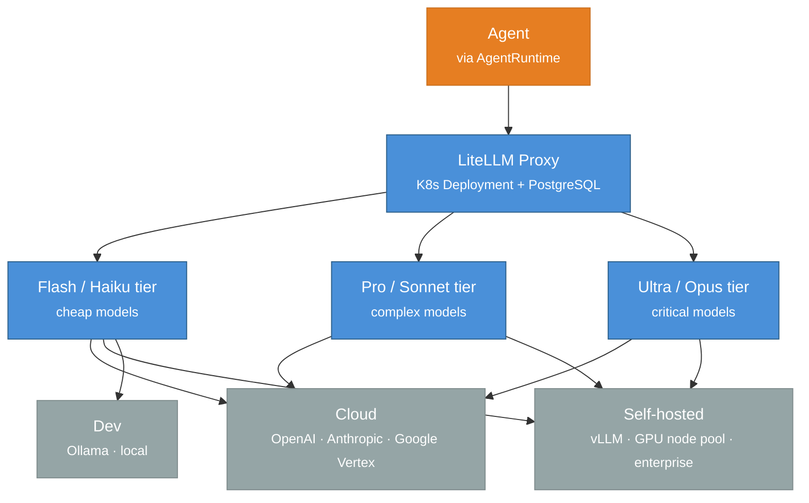
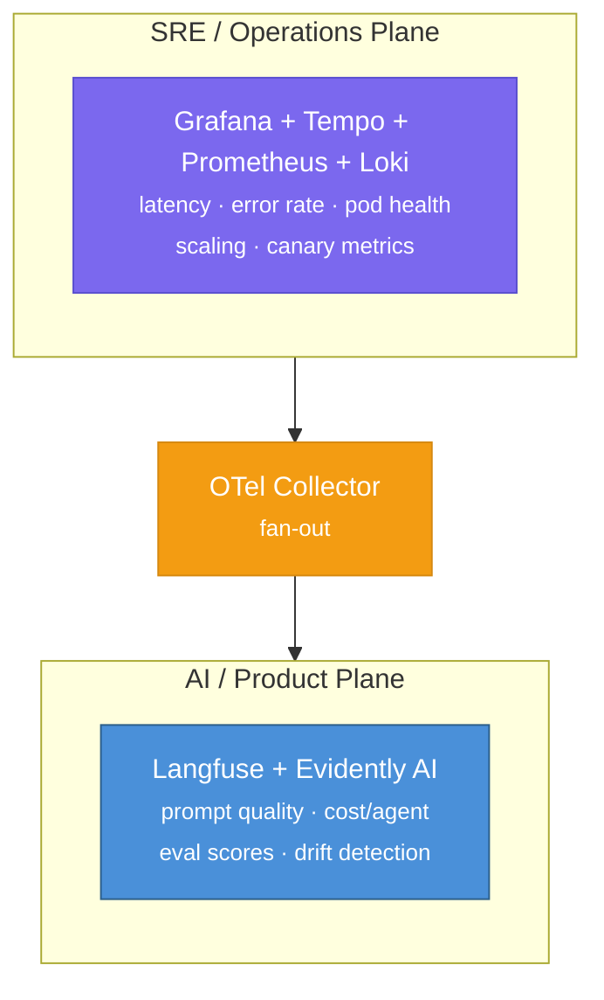
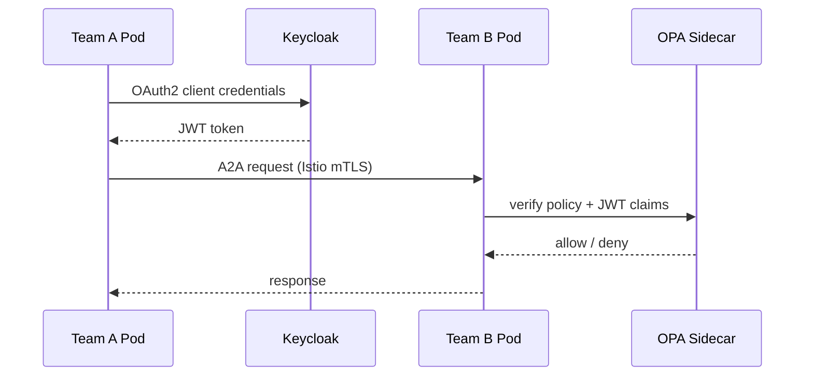
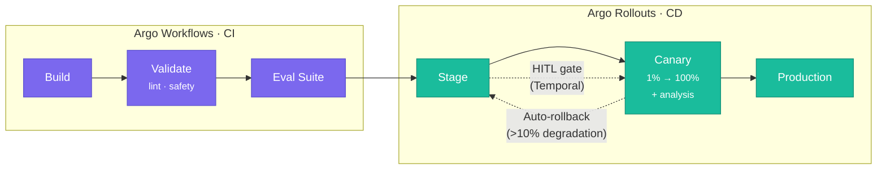
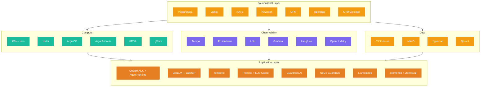

# 23 — Open-Source Technology Map

This document maps concrete open-source solutions to the layers and subsystems of the AgentForge architecture. The goal is to identify, for each component, the **primary** tool (recommended choice) and any **alternatives** or **complements**, with their license and rationale.

> **Selection criteria**: permissive licenses (MIT, Apache 2.0, BSD) preferred; self-hostable on Kubernetes; production-ready or near-production maturity; active community.

---

## 1. Summary Map

```mermaid
graph TD
    subgraph STACK["AgentForge — Technology Stack"]
        direction TB

        subgraph AGRT["Agent Runtime"]
            direction TB
            AR1["Google ADK<br/><small>AgentTool · LlmAgent · LoopAgent · MCPToolset</small>"]
            AR2["AgentRuntime abstraction layer"]
            AR3["FastMCP<br/><small>MCP servers</small>"]
            AR4["A2A Protocol SDK<br/><small>inter-team</small>"]
        end

        subgraph LLMGW["LLM Gateway"]
            direction TB
            LG1["LiteLLM<br/><small>proxy multi-provider · cost tracking · fallback</small>"]
            LG2["vLLM<br/><small>self-hosted inference</small>"]
            LG3["Ollama<br/><small>local dev</small>"]
        end

        subgraph OBSV["Observability"]
            direction TB
            OB1["OpenTelemetry Collector + OpenLLMetry"]
            OB2["Grafana Tempo + Prometheus / Mimir"]
            OB3["Grafana Loki + Grafana"]
            OB4["Langfuse<br/><small>LLM tracing · eval · prompt versioning</small>"]
        end

        subgraph GUARD["Guardrails"]
            direction TB
            GR1["Presidio<br/><small>PII</small>"]
            GR2["LLM Guard<br/><small>security scanning</small>"]
            GR3["Guardrails AI<br/><small>output schema</small>"]
            GR4["NeMo Guardrails<br/><small>behavioral · regulated</small>"]
        end

        subgraph DATALYR["Data Layer"]
            direction TB
            DL1["PostgreSQL + pgvector"]
            DL2["Valkey<br/><small>cache · sessions · rate limiting</small>"]
            DL3["ClickHouse<br/><small>analytics · time-series</small>"]
            DL4["MinIO<br/><small>object storage</small>"]
            DL5["Qdrant<br/><small>vector scale-out</small>"]
        end

        subgraph IAMSEC["IAM &amp; Security"]
            direction TB
            IA1["Keycloak<br/><small>OAuth2/OIDC · multi-tenant realms</small>"]
            IA2["OPA + Gatekeeper<br/><small>policy engine · K8s admission</small>"]
            IA3["OpenBao / Vault + SOPS<br/><small>secrets management</small>"]
        end

        subgraph EVTBUS["Event Bus &amp; Workflow"]
            direction TB
            EB1["NATS JetStream<br/><small>real-time events · CloudEvents</small>"]
            EB2["Temporal<br/><small>durable workflow · HITL · scheduling</small>"]
        end

        subgraph CONTPLAT["Container Platform"]
            direction TB
            CP1["Kubernetes + Istio ambient<br/><small>service mesh · mTLS</small>"]
            CP2["Helm + Argo CD + Argo Rollouts"]
            CP3["Argo Workflows + KEDA"]
            CP4["gVisor + Kata Containers<br/><small>code sandbox</small>"]
        end

        subgraph EVALTEST["Evaluation &amp; Testing"]
            direction TB
            ET1["promptfoo + DeepEval"]
            ET2["Ragas + Evidently AI"]
            ET3["Locust + Garak"]
            ET4["PyRIT + inspect_ai"]
        end

        subgraph RAGKNOW["RAG &amp; Knowledge"]
            direction TB
            RK1["LlamaIndex<br/><small>retrieval framework</small>"]
            RK2["Unstructured<br/><small>document ingestion</small>"]
        end
    end

    classDef runtime fill:#E67E22,stroke:#CA6F1E,color:#fff
    classDef core fill:#4A90D9,stroke:#2C5F8A,color:#fff
    classDef infra fill:#7B68EE,stroke:#5A4FCF,color:#fff
    classDef guardrail fill:#E74C3C,stroke:#C0392B,color:#fff
    classDef foundational fill:#F39C12,stroke:#D68910,color:#fff
    classDef security fill:#E74C3C,stroke:#C0392B,color:#fff
    classDef middleware fill:#9B59B6,stroke:#7D3C98,color:#fff
    classDef userFacing fill:#2ECC71,stroke:#1FA855,color:#fff
    classDef platform fill:#1ABC9C,stroke:#148F77,color:#fff
    class AR1,AR2,AR3,AR4 runtime
    class LG1,LG2,LG3 core
    class OB1,OB2,OB3,OB4 infra
    class GR1,GR2,GR3,GR4 guardrail
    class DL1,DL2,DL3,DL4,DL5 foundational
    class IA1,IA2,IA3 security
    class EB1,EB2 middleware
    class CP1,CP2,CP3,CP4 platform
    class ET1,ET2,ET3,ET4 userFacing
    class RK1,RK2 core
```




---

## 2. Mapping by Subsystem

### 2.1 Agent Runtime & Framework

| Component | OSS Tool | License | Role |
|-----------|----------|---------|------|
| Agent framework | **Google ADK** | Apache 2.0 | LlmAgent, AgentTool, LoopAgent — 1:1 mapping to Hierarchical Supervisor (p. 133) |
| Abstraction layer | **AgentRuntime** (custom) | — | Portability wrapper over ADK; hedge against immaturity |
| MCP servers | **FastMCP** | MIT | Python tool servers; STDIO (dev) → HTTP+SSE (prod) (p. 160) |
| Inter-team protocol | **A2A Protocol SDK** | Apache 2.0 | Agent Cards, task lifecycle, SSE streaming (p. 240) |
| I/O validation | **Pydantic v2** | MIT | Schema enforcement for agent identity contract |

**Why ADK**: the only framework with native support for MCP + A2A + callback system (guardrails) + nested agent hierarchy. LangGraph and CrewAI are valid alternatives but require manual A2A integration.

**Alternatives considered**:

| Framework | Stars | License | Pros | Cons |
|-----------|-------|---------|------|------|
| LangGraph | ~10k | MIT | Mature state machine, checkpointing, LangSmith | No native A2A, boilerplate for hierarchies |
| CrewAI | ~28k | MIT | Intuitive team API, popular | Limited hierarchical support, no A2A |
| AutoGen | ~38k | MIT | Distributed runtime, nested teams | Disruptive v0.2→v0.4 migration, complexity |
| OpenAI Agents SDK | ~18k | MIT | Clean API, built-in guardrails | Young, optimized for OpenAI, no team abstraction |
| Pydantic AI | ~10k | MIT | Excellent type-safety | Single-agent, no multi-agent orchestration |

---

### 2.2 Multi-Provider LLM Management (Subsystem 19)

| Component | OSS Tool | License | Role |
|-----------|----------|---------|------|
| LLM gateway proxy | **LiteLLM** | MIT | Unified OpenAI-compatible API across 100+ providers; cost tracking per key/team; rate limiting; fallback/retry; budget per tenant |
| Self-hosted inference | **vLLM** | Apache 2.0 | PagedAttention, continuous batching, OpenAI-compatible API; for enterprise tier with on-premise models |
| Local dev | **Ollama** | MIT | Local models for development/testing; integrated with LiteLLM as a provider |
| Inference alternative | **SGLang** | Apache 2.0 | RadixAttention for prefix caching — beneficial for agents with shared system prompts |

**Gateway architecture**:


**Why LiteLLM**: broadest provider support, native cost tracking, budget per API key (→ per tenant), built-in Langfuse callback, native Prometheus metrics. Portkey is a valid alternative for semantic caching at the gateway level.

---

### 2.3 Observability Platform (Subsystem 5)

| Component | OSS Tool | License | Role |
|-----------|----------|---------|------|
| LLM auto-instrumentation | **OpenLLMetry** (Traceloop) | Apache 2.0 | Auto-trace every LLM/tool call with OTel semantic conventions (`gen_ai.*`) |
| Collector | **OpenTelemetry Collector** | Apache 2.0 | Receives, processes, exports traces/metrics/logs |
| Distributed tracing | **Grafana Tempo** | AGPL-3.0 | Trace storage, TraceQL, object storage backend (S3/MinIO) |
| Metrics | **Prometheus** + **Grafana Mimir** | Apache 2.0 | K8s + custom metrics (token/agent/tenant); long-term storage |
| Log aggregation | **Grafana Loki** | AGPL-3.0 | Logs correlated to traces |
| Dashboard | **Grafana** | AGPL-3.0 | Unified dashboards: ops, LLM usage, agent performance |
| Alerting | **Alertmanager** | Apache 2.0 | Auto-rollback trigger (>10% degradation), budget overrun |
| LLM-specific tracing | **Langfuse** | MIT | Nested LLM traces, scoring, cost tracking, prompt versioning |
| Production monitoring | **Evidently AI** | Apache 2.0 | Drift detection, text quality monitoring, Grafana integration |

**Two-plane architecture**:



---

### 2.4 Guardrail System (Subsystem 4)

Mapping to the six defense layers (p. 286):

| Layer | Description | OSS Tool | License | Latency |
|-------|-------------|----------|---------|---------|
| **Layer 1** — Input Validation | PII detection, prompt injection, sanitization | **Presidio** (PII) + **LLM Guard** (security scan) | MIT + MIT | ~5-15ms + ~20-50ms |
| **Layer 2** — Behavioral Constraints | System prompt boundaries, topic control | **NeMo Guardrails** (Colang flows) | Apache 2.0 | ~50-200ms (LLM-based) |
| **Layer 3** — Tool Restrictions | Least Privilege, `before_tool_callback` | **OPA** (inline policy eval) + ADK callbacks | Apache 2.0 | ~1-5ms |
| **Layer 4** — Guardrail Agents | Dedicated policy evaluation | **NeMo Guardrails** (dedicated pod, regulated) | Apache 2.0 | ~100ms budget |
| **Layer 5** — External Moderation | Content safety classification | **LLM Guard** (output scanners) | MIT | ~20-100ms |
| **Layer 6** — Output Filtering | Schema validation, PII redaction | **Guardrails AI** (schema) + **Presidio** (PII) | Apache 2.0 + MIT | ~5-20ms |

**Two deployment modes** (per ADR):

- **Standard tenants**: in-process `before_tool_callback` with Presidio + LLM Guard + Guardrails AI (~10-30ms)
- **Regulated tenants**: dedicated Guardrail Pod with NeMo Guardrails full stack (~100ms)

**Middleware chain in AgentRuntime**:

```mermaid
graph LR
    IN["Input"]
    P1["Presidio<br/><small>PII</small>"]
    LG1["LLM Guard<br/><small>security</small>"]
    NM["NeMo<br/><small>behavioral</small>"]
    ADK["ADK Agent Execution"]
    GA["Guardrails AI<br/><small>schema</small>"]
    P2["Presidio<br/><small>PII</small>"]
    LG2["LLM Guard<br/><small>output</small>"]
    OUT["Output"]

    IN --> P1 --> LG1 --> NM --> ADK
    ADK --> GA --> P2 --> LG2 --> OUT

    classDef guardrail fill:#E74C3C,stroke:#C0392B,color:#fff
    classDef runtime fill:#E67E22,stroke:#CA6F1E,color:#fff
    classDef external fill:#95A5A6,stroke:#7F8C8D,color:#fff
    class P1,LG1,NM,GA,P2,LG2 guardrail
    class ADK runtime
    class IN,OUT external
```


---

### 2.5 Data Layer

| Component | OSS Tool | License | Role in AgentForge |
|-----------|----------|---------|---------------------|
| Primary DB | **PostgreSQL 17** | PostgreSQL License | Agents, teams, prompts, configs, tenant data, RBAC; RLS for tenant isolation |
| Vector search | **pgvector** | PostgreSQL License | Embeddings for agent memory (moderate scale, millions of vectors); HNSW index |
| Vector scale-out | **Qdrant** | Apache 2.0 | When pgvector hits its limits; multi-vector, collection per tenant |
| Cache & sessions | **Valkey** (Linux Foundation fork of Redis) | BSD-3 | Session state (`temp:`), LLM response cache, rate limiting, pub/sub |
| Analytics DB | **ClickHouse** | Apache 2.0 | OLAP for observability data, token usage, cost tracking; direct ingestion from NATS |
| Object storage | **MinIO** | AGPL-3.0 | Artifacts: conversation logs, code sandbox output, eval datasets, prompt history |
| Time-series alternative | **TimescaleDB** | Apache 2.0 | If staying within the PostgreSQL ecosystem is preferred (vs ClickHouse) |

**License notes**:

- **Redis** is no longer open-source (RSALv2+SSPL since 7.4) → use **Valkey** (BSD-3, drop-in replacement)
- **MinIO** is AGPL-3.0 → unmodified use via S3 API is generally safe, but verify with legal

**Per-tenant data isolation scheme**:
```
PostgreSQL → Row-Level Security (RLS) with tenant_id
Valkey     → Key prefix per tenant (tenant:{id}:*)
ClickHouse → tenant_id filter on every query; materialized view per-tenant
MinIO      → Bucket per tenant or prefix-based isolation
Qdrant     → Collection per tenant


---

### 2.6 IAM & Access Control (Subsystem 12)

| Component | OSS Tool | License | Role |
|-----------|----------|---------|------|
| Identity Provider | **Keycloak** | Apache 2.0 | OIDC/OAuth2, realms per tenant, service accounts for A2A, MFA, admin console |
| Policy engine | **OPA** + **Gatekeeper** | Apache 2.0 | Rego policies for RBAC, tool access, resource quotas; K8s admission control |
| Policy distribution | **OPAL** | Apache 2.0 | Real-time push of policy updates to all OPA sidecars |
| Secrets management | **OpenBao** (Vault fork) | MPL 2.0 | Dynamic secrets, PKI, transit encryption; OSS alternative to HashiCorp Vault (BSL) |
| GitOps secrets | **SOPS** | MPL 2.0 | Encryption of secrets in Git for Argo CD |

**Why Keycloak + OPA**: Keycloak handles identity (who you are), OPA handles authorization (what you can do). Clean separation, CNCF standard.

**Auth flow for A2A inter-team**:


**Alternatives considered**:

- **Ory Stack** (Hydra/Kratos/Keto): more modular but 4 services to operate vs 1 (Keycloak)
- **Zitadel**: native multi-tenancy, Go single-binary, but smaller ecosystem
- **HashiCorp Vault**: mature but BSL 1.1 since 2023 → prefer **OpenBao** (MPL 2.0)

---

### 2.7 Event Bus (Subsystem 14)

| Component | OSS Tool | License | Role |
|-----------|----------|---------|------|
| Primary event bus | **NATS JetStream** | Apache 2.0 | At-least-once, CloudEvents, consumer groups, replay, multi-tenancy via accounts |
| Analytics streaming | **Apache Kafka** (via Strimzi) | Apache 2.0 | Optional: high-throughput feed to ClickHouse for analytics |

**Why NATS**: lightweight (~20MB binary), native multi-tenancy via accounts, sub-ms latency for real-time guardrail events, replay for debugging, official Helm chart.

**Topic hierarchy**:

platform.agents.{tenant_id}.{event_type}
platform.teams.{tenant_id}.{event_type}
platform.tools.{tenant_id}.{event_type}
platform.guardrails.{tenant_id}.{event_type}
platform.deployments.{tenant_id}.{event_type}

---

### 2.8 Scheduling & Workflow (Subsystem 18)

| Component | OSS Tool | License | Role |
|-----------|----------|---------|------|
| Workflow engine | **Temporal** | MIT | Durable execution for agent pipelines, HITL approval (signal/wait), scheduled runs, saga rollback |
| Lightweight tasks | **Celery** (optional) | BSD-3 | Simple fire-and-forget async tasks (notifications, cleanup) |
| In-process scheduling | **APScheduler** | MIT | Local cron/interval within individual services |

**Why Temporal**: durable execution guarantees that multi-step workflows (eval pipeline, HITL approval, canary rollout) survive crashes and restarts. Python SDK with asyncio. Namespace per tenant. Signal pattern for HITL (pause workflow → wait for human approval → resume).

**HITL workflow example**:

??? example "View Python pseudocode"

    ```python
    # Temporal workflow (pseudo-code)
    @workflow.defn
    class PromptDeploymentWorkflow:
        async def run(self, prompt_version):
            await workflow.execute_activity(run_eval_suite, prompt_version)
            await workflow.execute_activity(deploy_canary, prompt_version)

            # HITL gate — workflow pauses here
            approval = await workflow.wait_signal("human_approval")

            if approval.approved:
                await workflow.execute_activity(promote_to_production, prompt_version)
            else:
                await workflow.execute_activity(rollback_canary, prompt_version)
    ```

---

### 2.9 Container Platform & CI/CD (Subsystem 13, 20)

| Component | OSS Tool | License | Role |
|-----------|----------|---------|------|
| Orchestration | **Kubernetes** (EKS/GKE/AKS) | Apache 2.0 | Foundation; Namespace for tenant isolation |
| Service mesh | **Istio** (ambient mode) | Apache 2.0 | mTLS for A2A, AuthorizationPolicy, canary traffic splitting |
| Packaging | **Helm** | Apache 2.0 | Chart per subsystem; values override per environment/tenant |
| GitOps CD | **Argo CD** | Apache 2.0 | ApplicationSet for per-tenant deploy; app-of-apps for 20 subsystems |
| Progressive delivery | **Argo Rollouts** | Apache 2.0 | Canary 1%→5%→25%→50%→100%; analysis run with Prometheus |
| CI pipeline | **Argo Workflows** | Apache 2.0 | DAG: lint → test → eval → build → scan → deploy |
| Autoscaling | **KEDA** | Apache 2.0 | Scale from NATS queue depth, scale-to-zero for inactive tenants |
| Code sandbox (default) | **gVisor** (runsc) | Apache 2.0 | RuntimeClass for code execution pods; syscall interception |
| Code sandbox (enterprise) | **Kata Containers** + Firecracker VMM | Apache 2.0 | VM-level isolation for regulated/enterprise tier |

**Six-stage pipeline via Argo Workflows + Rollouts**:



**KEDA scaler for agent workloads**:
```yaml
apiVersion: keda.sh/v1alpha1
kind: ScaledObject
metadata:
  name: team-supervisor-scaler
spec:
  scaleTargetRef:
    name: team-supervisor
  minReplicaCount: 0    # scale-to-zero for inactive tenants
  maxReplicaCount: 20
  triggers:
    - type: nats-jetstream
      metadata:
        natsServerMonitoringEndpoint: "nats:8222"
        account: "$G"
        stream: "team-tasks"
        consumer: "team-supervisor"
        lagThreshold: "10"

---

### 2.10 Evaluation Framework (Subsystem 8)

| Component | OSS Tool | License | Role |
|-----------|----------|---------|------|
| CI/CD eval gates | **promptfoo** | MIT | Assertions on agent outputs; prompt/model comparison; red-teaming plugin |
| Pytest-native testing | **DeepEval** | Apache 2.0 | 14+ LLM metrics; multi-turn conversation eval; custom metrics |
| RAG evaluation | **Ragas** | Apache 2.0 | Faithfulness, relevancy, context precision/recall |
| Production monitoring | **Evidently AI** | Apache 2.0 | Drift detection, text quality, Grafana integration |
| Safety audit | **inspect_ai** (UK AISI) | MIT | Periodic safety/capability benchmarks |
| Experiment tracking | **Langfuse** | MIT | Score tracking per trace, dataset management for eval |

**Integration in the deployment pipeline**:
```
Pre-deploy (Argo Workflows):
  ├── promptfoo eval suite → pass/fail gate
  ├── DeepEval pytest suite → pass/fail gate
  └── Garak security scan → pass/fail gate

Post-deploy (continuous):
  ├── Evidently drift monitoring → alert on degradation
  ├── Langfuse scoring → quality per prompt version
  └── Ragas RAG metrics → retrieval quality

Periodic:
  ├── inspect_ai safety benchmarks
  └── PyRIT deep red-teaming


---

### 2.11 Prompt Registry (Subsystem 7)

| Component | OSS Tool | License | Role |
|-----------|----------|---------|------|
| Prompt versioning + tracing | **Langfuse** | MIT | Versioning with labels (production/staging); linked to traces; cost per version |
| HITL lifecycle | **Temporal** | MIT | Draft → Review → Staged → Production workflow with signal for approval |

**Note**: Langfuse covers versioning + observability in a single self-hostable tool. The full lifecycle (Draft → Review → Staged → Production with HITL gate) requires a thin custom layer on top of Langfuse orchestrated by Temporal.

**Alternative**: **Pezzo** (Apache 2.0) as a dedicated prompt management tool, but less mature and lacks observability integration.

---

### 2.12 Testing & Simulation (Subsystem 15)

| Component | OSS Tool | License | Role |
|-----------|----------|---------|------|
| Load testing | **Locust** | MIT | Python-native; simulates multi-tenant load on A2A, MCP, API |
| Vulnerability scanning | **Garak** (NVIDIA) | Apache 2.0 | Prompt injection, data leakage, encoding attacks; CI/CD integration |
| Red-teaming | **PyRIT** (Microsoft) | MIT | Multi-turn attack strategies (crescendo, tree-of-attacks); periodic |
| Load test alternative | **k6** (Grafana) | AGPL-3.0 | K8s operator, Grafana-native; JS scripts (not Python) |

---

### 2.13 Memory & Context Management (Subsystem 10)

| Component | OSS Tool | License | Role |
|-----------|----------|---------|------|
| RAG framework | **LlamaIndex** | MIT | Query routing, composable retrieval pipeline, multi-index |
| Document ingestion | **Unstructured** | Apache 2.0 | PDF, Word, HTML, email → structured chunks |
| Vector store | **pgvector** (default) / **Qdrant** (scale) | PostgreSQL / Apache 2.0 | Embedding storage per memory scope |
| Semantic cache | **Valkey** | BSD-3 | TTL-based LLM response cache |

**Memory scopes → storage mapping**:
temp:  → Valkey (TTL = session end)
user:  → PostgreSQL + pgvector (persistent, 90 days)
app:   → PostgreSQL + pgvector + MinIO (indefinite)


---

### 2.14 Code Generation Tools (Subsystem 6)

| Component | OSS Tool | License | Role |
|-----------|----------|---------|------|
| Default sandbox | **gVisor** (runsc) | Apache 2.0 | K8s RuntimeClass; syscall interception |
| Enterprise sandbox | **Kata Containers** + Firecracker | Apache 2.0 | Full VM isolation for regulated tier |
| Future sandbox | **Wasmtime** | Apache 2.0 | Capability-based security; to be evaluated when Python WASM matures |

---

### 2.15 Conversation & Session Management (Subsystem 16)

| Component | OSS Tool | License | Role |
|-----------|----------|---------|------|
| API framework | **FastAPI** | MIT | WebSocket + SSE streaming |
| Session state | **Valkey** | BSD-3 | Ephemeral session store with PostgreSQL backup |
| Real-time pub/sub | **Valkey** pub/sub | BSD-3 | Typing indicators, token streaming cross-instance |

---

### 2.16 Replay & Debugging (Subsystem 17)

| Component | OSS Tool | License | Role |
|-----------|----------|---------|------|
| Trace storage | **Grafana Tempo** | AGPL-3.0 | Full traces for deterministic replay |
| Snapshot storage | **MinIO** | AGPL-3.0 | Execution snapshots (7d hot / 30d warm / 90d cold) |
| LLM trace analysis | **Langfuse** | MIT | Nested LLM traces with scoring for root cause analysis |

---

## 3. License Matrix

| Tool | License | Type | SaaS Notes |
|------|---------|------|------------|
| Google ADK | Apache 2.0 | Permissive | No restrictions |
| FastMCP | MIT | Permissive | OK |
| LiteLLM | MIT | Permissive | OK (enterprise features are commercial) |
| vLLM | Apache 2.0 | Permissive | OK |
| Langfuse | MIT | Permissive | OK (self-host OK, enterprise features are commercial) |
| Presidio | MIT | Permissive | OK |
| LLM Guard | MIT | Permissive | OK |
| Guardrails AI | Apache 2.0 | Permissive | OK |
| NeMo Guardrails | Apache 2.0 | Permissive | OK |
| PostgreSQL | PostgreSQL License | Permissive | OK |
| pgvector | PostgreSQL License | Permissive | OK |
| Qdrant | Apache 2.0 | Permissive | OK |
| **Valkey** | BSD-3 | Permissive | OK (prefer over Redis RSALv2) |
| ClickHouse | Apache 2.0 | Permissive | OK |
| **MinIO** | **AGPL-3.0** | **Copyleft** | Unmodified use via S3 API is generally OK; verify with legal |
| Keycloak | Apache 2.0 | Permissive | OK |
| OPA | Apache 2.0 | Permissive | OK |
| **OpenBao** | MPL 2.0 | Weak copyleft | OK (MPL applies only to modified files) |
| NATS | Apache 2.0 | Permissive | OK |
| Temporal | MIT | Permissive | OK (Temporal Cloud is an optional commercial offering) |
| **Grafana** | **AGPL-3.0** | **Copyleft** | Do not expose Grafana as a service to tenants; internal use OK |
| Prometheus | Apache 2.0 | Permissive | OK |
| OpenTelemetry | Apache 2.0 | Permissive | OK |
| Istio | Apache 2.0 | Permissive | OK |
| Argo (CD/Rollouts/Workflows) | Apache 2.0 | Permissive | OK |
| KEDA | Apache 2.0 | Permissive | OK |
| gVisor | Apache 2.0 | Permissive | OK |
| Helm | Apache 2.0 | Permissive | OK |
| Locust | MIT | Permissive | OK |
| promptfoo | MIT | Permissive | OK |
| LlamaIndex | MIT | Permissive | OK |

**Licenses to watch**:

1. **Grafana (AGPL)**: OK for internal dashboards; do not expose directly as a SaaS feature to tenants
2. **MinIO (AGPL)**: OK if used unmodified via S3 API; legal confirmation recommended
3. **Redis → Valkey**: Redis changed its license (RSALv2+SSPL); migrate to Valkey (BSD-3)
4. **HashiCorp Vault → OpenBao**: Vault is BSL 1.1 since 2023; OpenBao (MPL 2.0) is the OSS fork

---

## 4. Tool Dependencies



---

## 5. Indicative Sizing & Costs (per environment)

### Development (single-node, Docker Compose)

| Tool | Resources |
|------|-----------|
| PostgreSQL + pgvector | 1 container, 512MB RAM |
| Valkey | 1 container, 256MB RAM |
| NATS | 1 container, 128MB RAM |
| Ollama | 1 container, 4-8GB RAM (depends on model) |
| Langfuse | 1 container, 512MB RAM |
| Keycloak | 1 container, 512MB RAM |
| Total | ~6-10GB RAM, no GPU required |

### Staging (K8s, 3-5 nodes)

| Tool | Replicas | Resources per replica |
|------|----------|----------------------|
| PostgreSQL (CloudNativePG) | 2 (primary+replica) | 2 CPU, 4GB RAM |
| Valkey | 3 (sentinel) | 1 CPU, 2GB RAM |
| NATS JetStream | 3 | 0.5 CPU, 1GB RAM |
| ClickHouse | 1 | 2 CPU, 4GB RAM |
| LiteLLM | 2 | 0.5 CPU, 512MB RAM |
| Langfuse | 2 | 1 CPU, 1GB RAM |
| Keycloak | 2 | 1 CPU, 1GB RAM |
| OTel Collector | 2 | 0.5 CPU, 512MB RAM |
| Grafana stack | 1 each | ~3 CPU, 6GB RAM total |
| Istio (ambient) | — | ~0.5 CPU, 512MB per node |

### Production (K8s, 10+ nodes, multi-tenant)

Horizontal scaling driven by KEDA/HPA; vLLM on dedicated GPU node pool for enterprise tier. See `22-cost-analysis.md` for detailed estimates.

---

## 6. Open Questions for Phase 2

1. **Grafana AGPL**: acceptable for internal use? If tenants need dashboard access, a custom layer on top of Grafana APIs or an alternative (e.g., Apache Superset) is needed.
2. **MinIO AGPL**: legal confirmation on unmodified use in SaaS. Alternative: use cloud object storage (S3/GCS) directly and keep MinIO only for dev/on-prem.
3. **Temporal vs Celery**: for simple tasks (notifications, cleanup), is it worth adding Celery, or should everything go through Temporal for operational simplicity?
4. **pgvector vs Qdrant**: at what scale (millions of vectors? tens of millions?) does it make sense to introduce Qdrant as a dedicated vector store?
5. **NeMo Guardrails overhead**: is the LLM cost for Colang flows on every request sustainable for standard tier, or should it be limited to regulated tier?
6. **OpenBao maturity**: is the fork mature enough for production, or use Vault BSL in the interim?
7. **SGLang vs vLLM**: benchmarking needed for agent-specific workloads (prefix-heavy) before choosing.

---

*Next step: validate the stack with a Docker Compose PoC that integrates the foundational tools (ADK + LiteLLM + NATS + PostgreSQL + Langfuse + Keycloak) in an end-to-end workflow.*
