# AgentForge — Architecture Diagrams

> Visual reference for the AgentForge Agentic Orchestration & Monitoring Platform.
> These diagrams complement the detailed subsystem design documents (01–21) and the master ADR (ADR-001).
>
> Each diagram is rendered natively by mkdocs-material. Click on any diagram to open it in a zoomable fullscreen view.

## Table of Contents

1. [High-Level Platform Overview](#1-high-level-platform-overview)
2. [Subsystem Architecture Map](#2-subsystem-architecture-map)
3. [Hierarchical Supervisor Topology](#3-hierarchical-supervisor-topology)
4. [Request Processing Flow](#4-request-processing-flow)
5. [Communication Protocols](#5-communication-protocols)
6. [Core Subsystems Detail](#6-core-subsystems-detail)
7. [Infrastructure Layer Detail](#7-infrastructure-layer-detail)
8. [User-Facing Layer Detail](#8-user-facing-layer-detail)
9. [Security Defense-in-Depth](#9-security-defense-in-depth)
10. [K8s Deployment Topology](#10-k8s-deployment-topology)
11. [Data Flow & Storage](#11-data-flow--storage)
12. [CI/CD Pipeline](#12-cicd-pipeline)
13. [Multi-Tenancy Isolation](#13-multi-tenancy-isolation)
14. [Prompt Lifecycle](#14-prompt-lifecycle)
15. [LLM Routing & Model Selection](#15-llm-routing--model-selection)

---

## 1. High-Level Platform Overview

External actors, the AgentForge platform boundary, and external systems it depends on.
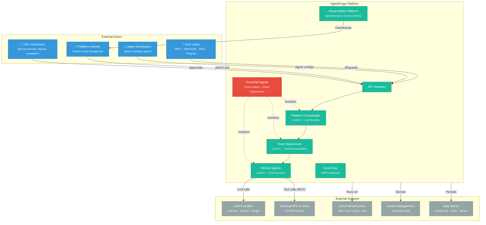
---

## 2. Subsystem Architecture Map

All 20 subsystems grouped by category. Foundational services (zero inter-dependencies) are started first; all other subsystems depend on them.
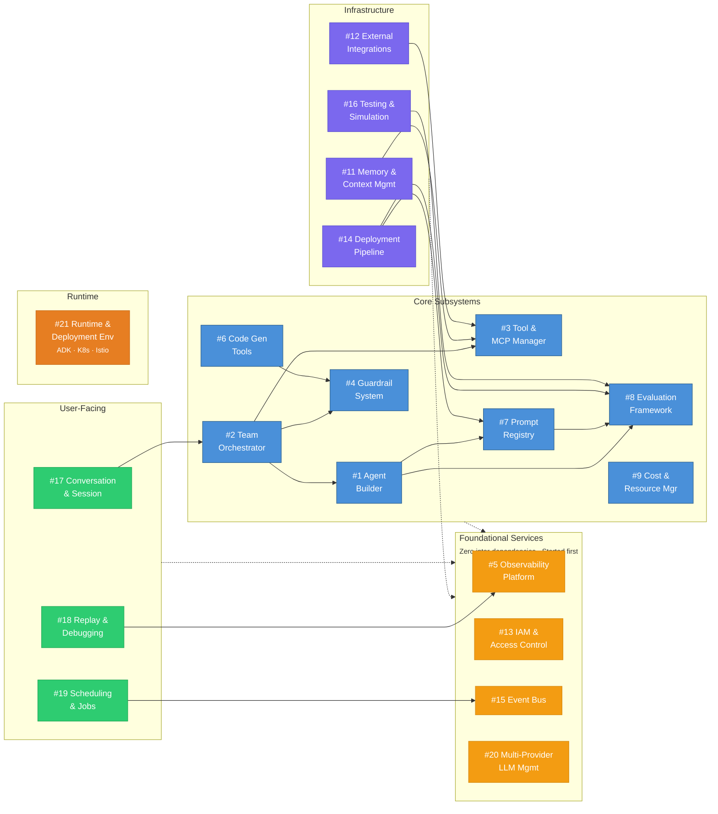
---

## 3. Hierarchical Supervisor Topology

Three-level agent hierarchy (p. 133) with Guardrail Agents monitoring every level via `before_tool_callback`.

- **Solid thick arrows** = inter-team A2A HTTP (~100ms, mTLS)
- **Solid thin arrows** = intra-team AgentTool (~10ms, in-process)
- **Dotted arrows** = guardrail observation
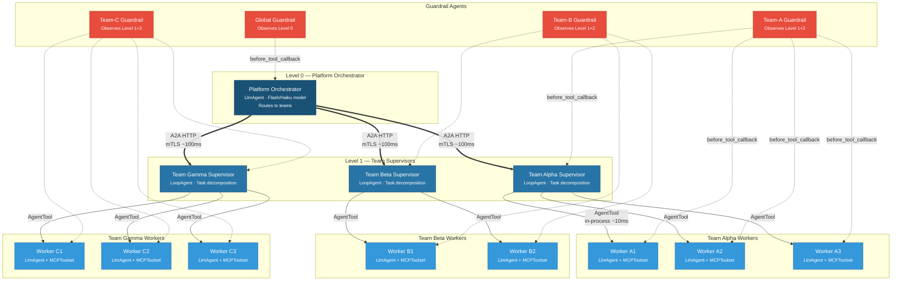
---

## 4. Request Processing Flow

End-to-end sequence from user request to response, including guardrail checks, tool calls, and async telemetry.
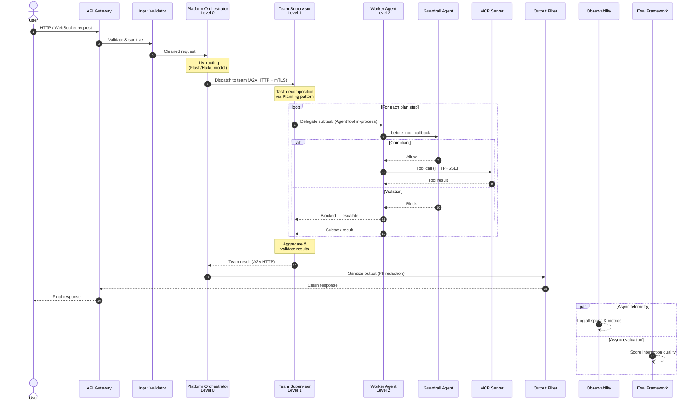
---

## 5. Communication Protocols

Three communication patterns used by the platform: intra-team (in-process), inter-team (A2A HTTP), and agent-to-tool (MCP).
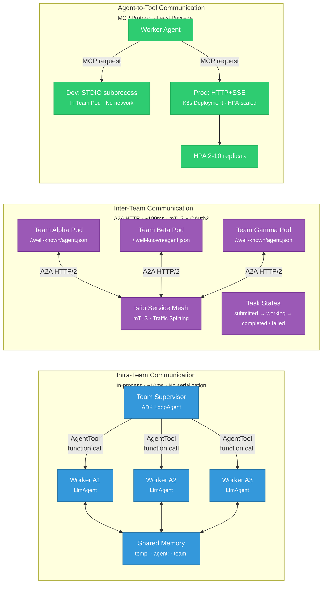
---

## 6. Core Subsystems Detail

Internal components and cross-dependencies of the five most critical core subsystems.
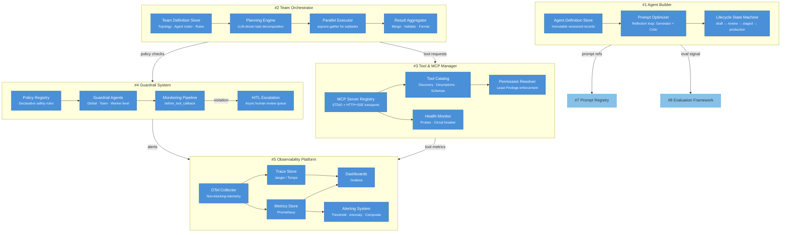
---

## 7. Infrastructure Layer Detail

Memory model (4 layers), IAM, Event Bus (NATS JetStream), and 6-stage Deployment Pipeline.
```mermaid
graph TD
    subgraph MEM["#11 Memory & Context Management"]
        M1["Layer 1: Session Memory<br/><small>temp: · In-process · Per-turn</small>"]
        M2["Layer 2: Working Memory<br/><small>agent: team: · Redis · Cross-turn</small>"]
        M3["Layer 3: Long-Term Memory<br/><small>user: app: · PostgreSQL · Cross-session</small>"]
        M4["Layer 4: Knowledge Memory<br/><small>knowledge: · Vector Store · RAG</small>"]
        M5["Context Optimizer<br/><small>Pruning · Summarization · Windowing</small>"]
        M6["RAG Engine<br/><small>Embedding · Retrieval · Hybrid Search</small>"]
        M1 --> M2 --> M3 --> M4
        M5 -.-> M2
        M5 -.-> M3
        M6 -.-> M4
    end

    subgraph IAM["#13 IAM & Access Control"]
        I1["Tenant Manager<br/><small>3-tier isolation provisioning</small>"]
        I2["RBAC / OPA Engine<br/><small>6 roles · Policy evaluation</small>"]
        I3["API Key Manager<br/><small>Generation · Rotation · Scoping</small>"]
        I4["Auth & Session Layer<br/><small>JWT · mTLS · OAuth2</small>"]
        I5["Audit Trail<br/><small>Immutable · Append-only · Hash-chained</small>"]
        I1 --> I2 --> I3
        I2 --> I4
        I4 --> I5
    end

    subgraph EVT["#15 Event Bus"]
        E1["NATS JetStream Cluster<br/><small>3 nodes · At-least-once</small>"]
        E2["Topic Hierarchy<br/><small>agent.* · team.* · guardrail.*<br/>tool.* · deployment.* · eval.*</small>"]
        E3["Consumer Groups<br/><small>Partition ordering · Backpressure</small>"]
        E4["Schema Registry<br/><small>CloudEvents · Versioned schemas</small>"]
        E5["Dead Letter Queue<br/><small>Failed events · Reprocessing</small>"]
        E6["Event Replay<br/><small>Time-range · Type · Consumer replay</small>"]
        E1 --> E2 --> E3
        E1 --> E4
        E3 --> E5
        E1 --> E6
    end

    subgraph DEP["#14 Deployment Pipeline"]
        D1["Artifact Builder<br/><small>Immutable snapshot assembly</small>"]
        D2["Validate<br/><small>Schema · Refs · Deps</small>"]
        D3["Evaluate<br/><small>Evalset regression · Red-team</small>"]
        D4["Stage<br/><small>Blue-green · Smoke tests</small>"]
        D5["Canary<br/><small>1% → 5% → 25% → 50% → 100%</small>"]
        D6["Production<br/><small>Full rollout</small>"]
        D7["Rollback Controller<br/><small>less than 60s recovery SLA</small>"]
        D1 --> D2 --> D3 --> D4 --> D5 --> D6
        D5 -->|"degradation >10%"| D7
        D7 -->|"revert"| D4
    end

    classDef mem fill:#2ECC71,stroke:#1FA855,color:#fff
    classDef iam fill:#9B59B6,stroke:#7D3C98,color:#fff
    classDef evt fill:#E67E22,stroke:#CA6F1E,color:#fff
    classDef pipeline fill:#3498DB,stroke:#2471A3,color:#fff

    class M1,M2,M3,M4,M5,M6 mem
    class I1,I2,I3,I4,I5 iam
    class E1,E2,E3,E4,E5,E6 evt
    class D1,D2,D3,D4,D5,D6,D7 pipeline
```
---

## 8. User-Facing Layer Detail

Conversation & Session Management, Replay & Debugging, and Scheduling & Background Jobs.
```mermaid
graph TD
    subgraph CONV["#17 Conversation & Session Management"]
        C1["Channel Adapters<br/><small>REST · WebSocket · Slack · Telegram · Widget</small>"]
        C2["Message Normalizer<br/><small>Canonical message model</small>"]
        C3["Session Manager<br/><small>Create · Active · Paused · Closed</small>"]
        C4["Conversation Router<br/><small>LLM-based intent classification</small>"]
        C5["Handoff Controller<br/><small>Agent → Human escalation</small>"]
        C6["Stream Emitter<br/><small>SSE / WebSocket token streaming</small>"]
        C1 --> C2 --> C3
        C3 --> C4
        C3 --> C5
        C4 --> C6
    end

    subgraph REPLAY["#18 Replay & Debugging"]
        R1["Execution Record Store<br/><small>OTel traces · State snapshots</small>"]
        R2["Replay Engine<br/><small>Deterministic step playback</small>"]
        R3["Time-Travel Debugger<br/><small>Rewind · Forward · State inspect</small>"]
        R4["What-If Analyzer<br/><small>Fork · Mutate · Re-execute · Compare</small>"]
        R5["Breakpoint System<br/><small>Conditional breakpoints</small>"]
        R6["Root Cause Analyzer<br/><small>Critic agent · Fault localization</small>"]
        R1 --> R2 --> R3
        R2 --> R4
        R3 --> R5
        R2 --> R6
    end

    subgraph SCHED["#19 Scheduling & Background Jobs"]
        S1["Schedule Manager<br/><small>Cron · One-shot · Interval</small>"]
        S2["Event Trigger Manager<br/><small>Event Bus subscriptions</small>"]
        S3["Priority Job Queue<br/><small>P0-P3 · Consumer groups</small>"]
        S4["Job Execution Engine<br/><small>Worker pools · Concurrency control</small>"]
        S5["DAG Executor<br/><small>Dependencies · Fan-out · Fan-in</small>"]
        S6["Distributed Lock Manager<br/><small>Redis/etcd · Leader election</small>"]
        S7["Dead Letter Queue<br/><small>Failed jobs · Reprocessing</small>"]
        S1 --> S3
        S2 --> S3
        S3 --> S4 --> S5
        S4 --> S6
        S4 -->|"max retries exceeded"| S7
    end

    %% Cross-subsystem links
    CONV -->|"routes to"| TEAM["Team Orchestrator"]
    REPLAY -->|"reads from"| OBS["Observability Platform"]
    SCHED -->|"subscribes"| EVTBUS["Event Bus"]

    classDef conv fill:#2ECC71,stroke:#1FA855,color:#fff
    classDef replay fill:#1ABC9C,stroke:#148F77,color:#fff
    classDef sched fill:#16A085,stroke:#117A65,color:#fff
    classDef ext fill:#85C1E9,stroke:#5DADE2,color:#333

    class C1,C2,C3,C4,C5,C6 conv
    class R1,R2,R3,R4,R5,R6 replay
    class S1,S2,S3,S4,S5,S6,S7 sched
    class TEAM,OBS,EVTBUS ext
```
---

## 9. Security Defense-in-Depth

Seven-layer security model — each layer can independently block a request. Violations are logged and alerted at every layer.
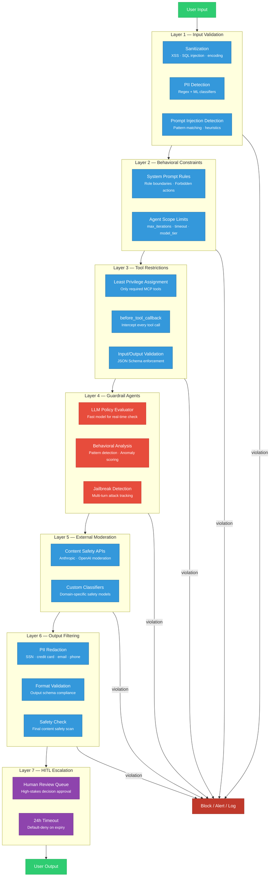
---

## 10. K8s Deployment Topology

Full Kubernetes cluster layout showing platform namespace, per-tenant namespaces, shared infrastructure, and data layer.
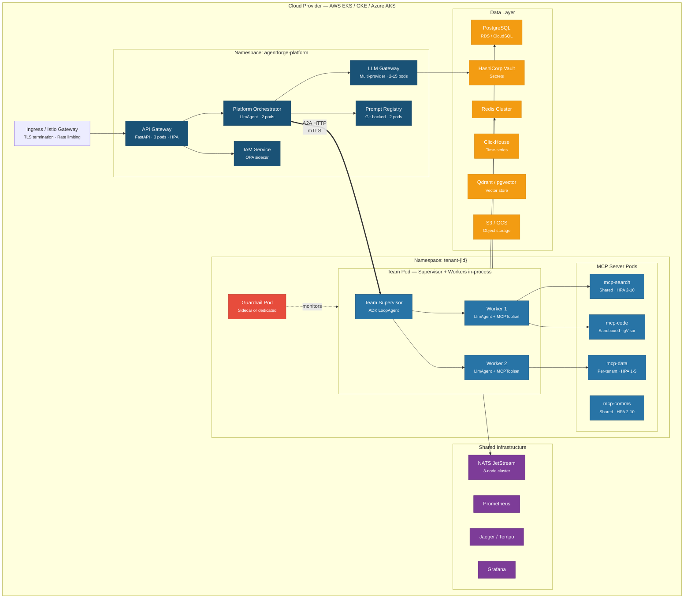
---

## 11. Data Flow & Storage

Data sources, storage systems (with what each stores), and downstream consumers.
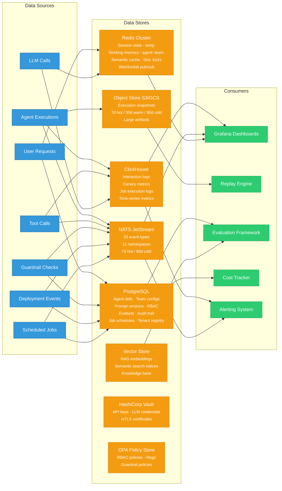
---

## 12. CI/CD Pipeline

Six-stage agent deployment pipeline with validation gates, HITL approval, canary rollout, and auto-rollback.
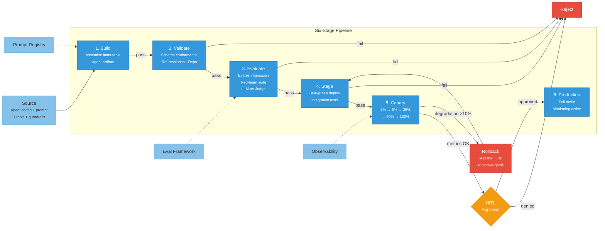
---

## 13. Multi-Tenancy Isolation

Three isolation tiers with increasing security guarantees, plus four cross-tenant prevention layers.
```mermaid
graph TD
    subgraph Standard["Tier 1 — Standard"]
        ST1["Shared K8s Nodes"]
        ST2["Separate Namespace<br/><small>per tenant</small>"]
        ST3["ResourceQuota<br/><small>CPU / Memory limits</small>"]
        ST4["NetworkPolicy<br/><small>Deny-default ingress</small>"]
        ST5["Row-Level Security<br/><small>PostgreSQL tenant_id filter</small>"]
        ST1 --> ST2 --> ST3 --> ST4 --> ST5
    end

    subgraph Professional["Tier 2 — Professional"]
        PR1["Dedicated Node Pool<br/><small>per tenant</small>"]
        PR2["Separate Namespace"]
        PR3["Node Affinity<br/><small>Tenant workloads pinned</small>"]
        PR4["NetworkPolicy<br/><small>+ Node-level isolation</small>"]
        PR5["Data Isolation<br/><small>Separate Redis keyspace</small>"]
        PR1 --> PR2 --> PR3 --> PR4 --> PR5
    end

    subgraph Enterprise["Tier 3 — Enterprise"]
        EN1["Dedicated K8s Cluster<br/><small>per tenant</small>"]
        EN2["Full Process Isolation"]
        EN3["Separate Data Stores<br/><small>Dedicated PostgreSQL / Redis</small>"]
        EN4["Custom Compliance<br/><small>SOC2 · HIPAA · GDPR</small>"]
        EN5["Dedicated Vault Namespace"]
        EN1 --> EN2 --> EN3 --> EN4 --> EN5
    end

    subgraph Prevention["Cross-Tenant Prevention Layers"]
        direction LR
        P1["API Gateway<br/><small>Tenant ID extraction<br/>from credential</small>"]
        P2["Middleware<br/><small>TenantContextMiddleware<br/>Status validation</small>"]
        P3["Data Layer<br/><small>TenantScopedRepository<br/>WHERE tenant_id = ?</small>"]
        P4["Event Bus<br/><small>Namespaced channels<br/>events.tenant_id.*</small>"]
        P1 --> P2 --> P3 --> P4
    end

    classDef standard fill:#2ECC71,stroke:#1FA855,color:#fff
    classDef professional fill:#F39C12,stroke:#D68910,color:#fff
    classDef enterprise fill:#E74C3C,stroke:#C0392B,color:#fff
    classDef prevention fill:#3498DB,stroke:#2471A3,color:#fff

    class ST1,ST2,ST3,ST4,ST5 standard
    class PR1,PR2,PR3,PR4,PR5 professional
    class EN1,EN2,EN3,EN4,EN5 enterprise
    class P1,P2,P3,P4 prevention
```
---

## 14. Prompt Lifecycle

Version lifecycle from Draft to Production with AI-driven optimization loop (Reflection pattern, p. 61).
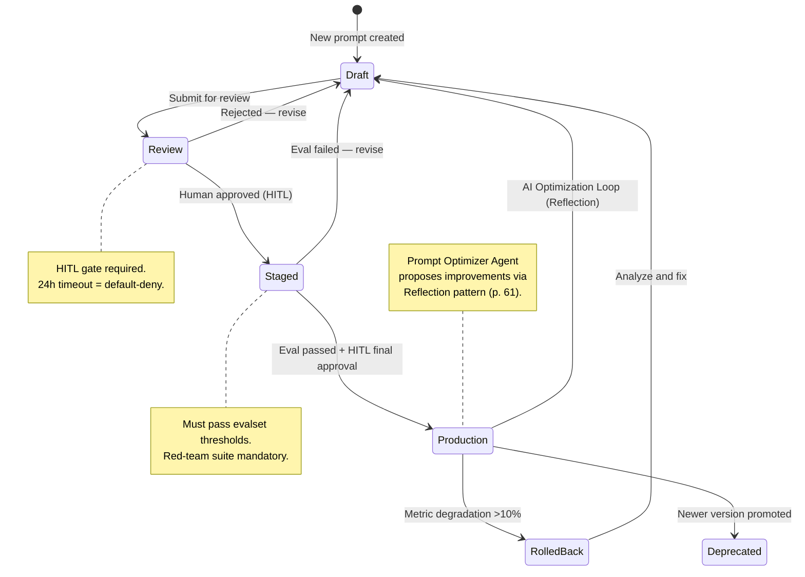
---

## 15. LLM Routing & Model Selection

Three-tier model routing with critique-then-escalate pattern, provider failover via circuit breaker, and semantic caching.
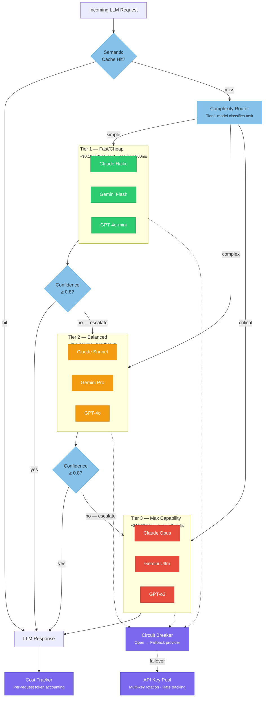
